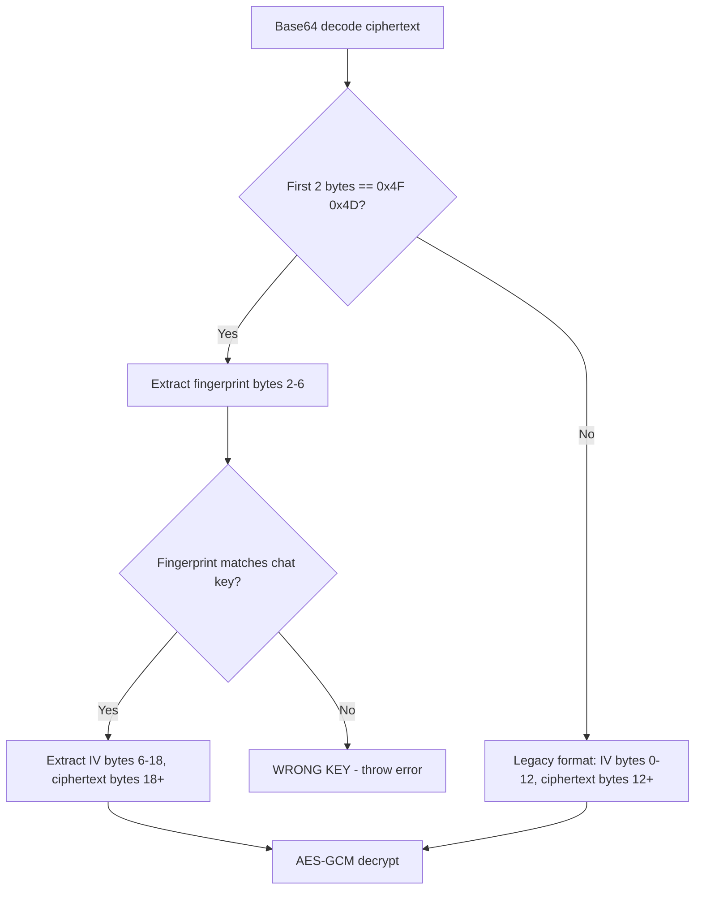

<objective>
Document the exact byte-level ciphertext formats for all encrypted field types (AUDT-02) and the complete master key derivation + cross-device distribution lifecycle (AUDT-04, AUDT-05).

Purpose: Phase 2-4 rebuild cannot proceed without precise format documentation -- ambiguous descriptions lead to wrong implementations. The master key cross-device gap is the single biggest architectural unknown and must be explained before Phase 3.

Output: Two new docs in `docs/architecture/core/` with Mermaid diagrams per D-04.
</objective>

<execution_context>
@$HOME/.claude/get-shit-done/workflows/execute-plan.md
@$HOME/.claude/get-shit-done/templates/summary.md
</execution_context>

<context>
@.planning/PROJECT.md
@.planning/ROADMAP.md
@.planning/STATE.md
@.planning/phases/01-audit-discovery/01-CONTEXT.md
@.planning/phases/01-audit-discovery/01-RESEARCH.md
</context>

<tasks>

<task type="auto">
  <name>Task 1: Document byte-level ciphertext formats for all encrypted field types</name>
  <files>docs/architecture/core/encryption-formats.md</files>
  <read_first>
    - frontend/packages/ui/src/services/cryptoService.ts
    - docs/architecture/core/chat-encryption-implementation.md
  </read_first>
  <action>
Create `docs/architecture/core/encryption-formats.md` documenting all four ciphertext formats with byte-level precision. Per D-04, use Mermaid diagrams as primary visual format.

**Read cryptoService.ts to verify these formats against actual code:**

**Format A: OM-header (chat key encrypted fields)**
- Source: cryptoService.ts lines ~1090-1130 (encryption) and ~1133-1178 (decryption)
- Layout: `[0x4F 0x4D (2B)] [FNV-1a fingerprint (4B)] [IV (12B)] [AES-GCM ciphertext + 16B auth tag]`
- Total header: 18 bytes before ciphertext
- Used for fields: `encrypted_content`, `encrypted_sender_name`, `encrypted_category`, `encrypted_active_focus_id`, `encrypted_chat_summary`, `encrypted_chat_tags`, `encrypted_follow_up_request_suggestions`
- Constants to verify in code: `CIPHERTEXT_MAGIC` (should be `[0x4F, 0x4D]`), `CIPHERTEXT_HEADER_LENGTH` (should be 6), `AES_IV_LENGTH` (should be 12)

**Format B: Legacy (no header, chat key)**
- Source: cryptoService.ts lines ~1178+ (else branch of format detection)
- Layout: `[IV (12B)] [AES-GCM ciphertext + 16B auth tag]`
- Used for: older messages encrypted before fingerprint header was added
- Detection: `decryptWithChatKey` checks first 2 bytes for `0x4F 0x4D`; if absent, assumes legacy format

**Format C: Wrapped chat key (master key encrypted)**
- Source: cryptoService.ts lines ~1227-1254
- Layout: `[IV (12B)] [AES-GCM(chatKey 32B) + 16B auth tag]` = 60 bytes total
- Used for: `encrypted_chat_key` field
- No OM header. Raw 32-byte chat key encrypted with user's master CryptoKey

**Format D: Master key encrypted arbitrary data**
- Source: cryptoService.ts `encryptWithMasterKey()` / `decryptWithMasterKey()` functions
- Same structure as Format C but encrypting arbitrary data instead of keys
- Used for: encrypted titles, drafts, search indexes, suggestions, app settings

**For each format, include:**
1. A Mermaid diagram showing the byte layout:
   ```mermaid
   block-beta
     columns 4
     magic["OM Magic\n0x4F 0x4D\n2 bytes"]:1
     fp["FNV-1a\nFingerprint\n4 bytes"]:1
     iv["AES IV\nRandom Nonce\n12 bytes"]:1
     ct["AES-GCM\nCiphertext + Auth Tag\nN + 16 bytes"]:1
   ```
   (Adjust diagram type if block-beta is not well-supported -- use a simple table diagram or flowchart instead)

2. An offset table:
   | Offset | Length | Field | Description |
   |--------|--------|-------|-------------|
   | 0 | 2 | Magic bytes | `0x4F 0x4D` ("OM") |
   | 2 | 4 | Fingerprint | FNV-1a hash of chat key |
   | 6 | 12 | IV | Random nonce |
   | 18 | N+16 | Ciphertext | AES-GCM encrypted data + auth tag |

3. The exact cryptoService.ts line numbers where encoding and decoding happen
4. Which database fields use this format (verify against `chat-encryption-implementation.md`)
5. The base64 encoding wrapper (all formats are base64-encoded for storage/transport)

**Also document the FNV-1a fingerprint computation:**
- Source: cryptoService.ts lines ~1053-1065 (`computeKeyFingerprint4Bytes`)
- Algorithm: FNV-1a with offset basis `0x811c9dc5` and prime `0x01000193`
- Input: raw chat key bytes
- Output: 4-byte fingerprint
- Purpose: Fast wrong-key detection without attempting AES-GCM decryption

**Include a Mermaid flowchart showing the format detection logic in decryptWithChatKey:**


Include a 5-10 line file header comment per CLAUDE.md.
  </action>
  <verify>
    <automated>grep -c "0x4F.*0x4D\|Format A\|Format B\|Format C\|Format D\|mermaid" /home/superdev/projects/OpenMates/docs/architecture/core/encryption-formats.md</automated>
  </verify>
  <acceptance_criteria>
    - File `docs/architecture/core/encryption-formats.md` exists with 5-10 line header comment
    - Contains all four format sections: grep for "Format A", "Format B", "Format C", "Format D" returns 4+ matches
    - Contains byte offset tables: grep for "Offset.*Length.*Field" returns at least 3 matches (one per distinct layout)
    - Contains at least 2 Mermaid diagrams: grep for "```mermaid" returns 2+ matches
    - Contains FNV-1a documentation: grep for "FNV-1a\|0x811c9dc5\|computeKeyFingerprint4Bytes" returns 3+ matches
    - Contains specific cryptoService.ts line references: grep for "cryptoService.ts.*line\|line.*[0-9]" returns 5+ matches
    - Documents which fields use which format: grep for "encrypted_content\|encrypted_chat_key\|encrypted_sender_name" returns 3+ matches
  </acceptance_criteria>
  <done>encryption-formats.md exists with byte-level documentation and offset tables for all 4 ciphertext formats, FNV-1a fingerprint documentation, Mermaid diagrams for byte layouts and format detection flow, and line-number references to cryptoService.ts</done>
</task>

<task type="auto">
  <name>Task 2: Document master key derivation path and cross-device distribution mechanism</name>
  <files>docs/architecture/core/master-key-lifecycle.md</files>
  <read_first>
    - frontend/packages/ui/src/services/cryptoService.ts
    - frontend/packages/ui/src/services/cryptoKeyStorage.ts
    - docs/architecture/core/zero-knowledge-storage.md
    - docs/architecture/core/passkeys.md
    - docs/architecture/core/signup-and-auth.md
  </read_first>
  <action>
Create `docs/architecture/core/master-key-lifecycle.md` documenting the complete master key derivation chain and cross-device distribution mechanism. Per D-04, use Mermaid diagrams.

**Part A: Master Key Derivation Path (AUDT-04)**

Trace the full derivation chain by reading the actual code:

1. **Credential to wrapping key:** Read `cryptoService.ts` for PBKDF2 derivation. Document:
   - Input: user password (or passkey PRF output, or recovery key)
   - Algorithm: PBKDF2 with what hash, what iteration count, what salt
   - Output: AES-GCM wrapping key (CryptoKey)
   - Exact function name and line number in cryptoService.ts

2. **Wrapping key to master key (new user signup):** Read `cryptoService.ts` for `generateExtractableMasterKey()`. Document:
   - How the 256-bit AES-GCM master key is generated
   - How it is wrapped with the wrapping key for server storage
   - How it is stored locally in IndexedDB via `cryptoKeyStorage.ts`
   - Function names: `generateExtractableMasterKey`, `saveKeyToSession`

3. **Master key to chat key wrapping:** Document:
   - `encryptChatKeyWithMasterKey()` -- wraps a 32-byte chat key with master key
   - `decryptChatKeyWithMasterKey()` -- unwraps a chat key from `encrypted_chat_key` field
   - Where wrapped keys are stored (Directus server-side)

4. **Chat key to content encryption:** Document:
   - `encryptWithChatKey()` / `decryptWithChatKey()` -- the final step
   - How the chat key is obtained from ChatKeyManager (normal path)

5. Include a Mermaid diagram showing the full derivation chain:
   ```mermaid
   flowchart TD
       A[User Password] --> B[PBKDF2 Derivation]
       B --> C[Wrapping Key]
       C --> D[Unwrap Master Key]
       D --> E[Master Key in IndexedDB]
       E --> F[Unwrap Chat Key]
       F --> G[Chat Key in Memory]
       G --> H[Encrypt/Decrypt Messages]
   ```
   (Expand with actual parameter details, alternative auth paths like passkey PRF and recovery key)

**Part B: Cross-Device Distribution (AUDT-05)**

This is the critical architectural gap. Trace the login flow (not signup) to answer:

1. Read `cryptoKeyStorage.ts` -- specifically `getKeyFromStorage()`. What happens when a second device logs in?
   - Does it call a server endpoint to download the wrapped master key?
   - Does it derive the wrapping key from the password and unwrap?
   - Or does it generate a fresh master key (which would be the bug)?

2. Read the auth/login flow files to trace the sequence:
   - What API endpoint returns the wrapped master key?
   - How is the wrapping key derived on the second device?
   - Is the same PBKDF2 salt used? Where is it stored?

3. Check the passkey PRF path in `passkeys.md` and related code:
   - Does passkey PRF provide a deterministic key that can unwrap the master key on any device with the passkey?

4. Document what actually happens today with a Mermaid sequence diagram:
   ```mermaid
   sequenceDiagram
       participant D1 as Device 1
       participant S as Server
       participant D2 as Device 2
       D1->>S: Upload wrapped master key
       D2->>S: Login with same credentials
       D2->>S: Request wrapped master key
       S->>D2: Return wrapped master key
       D2->>D2: Derive wrapping key from password
       D2->>D2: Unwrap master key
   ```
   (Or document the gap if the flow is different/broken)

5. **Explicitly answer these questions** (from research Open Question 1):
   - When a second device logs in with the same password/passkey, does it derive the same wrapping key?
   - Does it download and unwrap the same master key?
   - Or does it generate a fresh master key?
   - If fresh master key: how can it decrypt `encrypted_chat_key` values wrapped with Device 1's master key?

6. **Document the architectural gap** if one exists:
   - What works today
   - What does not work
   - What would need to change in Phase 3 to fix it

Include a 5-10 line file header comment per CLAUDE.md.
  </action>
  <verify>
    <automated>grep -c "generateExtractableMasterKey\|getKeyFromStorage\|PBKDF2\|cross-device\|mermaid" /home/superdev/projects/OpenMates/docs/architecture/core/master-key-lifecycle.md</automated>
  </verify>
  <acceptance_criteria>
    - File `docs/architecture/core/master-key-lifecycle.md` exists with 5-10 line header comment
    - Contains derivation chain section: grep for "PBKDF2\|wrapping key\|master key\|chat key" returns 10+ matches
    - Contains cross-device section: grep for "cross-device\|second device\|Device 2\|architectural gap" returns 3+ matches
    - Contains at least 2 Mermaid diagrams: grep for "```mermaid" returns 2+ matches
    - Documents the key functions: grep for "generateExtractableMasterKey\|getKeyFromStorage\|saveKeyToSession\|encryptChatKeyWithMasterKey\|decryptChatKeyWithMasterKey" returns 5+ matches
    - Answers the cross-device question explicitly: grep for "fresh master key\|same master key\|unwrap\|download" returns 3+ matches
    - References actual source file line numbers: grep for "cryptoService.ts\|cryptoKeyStorage.ts" returns 5+ matches
  </acceptance_criteria>
  <done>master-key-lifecycle.md exists with complete derivation chain documentation (credential to PBKDF2 to wrapping key to master key to chat key), cross-device distribution mechanism documented with explicit answers about what happens on second device login, architectural gap documented if one exists, and Mermaid diagrams for derivation flow and device sync sequence</done>
</task>

</tasks>

<verification>
- `docs/architecture/core/encryption-formats.md` has byte-level documentation for all 4 ciphertext formats with offset tables
- `docs/architecture/core/master-key-lifecycle.md` has full derivation chain and cross-device analysis
- Both files use Mermaid diagrams per D-04
- Both files are in docs/architecture/core/ per D-03
- The cross-device gap from research Open Question 1 is explicitly answered
</verification>

<success_criteria>
- All 4 ciphertext formats documented with byte offsets and Mermaid diagrams
- FNV-1a fingerprint computation documented
- Format detection logic in decryptWithChatKey documented with flowchart
- Full master key derivation path documented from credential to content encryption
- Cross-device distribution mechanism traced through actual login code (not just signup)
- Architectural gap explicitly documented with what works and what does not
</success_criteria>

<output>
After completion, create `.planning/phases/01-audit-discovery/01-02-SUMMARY.md`
</output>
