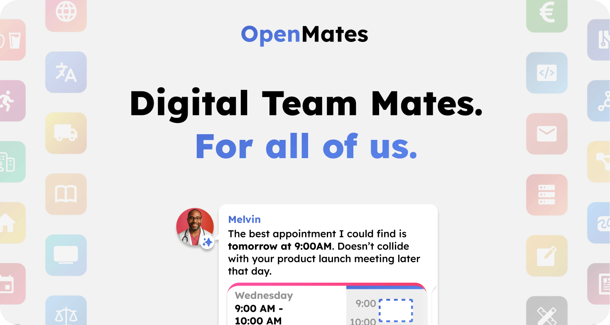
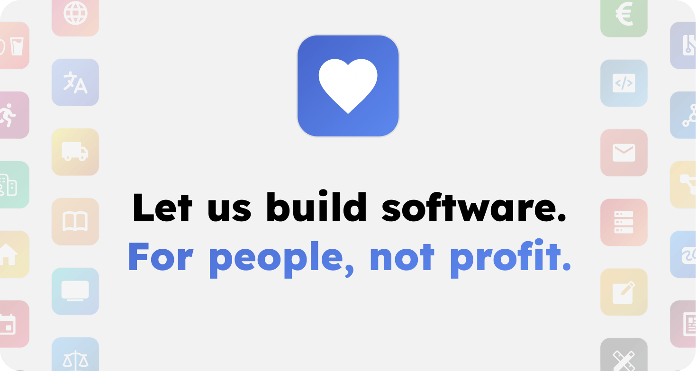

# OpenMates

Digital team mates for everyone. With a focus on everyday usecases for private and work life, great UX design, privacy and provider independence.

> _The following instructions (as well as the code) are still an early prototype and will be improved and extended in the coming weeks. Keep in mind the current release of OpenMates is for developers and early testers only and many features are still missing. If you prefer to wait for a more stable release (Current release estimate: July / August), join our Discord group to be informed when a more stable release of OpenMates is published._

## What is OpenMates?

OpenMates is a web app that makes AI agents accessible to everyone, which can not only answer questions but also use various apps. Apps like Web, Travel, Health, Code, Calendar and many more. Need to use external providers to search for train connections or search for available doctor appointments that don't collide with your calendar? Thats what app skills are for. And app focuses temporarily change the systemprompt for a conversation to focus the chat on a specific goal, like planning a new software project, getting career advice and much more - all without you having to be an expert in AI prompt engineering.

## Cloud web app

Want to test OpenMates without having to manage the deployment yourself? And also support the development financially at the same time? Then join our Discord group, where invite codes to signup for OpenMates will be posted on a regular base.

[Open web app](https://app.openmates.org)

## License

OpenMates is licensed under AGPL.

### What is allowed?

- Run OpenMates on your local machine or private server
- Share access with your team or organization
- Create new open source software based on OpenMates (commercial use allowed)
- Use OpenMates alongside other software on the same server

### What is prohibited?

- Offering OpenMates as a service to outside users while keeping your code changes private
- Creating software based on OpenMates under a different license than AGPL
- Combining OpenMates code with proprietary code in the same application

### Key requirement:

If you provide OpenMates as a network service to others (like a public website or API), you must make your complete source code - including any modifications - available to the public.

[Open GNU website with more details](https://www.gnu.org/licenses/why-affero-gpl.html)

## Self hosted setup

### Requirements

- docker & docker compose installed

### Setup

1. Clone the repo
   - `git clone https://github.com/glowingkitty/OpenMates`
2. Prepare `.env`
   - rename `example.env` to `.env`
   - add your API keys in `.env`

### Start

- open the OpenMates folder in your terminal
- `docker compose --env-file .env up`
- check the `cms-setup` logs for a generated invite code
- open [http://localhost:5174](http://localhost:5174), click signup and use the invite code to signup for an account and to start using OpenMates
- for better debugging / development, run web app via pnpm outside of a docker (for better hot reload / live code changes support) `pnpm --filter web_app start --host 0.0.0.0`

## Design Guidelines

A great UX & UI design that makes OpenMates accessible to everyone and not just tech enthusiasts is one of the key differences to other AI agents software.

[Show design guidelines](./docs/designguidelines/README.md)

## Architecture

OpenMates is a web app, which is built with a privacy focus, separation of concerns, easy setup and scalability in mind. The code is currently still a bit of a work in progress mess. I am working on it.

[Show architecture](./docs/architecture/README.md)

## Contribute

After many months of work I have open sourced this project, so that this personal project can grow into a larger community project. Now I am looking forward to see how the project will evolve.

[Learn how to contribute](./docs/contributing.md)
