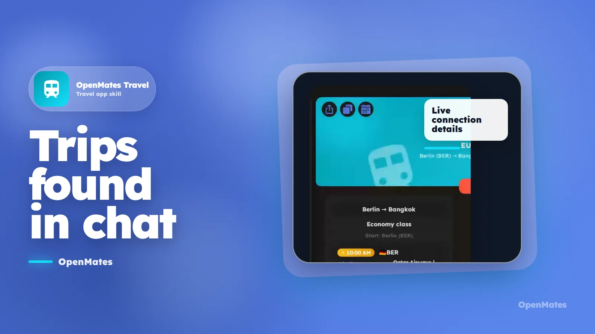
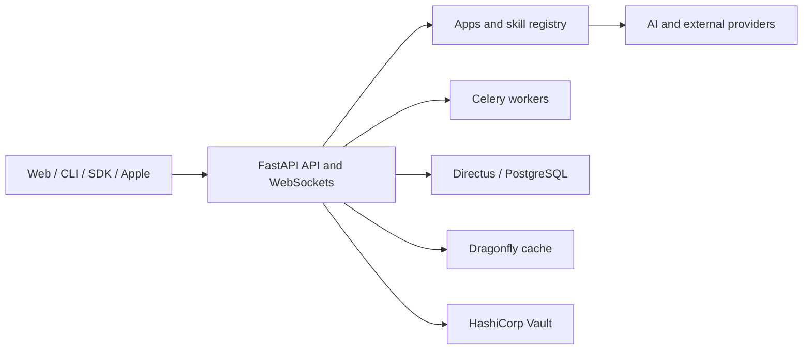

# OpenMates

**Digital team mates for everyday tasks, learning, research, and creation.**

OpenMates is an open-source, provider-independent AI assistant platform with built-in apps, rich results inside chat, client-side encrypted storage, automatic model selection, a terminal CLI, JavaScript and Python SDKs, and self-hosting support.

[Open the web app](https://openmates.org) | [Try example chats](https://openmates.org/example/flights-berlin-to-bangkok) | [Documentation](https://openmates.org/docs) | [Self-host](./docs/self-hosting/setup.md) | [Releases](https://github.com/glowingkitty/OpenMates/releases)

[](https://openmates.org/example/flights-berlin-to-bangkok)

> [!NOTE]
> OpenMates is alpha software. The web app is the most complete product surface, and capabilities can differ between the web app, CLI, SDKs, and native clients. The current user-facing product line is **v0.14**.

## See what it can already do

Public example chats are available without an account. They contain complete, interactive conversations and finished app results rather than isolated screenshots.

| Capability                                         | Live example                                                                                        |
| -------------------------------------------------- | --------------------------------------------------------------------------------------------------- |
| Search travel connections and inspect rich results | [Flights from Berlin to Bangkok](https://openmates.org/example/flights-berlin-to-bangkok)           |
| Run multi-step research with focused sub-chats     | [Why US egg prices stayed high](https://openmates.org/example/us-egg-prices-deep-research)          |
| Generate an editable Remotion video                | [Product teaser Remotion video](https://openmates.org/example/product-teaser-remotion-video)        |
| Create a formatted document                        | [Launch readiness checklist](https://openmates.org/example/launch-readiness-checklist-doc)          |
| Plot and inspect mathematical functions            | [Damped sine wave plot](https://openmates.org/example/damped-sine-wave-plot)                        |
| Generate visual assets                             | [Privacy-focused website background](https://openmates.org/example/privacy-website-hero-background) |
| Use current programming documentation              | [Svelte runes documentation](https://openmates.org/example/svelte-runes-docs)                       |

New to the project? Read [OpenMates for everyone](https://openmates.org/intro/for-everyone), [OpenMates for developers](https://openmates.org/intro/for-developers), or [who develops OpenMates](https://openmates.org/intro/who-develops-openmates).

## What makes OpenMates different

- **Apps inside chat:** Mates can search the web, read documents, work with code, create media, find places and events, plan travel, set reminders, and perform many other structured tasks.
- **Rich, reusable results:** App output becomes interactive embeds for sources, documents, maps, travel connections, images, videos, plots, code, and other result types.
- **Automatic model selection:** OpenMates routes requests to suitable AI models and skills instead of binding the product to one model vendor.
- **Privacy by design:** Private content is encrypted on the client before persistence, and selected sensitive details can be replaced with placeholders before a prompt is sent.
- **Credits instead of a required monthly plan:** Cloud usage is pay-per-use, with optional automatic top-ups.
- **Open and self-hostable:** Run the published stack on your own Linux server and connect API-based or local OpenAI-compatible models.
- **More than a web app:** Use OpenMates through the web, terminal CLI, JavaScript SDK, Python SDK, or the native Apple clients under active development.

Learn more about [apps and skills](./docs/user-guide/apps/README.md), [focus modes](./docs/user-guide/apps/focus-modes.md), and [embeds](./docs/architecture/messaging/embeds.md).

## Use OpenMates your way

| Surface               | Best for                                                 | Start here                                         |
| --------------------- | -------------------------------------------------------- | -------------------------------------------------- |
| Cloud web app         | Using OpenMates without managing infrastructure          | [openmates.org](https://openmates.org)             |
| CLI and terminal chat | Interactive terminal use, scripts, and server management | `npm install -g openmates`                         |
| JavaScript SDK        | Node.js applications and automation                      | `npm install openmates`                            |
| Python SDK            | Python applications and automation                       | `pip install openmates`                            |
| Self-hosted edition   | Running OpenMates on your own infrastructure             | [Self-hosting guide](./docs/self-hosting/setup.md) |

### CLI quick start

The npm package includes an interactive terminal UI, explicit subcommands, and the JavaScript SDK. It requires Node.js 20 or newer.

```bash
npm install -g openmates
openmates
```

Common commands:

```bash
openmates login
openmates chats list
openmates apps list
openmates docs search "API keys"
```

Read the [CLI guide](./docs/user-guide/cli/README.md) or the [npm package documentation](./frontend/packages/openmates-cli/README.md).

### SDK quick start

Create an API key under **Settings > Developers > API Keys**, then use the generated app and skill methods.

```ts
import { OpenMates } from "openmates";

const openmates = new OpenMates({
  apiKey: process.env.OPENMATES_API_KEY,
});

const result = await openmates.apps.web.search({
  requests: [{ query: "OpenMates SDK examples" }],
});
```

The [SDK guide](https://openmates.org/docs/user-guide/developers/sdk) covers JavaScript and Python. The Python package has additional examples in [`packages/openmates-python`](./packages/openmates-python/README.md).

## Self-host OpenMates

The published CLI installs and manages the Docker Compose stack. A default installation needs Linux, Docker with Compose support, Node.js/npm, at least 4 GB RAM, and at least 20 GB of free disk space. 8 GB or more RAM is recommended.

```bash
npm install -g openmates
openmates server install --path "$HOME/openmates"
openmates server start --path "$HOME/openmates"
openmates server status --path "$HOME/openmates"
```

Open `http://localhost:5173` after startup. A server can start without provider keys, but AI chat and model-backed features remain unavailable until an LLM provider or local OpenAI-compatible model is configured.

See the [self-hosting setup](./docs/self-hosting/setup.md) for profiles, provider setup, local models, backups, updates, HTTPS, and hardening.

## Privacy model

OpenMates encrypts chat content on the client before persistence. Databases, persistent caches, and backups store ciphertext. When an AI response or another requested operation requires plaintext, the relevant content is decrypted transiently in server memory and is not written to disk, logs, or traces.

This is **client-side encryption with in-memory-only server processing**, not end-to-end encryption. The server can decrypt relevant content on the user's behalf while processing a request.

OpenMates also includes client-side detection and placeholder substitution for supported sensitive-data types before sending. Users remain in control of exclusions and can restore placeholders in their own interface.

Read the [encryption architecture](./docs/architecture/core/encryption-architecture.md), [PII protection architecture](./docs/architecture/privacy/pii-protection.md), and [privacy policy](https://openmates.org/legal/privacy).

## Architecture at a glance


```mermaid
flowchart LR
    Clients[Web / CLI / SDK / Apple] --> API[FastAPI API and WebSockets]
    API --> Skills[Apps and skill registry]
    Skills --> Providers[AI and external providers]
    API --> Workers[Celery workers]
    API --> Data[Directus / PostgreSQL]
    API --> Cache[Dragonfly cache]
    API --> Vault[HashiCorp Vault]
```

The repository is organized as a pnpm/Turborepo frontend monorepo plus a Python/FastAPI backend:

```text
OpenMates/
|-- frontend/
|   |-- apps/web_app/          # SvelteKit web product and public docs
|   `-- packages/
|       |-- ui/                # Shared Svelte UI, services, i18n, and tokens
|       `-- openmates-cli/     # npm CLI and JavaScript SDK
|-- backend/
|   |-- core/                  # FastAPI, workers, Compose, Directus, and Vault
|   |-- apps/                  # Apps, skills, focus modes, and app metadata
|   `-- shared/                # Shared Python schemas, providers, and utilities
|-- packages/openmates-python/ # Python SDK
|-- apple/                     # Native iPhone, iPad, Mac, and Watch sources
|-- docs/                      # User, architecture, contributing, and hosting docs
`-- scripts/                   # Tests, audits, sessions, and operational tooling
```

See the [architecture index](./docs/architecture/README.md) for detailed system documentation.

## Contributing

OpenMates is currently maintained as a single-person project. The most helpful contributions are clear bug reports, product feedback, documentation improvements, self-hosting feedback, and small scoped fixes. Please discuss larger changes before starting implementation.

For a source checkout:

```bash
git clone https://github.com/glowingkitty/OpenMates.git
cd OpenMates
git switch dev
corepack enable
corepack prepare pnpm@10.23.0 --activate
pnpm install --frozen-lockfile
```

Contributor development uses Node.js 24.x and pnpm 10.23.0. Pull requests should normally target `dev`.

Read [CONTRIBUTING.md](./CONTRIBUTING.md), the [frontend standards](./docs/contributing/standards/frontend.md), [backend standards](./docs/contributing/standards/backend.md), and [testing guide](./docs/contributing/guides/testing.md) before making code changes.

## Documentation and community

- [User guide](./docs/user-guide/README.md)
- [CLI documentation](./docs/user-guide/cli/README.md)
- [Self-hosting documentation](./docs/self-hosting/README.md)
- [Architecture documentation](./docs/architecture/README.md)
- [Design guidelines](./docs/design-guide/README.md)
- [GitHub issues](https://github.com/glowingkitty/OpenMates/issues)
- [Signal developer group](https://signal.group/#CjQKIOlYZ63Rz7sibDjQ680wO1a0NcKxtfL0in2BA6Yvbr82EhDNd6GJYtaPfHn4BFcsETQq)
- [Discord community](https://discord.gg/bHtkxZB5cc)
- [Support OpenMates](https://openmates.org/#settings/support)

## License

The OpenMates repository is licensed under the [GNU Affero General Public License v3.0](./LICENSE). If you modify OpenMates and provide the modified program to users over a network, the AGPL requires you to offer those users the corresponding source code under the same license. Refer to the license text for the complete terms.
