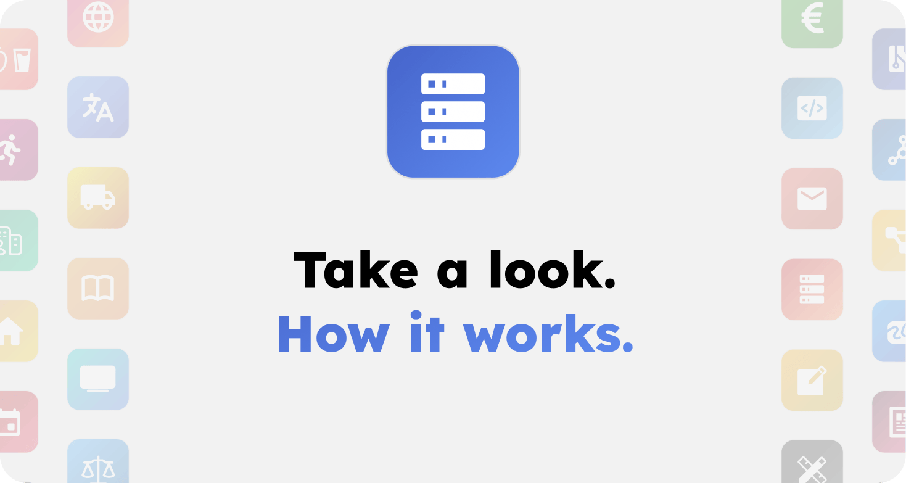

# OpenMates™

## What is OpenMates?

OpenMates™ aims to become an open source alternative to ChatGPT, Claude, Manus, etc. - focused on the best user experience, fulfilling your tasks using a wide range of apps, zero-knowledge encryption by default and compatibility with a wide range of AI models - making it also independent of specific companies. Currently in an alpha stage online. The perfect time for you to join in on the development with your feedback & contributions.

[Click to show project overview slides PDF](./docs/internal/slides/openmates_overview_slides.pdf)

[Support OpenMates financially](https://openmates.org/#settings/support)

> _The following documentation (as well as the code) are still in an early alpha stage. Keep in mind the current release of OpenMates is for developers and early testers only and some features are still missing._

### Goal

OpenMates aims to be the most user-friendly, privacy-focused and provider-independent AI agent software. Beyond being a powerful tool for daily tasks, it is designed with a strong focus on **education and inspiration** — empowering users to learn and discover new ideas through interactive AI assistance.

#### Apps

Apps are one of the core components of OpenMates. They allow your digital team mates to use various external providers to fullfill your requests - from searching the web, finding meetups, finding restaurants, generating images, transcribing videos, and much more.

[Click here to learn more](./docs/apps/README.md)

### Completed

The [alpha release of OpenMates](https://openmates.org) is available and includes core features like:

- **Apps & AI Agents**: Fulfill tasks using a wide range of integrated apps (Web search, Videos, Maps, News, etc.)
- **Zero-Knowledge Encryption**: Privacy by default with client-side encryption for all your chats and data.
- **Unified UI**: A modern interface that seamlessly integrates media previews and app skill details.
- **Educational Support**: Auto-generated follow-up questions and new chat suggestions to help you explore topics more deeply.
- **Auto AI Model Selection**: Automatically routes your requests to the best-suited AI model based on complexity.
- **Developer API**: OpenAI-compatible REST API for external integrations and CLI tools.

A more stable and feature-rich beta release is planned for 2026.

### What's next

While many core features are implemented, we are continuously improving OpenMates. Our next focus areas include:

- **Daily Inspirations**: Personalized daily prompts and insights to keep you learning and inspired.
- **CLI & REST API**: Implementing a powerful CLI tool and improving the developer REST API.
- **Expanded App Ecosystem**: Adding more specialized apps and deeper integrations.
- **Improved AI Model Selection**: Refining the automated process for selecting the best-suited AI model based on task complexity.
- **Separate documentation page**: A dedicated, searchable documentation site.

### How to contribute

You can help by testing the web app and providing feedback. You can also help by contributing to the code.

[Click here to learn how to contribute](./docs/contributing/contributing.md)

## Cloud web app

Want to test OpenMates without having to manage the deployment yourself? And also support the development financially at the same time? Then join our Discord group, where invite codes to sign up for OpenMates will be posted on a regular basis.

[Open web app](https://openmates.org)

## License

OpenMates is licensed under AGPL.

### What is allowed?

- Run OpenMates on your local machine or private server
- Share access with your team or organization
- Create new open source software based on OpenMates (commercial use allowed)
- Use OpenMates alongside other software on the same server

### What is prohibited?

- Offering OpenMates as a service to outside users while keeping your code changes private
- Creating software based on OpenMates under a different license than AGPL
- Combining OpenMates code with proprietary code in the same application

### Key requirement:

If you provide OpenMates as a network service to others (like a public website or API), you must make your complete source code - including any modifications - available to the public.

[Open GNU website with more details](https://www.gnu.org/licenses/why-affero-gpl.html)

## Self-hosted setup

Learn how to self-host OpenMates by reading the [Self-Hosting Guide](./docs/self-hosting/setup.md).

## Design Guidelines

A great UX & UI design that makes OpenMates accessible to everyone and not just tech enthusiasts is one of the key differences from other AI agent software.

[Show design guidelines](./docs/design-guide/README.md)

## Architecture

OpenMates is a web app built with a focus on privacy, separation of concerns, easy setup, and scalability. While the codebase is continuously being refined, it follows a modular architecture designed for high extensibility.

[Show architecture](./docs/architecture/README.md)
