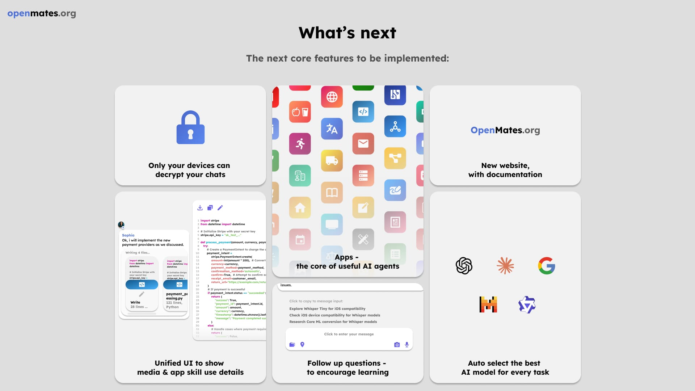

# OpenMates™

[](https://openmates.org)

## What is OpenMates?

OpenMates™ aims to become an open source alternative to ChatGPT, Claude, Manus, etc. - focused on the best user experience, fulfilling your tasks using a wide range of apps, zero-knowledge encryption by default and compatibility with a wide range of AI models - making it also independent of specific companies. Currently in an alpha stage online. The perfect time for you to join in on the development with your feedback & contributions.


[Click to show project overview slides PDF](./docs/slides/openmates_overview_slides.pdf)

> *The following documentation (as well as the code) are still in an early alpha stage. Keep in mind the current release of OpenMates is for developers and early testers only and some features are still missing.*

### Goal


OpenMates aims to be the most user-friendly, privacy-focused and provider-independent AI agent software. Beyond being a powerful tool for daily tasks, it is designed with a strong focus on **education and inspiration** — empowering users to learn and discover new ideas through interactive AI assistance.

#### Apps


Apps are one of the core components of OpenMates. They allow your digital team mates to use various external providers to fullfill your requests - from searching the web, finding meetups, finding restaurants, generating images, transcribing videos, and much more.

[Click here to learn more](./docs/architecture/apps/README.md)

### Completed


The [alpha release of OpenMates](https://openmates.org) is available and includes core features like:
- **Apps & AI Agents**: Fulfill tasks using a wide range of integrated apps (Web search, Videos, Maps, News, etc.)
- **Zero-Knowledge Encryption**: Privacy by default with client-side encryption for all your chats and data.
- **Unified UI**: A modern interface that seamlessly integrates media previews and app skill details.
- **Educational Support**: Auto-generated follow-up questions and new chat suggestions to help you explore topics more deeply.
- **Auto AI Model Selection**: Automatically routes your requests to the best-suited AI model based on complexity.
- **Developer API**: OpenAI-compatible REST API for external integrations and CLI tools.

A more stable and feature-rich beta release is planned for 2026.

### What's next



While many core features are implemented, we are continuously improving OpenMates. Our next focus areas include:

- **Daily Inspirations**: Personalized daily prompts and insights to keep you learning and inspired.
- **CLI & REST API**: Implementing a powerful CLI tool and improving the developer REST API.
- **Expanded App Ecosystem**: Adding more specialized apps and deeper integrations.
- **Improved AI Model Selection**: Refining the automated process for selecting the best-suited AI model based on task complexity.
- **Separate documentation page**: A dedicated, searchable documentation site.

### How to contribute


You can help by testing the web app and providing feedback. You can also help by contributing to the code.

[Click here to learn how to contribute](./docs/contributing.md)

## Cloud web app

[](https://openmates.org)

Want to test OpenMates without having to manage the deployment yourself? And also support the development financially at the same time? Then join our Discord group, where invite codes to sign up for OpenMates will be posted on a regular basis.

[Open web app](https://openmates.org)

## License

[](https://www.gnu.org/licenses/why-affero-gpl.html)

OpenMates is licensed under AGPL.

### What is allowed?

- Run OpenMates on your local machine or private server
- Share access with your team or organization
- Create new open source software based on OpenMates (commercial use allowed)
- Use OpenMates alongside other software on the same server

### What is prohibited?

- Offering OpenMates as a service to outside users while keeping your code changes private
- Creating software based on OpenMates under a different license than AGPL
- Combining OpenMates code with proprietary code in the same application

### Key requirement:

If you provide OpenMates as a network service to others (like a public website or API), you must make your complete source code - including any modifications - available to the public.

[Open GNU website with more details](https://www.gnu.org/licenses/why-affero-gpl.html)

## Self-hosted setup


### Setup

1.  **Clone the repository**
    ```bash
    git clone https://github.com/glowingkitty/OpenMates
    cd OpenMates
    ```
2.  **Run the setup script**
    This will check for dependencies (Docker, Docker Compose, pnpm) and install them if missing. It will also create your `.env` file, generate necessary secrets, and set up the Docker network.
    ```bash
    chmod +x setup.sh
    ./setup.sh
    ```
    *Note: The script requires `sudo` to install missing dependencies. It is designed for Debian-based systems (like Ubuntu). If you're on another OS, please install the dependencies manually.*

3.  **Add your API keys**
    Open the newly created `.env` file and add your secret API keys for any services you want to use (e.g., Mailjet, Google, etc.).

### Start the services

Once the initial setup is complete, you can start the services. For a typical development setup, you'll run the backend services using Docker and the frontend service directly using pnpm for a better development experience (e.g., hot-reloading).

-   **1. Start the backend services:**
    This command starts all the necessary background services (like the API, database, etc.).
    ```bash
    docker compose --env-file .env -f backend/core/docker-compose.yml up -d
    ```
    *Note: To also access the web UIs for services like Directus (CMS) and Grafana (Monitoring), you need to include the override file. Use the following command instead:*
    ```bash
    docker compose --env-file .env -f backend/core/docker-compose.yml -f backend/core/docker-compose.override.yml up -d
    ```
    - Directus will be available at [http://localhost:8055](http://localhost:8055)
    - Grafana will be available at [http://localhost:3000](http://localhost:3000)

-   **2. Check Vault for secret import:**
    After starting the services, check the logs of the `vault-setup` container to ensure all your secrets from the `.env` file have been successfully imported into Vault.
    ```bash
    docker compose --env-file .env -f backend/core/docker-compose.yml logs vault-setup
    ```
    If the logs indicate a successful import, you should update your `.env` file by replacing the actual API key values with `IMPORTED_TO_VAULT`. This prevents the keys from being re-imported on subsequent startups and keeps them from being exposed in the `.env` file.

    For example, if your `.env` file has:
    `SECRET__MISTRAL_AI__API_KEY=your_secret_key`

    You should change it to:
    `SECRET__MISTRAL_AI__API_KEY=IMPORTED_TO_VAULT`

-   **3. Start the frontend service (for development):**
    This command starts the web app with hot-reloading, which is ideal for development.
    ```bash
    pnpm --filter web_app dev --host 0.0.0.0 --port 5173
    ```
    *Note: The first time you access the web app, it may take up to a minute to load as Svelte builds the necessary files.*

-   **4. Check for your invite code:**
    The initial setup generates an invite code for the first user. Check the logs of the `cms-setup` container to find it.
    ```bash
    docker compose --env-file .env -f backend/core/docker-compose.yml logs cms-setup
    ```
-   **5. Access the web app:**
    Open [http://localhost:5173](http://localhost:5173) in your browser. Click "Sign Up" and use the invite code to create your account.

### Development workflow

For development, you typically want to restart the backend services (excluding the webapp container, since you're running the frontend with `pnpm dev` for hot-reloading) and start the frontend separately.

**Restart backend services (for development):**
This command stops all services, rebuilds all backend services, and starts them again.
```bash
docker compose --env-file .env -f backend/core/docker-compose.yml -f backend/core/docker-compose.override.yml down && docker volume rm openmates-cache-data && docker compose --env-file .env -f backend/core/docker-compose.yml -f backend/core/docker-compose.override.yml build && docker compose --env-file .env -f backend/core/docker-compose.yml -f backend/core/docker-compose.override.yml up -d
```

**Start the frontend (for development):**
```bash
pnpm --filter web_app dev --host 0.0.0.0 --port 5173
```

### Manage the services

You can use standard Docker Compose commands to manage your OpenMates environment. Remember to include the optional override file if you are using it.

-   **View logs:**
    ```bash
    # View logs for all services
    docker compose --env-file .env -f backend/core/docker-compose.yml logs -f

    # View logs for a specific service (e.g., api)
    docker compose --env-file .env -f backend/core/docker-compose.yml logs -f api
    ```
-   **Stop all services:**
    ```bash
    docker compose --env-file .env -f backend/core/docker-compose.yml down
    ```
-   **Restart a specific service:**
    ```bash
    docker compose --env-file .env -f backend/core/docker-compose.yml restart api
    ```

### Reverse Proxy Configuration (Caddy)

For production deployments or when you need TLS/HTTPS support, you can use Caddy as a reverse proxy. OpenMates provides a template-based configuration pattern:

1. **Copy the template:**
   ```bash
   cp deployment/Caddyfile.example deployment/dev_server/Caddyfile.local
   ```

2. **Edit the configuration:**
   - Replace `<API_DOMAIN>` with your API domain (e.g., `api.dev.openmates.org`)
   - Replace `<FRONTEND_ORIGIN>` with your frontend origin (e.g., `https://app.dev.openmates.org`)
   - Replace `<API_UPSTREAM>` with your API upstream (e.g., `api:8000` for Docker Compose or `localhost:8000` for standalone)
   - Replace `<YOUR_EMAIL@example.com>` with your email for Let's Encrypt

3. **Use the configuration:**
   Point Caddy to your configured file, or see [deployment/README.md](./deployment/README.md) for detailed instructions.

**Note:** Environment-specific Caddyfiles (like `Caddyfile.local`, `Caddyfile.prod`) are gitignored to prevent committing sensitive configuration. Only the template (`Caddyfile.example`) is committed to the repository.

### Troubleshooting

**Complete reset (clears cache and rebuilds everything):**
```bash
docker compose --env-file .env -f backend/core/docker-compose.yml -f backend/core/docker-compose.override.yml down && docker volume rm openmates-cache-data && docker compose --env-file .env -f backend/core/docker-compose.yml -f backend/core/docker-compose.override.yml build && docker compose --env-file .env -f backend/core/docker-compose.yml -f backend/core/docker-compose.override.yml up -d
```

*Use this command when normal restarts don't resolve issues, or when you want to ensure a completely clean state. This will:*
- *Stop all services*
- *Remove cached data that might be causing issues*
- *Rebuild all Docker images from scratch*
- *Start all services with fresh builds*

## Design Guidelines

[](./docs/designguidelines/README.md)

A great UX & UI design that makes OpenMates accessible to everyone and not just tech enthusiasts is one of the key differences from other AI agent software.

[Show design guidelines](./docs/designguidelines/README.md)

## Architecture

[](./docs/architecture/README.md)

OpenMates is a web app built with a focus on privacy, separation of concerns, easy setup, and scalability. While the codebase is continuously being refined, it follows a modular architecture designed for high extensibility.

[Show architecture](./docs/architecture/README.md)

## Code quality

The code is currently more chaotic and not as well commented / documented as I want it to be. But this is a temporary state and does not reflect what I consider well-written and organized code.
Because this is a pretty big project in terms of scope / functionality / parts to implement - and because I find it pretty obvious at this point that AI-assisted coding is here to stay and will only become more relevant and not less - I switched during the development process from writing most of the code myself to instead collaborating with AI together to plan the architecture, todos and let AI do most of the coding. My experiences here ranged from being blown away by AI having taught me a lot new about software development, saved me a lot of time, built better code than what I would have come up with and made a project of this scale even possible to start as a single person - up to me yelling at the AI for making stupid suggestions. However, while in some instances one can fairly blame the LLM models themselves - most of the blame goes to how badly the existing AI coding extensions and VScode forks like Cursor and Windsurf are implementing existing LLMs. After all: an LLM can’t consider context it doesn’t know about. Resulting in none of them being able so far to deliver a high-quality workflow that is consistent over weeks. All of the extensions and AI VScode forks I tried (and I tried easily 6-7 of them) are on various degrees of shitty, with some being less shitty than others (especially if one knows how to give the LLM additional code context to try to fix the mistakes of the developers who built the extensions and forks). But still, they are more valuable than in the way and I find it important to instead of rejecting AI-assisted coding - instead to learn what others do badly and how it should be done better instead. Which also led me to lots of ideas for building a custom VScode extension for OpenMates in the coming months. But that’s a topic for another day.​​​​​​​​​​​​​​​​
