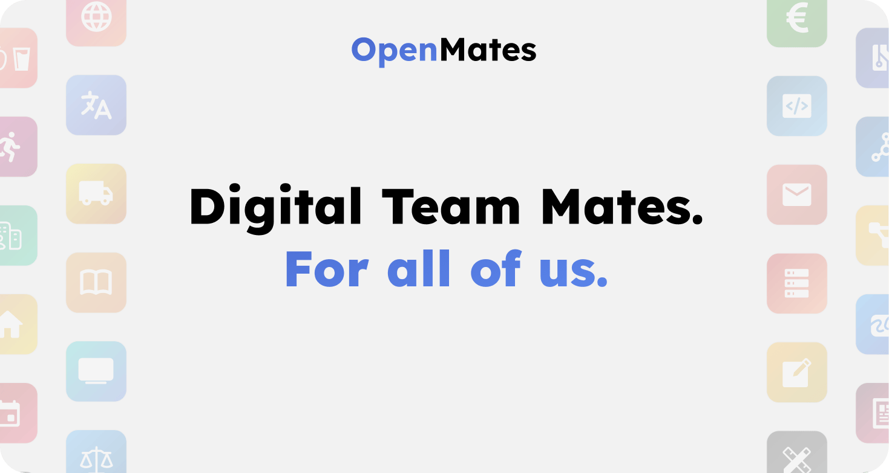

# OpenMates

Digital teammates for everyone. With a focus on everyday use cases for private and work life, great UX design, privacy and provider independence.

> *The following instructions (as well as the code) are still an early prototype and will be improved and extended in the coming weeks. Keep in mind the current release of OpenMates is for developers and early testers only and many features are still missing. If you prefer to wait for a more stable release (Current release estimate: July / August), join our Discord group to be informed when a more stable release of OpenMates is published.*

## What is OpenMates?

OpenMates is a web app that makes AI agents accessible to everyone, which can not only answer questions but also use various apps. Apps like Web, Travel, Health, Code, Calendar and many more. Need to use external providers to search for train connections or search for available doctor appointments that don’t collide with your calendar? That’s what app skills are for. And app focuses temporarily change the system prompt for a conversation to focus the chat on a specific goal, like planning a new software project, getting career advice and much more - all without you having to be an expert in AI prompt engineering.

## Cloud web app

Want to test OpenMates without having to manage the deployment yourself? And also support the development financially at the same time? Then join our Discord group, where invite codes to sign up for OpenMates will be posted on a regular basis.

[Open web app](https://app.openmates.org)

## License

OpenMates is licensed under AGPL.

### What is allowed?

- Run OpenMates on your local machine or private server
- Share access with your team or organization
- Create new open source software based on OpenMates (commercial use allowed)
- Use OpenMates alongside other software on the same server

### What is prohibited?

- Offering OpenMates as a service to outside users while keeping your code changes private
- Creating software based on OpenMates under a different license than AGPL
- Combining OpenMates code with proprietary code in the same application

### Key requirement:

If you provide OpenMates as a network service to others (like a public website or API), you must make your complete source code - including any modifications - available to the public.

[Open GNU website with more details](https://www.gnu.org/licenses/why-affero-gpl.html)

## Self-hosted setup

### Requirements

- docker & docker compose installed

### Setup

1. Clone the repo
    - `git clone https://github.com/glowingkitty/OpenMates`
2. Prepare `.env`
    - rename `.env.example` to `.env`
    - add your API keys in `.env`

### Start

- open the OpenMates folder in your terminal
- `docker compose --env-file .env up`
- check the `cms-setup` logs for a generated invite code
- open <http://localhost:5174>, click sign up and use the invite code to sign up for an account and to start using OpenMates
- for better debugging / development, run web app via pnpm outside of a docker (for better hot reload / live code changes support) `pnpm --filter web_app start --host 0.0.0.0`

## Design Guidelines

A great UX & UI design that makes OpenMates accessible to everyone and not just tech enthusiasts is one of the key differences from other AI agent software.

[Show design guidelines](./docs/designguidelines/README.md)

## Architecture

OpenMates is a web app, which is built with a privacy focus, separation of concerns, easy setup and scalability in mind. The code is currently still a bit of a work-in-progress mess. I am working on it.

[Show architecture](./docs/architecture/README.md)

## Contribute

After many months of work I have open-sourced this project, so that this personal project can grow into a larger community project. Now I am looking forward to seeing how the project will evolve.

[Learn how to contribute](./docs/contributing.md)

## Code quality

The code is currently more chaotic and not as well commented / documented as I want it to be. But this is a temporary state and does not reflect what I consider well-written and organized code.
Because this is a pretty big project in terms of scope / functionality / parts to implement - and because I find it pretty obvious at this point that AI-assisted coding is here to stay and will only become more relevant and not less - I switched during the development process from writing most of the code myself to instead collaborating with AI together to plan the architecture, todos and let AI do most of the coding. My experiences here ranged from being blown away by AI having taught me a lot new about software development, saved me a lot of time, built better code than what I would have come up with and made a project of this scale even possible to start as a single person - up to me yelling at the AI for making stupid suggestions. However, while in some instances one can fairly blame the LLM models themselves - most of the blame goes to how badly the existing AI coding extensions and VScode forks like Cursor and Windsurf are implementing existing LLMs. After all: an LLM can’t consider context it doesn’t know about. Resulting in none of them being able so far to deliver a high-quality workflow that is consistent over weeks. All of the extensions and AI VScode forks I tried (and I tried easily 6-7 of them) are on various degrees of shitty, with some being less shitty than others (especially if one knows how to give the LLM additional code context to try to fix the mistakes of the developers who built the extensions and forks). But still, they are more valuable than in the way and I find it important to instead of rejecting AI-assisted coding - instead to learn what others do badly and how it should be done better instead. Which also led me to lots of ideas for building a custom VScode extension for OpenMates in the coming months. But that’s a topic for another day.​​​​​​​​​​​​​​​​

