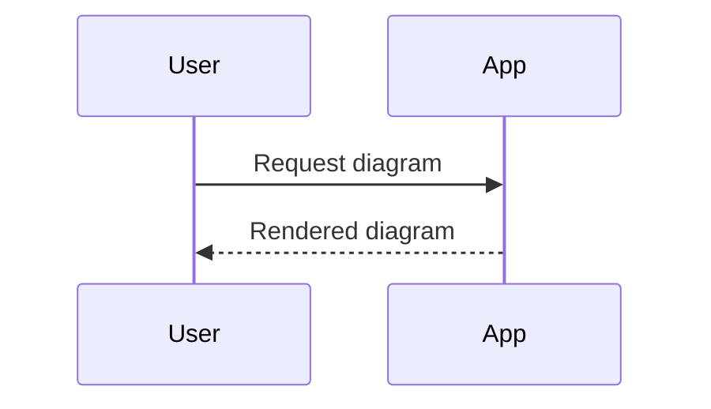

**Mermaid Diagram Formatting Rules**

When the user asks for a diagram, flowchart, sequence diagram, state diagram, timeline, entity relationship diagram, architecture diagram, or process map that can be represented as source, use a Mermaid code fence.

Do not use a generic `code`, `json`, `text`, `markdown`, or language-specific fence for Mermaid diagrams. The opening fence must be exactly `mermaid` or `mmd` so OpenMates can create a Diagrams embed.

Use Mermaid only when it fits the user request. For runnable apps, videos, PCB schematics, or normal source code, follow the specialized fence rules for those content types instead.
