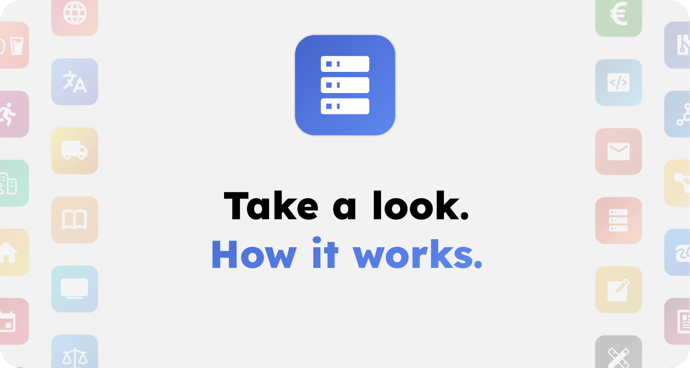

# Architecture

## Quick links

- **Servers**: [servers.md](servers.md)
- **Signup & login**: [signup_login.md](signup_login.md)
- **Security**: [security.md](security.md)
- **Message processing**: [message_processing.md](message_processing.md)
- **Message parsing**: [message_parsing.md](message_parsing.md)
- **AI model selection**: [ai_model_selection.md](ai_model_selection.md)
- **Pricing**: [pricing.md](pricing.md)
- **Translations**: [translations.md](translations.md)
- **Sync**: [sync.md](sync.md)
- **Share a chat**: [share_chat.md](share_chat.md)

## Apps

- **Apps overview**: [apps/README.md](apps/README.md)
- **App skills**: [apps/app_skills.md](apps/app_skills.md)
- **Code**: [apps/code.md](apps/code.md)
- **Events**: [apps/events.md](apps/events.md)
- **Fitness**: [apps/fitness.md](apps/fitness.md)
- **Images**: [apps/images.md](apps/images.md)
- **Music**: [apps/music.md](apps/music.md)
- **News**: [apps/news.md](apps/news.md)
- **Slides**: [apps/slides.md](apps/slides.md)
- **Study**: [apps/study.md](apps/study.md)
- **Travel**: [apps/travel.md](apps/travel.md)
- **Videos**: [apps/videos.md](apps/videos.md)
- **Web**: [apps/web.md](apps/web.md)

## Servers

### Backend

- Docker compose setup
	- api docker (FastAPI)
	- cms dockers (Directus & PostgreSQL)
	- task-worker dockers (celery worker & scheduler)
	- cache docker (Dragonfly)
	- logging dockers (Grafana, Loki, Prometheus)
	- app-ai docker & other docker containers for each app

### Frontend

- svelte web app
	- can run either directly via docker-compose (default) or via pnpm dev mode for better debugging/ live code updates (only relevant for contributors)

[Click here to read more](servers.md)

## Signup & login architecture

### v0.1 alpha signup & login

- user signup & login via email + password + 2FA OTP (mandatory)

### Signup & login plans for improvements

- multiple signup / login options:
	- email + passkey (recommended)
	- email + hardware key / yubikey
	- email + password (requires additional 2FA OTP to enhance security)

[Click here to read more](signup_login.md)

## Security architecture

### v0.1 alpha security

- user data encrypted & decrypted via HashiCorp Vault and AES on server
- API keys stored in HashiCorp Vault
- user encryption keys stored in HashiCorp Vault
- user devices store chats decrypted in indexeddb on their device for fast access & offline capacity

### Security plans for improvements

- on signup we create encryption keys for user on user device, then encrypt the keys with the login method (password/passkey/hardwarekey) and only upload the encrypted encryption keys to the server (wrapped encryption key). One key per chat and one key per app (for settings & memories).
- encrypting and decrypting of chats and sensitive user data (like app settings, app memories, etc.) will happen on user device, not on server
- encryption key rotation is done every 2(?) weeks or if user reports login from unknown device and login is reset
- server will never be able to decrypt user data
- user device will send plaintext data for LLM requests to server only on demand and only with minimum data needed. Those data will remain in memory and never be stored to disk. Only last three active chats will be cached (encrypted via AES via server keys) on server.
- goal: even if server gets hacked or regimes demand user data, those user data will be of little use

[Click here to read more](security.md)

## Processing architecture of messages

- user sends message in web app
- fastapi docker receives message via websocket
- after authentication message is forwarded to celery to execute via the AI app / Ask skill the request
- billing-precheck
	- checks if user has enough minimum credits for request
- pre-processing (by default using cheap Mistral API on EU servers)
	- detect harmful / illegal request (and reject if clearly detected)
	- generate chat title
	- detect complexity level
	- detect temperature (creativity level needed)
	- match category to forward to right mate
	- (coming soon, with improved encryption) encrypt user message on user device and send to server for long term storage
- main-processing (model/provider depends on complexity level)
	- process request via LLM
 	- (coming soon) if app skill or app focus mode is requested, either call tool directly and wait for response to process - or forward to celery and inform user that they will be informed once request is completed
	- stream back response back to frontend via websocket (if chat is open on device, else wait for completed message to notify about completed message)
- post-processing (by default using cheap Mistral API on EU servers)
	- check harmfulness & misuse for scams / causing harm risk
	- based on last user question and assistant response: suggest 6 possible follow up questions which are shown to user, which user can click on to add them to message input field
	- (coming soon, with improved encryption) encrypt assistant response on user device and send to server for long term storage
- billing
	- user is charged in credits for main processing (for input tokens and output tokens)
