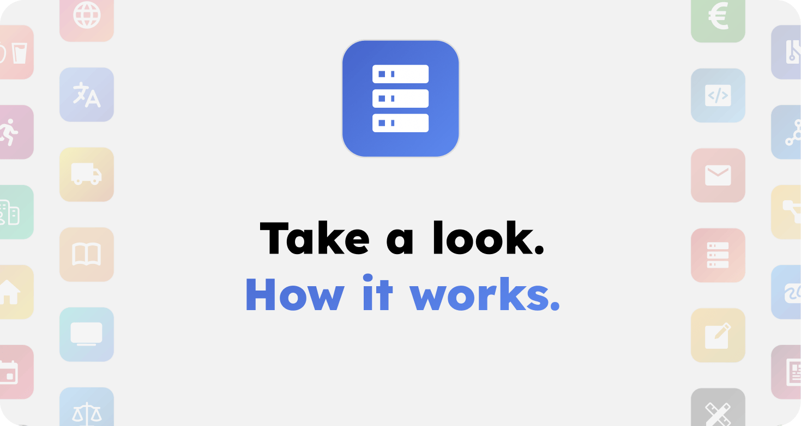

# Architecture

Technical architecture documentation for developers and contributors. For user-facing guides, see the [User Guide](../user-guide/README.md).

## Core Systems

- [Servers](core/servers.md) - Docker Compose infrastructure, container architecture
- [Security](core/security.md) - Zero-knowledge encryption, Vault key management
- [Zero-Knowledge Storage](core/zero-knowledge-storage.md) - Encrypted storage architecture
- [Signup & Authentication](core/signup-and-auth.md) - Auth flows, passkeys, 2FA
- [Passkeys](core/passkeys.md) - WebAuthn/PRF implementation details
- [Account Recovery](core/account-recovery.md) - Account reset and recovery flows
- [Account Backup](core/account-backup.md) - GDPR data export architecture

## Message Pipeline

- [Message Processing](messaging/message-processing.md) - Full request/response pipeline with encryption
- [Message Parsing](messaging/message-parsing.md) - Client-side TipTap JSON parsing and rendering
- [Message Input Field](messaging/message-input-field.md) - Input field architecture and embed detection
- [Message Previews Grouping](messaging/message-previews-grouping.md) - Dynamic embed grouping
- [Embeds](messaging/embeds.md) - First-class embed entity system

## AI & Models

- [AI Model Selection](ai/ai-model-selection.md) - Provider configuration and automatic routing
- [Thinking Models](ai/thinking-models.md) - Support for reasoning models (Gemini, Claude, o-series)
- [Hallucination Mitigation](ai/hallucination-mitigation.md) - Reducing AI hallucinations
- [Preprocessing Model Comparison](ai/preprocessing-model-comparison.md) - Mistral model benchmarks
- [Mates](ai/mates.md) - Specialized AI assistant identities and routing
- [Followup Suggestions](ai/followup-suggestions.md) - Post-processing follow-up generation

## Privacy & Security

- [PII Protection](privacy/pii-protection.md) - Client-side PII detection and anonymization
- [Prompt Injection](privacy/prompt-injection.md) - Defense-in-depth against prompt injection
- [Sensitive Data Redaction](privacy/sensitive-data-redaction.md) - Redacting PII before LLM processing
- [Email Privacy](privacy/email-privacy.md) - Client-side email encryption

## Data & Sync

- [Sync](data/sync.md) - 3-phase multi-device synchronization system
- [Device Sessions](data/device-sessions.md) - Multi-device session management
- [Translations](data/translations.md) - i18n system and translation workflow

## Payments

- [Payment Processing](payments/payment-processing.md) - Stripe integration and credit system

## Apps Architecture

Technical implementation details for the apps system. For user-facing app guides, see [User Guide > Apps](../user-guide/apps/README.md).

- [App Skills](apps/app-skills.md) - Skill registration, BaseSkill, app.yml schema
- [Function Calling](apps/function-calling.md) - LLM tool calling integration
- [Focus Modes Implementation](apps/focus-modes-implementation.md) - Focus mode technical details
- [Action Confirmation](apps/action-confirmation.md) - User confirmation for destructive actions
- [REST API](apps/rest-api.md) - OpenAI-compatible API endpoints

## Frontend

- [Web App](frontend/web-app.md) - SvelteKit application architecture
- [Docs Web App](frontend/docs-web-app.md) - Documentation rendering system
- [Daily Inspiration](frontend/daily-inspiration.md) - Curated daily prompts system
- [Accessibility](frontend/accessibility.md) - WCAG compliance and a11y patterns

## Infrastructure

- [Health Checks](infrastructure/health-checks.md) - Service health monitoring
- [Logging](infrastructure/logging.md) - Structured logging and OpenObserve
- [Admin Console Log Forwarding](infrastructure/admin-console-log-forwarding.md) - Client log forwarding
- [Cronjobs](infrastructure/cronjobs.md) - Scheduled tasks
- [Developer Settings](infrastructure/developer-settings.md) - API keys and developer mode
- [File Upload Pipeline](infrastructure/file-upload-pipeline.md) - Presigned URLs and S3 storage
- [Analytics](infrastructure/analytics.md) - Privacy-preserving analytics
- [Status Page](infrastructure/status-page.md) - Service status monitoring
- [Vector Personalization](infrastructure/vector-personalization.md) - Personalized search

## Integrations

- [Luma API](integrations/luma.md) - Luma video generation API
- [Media Generation](integrations/media-generation.md) - OG images and social media graphics

## Storage

- [Embed Cold Storage](storage/embed-cold-storage.md) - Archival and cold storage for embeds

## Contributing

- [Contributing Guide](contributing/contributing.md) - How to contribute to OpenMates
