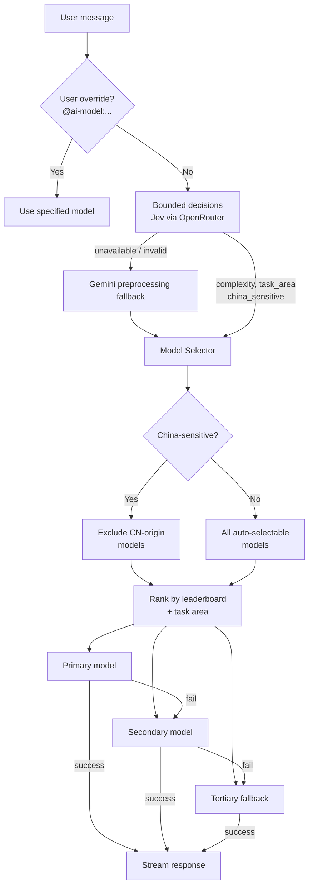

# AI Model Selection

> Uses Jev for bounded request decisions, then selects the optimal generative LLM using leaderboard rankings, task analysis, and sensitivity filters, with tiered fallback across models and providers.

## Why This Exists

A single model cannot optimally serve all request types. Simple factual questions waste money on premium models; complex coding tasks need top-tier reasoning. The selection system matches request characteristics to model strengths while filtering out models that may be censored on sensitive topics.

## How It Works

### Configuration

Model selection is configured in [`backend/apps/ai/app.yml`](../../backend/apps/ai/app.yml) under `skill_config`:

- **`enable_auto_model_selection`**: When `true` (current default), uses intelligent leaderboard-based selection. When `false`, falls back to hardcoded `default_llms`.
- **`default_llms`**: Hardcoded model IDs for preprocessing, simple requests, complex requests, and content sanitization.
- **Current defaults**: Jev (`typesafe/jev-1.13`) for bounded decisions, Gemini 3.5 Flash Lite (`google/gemini-3.5-flash-lite`) for generative preprocessing fallback, and Gemini 3.8 Flash (`google/gemini-3.8-flash`) for simple and complex main processing.

### Provider YAML Structure

Each LLM provider has a YAML config in [`backend/providers/`](../../backend/providers/). Models define:

- **`country_origin`**: ISO 3166-1 alpha-2 code (used for China-sensitive filtering)
- **`allow_auto_select`**: Whether the model participates in auto-selection
- **`external_ids`**: Cross-platform ID mappings (LMArena, OpenRouter)
- **`default_server`** and **`servers`**: Provider routing (e.g., AWS Bedrock primary, direct API fallback)
- **`servers[].model_id`** and **`reasoning_effort`**: Provider-specific upstream IDs and reasoning controls for catalog variants such as Sol Max
- **`pricing`/`costs`**: Token pricing for billing

### Selection Flow

1. **User override check**: If the message contains `@ai-model:{model_id}`, that model is used directly, bypassing all selection logic. Other overrides: `@mate:{name}`, `@skill:{app}:{id}`, `@focus:{app}:{id}`.

2. **Preprocessing decision analysis**: The preprocessor ([`preprocessor.py`](../../backend/apps/ai/processing/preprocessor.py)) first calls Jev's decision endpoint for bounded fields. Jev returns typed Choice, Noul, and Score answers rather than text. It supplies:
   - `complexity` (simple/complex)
   - `task_area` (code, math, creative, instruction, general)
   - `user_unhappy` (boolean)
   - `china_model_sensitive` (boolean, detected by LLM -- replaces old hardcoded keyword approach)
   - topic/language/safety scores and bounded skill, focus, memory, preview, and icon selections

   A fresh client-authorized chat summary may accompany the bounded recent-message projection as a separate typed state field. It is sanitized, capped at 4,000 characters, and labeled conversation data rather than instructions. If Jev is unavailable, malformed, oversized, or below a required confidence threshold, the existing Gemini structured-output preprocessing path runs with its own provider fallbacks. Jev is never selected as the main answer model. See [TypeSafe Jev decision API](../../apis/typesafe-jev.md).

3. **Model selection** ([`model_selector.py`](../../backend/apps/ai/utils/model_selector.py)):
   - Filters to models with `allow_auto_select: true`
   - Excludes CN-origin models if `china_model_sensitive` is true
   - For simple tasks: selects from economical models (e.g., Claude Haiku, Gemini Flash)
   - For complex tasks or unhappy users: selects premium models for the detected task area
   - Returns primary + secondary + fallback (3 models total)

4. **Main processing with fallback** ([`main_processor.py`](../../backend/apps/ai/processing/main_processor.py)):
   - Tries primary model first
   - On failure: tries secondary, then fallback
   - Each model may have multiple server providers (e.g., AWS Bedrock then direct API)
   - Derives the usable history budget from that model's configured context window after subtracting the actual system/tool estimate, expected output, and a safety reserve
   - Recomputes the budget before each tool iteration and provider fallback because prompts, tool results, and model context limits can change

### Independent long-chat budgets

Preprocessing and answer generation deliberately have different context boundaries. Jev sees only its bounded routing projection; the generative preprocessing fallback retains its own 120k safety guard. Chat compression runs after preprocessing has selected and billing has validated the actual main model. Its trigger is derived from that model's configured context window, expected output, and safety reserve, so a 32k Jev request never causes a 200k or 1M answer model to forget the rest of the chat.

Compression summaries preserve exact artifact references. A separate Vault-encrypted, content-free artifact ledger retains only `embed_ref -> embed_id` metadata for the lifetime of the AI chat cache. It restores tool resolution after the source message has left active context, stores no pixels, file bytes, OCR text, transcripts, or skill output, and is invalidated with message/chat deletion. Missing cache or Vault access is non-fatal and falls back to references resolved in the current request.

### China-Sensitive Content Handling

Chinese-origin models (Qwen, DeepSeek) may exhibit censorship on politically sensitive topics. The preprocessing LLM detects this via the `china_model_sensitive` field in [`base_instructions.yml`](../../backend/apps/ai/base_instructions.yml). When true, models with `country_origin: CN` are excluded from selection. Users can still explicitly request CN models via `@ai-model:` override.

### Leaderboard System

Daily scripts fetch rankings from external sources:

- [`fetch_lmarena_rankings.py`](../../backend/scripts/fetch_lmarena_rankings.py): ELO scores by category (coding, math, creative writing, etc.)
- [`fetch_openrouter_rankings.py`](../../backend/scripts/fetch_openrouter_rankings.py): Usage data, pricing, speed (TPS)

Rankings are aggregated into a leaderboard file loaded to cache on server startup. The `ModelSelector` class uses these rankings to determine the best model per task area.

### Fallback Strategy

Three tiers of fallback ensure reliability:

| Tier | Source | Example |
|------|--------|---------|
| Primary | Best ranked for task area | `alibaba/qwen3-235b-a22b-2507` |
| Secondary | Second-best ranked | `google/gemini-3.1-pro-preview` |
| Tertiary | Hardcoded reliable default | `anthropic/claude-sonnet-5` |

Each model tries its configured servers in order (e.g., Bedrock then direct API) before moving to the next tier.

Foreground decision processing has a separate availability boundary: Jev/OpenRouter is primary, while Gemini preprocessing remains an independently hosted fallback. Request safety similarly falls back to Mistral, and ambiguous prompt-injection decisions fall back to GPT-OSS Safeguard for exact-span redaction.

## Edge Cases

- **All providers fail**: The `AllServersFailedError` exception propagates a standardized user-facing error message.
- **No auto-selectable models**: Falls back to `default_llms` from `app.yml`.
- **User override with invalid model**: Logs a warning and falls back to auto-selection.
- **Leaderboard data missing**: Uses hardcoded model rankings as fallback.

## Related Docs

- [Message Processing](../messaging/message-processing.md) -- full request pipeline
- [Preprocessing Model Comparison](./preprocessing-model-comparison.md) -- benchmark data for preprocessing model choice
- [Thinking Models](./thinking-models.md) -- reasoning model support
