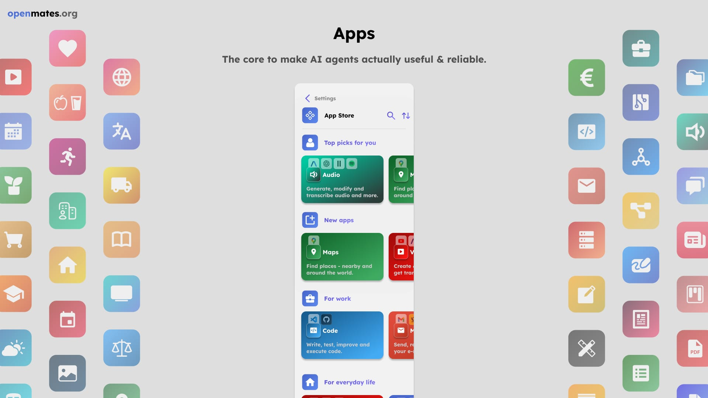
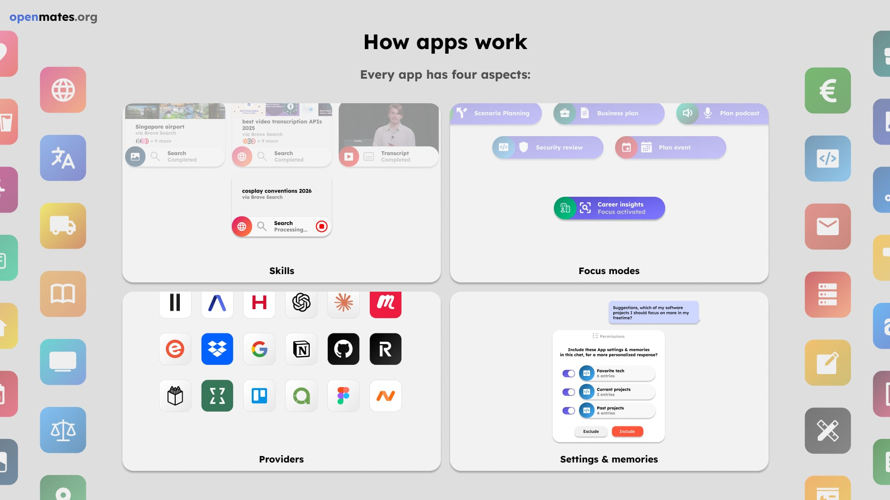

# Apps architecture

Apps are one of the core components of OpenMates. They allow your digital team mates to use various external providers to fullfill your requests - from searching the web, finding meetups, finding restaurants, generating images, transcribing videos, and much more.

> **Note**: Mates can also list apps as previews with links to the app store entry

## Skills

Skills are functions which are executed on the OpenMates server or via external providers, to fullfill your requests. From searching the web, finding meetups, finding restaurants, generating images, transcribing videos, and much more.

**Key Features:**

- Support for multiple requests per skill call (up to 5 parallel requests)
- Automatic parallel processing via Celery tasks
- Rate limiting and retry logic for external APIs

For detailed skill architecture, see [App Skills Architecture](./app_skills.md).

## Focus modes

Focus modes are temporary changes to the system prompt for a conversation to focus the chat on a specific goal, like planning a new software project, getting career advice and much more - all without you having to be an expert in AI prompt engineering.

> **Note**: For inspiration on focus mode prompts, see [OpenAI Prompt Packs](https://academy.openai.com/public/tags/prompt-packs-6849a0f98c613939acef841c)

For user-facing documentation, see [Focus Modes](./focus_modes.md).

## Providers

Providers are the external providers which are used to fullfill your requests. From searching the web, finding meetups, finding restaurants, generating images, transcribing videos, and much more.

## Settings & memories

Settings & memories are used to store your preferences and data, while minimizing the amount of data that is sent to the server and maximizing your privacy.

For detailed documentation, see [App Settings and Memories](./app_settings_and_memories.md).

---

## Documentation

### For Users

- [Skills](./app_skills.md) - How skills work and what they can do
- [Focus Modes](./focus_modes.md) - How focus modes work from a user perspective
- [Settings and Memories](./app_settings_and_memories.md) - How settings and memories work to store your preferences and data
- [App Store](./app_store.md) - Browse and discover apps, skills, focus modes, and pricing
- Individual app documentation (e.g., [Web App](./web.md), [Videos App](./videos.md)) - App-specific features and skills

### For Developers

- [Function Calling](./function_calling.md) - How LLM function calling integrates with apps
- [REST API Architecture](../rest_api.md) - Developer API for app skills and focus modes (includes technical implementation details for skills)
- [Action Confirmation Architecture](./action_confirmation.md) - How write and sensitive operations are secured
- [CLI Package Architecture](../cli_package.md) - CLI and SDK access
- [Servers Architecture](../servers.md) - Docker container architecture for apps

---

## Notes

> Some notes which are placed here for now.

### Skills implementation

- ✅ **Multiple requests support**: All skills support multiple requests in the same skill call (up to 5 parallel requests). Example: videos | get transcript using list of YouTube urls, or web | search using list of search queries
- ✅ **Parallel processing**: Multiple requests in same skill call create multiple celery tasks for the same API endpoint
- ✅ **Rate limiting**: Will be processed simultaneously, if API rate limit allows (maximum 5 parallel requests per skill call)
- ✅ **Rate limit enforcement**: Enforce third party API rate limits via Dragonfly / cache based counter that auto expires after rate limit reset time (every second, every minute) and which counts up with every request, incl. auto retry once key expired (calculate when to retry task)
- ✅ **Celery usage**: Always use celery for skills involving external APIs, regardless of processing time. Fast skills (< 1 second) process via Celery but the API waits for completion and returns results directly. Long-running skills return task IDs immediately.
- ✅ **Response delivery**: Whenever an individual skill call is completed, response will be sent via websocket connection to device which has chat currently open (for devices which don't have chat currently open, only completed assistant response that includes the app skill results will be sent once completed)
- ✅ **Direct response**: Use wait for direct response only for quick internal API endpoints which don't rely on any external APIs or long processes

For detailed documentation on multiple requests pattern, see [App Skills Architecture](./app_skills.md#multiple-requests-per-skill-call).

### Ignored

- save for example meetup groups or places which user doesn’t want to see anymore
- save hash of preview based on unique parameter like source url - for example meetup.com url or google places id
- save both a hash of the entry for fast check / lookup, but also content of preview encrypted via client stored encryption key, to also implement app specific "Ignored" list which also enables "Unignore" functionality

### Previews

- right click menu:
  - "Ignore" button -> hide preview and add under "Ignored" section at the end of slider / list of previews

#### Fullscreen mode

- shows preview with more details

#### Edit mode

- available for some previews in fullscreen mode (code, document, sheet, etc.)
