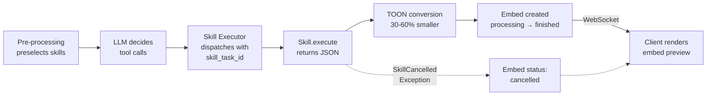

# App Skills Architecture

> Skills are the execution units of apps — each produces a JSON result that becomes an embed, with individual cancellation, provider availability, and TOON-optimized LLM context.

## Why This Exists

- Each app (Web, Code, Images, etc.) exposes multiple skills (search, generate, analyze)
- Skills must run independently — one slow skill shouldn't block the AI response
- Results persist as embeds for cross-chat reference and independent updates
- 35+ apps with growing skill count requires intelligent preselection

## How It Works

- Pre-processing preselects relevant skills — see [message-processing.md](../messaging/message-processing.md)
- LLM decides which to call → [skill_executor.py](../../backend/apps/ai/processing/skill_executor.py) dispatches each with unique `skill_task_id`
- Each skill returns JSON dict → auto-converted to **TOON** (30-60% fewer tokens) in [main_processor.py](../../backend/apps/ai/processing/main_processor.py)
- Result stored as embed — see [embeds.md](../messaging/embeds.md)
- Result streamed to client via WebSocket as embed update



## Skill Cancellation

- Each invocation gets unique `skill_task_id` (UUID) from [skill_executor.py](../../backend/apps/ai/processing/skill_executor.py)
- Frontend shows stop button on embed preview using this ID
- Cancel flow: user clicks stop → `cancel_skill` WebSocket → Redis flag `cancelled_skill:{skill_task_id}` → `SkillCancelledException`
- Handler: [cancel_skill_handler.py](../../backend/core/api/app/routes/handlers/websocket_handlers/cancel_skill_handler.py)
- Frontend sender: `sendCancelSkillImpl()` in [chatSyncServiceSenders.ts](../../frontend/packages/ui/src/services/chatSyncServiceSenders.ts)
- Main processor catches exception → embed status `cancelled` → AI continues with remaining skills

| | Skill Cancellation | Task Cancellation |
|---|---|---|
| Scope | Single skill | Entire AI response |
| ID | `skill_task_id` | `task_id` (Celery) |
| WebSocket | `cancel_skill` | `cancel_ai_task` |
| AI continues? | Yes | No |

## Provider Configuration

Declared in each app's `app.yml`:

```yaml
# Standard — requires API key lookup via Vault
providers:
  - Brave

# No-API-key — always available
providers:
  - name: Doctolib
    no_api_key: true
```

Normalized by `ProviderRef` in [app_metadata_schemas.py](../../backend/shared/python_schemas/app_metadata_schemas.py)

**`no_api_key: true` means:** the provider doesn't use the standard Vault API key lookup path. It does NOT necessarily mean "no authentication" — some providers use alternative auth (e.g., SecretsManager tokens, proxy credentials). Always check the provider's source to understand its actual auth mechanism.

**Providers using `no_api_key: true`:**
- Web scraping: Doctolib, Jameda, Meetup, Luma, REWE
- Proxy-based: Webshare
- Alternative auth (SecretsManager): Flightradar24 (Bearer token API)
- Internal: OpenMates

Availability check: `is_skill_available()` in [apps.py](../../backend/core/api/app/routes/apps.py)

## Data Structures

### Skill Output Fields

| Field | Type | Purpose |
|-------|------|---------|
| `previews` | list | All result outputs (code files, websites, etc.) |
| `previews[x].hash` | string | Content hash — verify backend-generated vs. user-modified |
| `suggestions_follow_up_requests` | list[str] | Improve post-processing follow-up suggestions |
| `added_instructions` | string | Extra LLM instructions (e.g., PDF quoting guidance) |

### TOON Format

- Token-Oriented Object Notation — 30-60% fewer tokens than JSON
- Conversion automatic in [main_processor.py](../../backend/apps/ai/processing/main_processor.py)
- Skills only return JSON; system handles TOON encoding

<!-- TODO: screenshot (1000x400) — embed preview in processing state with cancel button visible -->

## In-Process Loading (OPE-342)

Apps run **in-process** inside the `api` container and the Celery workers. There is no per-app `app-{name}` Uvicorn container.

At startup, `discover_apps()` in [main.py](../../backend/core/api/main.py) calls `build_skill_registry()` in [skill_registry.py](../../backend/core/api/app/services/skill_registry.py) which:

1. Filesystem-scans `backend/apps/*/app.yml`.
2. Applies stage filtering (development/production).
3. Instantiates a `BaseApp(register_http_routes=False)` per app — each `BaseApp` resolves every skill `class_path` via `importlib`.
4. Stores the resulting `SkillRegistry` on `app.state.skill_registry` and as a process-global singleton.

Celery workers do the same in `init_worker_process()` ([celery_config.py](../../backend/core/api/app/tasks/celery_config.py)) so they can dispatch skills via the registry instead of HTTPing to a sibling container.

**To add a new app:** drop a folder under `backend/apps/`, restart api. Zero `docker-compose.yml` edits.

**Failure mode:** if a skill's `class_path` fails to import, `BaseApp._resolve_skill_classes` logs an `ERROR` and skips that one skill — the rest of the app keeps working, and the failing skill returns 404 from REST and is invisible to the AI preprocessor. The api process itself stays up.

## Edge Cases

- **Uninstalled app skills:** pre-processing excludes them — checked during validation in [skill_executor.py](../../backend/apps/ai/processing/skill_executor.py)
- **Account-connected skills:** auto-excluded when user hasn't connected required account (`requires_account` metadata check)
- **Skill timeout:** executor enforces timeout → embed set to `error` status
- **Provider using alternative auth:** `no_api_key: true` does not mean unauthenticated — check provider source (e.g., Flightradar24 uses SecretsManager Bearer token in [flightradar24_provider.py](../../backend/apps/travel/providers/flightradar24_provider.py))

## Improvement Opportunities

> **Improvement opportunity:** Input fields documentation — needs REST API / Pydantic model generation for docs
> **Improvement opportunity:** Batch skill execution — currently sequential per tool call, could parallelize independent skills

## Related Docs

- [Embeds](../messaging/embeds.md) — how skill results are stored and rendered
- [Message Processing](../messaging/message-processing.md) — pipeline that invokes skills
- [Function Calling](./function-calling.md) — tool preselection and LLM integration
- [AI Model Selection](../ai/ai-model-selection.md) — model choice logic
- [Follow-up Suggestions](../ai/followup-suggestions.md) — `suggestions_follow_up_requests` usage
