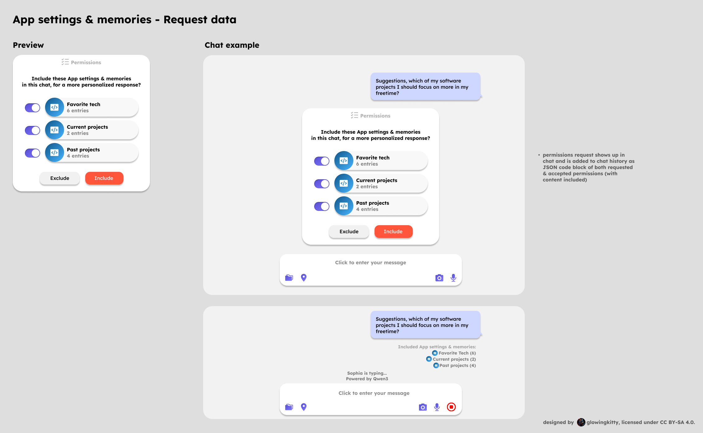

# App Settings and Memories

## Overview

App settings and memories are user-specific data stored per app (e.g., watched movies and TV shows for TV app, favorite restaurants for Maps app, upcoming trips for Travel app). Each **entry** within a settings/memories category (e.g., individual movie, restaurant, or trip) is stored as an encrypted item in Directus for scalability and efficient sync.

**Storage Model**: Per entry per settings/memories category for a specific user and app. For example:

- `tv` app, `watched_movies` category: Multiple entries (one per movie)
- `tv` app, `favorite_shows` category: Multiple entries (one per show)
- `maps` app, `favorite_restaurants` category: Multiple entries (one per restaurant)

App settings and memories schemas are defined in each app's `app.yml` file (e.g., `backend/apps/tv/app.yml`). The structure defines which settings/memories an app supports and their data types.

For encryption architecture, see [security.md#app-settings--memories](../security.md#app-settings--memories).

## Client-Side Interaction

As described in [message_processing.md](../message_processing.md), the client submits an overview of the type of app settings and memories that are available. The assistant then requests the data from the user via WebSocket connection, and the app settings & memories show up in chat history as a JSON code block containing included categories with their values and excluded categories without values.

## Connected Accounts

Some apps require connecting external accounts to access their services. These connected accounts are managed within the app's settings and memories section in the App Store.

### Purpose

Connected accounts allow apps to interact with external services on your behalf. For example:

- **Figma**: Connect your Figma account to access design files and projects
- **Gmail**: Connect your Gmail account to send and manage emails
- **Calendar services**: Connect Google Calendar, Cal.com, or other calendar providers
- **Other services**: Various apps may require connections to external APIs

### Connection Methods

Apps support two methods for connecting accounts:

1. **OAuth 2.0**: Secure, token-based authentication that doesn't require sharing passwords
   - User is redirected to the service provider's login page
   - User grants permissions to OpenMates
   - Access tokens are securely stored (encrypted server-side using Vault)
   - Tokens can be revoked at any time

2. **API Key**: Direct API key authentication for services that support it
   - User provides their API key from the external service
   - API key is encrypted server-side using Vault before storage
   - Keys can be updated or removed at any time

### Managing Connected Accounts

Connected accounts are managed in the App Store:

- **View connections**: See all connected accounts for each app in the app's detail view
- **Add connection**: Connect new accounts via OAuth flow or API key entry
- **Revoke access**: Disconnect accounts at any time, which immediately revokes access
- **Update credentials**: Refresh OAuth tokens or update API keys when needed

### Privacy and Security

**Encryption Model**: Server-side encryption with HashiCorp Vault (similar to credit balance and 2FA secrets)

- **Token Storage**: OAuth tokens and API keys are encrypted using per-user Vault keys
- **Server Access**: Server can decrypt tokens when needed for processing requests (enables offline processing)
- **Operation-Based Security**: Different security levels based on operation type and access method:
  - **Read-only operations**: Automatic server access (e.g., reading calendar events, fetching Figma files, reading emails)
  - **Write operations**:
    - **Web App**: Require user confirmation via WebSocket by default. Can be auto-confirmed if Autonomous Mode is enabled (unless skill has "Always Require Confirmation" override). Users can configure per-skill confirmation requirements in App Store settings.
    - **REST API/CLI**: No confirmation required by default, but protected by multiple security layers: API key scopes/permissions, rate limiting, privacy-compliant logging, device confirmation, and optional Enhanced Security Mode (requires confirmation for all API actions when enabled)
  - **High-risk operations**:
    - **Web App**: Always require explicit user confirmation with extended timeout, unless Autonomous Mode is enabled and skill doesn't have "Always Require Confirmation" override
    - **REST API/CLI**: No confirmation required by default, but heavily rate-limited, logged, and protected by all security layers. Optional Enhanced Security Mode can require confirmation for these operations

**User Control**:

- **Connection Preferences**: Users can configure per-connection security settings (e.g., "Allow automatic calendar reads but require confirmation for writes")
- **Access Logging**: All token usage is logged and visible to users in Developer Settings
- **Revocation**: Users can revoke access at any time, immediately invalidating tokens
- **Transparency**: Users see which operations require confirmation vs. automatic access
- **Enhanced Security Mode** (optional): Users can enable "Require confirmation for all API actions" in Developer Settings, which applies web app confirmation flow to REST API/CLI access

For detailed information on action confirmation architecture, see [Action Confirmation Architecture](./action_confirmation.md).

**Security Benefits**:

- Tokens encrypted at rest using Vault (same security model as credits/2FA)
- Server can process requests when user is offline (practical functionality for scheduled tasks, automated workflows)
- Operation-based controls prevent unauthorized high-risk actions
- User maintains full control through preferences and revocation
- All access is auditable and transparent

### App Store Display

In the App Store, apps that support connected accounts show:

- Which external services can be connected
- What permissions or access levels are required
- Connection status (connected/not connected) for each service
- Quick access to manage connections

## Versioning & Multi-Device Sync

Each app settings/memories item has an `item_version` field (integer, starts at 1) that increments on every update. This enables conflict detection and sync coordination across multiple devices.

### Version Tracking

- **item_version**: Integer that increments each time an item is updated
- **updated_at**: Unix timestamp of the last modification
- Maintained entirely by the client; server stores but doesn't increment

## Settings/Memories Management via Skills

Users can create, update, and delete settings/memories entries through the assistant's responses and follow-up confirmations. This is implemented as dynamically generated skills that are treated like any other app skill.

### Dynamic Skill Generation

For each settings/memories category defined in an app's `app.yml`, three dedicated skills are automatically generated using the naming conventions:

- `{app_id}.settings_memories_add_{category_name}` - Create new entries
- `{app_id}.settings_memories_update_{category_name}` - Update existing entries
- `{app_id}.settings_memories_delete_{category_name}` - Delete existing entries

Each skill includes:

- **Metadata**: app_id, category_name, display_name, description, and version (inherited from app)
- **Input Schema**:
  - **Add**: Extracted from the category's data schema in `app.yml`, including required and optional fields
  - **Update**: Includes `entry_id` (required) plus any fields from the category schema that should be updated (all optional)
  - **Delete**: Includes `entry_id` (required) for identifying the entry to delete
- **Output Schema**: Returns validated structured entry data (validated against category schema, but entry_id is generated client-side)

Skills are generated at backend startup, when app schemas change, or dynamically during main-processing when needed for a specific request.

### Execution Flow

**For Add Operations:**

1. **Main Processing Setup**: Main processing includes add/update/delete skills as function calls, so the LLM knows which settings/memories can be created/modified/deleted and their schemas.
2. **Main Processing Suggestion**: Assistant includes natural language suggestions in the response (e.g., "Would you like me to save 'Inception' to your watched movies list?").
3. **User Confirmation via Text**: User confirms via text message (e.g., "yeah, i really love that movie!").
4. **Main-Processing Skill Execution**: LLM receives the confirmation, extracts structured data, and calls the `{app_id}.settings_memories_add_{category_name}` skill with complete data matching the category schema from `app.yml`.
5. **Skill Handler Execution**: Handler validates data against category schema (ensures required fields are present, types are correct, etc.) and returns validated structured entry data. **Note**: Handler does NOT generate entry_id - that's done client-side.
6. **Initial Storage**: Client generates entry_id (UUID), encrypts entry data, saves to IndexedDB with approved set to false, and displays entry as app-specific embedded preview in the UI. Entry is NOT synced to server at this stage.
7. **UI Display**: Skill response appears as app-specific embedded preview in the UI (same as other app skill results). Each preview shows the validated entry data and includes three action buttons: **Confirm**, **Modify**, or **Reject**.
8. **User Interaction**:
   - **Confirm**: User clicks confirm button → client sets approved to true in IndexedDB, sends encrypted data to server for Directus storage
   - **Modify**: User clicks modify button → opens preview in fullscreen view with edit mode → user modifies entry data → saves modified version → client sets approved to true, encrypts modified data, updates IndexedDB, and sends to server
   - **Reject**: User clicks reject button → client deletes entry from IndexedDB, preview is dismissed
9. **Client-Side Processing**: When user confirms or modifies and saves:
   - Client sets approved to true in IndexedDB
   - Client encrypts entry data using app-specific encryption key (following zero-knowledge architecture)
   - Client sends encrypted entry to server for Directus storage
10. **Server Storage**: Server stores encrypted entry in Directus, updates AI cache, and returns success response.
11. **Success Response**: User receives confirmation, and the entry becomes available for future preprocessing requests, follow-up suggestions, and personalization.

**Note**: Unapproved entries (approved = false) remain in IndexedDB and are visible in the App Store settings under a "Pending Review" section, allowing users to recover or act on changes they may have forgotten about.

**For Update Operations:**

1. **User Request**: User requests to update an existing entry (e.g., "Update my rating for Inception to 9.0" or "Change the notes on that restaurant").
2. **Entry Identification**: LLM identifies the relevant entry from conversation context or by asking the user to clarify which entry to update.
3. **Main Processing Suggestion**: Assistant includes natural language suggestion in the response (e.g., "Should I update your rating for 'The Matrix' to 9.5?").
4. **User Confirmation via Text**: User confirms via text message (e.g., "yes, update it").
5. **Main-Processing Skill Execution**: LLM extracts the entry_id and updated fields, then calls the `{app_id}.settings_memories_update_{category_name}` skill with entry_id and fields to update.
6. **Skill Handler Execution**: Handler validates entry_id exists and belongs to user, validates updated fields against category schema, and returns validated updated entry data. **Note**: Handler does NOT increment item_version - that's done client-side.
7. **Initial Storage**: Client loads existing entry from IndexedDB, increments item_version, updates entry data, encrypts updated entry, saves to IndexedDB with approved set to false, and displays updated entry as app-specific embedded preview in the UI. Entry is NOT synced to server at this stage.
8. **UI Display**: Updated entry is displayed as an app-specific embedded preview with the proposed changes, including three action buttons: **Confirm**, **Modify**, or **Reject**.
9. **User Interaction**:
   - **Confirm**: User clicks confirm → client sets approved to true in IndexedDB, sends encrypted data to server
   - **Modify**: User clicks modify → opens preview in fullscreen view with edit mode → user modifies the proposed changes → saves → client increments item_version again, encrypts, sets approved to true in IndexedDB, and sends to server
   - **Reject**: User clicks reject → client reverts to previous version in IndexedDB (or deletes if this is a new update), preview is dismissed
10. **Client-Side Processing**: When user confirms or modifies and saves:
    - Client sets approved to true in IndexedDB
    - Client encrypts updated entry using app-specific encryption key
    - Client sends encrypted entry to server for Directus storage
11. **Server Storage**: Server stores encrypted updated entry in Directus, updates AI cache, and returns success response.
12. **Success Response**: User receives confirmation of the update.

**For Delete Operations:**

1. **User Request**: User requests to delete an existing entry (e.g., "Remove Inception from my watched movies" or "Delete that restaurant").
2. **Entry Identification**: LLM identifies the relevant entry from conversation context or by asking the user to clarify which entry to delete.
3. **Main Processing Suggestion**: Assistant includes natural language suggestion in the response (e.g., "Would you like me to remove 'Old Restaurant' from your favorites?").
4. **User Confirmation via Text**: User confirms via text message (e.g., "yes, delete it").
5. **Main-Processing Skill Execution**: LLM extracts the entry_id and calls the `{app_id}.settings_memories_delete_{category_name}` skill with entry_id.
6. **Skill Handler Execution**: Handler validates entry_id exists and belongs to user, and returns confirmation that deletion is authorized.
7. **UI Display**: Entry to be deleted is displayed as an app-specific embedded preview with two action buttons: **Confirm** or **Reject**.
8. **User Interaction**:
   - **Confirm**: User clicks confirm → client deletes entry from IndexedDB and sends deletion request to server
   - **Reject**: User clicks reject → preview is dismissed, no action taken
9. **Client-Side Processing**: When user confirms:
   - Client deletes entry from IndexedDB
   - Client sends deletion request (entry_id) to server
10. **Server Storage**: Server deletes encrypted entry from Directus, updates AI cache, and returns success response.
11. **Success Response**: User receives confirmation of the deletion.

**Note**: Delete operations do not require client-side encryption since only the entry_id is needed for deletion. The server can delete the encrypted entry directly from Directus without needing to decrypt it.

### UI/UX: Embedded Preview System

Settings/memories entries use the same embedded preview system as other content types (websites, code blocks, videos, etc.) for consistent user experience. Key characteristics:

**Preview Display**:

- App-specific embedded previews are grouped together when multiple entries are suggested
- Each preview displays the entry data in a format appropriate for the app and category
- Previews use the same 300x60px base container with app-specific branding (gradient, icon)
- Grouped previews can be scrolled horizontally when multiple entries are present

**Action Buttons**:

- **Confirm**: Immediately confirms the entry as-is → client sets approved to true in IndexedDB and sends encrypted data to server for Directus storage
- **Modify**: Opens the preview in fullscreen view with edit mode enabled
  - User can modify any fields in the entry
  - Changes are validated against the category schema (client-side)
  - User saves the modified version → client sets approved to true, encrypts, updates IndexedDB, and sends to server
- **Reject**: Dismisses the preview and deletes entry from IndexedDB (entry is not synced to server and is removed from local storage)

**Fullscreen Edit Mode**:

- When user clicks "Modify", the preview opens in fullscreen view
- All entry fields are editable according to the category schema
- Schema validation provides real-time feedback
- User can save modified entry or cancel to return to the original suggestion

This approach provides a consistent, intuitive interface for managing settings/memories entries while leveraging the existing embedded preview infrastructure.

### App Store Settings Integration

Unapproved entries are displayed in the App Store settings to help users track suggested changes they haven't yet acted on:

**Pending Review Section**:

- Located in the App Store settings under each app's configuration
- Shows all entries with approved = false
- Displays when entries were suggested (created_at)
- Shows the category each entry belongs to
- Users can take the same actions as in chat: **Confirm**, **Modify**, or **Reject**

**Benefits**:

- Users don't lose track of suggested settings/memories
- Provides a centralized location to review and manage pending changes
- Allows users to approve changes at their convenience, not just when they appear in chat
- Entries remain encrypted in IndexedDB until approved, maintaining security

### Integration Points

**Pre-Processing**: Lists available settings/memories categories and skills (add, update, delete) for relevant apps, identifies which existing entries might be relevant, and requests content from client.

**Main-Processing**: Includes relevant settings/memories skills (add, update, delete) when apps are relevant to the request, making them available for LLM to call after user confirmation or when user requests modifications.

**Post-Processing**: Analyzes assistant response and conversation to suggest which data should be saved, updated, or deleted, references the appropriate skill (add/update/delete), includes confidence and rationale, and filters out suggestions that don't add unique value.

**Follow-up Suggestions**: Acknowledges newly-created, updated, or deleted entries, uses saved data in personalized suggestions, and suggests related actions based on the changes.

### Implementation Considerations

**Schema Validation**:

- **Add**: Input data is validated against category schema before storage, with helpful error messages for missing required fields.
- **Update**: Updated fields are validated against category schema, with validation only on provided fields (partial updates supported).
- **Delete**: Entry_id is validated to ensure it exists and belongs to the user.

**Deduplication**: System checks for duplicate entries before creating, considering exact matches and fuzzy matching, with user confirmation when duplicates are detected. For updates, system verifies entry exists and belongs to user.

**Error Handling**:

- Validation errors return success status, error message, and suggestion.
- Duplicate detection includes existing entry reference and update suggestion.
- Update/delete operations return clear error messages if entry not found or access denied.

**Performance**: Skill execution is optimized for sub-second response times, with cached skill definitions to avoid regeneration and support for batch operations when multiple entries are created, updated, or deleted in the same request.

### Data Model

Each settings/memories entry includes: entry_id (UUID), app_id, category, user_id, encrypted_data, created_at, updated_at, item_version (starts at 1), chat_id (reference to where it was created), and approved (boolean, defaults to false).

**Approved Status**:

- **approved = false**: Entry is saved to IndexedDB encrypted but not synced to the server. User has not yet clicked Confirm or Modify on the preview. Unapproved entries are visible in the App Store settings under a "Pending Review" section so users can track suggested changes they haven't acted on yet.
- **approved = true**: Entry has been confirmed or modified by the user and synced to the server. The entry is fully stored in Directus and available for use.

**Encryption Flow**: Entries follow a zero-knowledge architecture similar to new chat suggestions:

1. **LLM calls skill** with structured parameters during main processing (when user confirms via text)
2. **Skill handler validates** data against category schema and returns validated structured entry data
3. **Skill result appears** as embedded preview in UI (like other app skill results)
4. **User clicks "Confirm"** on preview → client generates entry_id and metadata, encrypts entry using app-specific encryption key (see [security.md#app-settings--memories](../security.md#app-settings--memories))
5. **Client saves** encrypted entry to IndexedDB
6. **Client sends** encrypted data to server for storage in Directus
7. **Server stores** only encrypted data (zero-knowledge permanent storage)

This ensures the server never has access to plaintext entry contents, maintaining the same zero-knowledge security model as other user data.

## Security Considerations

**Encryption**: All entries are encrypted client-side before storage in Directus. The skill handler validates entry data against the category schema and returns structured data (plaintext) which appears as embedded previews in the UI. When the user clicks "Confirm", the client generates entry_id and metadata, encrypts the entry using the app-specific encryption key, saves to IndexedDB, and sends the encrypted data to the server for Directus storage. Client manages all decryption keys, and server cannot access entry contents without the client providing decrypted data (zero-knowledge architecture).

**Validation**: All input is validated against schema, with rejection of malicious data (e.g., oversized entries, invalid formats) and rate limiting on skill execution to prevent abuse.

**Privacy**: Entries are per-user and per-app with no cross-app data sharing unless explicitly designed, following the same privacy model as regular settings/memories.
