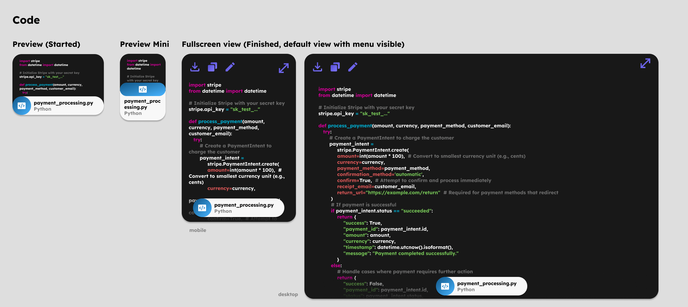

# Code App architecture

## Embedded previews

### Code

Used every time a code block is contained in a message in the chat history or message input field.

## Skills

### Run Code

Uses e2b (https://github.com/e2b-dev/infra) to start a vm where the user code can run safely. From python to JavaScript and more. Including that the user can take control over the coding environment via a code-server instance installed on the vm. Great for testing, Jupyter notebook, and more.

### Get error logs

Use Sentry or similar providers to get the error logs after an issue occured, for better debugging and fixing of the issue.

## Focuses

### Reverse engineer API

Starts focus mode that focuse on using playwright / web app to analyze api which website is using in background. With the end goal to create a Jupyter notebook file with the api being successfully used.