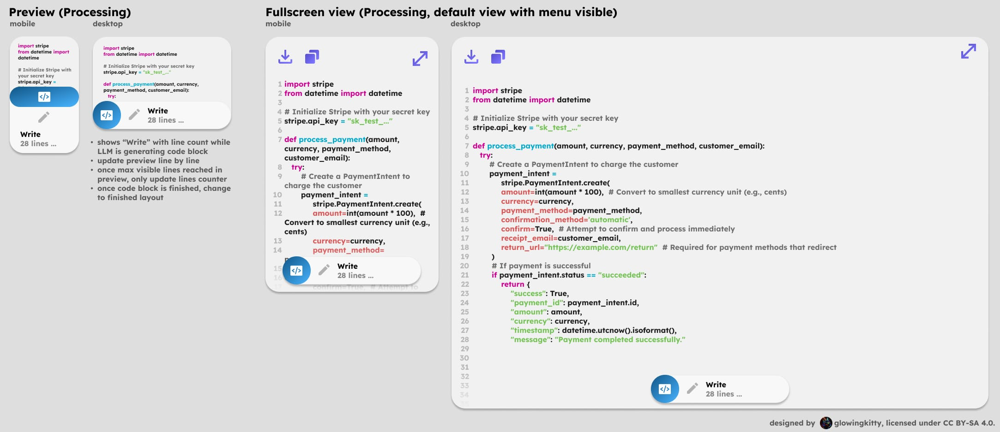
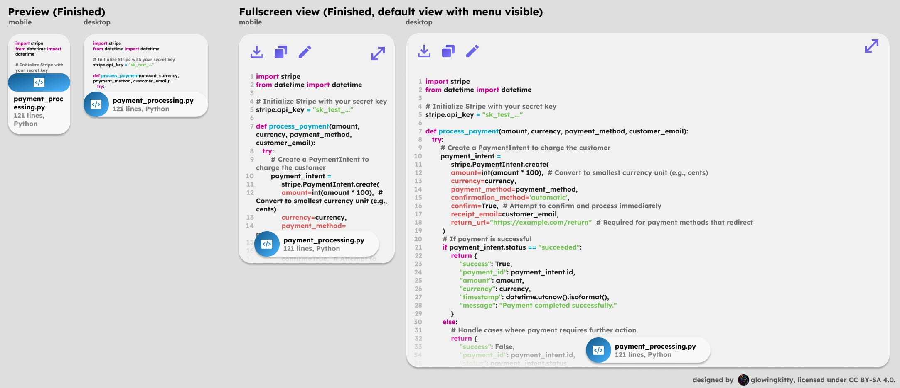
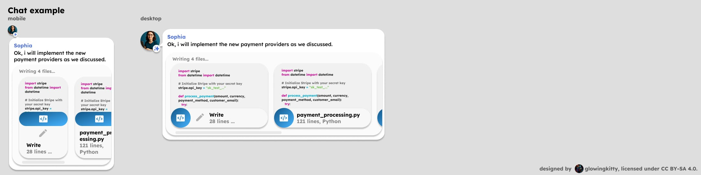

# Code App architecture

The Code app allows for viewing, writing and editing code / software projects.

## Embedded previews

### Code

> Note: Not yet implemented, but high priority.

Used every time a code block is contained in a message in the chat history or message input field.

Can include a filepath in the first line of the code block where we also define the language of the code: `{language}:{filepath}`.

Data processing is done via unified `parseMessage()` function described in [message_parsing.md](../message_parsing.md).

#### Code | Processing

[](https://www.figma.com/design/PzgE78TVxG0eWuEeO6o8ve/Website?node-id=3508-41238&t=V4FPCQaihiRx7h7e-4)

When the code is still being generated, those layouts are used.

##### Code | Processing | Input example (Markdown code block)

````
```python:stripe_payment_processor.py
import stripe
from datetime import datetime

# Initialize Stripe with your secret key
stripe.api_key = "sk_test_..."

def process_payment(amount, currency, payment_method, customer_email):
   try:
       # Create a PaymentIntent to charge the customer
       payment_intent = 
            stripe.PaymentIntent.create(
            amount=int(amount * 100),  # Convert to smallest currency unit (e.g., cents)
            currency=currency,
            payment_method=payment_method,
            confirmation_method='automatic',
            confirm=True,  # Attempt to confirm and process immediately
            receipt_email=customer_email,
            return_url="https://example.com/return"  # Required for payment methods that redirect
        )
# ...
```
````

##### Code | Processing | Output

- tiptap node (lightweight) with:
  - language (string)
  - line count (number)
  - contentRef (string) pointing to full source in client EmbedStore (memory + IndexedDB)
  - contentHash? (string, sha256 when finished; used for preview caching)
  - preview is derived at render-time (first 12 lines only)
  - "Write" text and 'modify' icon, indicating that the code is still being written
- Figma design:
  - [Preview mobile](https://www.figma.com/design/PzgE78TVxG0eWuEeO6o8ve/Website?node-id=2264-21760&t=JIw9suqrshvmsdFU-4)
  - [Preview desktop](https://www.figma.com/design/PzgE78TVxG0eWuEeO6o8ve/Website?node-id=1764-16509&t=JIw9suqrshvmsdFU-4)


##### Code | Processing | Fullscreen view

Show code in fullscreen mode, with preview element in bottom of the screen (with line count and "Write" text and icon, indicating that the code is still being written). The download and copy to clipboard buttons are also available in the top left corner. Top right corner has the fullscreen button, which closes the fullscreen view.

Figma design:

- [Mobile](https://www.figma.com/design/PzgE78TVxG0eWuEeO6o8ve/Website?node-id=3498-40814&t=JIw9suqrshvmsdFU-4)
- [Desktop](https://www.figma.com/design/PzgE78TVxG0eWuEeO6o8ve/Website?node-id=3498-40841&t=JIw9suqrshvmsdFU-4)


#### Code | Finished

[](https://www.figma.com/design/PzgE78TVxG0eWuEeO6o8ve/Website?node-id=3508-41242&t=V4FPCQaihiRx7h7e-4)

When the code is finished being generated, those layouts are used.

##### Code | Finished | Input example (Markdown code block)

````
```python:stripe_payment_processor.py
import stripe
from datetime import datetime

# Initialize Stripe with your secret key
stripe.api_key = "sk_test_..."

def process_payment(amount, currency, payment_method, customer_email):
   try:
       # Create a PaymentIntent to charge the customer
       payment_intent = 
            stripe.PaymentIntent.create(
            amount=int(amount * 100),  # Convert to smallest currency unit (e.g., cents)
            currency=currency,
            payment_method=payment_method,
            confirmation_method='automatic',
            confirm=True,  # Attempt to confirm and process immediately
            receipt_email=customer_email,
            return_url="https://example.com/return"  # Required for payment methods that redirect
        )
# ...
```
````

##### Code | Finished | Output

- tiptap node (lightweight) with:
  - language (string)
  - line count (number)
  - filename (string)
  - contentRef (string) pointing to full source in client ContentStore (loaded on fullscreen)
  - contentHash (string, sha256 for immutable snapshot/caching)
  - preview is derived at render-time (first 12 lines only)

- Figma design:
  - [Preview mobile](https://www.figma.com/design/PzgE78TVxG0eWuEeO6o8ve/Website?node-id=3423-41511&t=JIw9suqrshvmsdFU-4)
  - [Preview desktop](https://www.figma.com/design/PzgE78TVxG0eWuEeO6o8ve/Website?node-id=3423-41498&t=JIw9suqrshvmsdFU-4)


##### Code | Finished | Fullscreen view

Show code in fullscreen mode, with preview element in bottom of the screen (with filename, line count and language of the code). The download, copy to clipboard and modify buttons are also available in the top left corner. Top right corner has the fullscreen button, which closes the fullscreen view. Full source is resolved via `contentRef` from the client EmbedStore and can stream/live-update independently of the preview node.

> Note: Modify functionality is not yet planned out and should be added in the future.

Figma design:

- [Mobile](https://www.figma.com/design/PzgE78TVxG0eWuEeO6o8ve/Website?node-id=3406-38017&t=V4FPCQaihiRx7h7e-4)
- [Desktop](https://www.figma.com/design/PzgE78TVxG0eWuEeO6o8ve/Website?node-id=3406-38057&t=V4FPCQaihiRx7h7e-4)


##### Code | Finished | Fullscreen view with Architecture Diagrams (Future Feature)

> **Status:** Planned feature - to be implemented

**Concept:** When code is updated in the fullscreen view, automatically generate and display architecture diagrams alongside the code. These diagrams are generated by analyzing code structure (not LLM-generated), helping users understand and visualize code relationships, class hierarchies, module dependencies, and system architecture in real-time.

**Key Idea:**
- Auto-generated diagrams are **separate from LLM-generated content** - they use hardcoded analysis scripts
- When code is modified, the architecture diagram updates automatically to reflect the new structure
- Diagrams are embedded in a tab or side panel in the fullscreen view
- For Python code: UML class diagrams, dependency graphs, module relationships
- For other languages: similar architectural analysis relevant to that language

**Recommended Python Packages for Auto-Diagram Generation:**

| Package | Purpose | Use Case |
|---------|---------|----------|
| **py2puml** | Generates PlantUML class diagrams from Python code | Class hierarchies, method relationships, code structure |
| **PyUMLify** | Auto-generates UML diagrams from Python projects | Project-wide architecture, package diagrams |
| **py-code-visualizer** | Transforms codebases into visual diagrams | Module relationships, architecture maps |
| **Diagrams** | Programmatically create architecture diagrams | Cloud system architecture, infrastructure diagrams |
| **uml-class-diagram-generator** | Generates UML class diagrams from Python | Detailed class structures, XML output for customization |

**Implementation Strategy:**
1. Create a backend service (Python-based) that analyzes code structure using AST (Abstract Syntax Tree) parsing
2. Use one of the above packages to generate diagram files (PlantUML, Mermaid, or SVG format)
3. Cache diagrams with contentHash to avoid regenerating identical code structures
4. Stream diagrams to the frontend alongside code updates
5. Support multiple diagram types (class diagrams, dependency graphs, module hierarchies)
6. Display diagrams in a collapsible panel or tab within fullscreen view

**Benefits:**
- Real-time understanding of code architecture as users write/modify code
- No LLM latency - deterministic analysis based on code structure
- Version-controlled and reproducible visualizations
- Helps users understand complex codebases quickly
- Useful for documentation and knowledge sharing


#### Code | Chat example

[](https://www.figma.com/design/PzgE78TVxG0eWuEeO6o8ve/Website?node-id=3508-41244&t=V4FPCQaihiRx7h7e-4)

Shows how code previews are rendered in a chat message. Mobile / desktop layouts are used depending on the viewport width.

**Multiple previews:**

General rule for all previews/apps: If multiple previews of the same type are rendered in a chat message, they should be grouped together in a horizontally scrollable container. The previews must be sorted from status "Processing" (left) to "Finished" (right), so that the user can always see if there are any unfinished previews. Scroll bar is visible if there are scrollable elements.

**Single preview:**

If there is only one preview of the same type, no additional container with scrollbar is needed. If a text is following the preview, it will be regularly rendered below the preview. Same if a preview or group of previews of another type is following the preview.


### Notebook

> Note: To be implemented in the future.

Renders the Jupyter notebook json via notebookjs and adds execute buttons to it, triggering the execution in an e2b sandboxed instance and updating the Jupyter notebook json with the cell output. 

#### Input example (Markdown code block with Jupyter notebook json):

````
```json
{
  "cells": [
    {
      "cell_type": "code",
      ...
    }
  ]
}
```
````

#### Output:

- tiptap node with:
  - json code (string)
  - filename (string)
  - cell count (number)


## Skills

### Run Code

Uses e2b (https://github.com/e2b-dev/infra) to start a vm where the user code can run safely. From python to JavaScript and more. Including that the user can take control over the coding environment via a code-server instance installed on the vm. Great for testing, Jupyter notebook, and more.

### Get error logs

Use Sentry or similar providers to get the error logs after an issue occured, for better debugging and fixing of the issue.


### Search

Searches code repositories and uploaded code files for patterns, functions, variables, or specific content using high-performance `rg` (ripgrep) functionality.

**Features:**
- Support for searching within uploaded code files or connected repositories
- Optimized regex pattern matching using `rg` (ripgrep)
- Language-aware search (highlights syntax, respects language-specific patterns)
- Case-sensitive and case-insensitive options
- Returns matched lines with context (surrounding lines) and line numbers
- File-type filtering (e.g., search only in `.py`, `.js`, `.ts` files)
- Works across multiple files in parallel (up to 5 requests)

**Input Parameters:**
- `file_ids`: Array of uploaded code file IDs or repository reference
- `query`: Search pattern (supports regex, e.g., `def function_name`, `import.*request`)
- `case_sensitive`: Boolean (default: false)
- `context_lines`: Number of lines before/after match to include (default: 3)
- `regex`: Boolean to enable regex mode (default: true)
- `file_pattern`: Optional glob pattern to filter files (e.g., `*.py`, `src/**/*.ts`)

**Output:**
- Grouped results by file and query
- Each match includes:
  - File path and language
  - Line number(s)
  - Matched text with syntax highlighting
  - Context lines before/after
  - Match count per file

**Implementation:**
- Uses `rg` (ripgrep) as the core tool for fast, efficient searching (preferred over standard grep)
- Supports incremental results for large codebases
- Caches search results for repeated queries
- Celery-based processing with parallel requests
- Returns results incrementally as searches complete

### Replace

**Status:** Planned feature - to be implemented with careful consideration.

**Recommended Approach:** Consider using `sed` for code replacement operations. However, this requires **follow-up validation and safety checks** to prevent breaking the codebase:

1. **Pattern Validation**: Before executing sed, validate that the pattern matches expected code blocks
2. **Dry-run Preview**: Show the user a preview of all changes that would be made before applying them
3. **Post-replacement Checks**: After applying sed replacements:
   - Run linters and syntax validators to ensure code integrity
   - Execute unit tests related to modified files
   - Check for compilation/syntax errors
   - Validate no critical functionality is broken
4. **Rollback Capability**: Maintain the ability to revert changes if validation fails
5. **Scope Limitation**: Require explicit file/directory scope to prevent accidental global changes

This multi-step approach ensures sed can be used safely for large-scale code replacements without introducing bugs or breaking the codebase.

### Get code

> **Status:** Planned feature - to be implemented

**Functionality:** Automatically fetches code from external repository URLs (GitHub, GitLab, Bitbucket, etc.) when a file link is pasted, with mandatory prompt injection protection.

**Description:**
When a user pastes a URL pointing to a specific file in a code repository (e.g., `https://github.com/user/repo/blob/main/src/file.py`), this skill automatically triggers to:
1. Fetch the raw code content from the repository
2. Detect the programming language from file extension and content
3. **Sanitize the code for prompt injection attacks** before returning to the assistant
4. Display the code in the chat with proper syntax highlighting
5. Show the skill usage in the usage entries (like other skills)

**Supported Repository Platforms:**
- GitHub (github.com)
- GitLab (gitlab.com and self-hosted instances)
- Bitbucket (bitbucket.org)
- Other Git hosting platforms with accessible raw file URLs

**Auto-Trigger Patterns:**
The skill auto-triggers when URLs match patterns like:
- `https://github.com/{owner}/{repo}/blob/{branch}/{path/to/file}`
- `https://gitlab.com/{owner}/{repo}/-/blob/{branch}/{path/to/file}`
- `https://bitbucket.org/{owner}/{repo}/src/{branch}/{path/to/file}`

**Input Parameters:**
- `url`: The repository file URL
- `branch`: Optional branch override (defaults to branch in URL or main/master)
- `line_start`: Optional start line for partial file fetch
- `line_end`: Optional end line for partial file fetch

**Output:**
- Code content with syntax highlighting
- File metadata (filename, language, line count, repository info)
- Permalink to the source file

**Security Requirements (CRITICAL):**

⚠️ **Prompt Injection Protection is MANDATORY for this skill.**

Code fetched from external repositories **must** be treated as potentially malicious and scanned for prompt injection attacks before being returned to the assistant. This is because:

1. **Untrusted Source**: Code from public repositories can contain hidden malicious instructions targeting AI assistants
2. **Hidden Content**: Comments, strings, or documentation within code could contain prompt injection attempts
3. **Obfuscated Attacks**: Malicious instructions can be encoded or obfuscated within seemingly legitimate code

**Sanitization Process:**
1. Fetch raw code content from the repository URL
2. Split long files into chunks of **50,000 tokens maximum**
3. Process each chunk through the prompt injection detection system (see [Prompt Injection Protection](../prompt_injection_protection.md))
4. Replace detected injection patterns with `[PROMPT INJECTION DETECTED & REMOVED]` placeholder
5. Combine sanitized chunks and return to the assistant
6. This sanitization is the **final step** before the skill returns data

**Implementation Notes:**
- Uses the same sanitization pipeline as other external data skills (web search, video transcripts, etc.)
- Detection uses the configuration from [`backend/apps/ai/prompt_injection_detection.yml`](../../../backend/apps/ai/prompt_injection_detection.yml)
- Skill usage appears in the standard usage entries, providing transparency about when external code is fetched
- Supports authentication for private repositories (requires user to configure repository access tokens)

See also: [App Skills - Prompt Injection Protection for External Data](./app_skills.md#prompt-injection-protection-for-external-data)

### Get docs

Fetches up-to-date documentation for libraries/frameworks using Context7 API with intelligent library selection.

#### Input Parameters

| Parameter | Type | Required | Description |
|-----------|------|----------|-------------|
| `library` | string | Yes | Library name or search query (e.g., "svelte", "fastapi", "react hooks") |
| `question` | string | Yes | Natural language question about what documentation is needed |

#### Execution Flow

```
┌─────────────────────────────────────────────────────────────────────────┐
│  Step 1: Context7 Library Search                                        │
│  ─────────────────────────────────────────────────────────────────────  │
│  Input: library parameter                                               │
│  Output: List of matching libraries (id, title, description, metadata)  │
│  Note: Fast, no LLM involved                                            │
└─────────────────────────────────────────────────────────────────────────┘
                                    ↓
┌─────────────────────────────────────────────────────────────────────────┐
│  Step 2: Intelligent Library Selection (LLM)                            │
│  ─────────────────────────────────────────────────────────────────────  │
│  Input: Sanitized library list + question                               │
│  Output: Selected library_id (structured JSON)                          │
│  Model: See "Model Selection" below                                     │
│  Protection: ASCII sanitization + structured output + ID validation     │
└─────────────────────────────────────────────────────────────────────────┘
                                    ↓
┌─────────────────────────────────────────────────────────────────────────┐
│  Step 3: Context7 Documentation Retrieval                               │
│  ─────────────────────────────────────────────────────────────────────  │
│  Input: Selected library_id + question                                  │
│  Output: Documentation context (markdown with code examples)            │
│  Note: Fast, no LLM involved                                            │
└─────────────────────────────────────────────────────────────────────────┘
                                    ↓
┌─────────────────────────────────────────────────────────────────────────┐
│  Step 4: Output Sanitization                                            │
│  ─────────────────────────────────────────────────────────────────────  │
│  Input: Raw documentation from Context7                                 │
│  Output: Sanitized documentation                                        │
│  Protection: Full prompt injection detection (see Layer 2 below)        │
└─────────────────────────────────────────────────────────────────────────┘
```

#### Model Selection for Library Selection (Step 2)

This step is a **simple classification task** - selecting from 5-10 library options based on the user's question. Speed is critical since this is an intermediate step.

| Priority | Provider | Model | Latency | Cost | Reasoning |
|----------|----------|-------|---------|------|-----------|
| **Primary** | Groq | `openai/gpt-oss-20b` | ~150ms | Very low | Fast inference, good reasoning for selection |
| Fallback 1 | Cerebras | `openai/gpt-oss-120b` | ~300ms | Low | Stronger reasoning if primary fails |
| Fallback 2 | Mistral | `mistral-small-3.2` | ~400ms | Low | Reliable, good at structured tasks |

**Model rationale:**
- GPT OSS 20B via Groq provides excellent speed for this simple selection task
- GPT OSS 120B via Cerebras offers stronger reasoning as fallback without excessive cost
- Mistral Small 3.2 as last resort for maximum reliability

#### Prompt Injection Protection

Context7 output (library descriptions) is **untrusted external data**. Defense layers:

**Layer 0: ASCII Smuggling Protection**
- Applied to all library descriptions BEFORE sending to selection LLM
- Uses existing `text_sanitization.py` implementation
- Removes invisible Unicode characters, variant selectors, etc.

**Layer 1: Structured Output + Validation (Step 2)**
- Force JSON response with strict schema: `{"selected_library_id": "..."}`
- **Output validation**: Verify selected ID exists in the original search results
- Minimal context: Only pass `id`, `title`, and truncated `description` (100 chars max)
- If validation fails, select first result as fallback

**Layer 2: Full Sanitization (Step 4)**
- Documentation output goes through full prompt injection detection
- Uses existing `content_sanitization.py` with LLM-based detection
- Chunking at 50,000 tokens if documentation is large

#### Library Selection System Prompt

The system prompt for library selection is defined as a constant `LIBRARY_SELECTION_SYSTEM_PROMPT` in `backend/apps/code/skills/get_docs_skill.py`. The prompt enforces structured function calling output with a strict schema for library ID selection and includes selection criteria based on name matching, description relevance, and library quality metrics.

#### Special Cases

| Case | Handling |
|------|----------|
| **OpenMates API** | Bypass Context7, read directly from `docs/openapi.json` |
| **No Context7 results** | Fallback to web search + web read skill chain |
| **Single library match** | Skip LLM selection, use the single result directly |
| **LLM selection fails** | Use first search result (highest relevance score) |

#### Output Format

Returns a structured JSON object containing:
- `library`: Object with `id`, `title`, and `description` of the selected library
- `documentation`: Markdown-formatted documentation with code examples and source links
- `source`: Source identifier (e.g., "context7")

#### Implementation Notes

- **Caching**: Cache library search results for 1 hour (libraries don't change frequently)
- **Parallel requests**: If multiple Get docs calls in same message, batch library searches
- **Token limits**: Truncate documentation to fit within context budget
- **Logging**: Log selected library ID for analytics on selection accuracy

## Automated Code Quality Checks

> **Status:** Planned feature - to be implemented

**Functionality:** Every time the chatbot generates code, an automated check runs to ensure no critical issues exist in the generated code. If issues are detected, the LLM is automatically requested to fix the code until it passes validation.

**Description:**
To prevent broken code from being generated and to maintain code quality, the Code app performs automated syntax and compilation validation checks on all generated code before it's considered complete. This ensures that generated code is syntactically correct and compiles without errors. Code style and quality linting is handled separately via e2b (see [Automatic Linter Processing via e2b](#automatic-linter-processing-via-e2b)).

**Validation Process:**
1. **Automatic Check**: After code generation completes, the system automatically runs validation checks specific to the programming language
2. **Issue Detection**: If critical issues are found (e.g., syntax errors, indentation problems, compilation errors), the validation fails
3. **Automatic Fix Request**: The LLM is automatically prompted to fix the detected issues
4. **Iterative Fixing**: This process repeats until the code passes all validation checks or a maximum retry limit is reached

**Language-Specific Validators:**

| Language | Validator | Checks |
|----------|-----------|--------|
| **Python** | `py_compile` | Syntax errors, indentation issues, import errors |
| **JavaScript/TypeScript** | TypeScript compiler | Syntax errors, type errors |
| **Java** | `javac` | Compilation errors, syntax issues |
| **C/C++** | `gcc` / `clang` | Compilation errors, syntax issues |
| **Go** | `go build` | Compilation errors, syntax issues |
| **Rust** | `rustc` | Compilation errors, syntax issues |
| **Other languages** | Language-specific compilers | Syntax and critical errors |

> **Note:** Code style and quality linting (e.g., ESLint, ruff, pylint) is handled separately via [Automatic Linter Processing via e2b](#automatic-linter-processing-via-e2b) after the assistant response completes.

**Implementation Strategy:**
1. Create a validation service that detects the programming language from the code block
2. Run appropriate validator for the detected language (e.g., `py_compile.compile()` for Python)
3. Capture validation errors and format them for the LLM
4. Automatically generate a fix request prompt with the error details
5. Re-run validation after each fix attempt
6. Set a maximum retry limit (e.g., 3-5 attempts) to prevent infinite loops

**Benefits:**
- Prevents broken code from being delivered to users
- Catches syntax errors and indentation issues automatically
- Reduces manual debugging time
- Ensures code quality standards are maintained
- Provides immediate feedback to improve code generation

**Example Python Validation:**
```python
import py_compile
import tempfile
import os

def validate_python_code(code: str) -> tuple[bool, str]:
    """
    Validates Python code using py_compile.
    Returns (is_valid, error_message).
    """
    try:
        # Create temporary file with the code
        with tempfile.NamedTemporaryFile(mode='w', suffix='.py', delete=False) as f:
            f.write(code)
            temp_path = f.name
        
        # Compile the code to check for syntax errors
        py_compile.compile(temp_path, doraise=True)
        
        # Clean up
        os.unlink(temp_path)
        
        return True, ""
    except py_compile.PyCompileError as e:
        # Clean up on error
        if os.path.exists(temp_path):
            os.unlink(temp_path)
        return False, str(e)
    except Exception as e:
        if os.path.exists(temp_path):
            os.unlink(temp_path)
        return False, f"Validation error: {str(e)}"
```

**Integration Points:**
- Runs automatically after code generation in the message processing pipeline
- Can be triggered manually for code blocks in chat history
- Works with both streaming and non-streaming code generation
- Integrates with the code preview system to show validation status

### Automatic Linter Processing via e2b

**Functionality:** After the assistant response is completed, automatically run linters on all generated/modified files using e2b sandboxed environments to catch linting issues and code quality problems.

**Description:**
In addition to syntax validation, the system automatically runs language-specific linters on all files after code generation completes. This process uses e2b sandboxed environments to safely execute linters without affecting the local development environment.

**Linting Process:**
1. **Automatic Trigger**: After assistant response completion, the system automatically identifies all generated or modified files
2. **e2b Sandbox Execution**: Files are processed in an isolated e2b sandbox environment with appropriate language tooling installed
3. **Language-Specific Linters**: Appropriate linters are run for each file based on its language:
   - **Python**: `ruff`, `pylint`, or `flake8`
   - **JavaScript/TypeScript**: `ESLint`, `TypeScript compiler`
   - **Go**: `golangci-lint` or `gofmt`
   - **Rust**: `clippy` and `rustfmt`
   - **Other languages**: Language-specific linters
4. **Issue Collection**: All linting errors and warnings are collected and formatted
5. **Automatic Fix Request**: If linting issues are found, the LLM is automatically prompted to fix them
6. **Iterative Fixing**: The linting process repeats until all issues are resolved or a maximum retry limit is reached

**Benefits:**
- Catches code style and quality issues automatically
- Ensures generated code follows project coding standards
- Runs in isolated environments, preventing conflicts with local setup
- Provides consistent linting across all generated code
- Reduces manual code review burden

**Implementation Strategy:**
- Use e2b sandboxed VMs for safe, isolated linting execution
- Support project-specific linting configurations (e.g., `.eslintrc`, `pyproject.toml`)
- Cache linting results to avoid redundant checks
- Provide detailed linting reports with file paths, line numbers, and error messages
- Integrate with the existing validation pipeline for seamless error reporting

## Planned Code Quality Enhancements

> **Status:** Planned features - to be implemented

### Automatic Documentation Search Enforcement

**Functionality:** Enforce automatic searching for the latest documentation before generating code, especially for framework/library APIs that change frequently.

**Description:**
For code-writing flows, the system will automatically enforce a "search current docs first" step before generating final code. This ensures that generated code uses up-to-date APIs and follows current best practices, reducing the likelihood of using deprecated or incorrect API patterns.

**Implementation Strategy:**
- Before code generation, automatically trigger the Code app's **Get docs** skill for relevant frameworks/libraries
- The **Get docs** skill uses:
  - **Context7 API** to retrieve up-to-date documentation for external libraries and frameworks
  - **OpenMates docs/openapi.json** directly for OpenMates API documentation (bypassing Context7 for internal APIs)
  - Web search + web read as fallback if no docs are found via Context7
- Include retrieved documentation in the system prompt context
- Require documentation verification before final code generation

**Related Documentation:**
- See the [Get docs skill](#get-docs) for implementation details
- See [LLM Hallucination Mitigation](../llm_hallucination_mitigation.md) for details on how this fits into the broader strategy to reduce hallucinations and ensure accuracy.

### Maximum Code Length Enforcement

**Functionality:** Enforce a maximum code length limit through multiple layers (system prompt instructions, hardcoded line count processing, and automatic reprocessing) to prevent overly large code files that are difficult to maintain and review.

**Description:**
To maintain code quality and prevent files from growing too large, the system will enforce a maximum code length limit. This limit is enforced at three levels:
1. **System Prompt Instructions**: The LLM is explicitly instructed to keep code files under the maximum line count
2. **Hardcoded Line Count Processing**: After code generation, the system automatically counts lines in generated code files
3. **Enforced Reprocessing**: If a generated code file exceeds the limit, the system automatically requests the LLM to refactor the code (e.g., split into multiple files, extract modules, reduce complexity) until it meets the limit

**Implementation Strategy:**
- Define configurable maximum line count per file (e.g., 500 lines as a default, adjustable per project)
- Add line count validation in the code generation pipeline
- Automatically trigger refactoring requests when limits are exceeded
- Provide clear feedback to the LLM about which files exceed limits and require splitting
- Support project-specific limits via configuration files

**Benefits:**
- Prevents code files from becoming unmaintainable
- Encourages better code organization and modularity
- Makes code reviews more manageable
- Aligns with best practices for file size limits

### Hardcoded Code Quality Checks

**Functionality:** Implement hardcoded validation checks for various code quality metrics, similar to the maximum code length enforcement.

**Description:**
Beyond syntax validation and line count limits, we can implement similar hardcoded checks for other code quality metrics. These checks would run automatically after code generation and trigger reprocessing if issues are detected.

**Potential Quality Checks to Consider:**
- **Cyclomatic Complexity**: Detect functions/methods with excessive complexity
- **Function Length**: Enforce maximum lines per function/method
- **Import Organization**: Validate proper import ordering and grouping
- **Code Duplication**: Detect and flag duplicate code patterns
- **Naming Conventions**: Validate naming follows project conventions
- **Documentation Coverage**: Ensure functions/classes have proper docstrings
- **Type Hints Coverage**: For typed languages, ensure type hints are present
- **Unused Code Detection**: Identify and flag unused imports, variables, or functions

**Implementation Strategy:**
- Create a modular validation system that can run multiple quality checks
- Each check can be enabled/disabled per project or globally
- Failed checks trigger automatic fix requests to the LLM
- Provide clear, actionable feedback about what needs to be fixed
- Support both language-specific and language-agnostic checks

**Benefits:**
- Ensures consistent code quality across generated code
- Catches quality issues early in the generation process
- Reduces manual code review burden
- Maintains high standards automatically

## Planned Security Enhancements

> **Status:** Planned features - to be implemented

### Terminal Command Security Processing

**Functionality:** Automatically process every bash/terminal command generated by the assistant with a separate safety processing LLM request to ensure user awareness and security.

**Description:**
To prevent accidental data loss or security breaches from assistant-generated commands, every command is analyzed via a separate LLM request using a specialized safety prompt after it was created in the main processor. This provides the user with a natural language explanation and risk assessment for any command the assistant proposes.

**Processing Steps:**
1. **Safety Analysis**: After the main processor generates a bash/terminal command, it is sent to a separate safety-focused LLM request using a specialized safety prompt.
2. **Explanation**: The LLM explains in natural language what the command does in detail.
3. **Risk Assessment**: The LLM identifies security risks, such as:
   - Data loss (e.g., `rm -rf /`)
   - Accidental data overwrites (e.g., redirection without backup)
   - Destructive system actions
4. **Risk Scoring**: Provide a risk score on a scale from 1 (safe) to 10 (extremely dangerous).

**Benefits:**
- Increases user awareness of what generated commands actually do.
- Prevents accidental execution of destructive commands.
- Provides an additional layer of safety for power-user features.

## Focuses

### Reverse engineer API

Starts focus mode that focuse on using stagehand / playwright / web app to analyze api which website is using in background. With the end goal to create a Jupyter notebook file with the api being successfully used. Could also use https://github.com/LaurieWired/GhidraMCP/ to reverse engineer processing.

### Plan project

Include asking user multiple choice questions to better understand their requirements and provide more targeted assistance. Important: before suggestions using any AI models for a project, always research what the most recent models from providers are, to recommend recent models and not outdated LLMs / text to image models for example. Also auto research currently best tech stack for a project before making suggestions to user for tech stack.

### Auto setup project

**Functionality:** Automatically initializes and configures new or existing projects with comprehensive documentation, coding standards, and development environment setup.

**Description:**
Similar to Claude's `/init` function, this focus mode ensures projects have proper structure, documentation standards, and coding guidelines defined from the start. It analyzes the existing codebase (if any) and creates a complete project setup with best practices.

### Write code

> Note: Planned feature - to be implemented

**Functionality:** Comprehensive code writing mode for implementing new features, creating mini projects, or building larger applications.

**Description:**
This focus mode is optimized for writing new code from scratch or implementing significant new features. When active in a project with a connected GitHub repository, it:
- Understands project context and coding standards
- Plans implementation with clear milestones
- Writes clean, well-documented code
- Runs tests and validates functionality
- Upon completion:
  - Searches for related GitHub issues/feature requests
  - Links commits/PRs to relevant issues
  - Comments with implementation details
  - Marks issues as resolved when applicable

Suitable for everything from quick utility functions to full-featured applications.

### Fix bug

> Note: Planned feature - to be implemented

**Functionality:** Specialized mode for debugging and fixing unexpected behavior with optimized troubleshooting workflows.

**Description:**
This focus mode is specifically designed for bug fixes and resolving unexpected behavior. When active in a project with a connected GitHub repository, it:
- Analyzes error logs and stack traces
- Reproduces the issue to understand root cause
- Searches codebase for related patterns
- Implements targeted fixes with minimal changes
- Validates fix with tests and edge cases
- Upon successful fix:
  - Auto-searches GitHub issues matching the bug description
  - Comments on issue with root cause analysis and fix explanation
  - Links the fix commit/PR to the issue
  - Closes or marks issue as resolved

Optimized for rapid issue resolution with clear documentation of the debugging process.