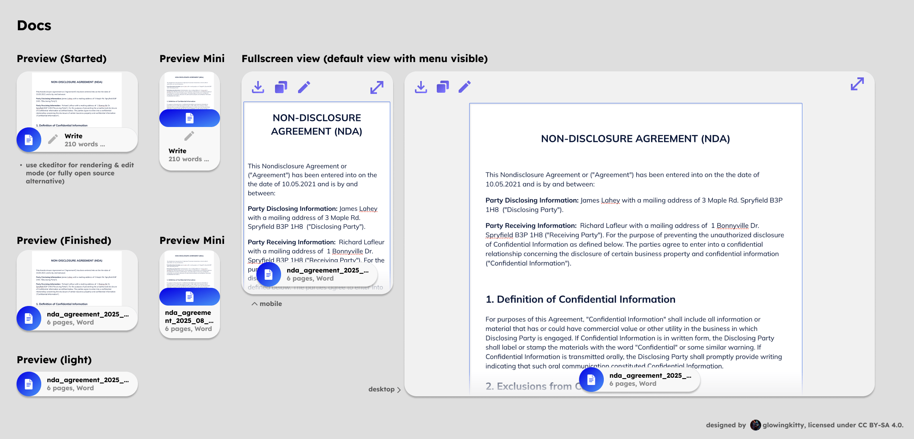

# Docs app architecture

## Embedded previews

### Document

Used every time a document is contained in a message in the chat history or message input field.
For uploaded Microsoft Word, Google Docs, OpenOffice documents. PDFs have their separate app & preview.

#### Document | Preview policy

- TipTap node (lightweight) keeps only minimal metadata plus a `contentRef` to full text in the client ContentStore (memory + IndexedDB).
- Preview renders only the first 200 words.
- `previewContent` (string): first 200 words used for lightweight rendering in the chat.
- Full text is loaded on demand in fullscreen via `contentRef` and can stream/update independently of the preview node.