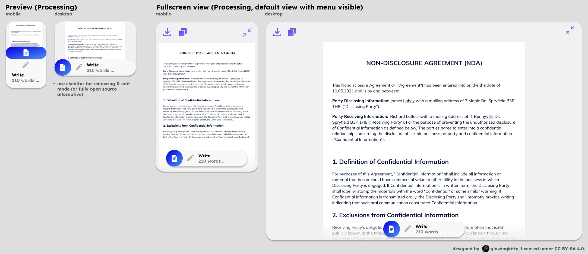

# Docs app architecture

## Embedded previews

### Document

Used every time a document is contained in a message in the chat history or message input field.
For uploaded Microsoft Word, Google Docs, OpenOffice documents. PDFs have their separate app & preview.
Also used if assistant is asked to create an extensive document (e.g., a report, a blog post, etc.). Generation must follow the Path-or-Title standard: use a typed fence with a first-line quoted title, specifically `document_html` with `<!-- title: "..." -->`, which is then parsed by CKEditor. Regular `html` fences are treated as Code embeds.

Data processing is done via unified `parseMessage()` function described in [message_parsing.md](../message_parsing.md).

#### Document | Processing

[](https://www.figma.com/design/PzgE78TVxG0eWuEeO6o8ve/Website?node-id=3514-41257&t=V4FPCQaihiRx7h7e-4)

When the document is still being processed, those layouts are used.

##### Document | Processing | Input example (Markdown code block)

```
Let me generate a document as requested by you.

```document_html
<!-- title: "Test Document" -->
<h1>Hello World</h1>
<p>This is a test document.</p>
<ul>
    <li>Item 1</li>
    <li>Item 2</li>
    <li>Item 3</li>
</ul>
```

```

##### Document | Processing | Output

- tiptap node (lightweight) with:
    - word count (number)
    - contentRef (string) pointing to full document content in client ContentStore (memory + IndexedDB)
    - contentHash? (string, sha256 when finished; used for preview caching)
    - preview is derived at render-time (first 200 words only)

- Figma design:
    - [Preview mobile](https://www.figma.com/design/PzgE78TVxG0eWuEeO6o8ve/Website?node-id=3514-41257&t=V4FPCQaihiRx7h7e-4)
    - [Preview desktop](https://www.figma.com/design/PzgE78TVxG0eWuEeO6o8ve/Website?node-id=3514-41257&t=V4FPCQaihiRx7h7e-4)


##### Document | Processing | Fullscreen view

Show document in fullscreen mode, with preview element in bottom of the screen (with word count). The download and copy to clipboard buttons are also available in the top left corner. Top right corner has the fullscreen button, which closes the fullscreen view. Full content is resolved via `contentRef` from the client ContentStore and instantiated with CKEditor in fullscreen.


## Focuses

### Creative writing session

Help the user improve their creative writing experience.