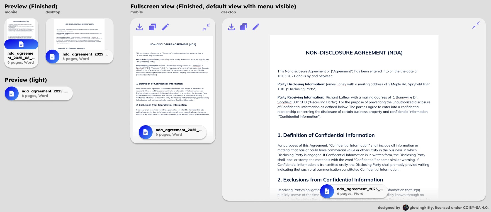
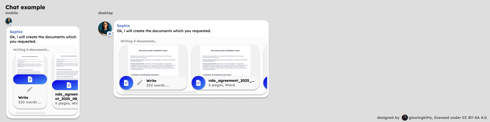

# Docs app architecture

## Embedded previews

### Document

> Note: Not yet implemented, but high priority.

Used every time a document is contained in a message in the chat history or message input field.

For uploaded Microsoft Word, Google Docs, OpenOffice documents. PDFs have their separate app & preview.

Also used if assistant is asked to create an extensive document (e.g., a report, a blog post, etc.). Generation must follow the Path-or-Title standard: use a typed fence with a first-line quoted title, specifically `document_html` with `<!-- title: "..." -->`, which is then parsed by CKEditor. Regular `html` fences are treated as Code embeds.

Data processing is done via unified `parseMessage()` function described in [message_parsing.md](../message_parsing.md).

#### Document | Processing

[](https://www.figma.com/design/PzgE78TVxG0eWuEeO6o8ve/Website?node-id=3522-41704&t=vQbeWjQG2QtbTDoL-4)

When the document is still being processed, those layouts are used.

##### Document | Processing | Input example (Markdown code block)

````
Let me generate the document you requested.

```document_html
<!-- title: "Test Document" -->
<h1>Hello World</h1>
<p>This is a test document.</p>
<ul>
    <li>Item 1</li>

````

##### Document | Processing | Output

- tiptap node (lightweight) with:
    - word count (number)
    - contentRef (string) pointing to full document content in client ContentStore (memory + IndexedDB)
    - contentHash? (string, sha256 when finished; used for preview caching)
    - preview is derived at render-time (first 200 words only)

- Figma design:
    - [Preview mobile](https://www.figma.com/design/PzgE78TVxG0eWuEeO6o8ve/Website?node-id=3438-38024&t=vQbeWjQG2QtbTDoL-4)
    - [Preview desktop](https://www.figma.com/design/PzgE78TVxG0eWuEeO6o8ve/Website?node-id=2173-19362&t=vQbeWjQG2QtbTDoL-4)


##### Document | Processing | Fullscreen view

Show document in fullscreen mode, with preview element in bottom of the screen (with word count). The download and copy to clipboard buttons are also available in the top left corner. Top right corner has the minimize button, which closes the fullscreen view. Full content is resolved via `contentRef` from the client ContentStore and instantiated with CKEditor in fullscreen.

Figma design:

- [Mobile](https://www.figma.com/design/PzgE78TVxG0eWuEeO6o8ve/Website?node-id=3524-42007&t=vQbeWjQG2QtbTDoL-4)
- [Desktop](https://www.figma.com/design/PzgE78TVxG0eWuEeO6o8ve/Website?node-id=3524-42020&t=vQbeWjQG2QtbTDoL-4)


#### Document | Finished

[](https://www.figma.com/design/PzgE78TVxG0eWuEeO6o8ve/Website?node-id=3524-42033&t=vQbeWjQG2QtbTDoL-4)

When the document is finished being processed, those layouts are used.

##### Document | Finished | Input example (Markdown code block)

````
Let me generate the document you requested.

```document_html
<!-- title: "Test Document" -->
<h1>Hello World</h1>
<p>This is a test document.</p>
<ul>
    <li>Item 1</li>
    <li>Item 2</li>
    <li>Item 3</li>
</ul>
```
````

##### Document | Finished | Output

- tiptap node (lightweight) with:
    - pages count (number)
    - title or filename (string)
    - contentRef (string) pointing to full document content in client ContentStore (memory + IndexedDB)
    - contentHash? (string, sha256 when finished; used for preview caching)
    - preview is derived at render-time (first 200 words only)

- Figma design:
    - [Preview mobile](https://www.figma.com/design/PzgE78TVxG0eWuEeO6o8ve/Website?node-id=3438-38051&t=vQbeWjQG2QtbTDoL-4)
    - [Preview desktop](https://www.figma.com/design/PzgE78TVxG0eWuEeO6o8ve/Website?node-id=3438-38043&t=vQbeWjQG2QtbTDoL-4)


##### Document | Finished | Fullscreen view

Show document in fullscreen mode, with preview element in bottom of the screen (with filename, pages count and filetype). The download, copy to clipboard and modify buttons are also available in the top left corner. Top right corner has the minimize button, which closes the fullscreen view. Full content is resolved via `contentRef` from the client ContentStore and instantiated with CKEditor in fullscreen.

Figma design:

- [Mobile](https://www.figma.com/design/PzgE78TVxG0eWuEeO6o8ve/Website?node-id=3424-41881&t=vQbeWjQG2QtbTDoL-4)
- [Desktop](https://www.figma.com/design/PzgE78TVxG0eWuEeO6o8ve/Website?node-id=3424-41892&t=vQbeWjQG2QtbTDoL-4)


#### Document | Chat example

[](https://www.figma.com/design/PzgE78TVxG0eWuEeO6o8ve/Website?node-id=3424-41905&t=vQbeWjQG2QtbTDoL-4)

Shows how document previews are rendered in a chat message. Mobile / desktop layouts are used depending on the viewport width.


**Multiple previews:**

General rule for all previews/apps: If multiple previews of the same type are rendered in a chat message, they should be grouped together in a horizontally scrollable container. The previews must be sorted from status "Processing" (left) to "Finished" (right), so that the user can always see if there are any unfinished previews. Scroll bar is visible if there are scrollable elements. Uses "mobile" layout of the previews for mobile, "desktop" layout for desktop.

**Single preview:**

If there is only one preview of the same type, no additional container with scrollbar is needed. If a text is following the preview, it will be regularly rendered below the preview. Same if a preview or group of previews of another type is following the preview. Uses "desktop" layout of the preview both for mobile and desktop.


## Focuses

### Creative writing session

Help the user improve their creative writing experience.