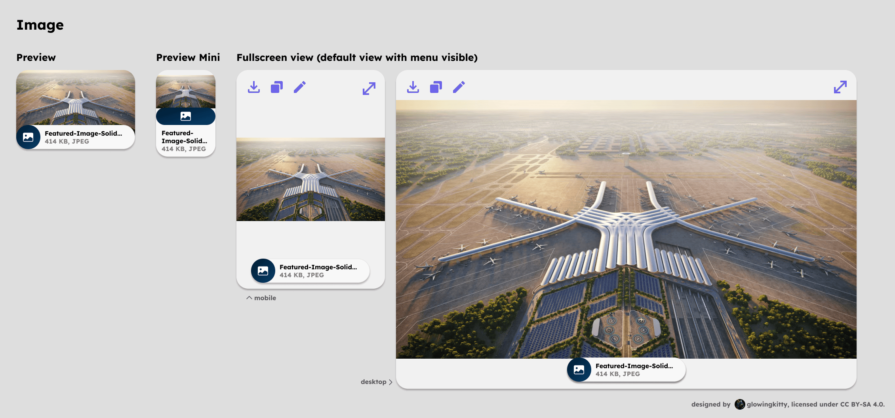

# Images app architecture

## Embedded previews

### Image

Used every time an image is contained in a message in the chat history or message input field.
For uploaded images, generated images, images from web search results.

#### Image | Fullscreen view

Show the image in fullscreen and the image name at the bottom and file type and size.

Editing options:

- crop image
- draw simple shapes on image (to ask about something circled in an image for example) & mark areas for editing

### Skill "Generate image"

Shows prompt and model used for generation, estimated finish time in seconds by default. Then, once generation is finished, shows generated image with AI icon in top right to indicate its ai generated (which fades out after a few seconds and becomes visible on hover again).

#### Skill "Generate image" | Fullscreen view

Shows image + on left side prompt for image and ai image provider & settings, with option to hide those details.

Editing options:

- crop image
- draw simple shapes on image (to ask about something circled in an image for example) & mark areas for editing

#### Skill "Reverse image search"

- better use Google Image search api via serpapi over tinyeye api, because better response quality