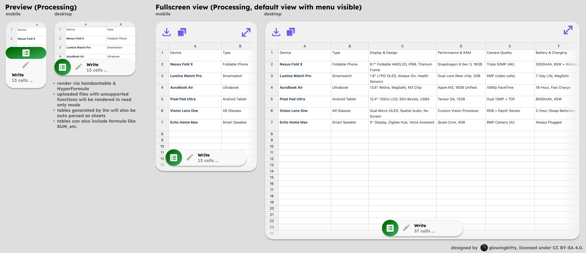
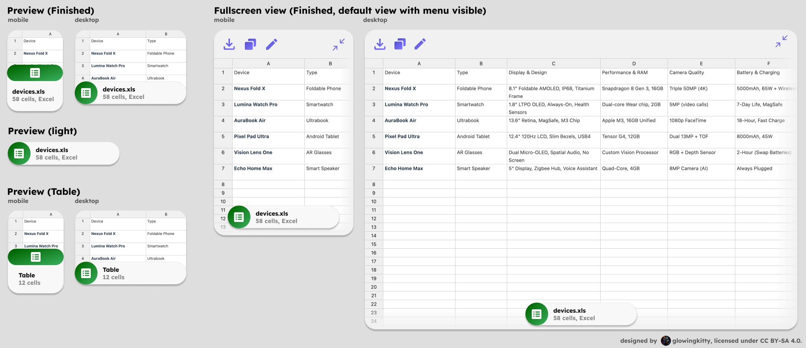
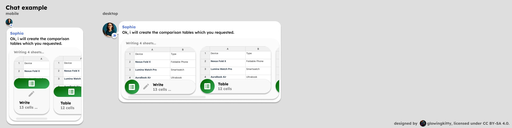

# Sheets app architecture

The Sheets app allows for viewing and editing spreadsheets.

## Embedded previews

### Sheet

> Note: Not yet implemented, but high priority.

Used every time a spreadsheet is contained in a message in the chat history or message input field. Render via handsontable & HyperFormula.
For uploaded Microsoft Excel, Google Sheets, OpenOffice Calc spreadsheets.

Can include a title via the title standard: `<!-- title: "..." -->` in the line before the table.

Data processing is done via unified `parseMessage()` function described in [message_parsing.md](../message_parsing.md).

#### Sheet | Processing

[](https://www.figma.com/design/PzgE78TVxG0eWuEeO6o8ve/Website?node-id=3514-41257&t=V4FPCQaihiRx7h7e-4)

When the sheet is still being processed, those layouts are used.

##### Sheet | Processing | Input example (Markdown table)

````markdown
<!-- title: "Device comparison" -->
| Column 1 | Column 2 | Column 3 |
|----------|----------|----------|
| Row 1    | Row 1    | Row 1    |
| Row 2    | Row 2    | Row 2    |
| Row 3    | Row 3    | 
````

> Note: Later we should also add support for rendering Google Sheets JSON structure for more complex sheets.

##### Sheet | Processing | Output

- tiptap node (lightweight) with:
	- cell count (number)
    - contentRef (string) pointing to full sheet content in client ContentStore (memory + IndexedDB)
    - contentHash? (string, sha256 when finished; used for preview caching)
    - preview is derived at render-time and limited to cells A1:D6 only
    - "Write" text and 'modify' icon, indicating that the sheet is still being processed

- Figma design:
    - [Preview mobile](https://www.figma.com/design/PzgE78TVxG0eWuEeO6o8ve/Website?node-id=3514-41345&t=R9j0Nv3WdNV351nc-4)
    - [Preview desktop](https://www.figma.com/design/PzgE78TVxG0eWuEeO6o8ve/Website?node-id=3514-41360&t=R9j0Nv3WdNV351nc-4)


##### Sheet | Processing | Fullscreen view

Show sheet in fullscreen mode, with preview element in bottom of the screen (with cell count and "Write" text and icon, indicating that the sheet is still being processed). The download and copy to clipboard buttons are also available in the top left corner. Top right corner has the minimize button, which closes the fullscreen view.

Figma design:

- [Mobile](https://www.figma.com/design/PzgE78TVxG0eWuEeO6o8ve/Website?node-id=3415-40088&t=R9j0Nv3WdNV351nc-4)
- [Desktop](https://www.figma.com/design/PzgE78TVxG0eWuEeO6o8ve/Website?node-id=3415-40111&t=R9j0Nv3WdNV351nc-4)


#### Sheet | Finished

[](https://www.figma.com/design/PzgE78TVxG0eWuEeO6o8ve/Website?node-id=3514-41375&t=R9j0Nv3WdNV351nc-4)

When the sheet is finished being processed, those layouts are used.

##### Sheet | Finished | Input example (Markdown table)

````markdown
<!-- title: "Device comparison" -->
| Column 1 | Column 2 | Column 3 |
|----------|----------|----------|
| Row 1    | Row 1    | Row 1    |
| Row 2    | Row 2    | Row 2    |
| Row 3    | Row 3    | Row 3    |
````

> Note: Later we should also add support for rendering Google Sheets JSON structure for more complex sheets.

##### Sheet | Finished | Output

- tiptap node (lightweight) with:
	- cell count (number)
    - title or filename (string)
    - contentRef (string) pointing to full sheet content in client ContentStore (loaded on fullscreen)
    - contentHash (string, sha256 for immutable snapshot/caching)
    - preview is derived at render-time and limited to cells A1:D6 only

- Figma design:
    - [File preview mobile](https://www.figma.com/design/PzgE78TVxG0eWuEeO6o8ve/Website?node-id=3019-35325&t=R9j0Nv3WdNV351nc-4)
    - [File preview desktop](https://www.figma.com/design/PzgE78TVxG0eWuEeO6o8ve/Website?node-id=3424-41865&t=R9j0Nv3WdNV351nc-4)
    - [Table preview mobile](https://www.figma.com/design/PzgE78TVxG0eWuEeO6o8ve/Website?node-id=3425-42255&t=R9j0Nv3WdNV351nc-4)
    - [Table preview desktop](https://www.figma.com/design/PzgE78TVxG0eWuEeO6o8ve/Website?node-id=3425-42248&t=R9j0Nv3WdNV351nc-4)


##### Sheet | Finished | Fullscreen view

Show sheet in fullscreen mode, with preview element in bottom of the screen (with filename, cell count and filetype). The download, copy to clipboard and modify buttons are also available in the top left corner. Top right corner has the minimize button, which closes the fullscreen view. Full content is resolved via `contentRef` from the client ContentStore and instantiated with Handsontable + HyperFormula in fullscreen.

> Note: Modify functionality is not yet planned out and should be added in the future.


Figma design:

- [Mobile](https://www.figma.com/design/PzgE78TVxG0eWuEeO6o8ve/Website?node-id=3514-41456&t=R9j0Nv3WdNV351nc-4)
- [Desktop](https://www.figma.com/design/PzgE78TVxG0eWuEeO6o8ve/Website?node-id=3514-41469&t=R9j0Nv3WdNV351nc-4)


#### Sheet | Chat example

[](https://www.figma.com/design/PzgE78TVxG0eWuEeO6o8ve/Website?node-id=3514-41526&t=R9j0Nv3WdNV351nc-4)

Shows how sheet previews are rendered in a chat message. Mobile / desktop layouts are used depending on the viewport width.

**Multiple previews:**

General rule for all previews/apps: If multiple previews of the same type are rendered in a chat message, they should be grouped together in a horizontally scrollable container. The previews must be sorted from status "Processing" (left) to "Finished" (right), so that the user can always see if there are any unfinished previews. Scroll bar is visible if there are scrollable elements. Uses "mobile" layout of the previews for mobile, "desktop" layout for desktop.

**Single preview:**

If there is only one preview of the same type, no additional container with scrollbar is needed. If a text is following the preview, it will be regularly rendered below the preview. Same if a preview or group of previews of another type is following the preview. Uses "desktop" layout of the preview both for mobile and desktop.