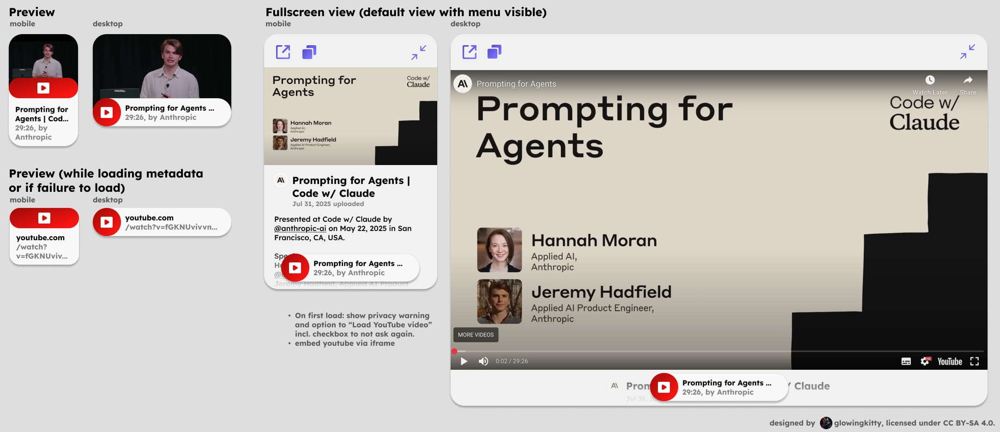
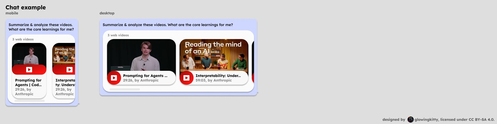
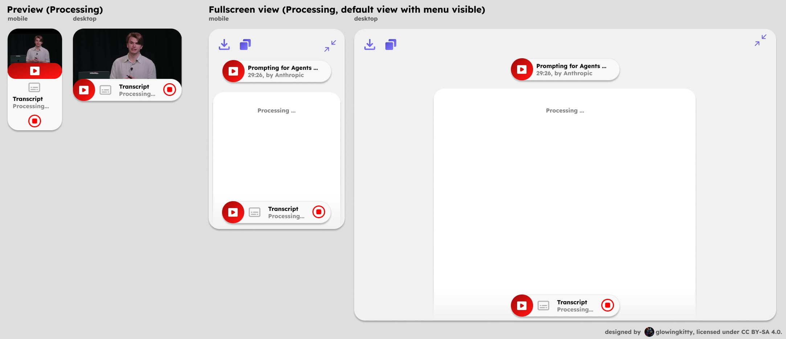
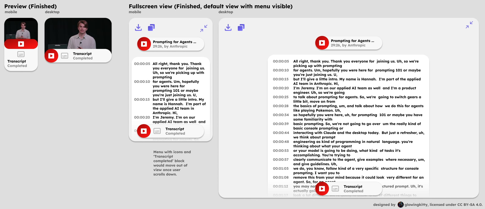
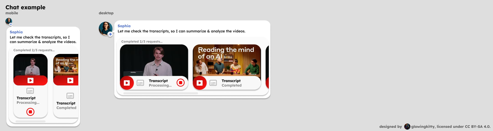

# Videos app architecture

## Embedded previews

### Web video

[](https://www.figma.com/design/PzgE78TVxG0eWuEeO6o8ve/Website?node-id=3403-37227&t=JIw9suqrshvmsdFU-4)
[](https://www.figma.com/design/PzgE78TVxG0eWuEeO6o8ve/Website?node-id=3403-37227&t=JIw9suqrshvmsdFU-4)

Used every time a web video is contained in a message in the chat history or message input field.

#### Web video | Input example

```text
https://www.youtube.com/watch?v=9S_ETzbAMfg
```

#### Web video | Processing

- frontend:
  - extract youtube video url
  - send request to server, use /apps/videos/get_metadata
- backend:
    - authenticate user
    - get video metadata via youtube api (title, thumbnail url, duration, views)
    - return video metadata to frontend
    - cache video thumbnail on server for better efficiency & privacy
    - cache video metadata (with expiration) on server for better efficiency

#### Web video | Output

- tiptap node with:
  - url (string)
  - title (string)
  - duration (number)
  - thumbnail
- Figma design:
  - [Preview](https://www.figma.com/design/PzgE78TVxG0eWuEeO6o8ve/Website?node-id=2984-35142&t=JIw9suqrshvmsdFU-4)
  - [Preview mini](https://www.figma.com/design/PzgE78TVxG0eWuEeO6o8ve/Website?node-id=3404-37386&t=JIw9suqrshvmsdFU-4)


#### Web video | Fullscreen view

Show video in fullscreen mode, with preview element in bottom of the screen (with title and duration details).

Figma design:

- [Mobile](https://www.figma.com/design/PzgE78TVxG0eWuEeO6o8ve/Website?node-id=3404-37606&t=JIw9suqrshvmsdFU-4)
- [Desktop](https://www.figma.com/design/PzgE78TVxG0eWuEeO6o8ve/Website?node-id=3403-37311&t=JIw9suqrshvmsdFU-4)


> Thumbnail url is not needed, since we simple request the /image?url=... endpoint of our preview server to get the thumbnail image.

### Skill "Videos | Get transcript" | Processing

[](https://www.figma.com/design/PzgE78TVxG0eWuEeO6o8ve/Website?node-id=3404-37413&t=JIw9suqrshvmsdFU-4)

### Skill "Videos | Get transcript" | Finished

[](https://www.figma.com/design/PzgE78TVxG0eWuEeO6o8ve/Website?node-id=3404-37413&t=JIw9suqrshvmsdFU-4)

### Skill "Videos | Get transcript" | Chat example

[](https://www.figma.com/design/PzgE78TVxG0eWuEeO6o8ve/Website?node-id=3404-37413&t=JIw9suqrshvmsdFU-4)

Used every time the skill ["Videos | Get transcript"](./videos.md#transcript) is called.

#### Get transcript | Input example (Processing)

This is the input for the preview node for the frontend.

```json
{
  "app": "Videos",
  "skill": "Get transcript",
  "requests": [{
    "url": "https://www.youtube.com/watch?v=9S_ETzbAMfg",
    "title": "China Reveals New Moon Lander",
    "duration": "00:09:41"
  }]
}
```

> Note: Thumbnail url is not needed in frontend, since we simple request the /image?url=... endpoint of our preview server to get the thumbnail image.

> Note: title and duration are not needed for the server but only for the frontend preview.

> TODO: any better way to handle this difference between the input data for the api request/server and the input data for the frontend preview?

#### Get transcript | Output (Processing)

- tiptap node with:
  - url (string)
  - title (string)
  - duration (string)
  - transcript (string)
  - thumbnail
  - Stop button (to send interrupt signal to server for this specific celery task)
- Figma design:
  - [Preview](https://www.figma.com/design/PzgE78TVxG0eWuEeO6o8ve/Website?node-id=3404-37465&t=JIw9suqrshvmsdFU-4)
  - [Preview mini](https://www.figma.com/design/PzgE78TVxG0eWuEeO6o8ve/Website?node-id=3404-37414&t=JIw9suqrshvmsdFU-4)


## Skills

### Transcript

Outputs a transcript for a youtube video url. Supports multiple video URLs in a single call (processed in parallel, up to 9 requests). Can later be extended to support video files as input as well, using api.video api or by extracting audio track from video and then call transcription api like Mistral Voxtral or AssemblyAI.

- if youtube url is given, use youtube transcript script to get existing transcript from youtube.
- if YouTube transcript fails because it’s deactivated for video, consider downloading audio of YouTube and transcribe via mistral voxal or assembly ai to text (also curious to see response for mixed languages videos like https://www.youtube.com/watch?v=wawwwU6Iv1E)


## Focuses

### Summarize

Used if user asks to summarize a video or just posts a link without any instruction whatsoever. Summarizes, analyzes and lists the key learnings from the videos. Also includes additional web searches to give a more complete picture and fact check the video.

### Fact check

Extracts facts mentioned in the video and then uses web searches in combination with the LLMs knowledge base to fact check claims made in video.