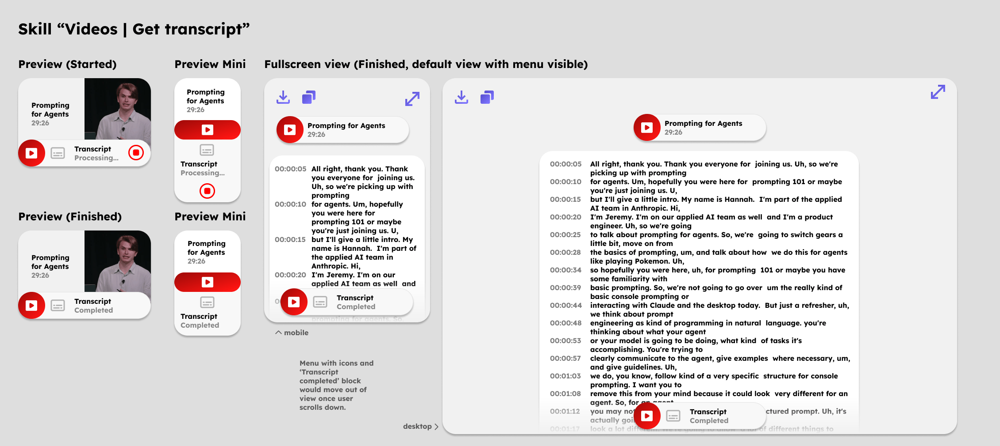

# Videos app architecture

## Embedded previews

### Web video

Used every time a web video is contained in a message in the chat history or message input field.

### Skill "Videos | Get transcript"

Used every time the skill "Videos | Get transcript" is called.

## Skills

### Transcript

Outputs a transcript for a youtube video url. Can later be extended to support video files as input as well, using api.video api or by extracting audio track from video and then call transcription api like Mistral Voxtral or AssemblyAI.

- if youtube url is given, use youtube transcript script to get existing transcript from youtube.
- if YouTube transcript fails because it’s deactivated for video, consider downloading audio of YouTube and transcribe via mistral voxal or assembly ai to text (also curious to see response for mixed languages videos like https://www.youtube.com/watch?v=wawwwU6Iv1E)

## Focuses

### Fact check

Extracts facts mentioned in the video and then uses web searches in combination with the LLMs knowledge base to fact check claims made in video.