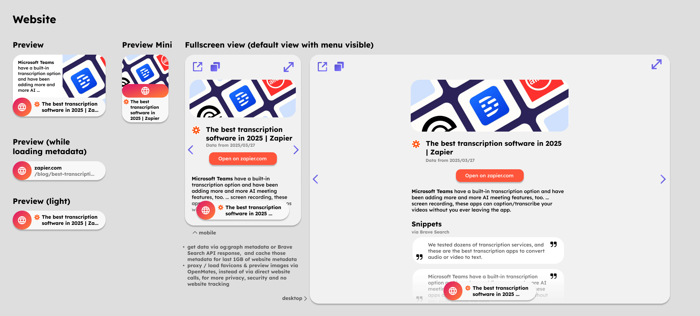
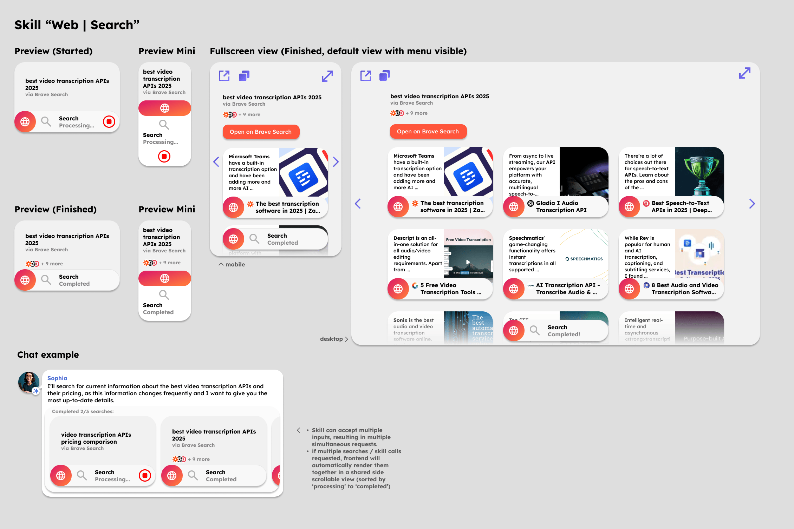
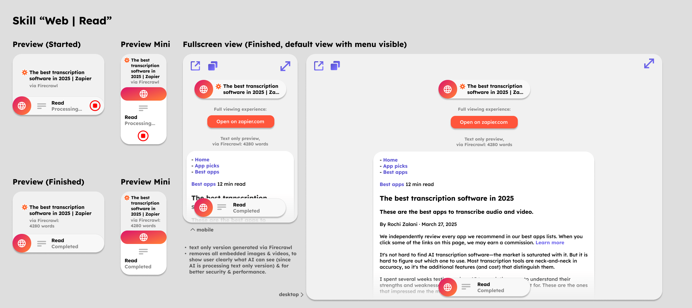

# Web app architecture

> This file about the app called "Web", which can be used by asking the digital team mates in a chat and later also via the OpenMates API. This file is NOT about the OpenMates web app, that allow users to access OpenMates via their web browser.

The web app allows for searching the web, reading and viewing websites & more.

## Embedded previews

### Website

Used every time a website is contained in a message in the chat history or message input field (except for markdown inline url links).

### Skill "Web | Search"

Used every time the skill "Web | Search" is called.

### Skill "Web | Read"

Used every time the skill "Web | Read" is called.

## Skills

### Search

- can search for web pages
- clearly communicate search query & search provider
- default provider: Brave (official Brave Search API)
- include right click menu option for search request "Open in {search_provider}", which would open a new tab with the search query, to continue a manual search if wanted
- clearly show website results (title, favicon or preview image, link to open website results in new tab)
- don't forward brave search thumbnail urls or website thumbnails directly to use, but add /image-proxy endpoint to preview server, to hide users IP address and prevent third party tracking

Note: make sure in post processing we check if the quotes / sources are correct (hardcoded search for the quote in the website snippets or content and if not included (hallucination), then send to LLM again for correction and hide message with quotes from UI.
Note: when pasting web url to message input field, auto remove tracking parameter from url before requesting preview of website (and also don’t restore it when going back to edit mode)

### Reverse image search

- default provider for reverse image search: TinyEye API (unfortunately expensive with 200$ a month 0,04 cent per request plan), alternatively using SerpAPI starting at 70$ a month for reverse image search, flight search and more
- should this skill move to Images app?

### Read

- use Firecrawl to open and parse the text content of a website

### View

- use Firecrawl to create screenshots from a website, which will then be attached in llm message history, for processing by with vision capable LLM

### Get legal pages

- load main page fire Firecrawl, check hardcoded for links including “privacy”, “terms”, “cookies” and other likely relevant url endings and extract target urls
- get each page via Firecrawl and get its content
- return dict of all pages and their content

## Focuses

### Research

- for every topic that is more complex to research than a single search query (anything related to economics, politics, geopolitics, etc.) the Research focus mode will be triggered
- will make multiple searches, towards multiple different view points, as well as answering questions like "Who might be profiting from this situation?", "What incentives do the people/companies/countries involved here have?" and other questions to get a complete and true overview over a topic
- example: "Why did the egg prices increase so much since 2023 in the US?"
    - single web search -> points to bird flue as reason
    - searching also for profits of egg selling companies during the same time -> reveals record profits and payouts to shareholders during the same time -> conclusion: bird flue isn't the reason for increased prices (further reports of legal investigations against those companies further confirm this)