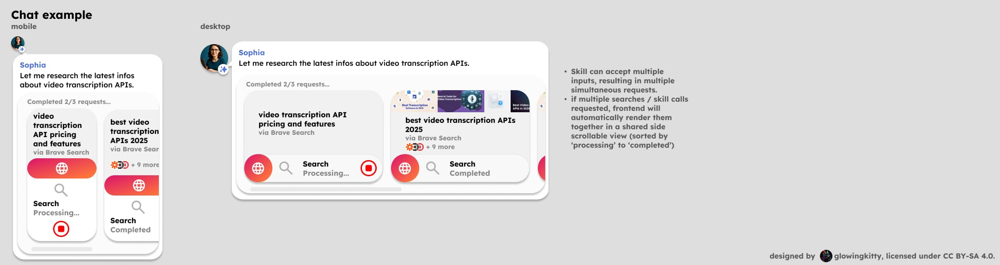

# Web app architecture

> This file about the app called "Web", which can be used by asking the digital team mates in a chat and later also via the OpenMates API. This file is NOT about the OpenMates web app, that allow users to access OpenMates via their web browser.

The web app allows for searching the web, reading and viewing websites & more.

## Embedded previews

### Website

> Note: Not yet implemented, but high priority.

Used every time a completed website link is contained in a message in the chat history or message input field (except for markdown inline url links). When a url is detected, a request to the preview server is made to get the website metadata from the open graph data (which we cache on the server, both the open graph data text and the images, with a max size limit).

- get data via open graph metadata or Brave Search API response, and cache those metadata for last 1GB of website metadata on preview.openmates.org
- proxy / load favicons & preview images via preview.openmates.org, instead of via direct website calls, for more privacy, security and no website tracking

#### Website | Finished

[](https://www.figma.com/design/PzgE78TVxG0eWuEeO6o8ve/Website?node-id=3558-63316&t=vQbeWjQG2QtbTDoL-4)

When the website is finished being processed, those layouts are used. If getting open graph data fails, the preview will be rendered with the url instead of a title and without a background image and favicon (and with no "Fullscreen" option for the preview).

##### Website | Finished | Input example (Markdown inline url link)

````text
https://zapier.com/blog/best-transcription-apps/
````

#### Website | Finished | Output

> TODO: Decide if or not the tiptap note should include title, favicon, background image, etc. or how the loading from the ContentStore should be handled. (only fullscreen exclusive details of websites are 'date_updated', and 'snippets'. Other details are rendered in the preview as well.)

##### Markdown in message input field

- once url is detected, we make a request to the preview server to get the website metadata from the open graph data (which we cache on the server, both the open graph data text and the images, with a max size limit).
- we replace the url in the markdown text with a json code block:

Original markdown text:

````
https://zapier.com/blog/best-transcription-apps/
````

Replaced markdown text (if metadata is fetched successfully):

````
\n
```json
{
  "type": "website",
  "url": "https://zapier.com/blog/best-transcription-apps/",
  "title": "The best transcription software in 2025 | Zapier",
  "description": "*Microsoft Teams* have a built-in transcription option and have been adding more and more AI ..."
}
```
\n
````

Replaced markdown text (if metadata is not fetched successfully):

````
\n
```json
{
  "type": "website",
  "url": "https://zapier.com/blog/best-transcription-apps/"
}
```
\n
````

- once the user pressed backspace after the rendered tiptap node, we replace the json code block with the original url again.


##### Rendered tiptap node in UI

- tiptap node (lightweight) with:
    - title (string)
    - favicon_url (string)
    - background_image_url (string)
    - contentRef (string) pointing to full website metadata (title, description, favicon, snippets, etc.) in client ContentStore (memory + IndexedDB)
    - contentHash? (string, sha256 when finished; used for preview caching)
    - preview is derived at render-time from the contentRef

- Figma design:
    - [Preview mobile](https://www.figma.com/design/PzgE78TVxG0eWuEeO6o8ve/Website?node-id=2264-21979&t=vQbeWjQG2QtbTDoL-4)
    - [Preview desktop](https://www.figma.com/design/PzgE78TVxG0eWuEeO6o8ve/Website?node-id=2173-19360&t=vQbeWjQG2QtbTDoL-4)
    - [Preview (while loading or if load failure) - mobile](https://www.figma.com/design/PzgE78TVxG0eWuEeO6o8ve/Website?node-id=3558-63567&t=vQbeWjQG2QtbTDoL-4)
    - [Preview (while loading or if load failure) - desktop](https://www.figma.com/design/PzgE78TVxG0eWuEeO6o8ve/Website?node-id=3558-63574&t=vQbeWjQG2QtbTDoL-4)
    - [Preview (if no og image but favicon and title) - mobile](https://www.figma.com/design/PzgE78TVxG0eWuEeO6o8ve/Website?node-id=3558-63594&t=vQbeWjQG2QtbTDoL-4)
    - [Preview (if no og image but favicon and title) - desktop](https://www.figma.com/design/PzgE78TVxG0eWuEeO6o8ve/Website?node-id=3417-40616&t=vQbeWjQG2QtbTDoL-4)

##### Website | Finished | Fullscreen view

Show website in fullscreen mode, with preview element in bottom of the screen (with title and favicon). The open (original website in new tab) and copy to clipboard buttons are also available in the top left corner. Top right corner has the minimize button, which closes the fullscreen view. Full content (snippets, if website data gathered from Brave Search API) is resolved via `contentRef` from the client ContentStore.

> TODO: decide if or not we need the contentRef for websites at all and if so, how to handle it.

Figma design:

- [Mobile](https://www.figma.com/design/PzgE78TVxG0eWuEeO6o8ve/Website?node-id=3558-63402&t=vQbeWjQG2QtbTDoL-4)
- [Desktop](https://www.figma.com/design/PzgE78TVxG0eWuEeO6o8ve/Website?node-id=3558-63425&t=vQbeWjQG2QtbTDoL-4)


#### Website | Chat example

[](https://www.figma.com/design/PzgE78TVxG0eWuEeO6o8ve/Website?node-id=3558-63607&t=vQbeWjQG2QtbTDoL-4)

Shows how website previews are rendered in a chat message. Mobile / desktop layouts are used depending on the viewport width.

**Multiple previews:**

General rule for all previews/apps: If multiple previews of the same type are rendered in a chat message, they should be grouped together in a horizontally scrollable container. The previews must be sorted from status "Processing" (left) to "Finished" (right), so that the user can always see if there are any unfinished previews. Scroll bar is visible if there are scrollable elements. Uses "mobile" layout of the previews for mobile, "desktop" layout for desktop.

**Single preview:**

If there is only one preview of the same type, no additional container with scrollbar is needed. If a text is following the preview, it will be regularly rendered below the preview. Same if a preview or group of previews of another type is following the preview. Uses "desktop" layout of the preview both for mobile and desktop.


### Skill "Web | Search"

> Note: Not yet implemented, but one of the first two skills to implement besides Videos | Get transcript.

Used every time the skill ["Web | Search"](#search) is called.

Include "likely_shortened" output parameter for news for example?

#### Skill "Web | Search" | Processing

[](https://www.figma.com/design/PzgE78TVxG0eWuEeO6o8ve/Website?node-id=3560-64335&t=vQbeWjQG2QtbTDoL-4)

#### Skill "Web | Search" | Finished

[](https://www.figma.com/design/PzgE78TVxG0eWuEeO6o8ve/Website?node-id=3560-64335&t=vQbeWjQG2QtbTDoL-4)

#### Skill "Web | Search" | Chat example

[](https://www.figma.com/design/PzgE78TVxG0eWuEeO6o8ve/Website?node-id=3560-64335&t=vQbeWjQG2QtbTDoL-4)


### Skill "Web | Read"

> Note: Not yet implemented. But No 3 skill to implement after Videos | Get transcript and Website | Search.

Used every time the skill ["Web | Read"](#read) is called.

**Slow executing skill:**

- skill execution time can take from 1-10 seconds
- no fullscreen view possible while “processing...”
- assistant will not wait for task completion before continue with answer, but instead send followup message on task completion.
- if last message in chat is (follow up) user message, include preview block to app skill again. If user has made no request in meantime in the chat, just show assistant follow up message without additional preview blocks being referenced in response.
- if group of requests was started, wait for all tasks in group to complete before sending follow up message via assistant.

#### Skill "Web | Read" | Processing

[](https://www.figma.com/design/PzgE78TVxG0eWuEeO6o8ve/Website?node-id=3562-66382&t=vQbeWjQG2QtbTDoL-4)

#### Skill "Web | Read" | Input example

````json
{
  "app": "Web",
  "skill": "Read",
  "requests": [{
    "url": "https://zapier.com/blog/best-transcription-apps/",
    "title": "The best transcription software in 2025 | Zapier"
  }]
}
````

> Note: favicon is not needed in frontend, since we simple request the /favicon?url=... endpoint of our preview server to get the favicon image.

> Note: title is not needed for the server but only for the frontend preview.

> TODO: any better way to handle this difference between the input data for the api request/server and the input data for the frontend preview?

#### Skill "Web | Read" | Finished

[](https://www.figma.com/design/PzgE78TVxG0eWuEeO6o8ve/Website?node-id=3562-66382&t=vQbeWjQG2QtbTDoL-4)

#### Skill "Web | Read" | Chat example

[](https://www.figma.com/design/PzgE78TVxG0eWuEeO6o8ve/Website?node-id=3562-66382&t=vQbeWjQG2QtbTDoL-4)

> TODO: continue updating docs ...


### Skill “Web | View”

> Note: Not yet implemented.

Used every time the skill ["Web | View"](#view) is called.

#### Skill "Web | View" | Processing

[](https://www.figma.com/design/PzgE78TVxG0eWuEeO6o8ve/Website?node-id=3560-65612&t=vQbeWjQG2QtbTDoL-4)


#### Skill "Web | View" | Finished

[](https://www.figma.com/design/PzgE78TVxG0eWuEeO6o8ve/Website?node-id=3560-65612&t=vQbeWjQG2QtbTDoL-4)

#### Skill "Web | View" | Chat example

[](https://www.figma.com/design/PzgE78TVxG0eWuEeO6o8ve/Website?node-id=3560-65612&t=vQbeWjQG2QtbTDoL-4)


## Skills

### Search

- can search for web pages
- clearly communicate search query & search provider
- default provider: Brave (official Brave Search API)
- include right click menu option for search request "Open in {search_provider}", which would open a new tab with the search query, to continue a manual search if wanted
- clearly show website results (title, favicon or preview image, link to open website results in new tab)
- don't forward brave search thumbnail urls or website thumbnails directly to use, but add /image-proxy endpoint to preview server, to hide users IP address and prevent third party tracking


Note: make sure in post processing we check if the quotes / sources are correct (hardcoded search for the quote in the website snippets or content and if not included (hallucination), then send to LLM again for correction and hide message with quotes from UI.
Note: when pasting web url to message input field, auto remove tracking parameter from url before requesting preview of website (and also don’t restore it when going back to edit mode)

### Reverse image search

- default provider for reverse image search: TinyEye API (unfortunately expensive with 200$ a month 0,04 cent per request plan), alternatively using SerpAPI starting at 70$ a month for reverse image search, flight search and more
- should this skill move to Images app?


### Read

- use Firecrawl to open and parse the text content of a website
- run firecrawl in an e2b environment for sandboxed security


### View

- use Firecrawl to create screenshots from a website, which will then be attached in llm message history, for processing by with vision capable LLM
- run firecrawl in an e2b environment for sandboxed security

### Browse

> NOTE: Unsure if this skill even makes sense or if we can reproduce it much better by combining other existing app skills. -> IMPLEMENTATION NO PRIORITY.

- use Stagehand + e2b.dev on hetzner vm for tasks which can’t be fulfilled with existing apps but can be fulfilled by browsing the web and fullfing a task
- uses Search skill when web search is required
- input: goal, fulfillment condition
- requires user confirmation before browsing starts (since this can be more expensive and time intensive)
- allow user to take control via VNC?

### Get legal pages

- load main page fire Firecrawl, check hardcoded for links including “privacy”, “terms”, “cookies” and other likely relevant url endings and extract target urls
- get each page via Firecrawl and get its content
- return dict of all pages and their content


## Focuses

### Research

- for every topic that is more complex to research than a single search query (anything related to economics, politics, geopolitics, etc.) the Research focus mode will be triggered
- will make multiple searches, towards multiple different view points, as well as answering questions like "Who might be profiting from this situation?", "What incentives do the people/companies/countries involved here have?" and other questions to get a complete and true overview over a topic
- example: "Why did the egg prices increase so much since 2023 in the US?"
    - single web search -> points to bird flue as reason
    - searching also for profits of egg selling companies during the same time -> reveals record profits and payouts to shareholders during the same time -> conclusion: bird flue isn't the reason for increased prices (further reports of legal investigations against those companies further confirm this)
- make sure to use check data sources for conflicts of interest for the given request. For example: The Trump White House website isn’t a reliable source on crime statistics in Washington DC when they at the same time send out military because of “insane crime rates”