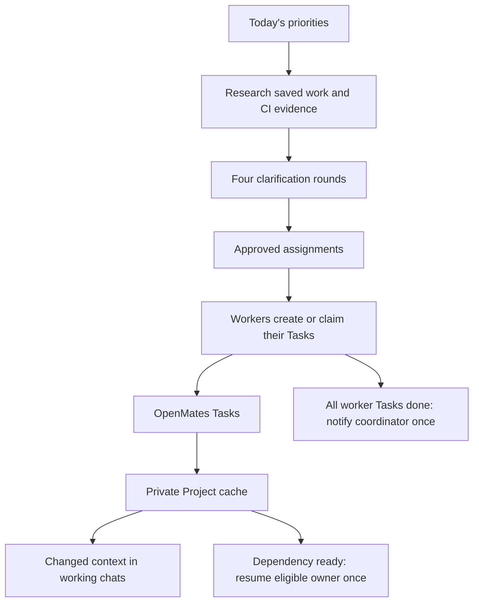
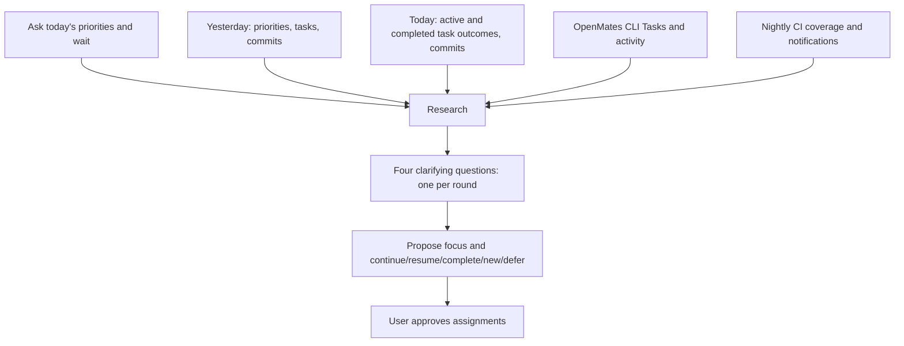

# Codex daily meeting and orchestration

OpenMates Tasks own work state and activity. Codex chats own execution. The
foreground global CLI syncs the selected Project and hosts the local event
adapter. See [Task cache and delivery](codex-task-cache.md) for configuration,
commands, instruction examples and runtime limits.



## Meeting order and daily memory



The priorities question comes **before all meeting research**. The four later
questions are additional and use gathered evidence. Each waits for the user's
answer. If today's priorities were already explicitly given in the opening
message, retain them rather than repeating the question. On resume, continue the
saved stage and avoid repeating answered rounds.

Record the actual priorities answer before collecting inputs:

```bash
python3 scripts/codex_meeting.py --timezone Europe/Berlin --meeting-thread <uuid> \
  --record priorities --text-file /tmp/priorities.txt --message-id <human-reply-id>
python3 scripts/codex_meeting.py --timezone Europe/Berlin --meeting-thread <uuid> \
  --output /tmp/meeting.json
openmates tasks activity list TASK-123 --max-entries 10 --newest-first --json
```

After research, record each of the four replies using `--record answer` and its
actual message ID. Store the proposed focus/assignments using `--record proposal`,
then the user's approval with `--record approve`. All records use `--text-file`
and the same meeting-thread/timezone; human replies also require `--message-id`.
The collector refuses research without recorded priorities, and the proposal
writer refuses fewer than four distinct clarification replies. Priorities are
intent, not assignment approval; never fabricate replies to pass a guard.

Private, gitignored UTF-8 JSON files at the canonical repository's
`logs/daily-meetings/YYYY-MM-DD.json` retain each day's meeting identity,
priorities, answers, proposal and approval. Multiple meetings have separate keys;
changed priorities preserve previous revisions. Files are atomically written
with mode 0600. They complement the authoritative OpenMates Task records.
Yesterday's file is always checked; the last recorded day within 30 days and
`scripts/.daily-meeting-state.json` preserve earlier/legacy priorities with their
actual dates. Missing records remain unknown rather than invented.

The collector uses supported Codex metadata and read-only transcript files. It
includes archived tasks and routed worktrees, selects actual message dates, and
deduplicates copied fork messages. `history.tasks` covers the last working day;
`history.today_tasks` separately includes today's activity and currently running
work, even when it began earlier and has no new messages. Today's idle/archived
tasks remain candidates for completion review: runtime idle is not proof of Done.
Review full relevant histories after the compact excerpts and group children
with parents. Inaccessible history is disclosed.

Git output includes the last working day's commits **and today's commits**.
Nightly CI uses yesterday through the meeting time independently of a weekend
history lookback. OpenMates Tasks are read through the CLI for backlog, todo,
in-progress, blocked and done states. CLI failures and unknown pagination are
explicit; read relevant Task activities before proposing assignments.

The legacy daily meeting helper follows the same priorities-first gate.
`MEETING_TIMEZONE` selects its timezone (UTC when unset); `MEETING_THREAD` identifies
the saved meeting. Without that day's priorities it returns the initial question,
without inspecting other tasks, commits, CI or legacy priorities. Old diagnostic
collectors remain available for targeted investigations.

Nightly output separates source commits, job states, selected spec inventory,
reporter case counts, overlapping reruns and unfinished jobs. Missing reports and
full parameterized discovery remain unknown. Daily dispatch writes selected/held
manifests before detaching, including zero-job holds. It never claims the whole
suite ran merely because a batch succeeded.

Notification diagnosis: the current isolated dispatcher does not call the legacy
email/Discord sender. New manifests explicitly record `notifications: not_wired`.
No resend or notification cutover is performed by this change. Plan that repair
as a scoped task with the intended recipients/channel approval; do not infer
notification delivery from a passing GitHub run.

## Assignment and execution

Use the daily-meeting-and-orchestration skill. Preserve existing user approval
and answered questions when continuing an approved assignment. Each worker uses
its own bound repository session and creates or claims its own OpenMates Tasks.
Split substantial workflows into concrete Tasks and explicit dependencies.

Register actual worker IDs and Task IDs in the coordinator's existing session:

```sh
python3 scripts/codex_orchestration.py --session <coordinator-session> register \
  --coordinator <coordinator-chat-id> --worker <worker-chat-id> \
  --task <task-id> --title "Landing - Header"
```

Configure that session for the foreground Task-cache adapter as described in
codex-task-cache.md. Registration does not claim or transfer a Task. An already
owned Task must be explicitly released before a replacement worker claims it.

Use injected cached Tasks for routine progress. For a specific unanswered status
question, call `wait_threads` once with `timeoutMs: 0`, worker ID and remote host
ID. Read a short history only when the Task detail and status leave a question.
Do not start the old `serve` observer, timed review loop or polling heartbeat.

Routine activity updates only refresh cached context. Dependency and source-bound
CI events go to their eligible owner. All completed worker Tasks trigger one
coordinator notification. Paused workers stay paused. CI success is evidence;
it does not automatically mark the assignment Done.

## Human communication and recovery

Report the outcome, meaningful verification and actual remaining work in plain
language. There is no required status table, exact-summary repetition, copied
blocker quote or extra Task next-action field. Use the existing blocker fields.
Do not turn a resolved local typo or routine command into a retrospective.

Queued delivery is pending until acknowledged. Foreground transport retries with
delay and stable operation IDs; agents do not resend on a timer. Preserve outbox
state and ownership during rollback. Hook definition changes require normal
Codex review/trust and the activation doctor before enabling event execution.

Product tests run through the existing isolated GitHub CI coordinator. Focused
unit and tooling checks may run locally. Explicitly authorized live-service smoke
checks are separate and must distinguish deployed service evidence from isolated
product tests. No additional CI scheduler is introduced.
