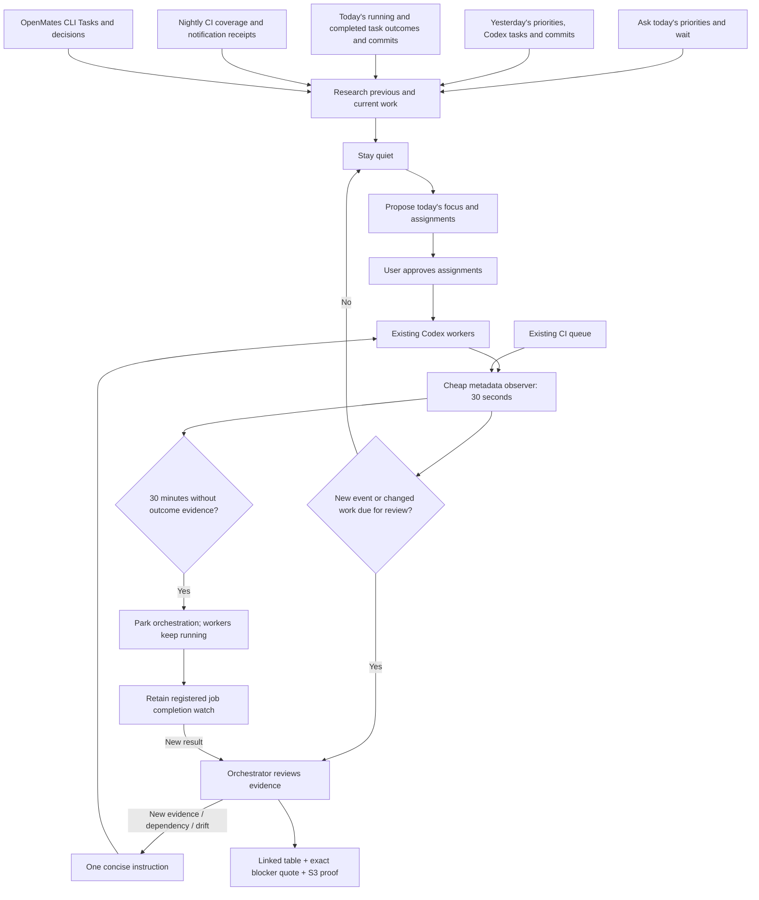
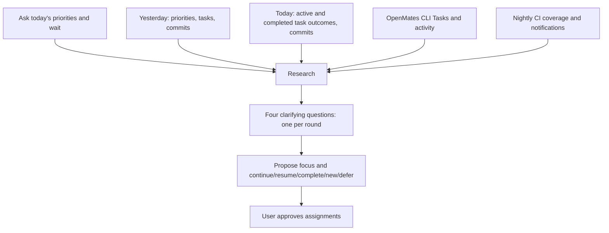

# Codex daily meeting and orchestration

OpenMates Tasks own goals, decisions and activity. Codex owns execution. The
orchestrator stores only scheduling, evidence references and delivery receipts.
The approved design removes the six-worker cap and nightly clock shutdown.



## Meeting order and daily memory



The priorities question comes **before all meeting research**. The four later
questions are additional and use gathered evidence. Each waits for the user's
answer. If today's priorities were already explicitly given in the opening
message, retain them rather than repeating the question. On resume, continue the
saved stage and avoid repeating answered rounds.

Record the actual priorities answer before collecting inputs:

```bash
python3 scripts/codex_meeting.py --timezone Europe/Berlin --meeting-thread <uuid> \
  --record priorities --text-file /tmp/priorities.txt --message-id <human-reply-id>
python3 scripts/codex_meeting.py --timezone Europe/Berlin --meeting-thread <uuid> \
  --output /tmp/meeting.json
openmates tasks activity list TASK-123 --max-entries 10 --newest-first --json
```

After research, record each of the four replies using `--record answer` and its
actual message ID. Store the proposed focus/assignments using `--record proposal`,
then the user's approval with `--record approve`. All records use `--text-file`
and the same meeting-thread/timezone; human replies also require `--message-id`.
The collector refuses research without recorded priorities, and the proposal
writer refuses fewer than four distinct clarification replies. Priorities are
intent, not assignment approval; never fabricate replies to pass a guard.

Private, gitignored UTF-8 JSON files at the canonical repository's
`logs/daily-meetings/YYYY-MM-DD.json` retain each day's meeting identity,
priorities, answers, proposal and approval. Multiple meetings have separate keys;
changed priorities preserve previous revisions. Files are atomically written
with mode 0600. They complement the authoritative OpenMates Task records.
Yesterday's file is always checked; the last recorded day within 30 days and
`scripts/.daily-meeting-state.json` preserve earlier/legacy priorities with their
actual dates. Missing records remain unknown rather than invented.

The collector uses supported Codex metadata and read-only transcript files. It
includes archived tasks and routed worktrees, selects actual message dates, and
deduplicates copied fork messages. `history.tasks` covers the last working day;
`history.today_tasks` separately includes today's activity and currently running
work, even when it began earlier and has no new messages. Today's idle/archived
tasks remain candidates for completion review: runtime idle is not proof of Done.
Review full relevant histories after the compact excerpts and group children
with parents. Inaccessible history is disclosed.

Git output includes the last working day's commits **and today's commits**.
Nightly CI uses yesterday through the meeting time independently of a weekend
history lookback. OpenMates Tasks are read through the CLI for backlog, todo,
in-progress, blocked and done states. CLI failures and unknown pagination are
explicit; read relevant Task activities before proposing assignments.

The legacy daily meeting helper follows the same priorities-first gate.
`MEETING_TIMEZONE` selects its timezone (UTC when unset); `MEETING_THREAD` identifies
the saved meeting. Without that day's priorities it returns the initial question,
without inspecting other tasks, commits, CI or legacy priorities. Old diagnostic
collectors remain available for targeted investigations.

Nightly output separates source commits, job states, selected spec inventory,
reporter case counts, overlapping reruns and unfinished jobs. Missing reports and
full parameterized discovery remain unknown. Daily dispatch writes selected/held
manifests before detaching, including zero-job holds. It never claims the whole
suite ran merely because a batch succeeded.

Notification diagnosis: the current isolated dispatcher does not call the legacy
email/Discord sender. New manifests explicitly record `notifications: not_wired`.
No resend or notification cutover is performed by this change. Plan that repair
as a scoped task with the intended recipients/channel approval; do not infer
notification delivery from a passing GitHub run.

## Observer commands

Use the coordinator's existing repository session. Each worker retains its own
session/worktree and its own OpenMates Task. No new worker is created by these
commands, and registration alone does not start background monitoring.

```bash
python3 scripts/codex_orchestration.py --session abcd register \
  --coordinator <coordinator-uuid> --worker <worker-uuid> \
  --task TASK-123 --title 'Complete signup verification'
python3 scripts/codex_orchestration.py --session abcd serve
python3 scripts/codex_orchestration.py --session abcd status
```

`serve` is a foreground, inference-free observer with one advisory delivery lock.
It discovers the installed daemon's supported Unix WebSocket endpoint. Do not
launch detached shell loops or a second scheduler. A service integration must
explicitly own this command. This implementation does not activate a live service
or attach to an existing coordinator automatically.

Review cadence after a genuine affected-user instruction: 1, 2, 3, 13, 23, 33,
53, 73, 93, 113, 133, 153, 183 minutes, then every 30 minutes. Missed checks
coalesce. An unchanged timestamp at a due checkpoint does not wake reasoning.
Metadata timestamps never count as outcome evidence.

```bash
python3 scripts/codex_orchestration.py --session abcd progress \
  --worker <uuid> --kind verification --evidence 'ci:<request-id>:new-assertion-failure'
python3 scripts/codex_orchestration.py --session abcd user-instruction \
  --worker <uuid> --message-id <actual-human-message-id>
python3 scripts/codex_orchestration.py --session abcd job \
  --worker <uuid> --id <ci-request-id> --state running
python3 scripts/codex_orchestration.py --session abcd note \
  --worker <uuid> --quote 'Exact worker sentence.' --next-action 'Inspect the new CI result'
```

Only the coordinator classifies semantic progress: a new cause, relevant fix,
verification result, usable artifact or resolved dependency. Evidence identities
are deduplicated. User messages grant a fresh inactivity window only to explicitly
listed workers. Worker pushes and automated messages cannot authorize work.

After 30 minutes without evidence, stop actively observing that worker. It keeps
executing. Read registered CI jobs from the existing coordinator's cached SQLite
state; do not add another GitHub poller. Completion rearms the affected worker.
Unregistered external render jobs have no automatic completion adapter yet: report
that limitation and register their result explicitly as dependency evidence.
All parked with no external watches ends the loop after one pending summary is
accepted. A busy coordinator can defer this one summary without rereading workers.

## Interventions and delivery recovery

Record a justified intervention before using supported Codex task controls:

```bash
python3 scripts/codex_orchestration.py --session abcd instruction \
  --worker <uuid> --trigger drift --evidence 'worker-message:<id>' \
  --next-action 'Return to the original signup verification; report the assertion result.'
python3 scripts/codex_orchestration.py --session abcd instruction-receipt \
  --worker <uuid> --message-id <accepted-message-id>
python3 scripts/codex_orchestration.py --session abcd instruction-result \
  --worker <uuid> --effect advanced --evidence 'ci:<new-run-id>'
```

A second instruction is refused until the prior effect is inspected. Identical
instructions are refused even after an unchanged outcome. The recorder does not
send worker messages: the coordinator must verify the supported tool's actual
acceptance. This keeps intervention judgment and execution visible.

Coordinator wakeups persist pending → uncertain → accepted. State is atomically
replaced under a file lock; process restarts preserve identity. A timeout after
submission remains uncertain and is never automatically resent. Use `reconcile
--message-id <id> --turn-id <id>` only when supported thread history contains both
identities. Otherwise leave it uncertain for inspection.

Wakeups use `turn/start.toolOutput` with empty user input, preserving observer
results as tool output instead of user messages. The supported runtime queues
that output if a regular turn becomes active. The observer checks coordinator
idle status first, but no atomic idle-only start field exists: a concurrent human
turn can receive the queued data. This cannot grant new human approval authority.
See [official App Server documentation](https://learn.chatgpt.com/docs/app-server).
There are no automatic worker starts. Live unattended activation remains separate
from deploying these tested tools.

`stop` disables future orchestration deliveries and cancels pending records;
`remove --worker <uuid>` ends observation of a completed or deliberately paused
worker. Neither command cancels worker execution. An already accepted/in-flight
turn cannot be unsent by a local stop; do not interrupt it automatically.

## Role-specific context and visual delivery

The existing Codex hook bridge projects bounded Task context at lifecycle/tool
boundaries and adds the linked-table contract only for a registered coordinator.
Task content is fetched through the source CLI and cached privately, with recent
activity at SessionStart/resume/compaction. No heartbeat is written as activity.
The existing CLI encrypted idempotent outbox remains the activity delivery owner.

Stop checks final table links when `last_assistant_message` and `turn_id` exist,
with at most one correction per turn. It cannot intercept every commentary
message or rewrite Codex's provider system prompt. The skill and injected role
contract govern those messages; workers acquire no table requirement.

CI result retrieval writes `codex-evidence.json` with each spec/test/attempt/profile
and video/image hash. Run the returned command, then paste its S3 links:

```bash
python3 scripts/codex_evidence.py /absolute/test-results/ci-runs/<request> --upload
# After posting the actual links, acknowledge their receipt IDs:
python3 scripts/codex_evidence.py /absolute/test-results/ci-runs/<request> \
  --ack <evidence-id> --message-id <posted-message-id>
```

Upload failures do not change the test verdict. Retrying refreshes retained
artifacts, not tests. Expired presigned links refresh after 48 hours. Images always
have explicit links; optional embeds are additional. Videos include the artifact
filename and, for component proof, the exact deployed component preview URL.
Do not upload credentials, auth state, private user data or raw logs. Missing
capture is an unmet obligation with an explicit reason, never replacement footage.
Actual OpenMates CLI product E2E uses the existing terminal recorder; timeout now
finalizes footage and retains failure exit code 124. Routine scripts are exempt.

## Concrete output examples

These are illustrative replays, not new live status claims. Real output uses the
actual task link, last-check time and uploaded proof URL.

**No new marketing evidence**

| Task | Status | Evidence / next action | Your input |
|---|---|---|---|
| [Marketing](codex://threads/<marketing-id>) | Parked · checked 01:08 | “No render was retried and no MP4 exists yet.” → Await the requested asset decision | Choose the asset |

No repeat “continue” instruction. Existing rendering, if any, is not cancelled.

**CI finished with one new failure**

| Task | Status | Evidence / next action | Your input |
|---|---|---|---|
| [Signup verification](codex://threads/<signup-id>) | Investigating · checked 09:14 | New signup assertion failure → Inspect its cause today · [Video](https://example.invalid/presigned-proof) `phone-retry-0.mp4` | — |

**Yesterday's work and today's priorities**

| Task | Yesterday | Suggested action | Your input |
|---|---|---|---|
| [CI migration](codex://threads/<ci-id>) | Dispatch fix committed; notification receipt absent | Resume scoped reporting diagnosis | Approve priority |
| [CLI feature](codex://threads/<cli-id>) | Implementation committed; product E2E pending | Resume verification and publish recording | — |
| [Completed feature](codex://threads/<done-id>) | Commit + verified proof + Task activity | Complete and close | — |

Show actual suite counts below this only when their source-bound reports exist;
“45 failed batches” must never become “45 failed tests”.

## Verification and rollback

Run the focused Codex orchestration/meeting/evidence/hook tests and the affected
CI result/dispatch/CLI capture tests. Sync canonical skills and audit hook parity.
No product E2E rerun is needed just to verify scheduling or table formatting.
Rollback disables the wakeup writer first, preserves scheduling/delivery evidence,
and restores the earlier adapter/skill; it must not restore the retired OpenCode
monitor. Live rollout/long-running efficiency evidence is reported separately
from isolated implementation tests.
