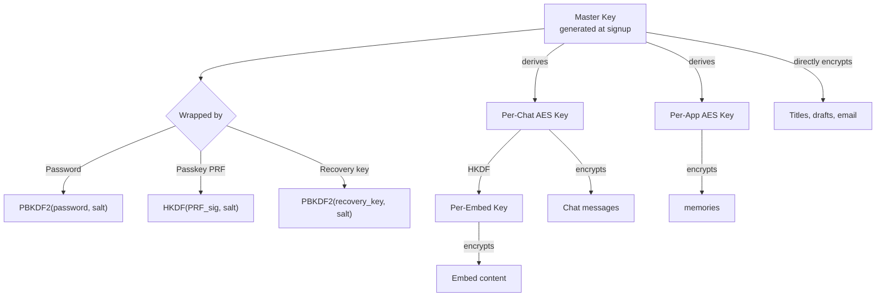

# Client-Side Encryption

> All sensitive user content is encrypted in the browser before it reaches our servers, and is stored only as ciphertext on disk, in caches, and in backups. When the server needs to read content (to run an AI response, render an invoice, or deliver a reminder), decryption happens transiently in memory via HashiCorp Vault — the plaintext is never written to disk, logs, or traces. **This is not end-to-end encryption.** See [encryption-architecture.md](./encryption-architecture.md) for the full posture.

## Why This Exists

- User data at rest must remain unreadable even if the database, caches, or backups are fully compromised
- Third-party data requests targeting cold storage cannot yield plaintext — ciphertext on disk requires the user's credential and a live Vault to decrypt
- AI features, invoicing, and scheduled reminders require server-side decryption on demand → the server decrypts in memory and discards the plaintext after use
- Multiple login methods (password, passkey PRF, recovery key) each derive the same master key deterministically, so any device can decrypt any chat after login

## How It Works

### Two Encryption Tiers

**Client-Managed (client-side encrypted):** chats, messages, app data, emails, profile settings. Master key is derived from the user's credential on their device; the raw key never leaves the device. The server stores only ciphertext on disk. When the server needs to run an AI response against the content, it decrypts transiently in memory and never writes the plaintext to disk.

**Server-Managed (Vault-hybrid):** server-generated files (images, PDFs, videos) and long-running task outputs. AES key wrapped by HashiCorp Vault using a user-specific key ID. Needed because the server must complete tasks while the user may be offline.

For the full breakdown of both tiers, see [Security Architecture](./security.md).

### Master Key Lifecycle

1. During signup, the client generates a unique master key via `generateExtractableMasterKey()` in [cryptoService.ts](../../frontend/packages/ui/src/services/cryptoService.ts)
2. The master key is wrapped using the chosen login method:
   - **Password:** PBKDF2-SHA256 (100k iterations) via `deriveKeyFromPassword()`
   - **Passkey:** HKDF from WebAuthn PRF signature + user salt via `deriveWrappingKeyFromPRF()`
   - **Recovery key:** PBKDF2-SHA256 (100k iterations) via `deriveKeyFromPassword()`
3. The wrapped master key is stored on the server; the unwrapped master key stays in browser memory (or IndexedDB if "Stay Logged In" is on)

### Master Key Storage Modes

Managed in [cryptoKeyStorage.ts](../../frontend/packages/ui/src/services/cryptoKeyStorage.ts):

- **Stay Logged In = false (default):** master key in memory only (module-level variable `memoryMasterKey`). Auto-cleared on page close.
- **Stay Logged In = true:** master key persisted to IndexedDB as a CryptoKey object. Uses `navigator.storage.persist()` to prevent iOS Safari from evicting the DB.

### Per-Data-Type Key Isolation

| Data type | Key source | Implementation |
|-----------|-----------|----------------|
| Chat messages | Per-chat AES key, wrapped with master key | `encryptWithChatKey()` / `decryptWithChatKey()` |
| Chat titles, drafts | Master key directly | `encryptWithMasterKey()` / `decryptWithMasterKey()` |
| Embeds | Per-embed key derived from chat key via HKDF | `deriveEmbedKeyFromChatKey()` |
| Email address | SHA256(email + salt) for server lookup; master key for client storage | `deriveEmailEncryptionKey()` / `encryptEmail()` |
| memories | Per-app AES key, wrapped with master key | Same pattern as chat keys |

Compromise of one data type does not affect others.

### Chat Key Immutability

Once a chat has an `encrypted_chat_key`, the server will not accept a different key unless the client includes an explicit `allow_chat_key_rotation` flag (used for hidden-chat hide/unhide flows). This guard operates at two levels:

1. **WebSocket handler** in [encrypted_chat_metadata_handler.py](../../backend/core/api/app/routes/handlers/websocket_handlers/encrypted_chat_metadata_handler.py) compares incoming key against cached key
2. **Persistence task** in [persistence_tasks.py](../../backend/core/api/app/tasks/persistence_tasks.py) checks against Directus before writing

This prevents a misconfigured device from corrupting the chat key across devices.

### AI Inference and Transient Decryption

**Client-side encryption does not mean the server never reads your content.** The server decrypts transiently in memory whenever it needs to act on your behalf:

- AI inference (the largest and most frequent case)
- PDF invoice rendering (tax and billing)
- Scheduled reminder delivery (when the relevant mate fires)

Mechanics for AI inference specifically:

- The client sends the new user message; the server caches the last 3 active chats per user via HashiCorp Vault-wrapped AES keys (72-hour TTL, LRU eviction) so that follow-up messages don't require a round-trip to the client for history
- The cache holds ciphertext whose wrapping key lives inside Vault; the API process unwraps on demand, reads the plaintext in RAM, and discards the reference
- Nothing plaintext is written to disk, logs, or OpenTelemetry traces (enforced by `TracePrivacyFilter`)
- The permanent storage tier (Directus/Postgres, S3 backups) is never touched by the AI inference path in plaintext form

## Cryptographic Standards

- **Symmetric encryption:** AES-256-GCM with random 12-byte IVs
- **Key derivation:** PBKDF2-SHA256 with 100,000 iterations (passwords, recovery keys)
- **Passkey derivation:** HKDF-SHA256 with info `"masterkey_wrapping"` (PRF signatures)
- **Random generation:** `crypto.getRandomValues()` (Web Crypto API)

All constants defined in [cryptoService.ts](../../frontend/packages/ui/src/services/cryptoService.ts): `AES_KEY_LENGTH = 256`, `AES_IV_LENGTH = 12`, `PBKDF2_ITERATIONS = 100000`.

## Edge Cases

- **At-rest compromise (cold DB / backup / cache dump):** yields only ciphertext and hashes; without a user credential, no content can be decrypted
- **Live-process compromise:** an attacker with root on a running API host could in principle read plaintext transiently in RAM during AI processing. This is the honest limit of the posture — defense-in-depth (Vault, OTel redaction, minimal blast radius) applies to live hosts.
- **Browser eviction (iOS Safari):** `navigator.storage.persist()` + `STAY_LOGGED_IN_FLAG` in localStorage tracks whether key loss is expected or unexpected
- **Tab/device race on embed keys:** embed keys are derived deterministically from chat key + embed ID via HKDF, so all tabs produce the same key

## Related Docs

- [Encryption Architecture](./encryption-architecture.md) -- module boundaries and data flow
- [Security Architecture](./security.md) -- encryption tiers, S3 access, controls summary
- [Master Key Lifecycle](./master-key-lifecycle.md) -- full derivation chain
- [Signup & Login](./signup-and-auth.md) -- master key creation during signup
- [Passkeys](./passkeys.md) -- PRF-based key wrapping
- [Email Privacy](../privacy/email-privacy.md) -- email encryption specifics
