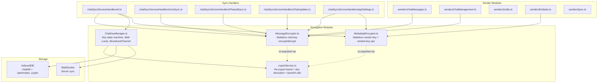
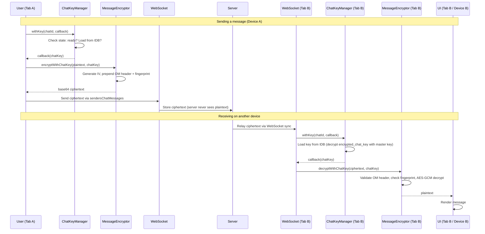
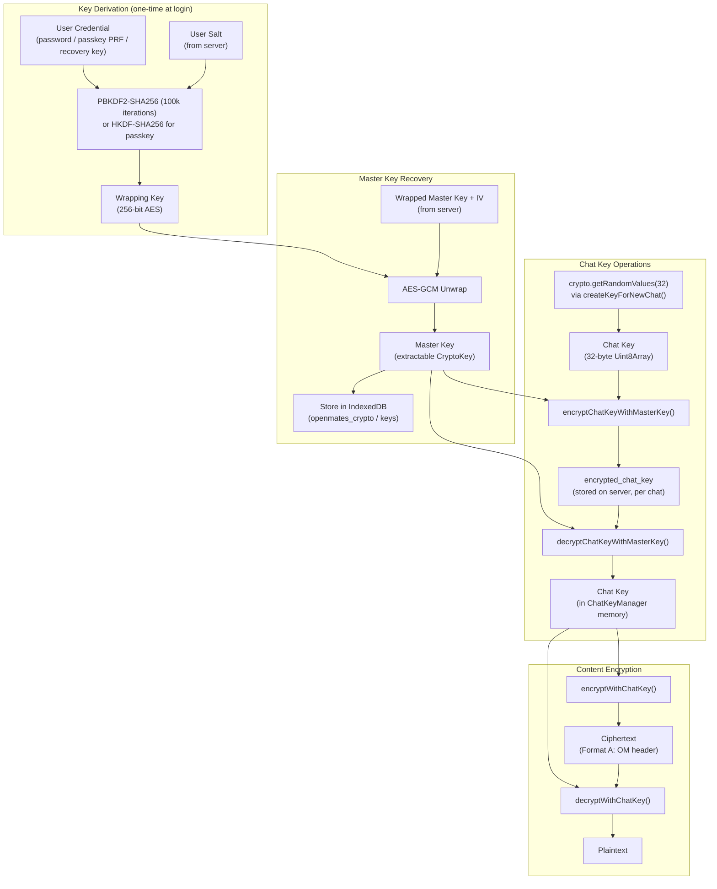

<!--
  Encryption Architecture - End-to-End Overview

  The single entry point for understanding how client-side encryption works
  in OpenMates after the Phase 1-4 rebuild. Covers module boundaries, data
  flow, key lifecycle, cross-device distribution, cross-tab propagation,
  sync handler architecture, and WebSocket key delivery.

  Created: 2026-03-26 (Phase 5, Plan 03 -- ARCH-05)
  Related: encryption-code-inventory.md, encryption-formats.md,
           master-key-lifecycle.md, encryption-root-causes.md
-->

# Encryption Architecture

End-to-end encryption architecture for OpenMates after the Phase 1-4 rebuild.
All chat content is encrypted client-side before syncing to the server.

## Overview

OpenMates encrypts all chat content on the user's device before it leaves the browser. The server stores only ciphertext and never sees plaintext message content. This is not multi-party end-to-end encryption (like Signal) -- it is single-user encryption where the user protects their own data from the server operator. The threat model assumes a compromised or untrusted server: even with full database access, an attacker cannot read chat content without the user's credential.

The cryptographic primitives are **AES-256-GCM** (via the Web Crypto API) for all symmetric encryption, and **PBKDF2-SHA256** / **HKDF-SHA256** for key derivation. Key wrapping for cross-device distribution uses NaCl-style patterns via the `tweetnacl` library for specific operations, though the core encrypt/decrypt path is pure Web Crypto. The rebuild (Phases 1-4) did not change any cryptographic algorithms -- it reorganized the code into well-separated modules with clear ownership and eliminated race conditions that caused recurring "content decryption failed" errors.

The core guarantee: **every encrypted chat must decrypt successfully on every device, every time**. This is enforced through a single key authority (`ChatKeyManager`), immutable key storage, fingerprint-based wrong-key detection, and buffered operations that wait for keys to be available before attempting decryption.

## Module Map

## Data Flow: Encrypt -> Sync -> Decrypt

## Module Boundaries

### MessageEncryptor (`encryption/MessageEncryptor.ts`)

Stateless module responsible for all chat-key encryption and decryption. Every function takes a key and data as parameters, returns a result, and has no side effects.

- **`encryptWithChatKey(plaintext, chatKey)`** -- Encrypts UTF-8 text with a chat key. Produces Format A ciphertext: `[0x4F 0x4D magic][4B FNV-1a fingerprint][12B IV][AES-GCM ciphertext + 16B auth tag]`. Base64-encoded for storage.
- **`decryptWithChatKey(ciphertext, chatKey)`** -- Decrypts base64 ciphertext. Auto-detects Format A (OM header) vs Format B (legacy, no header). Validates fingerprint before attempting AES-GCM to fast-fail on wrong keys.
- **`encryptArrayWithChatKey(items, chatKey)`** -- Batch encrypt an array of strings.
- **`decryptArrayWithChatKey(items, chatKey)`** -- Batch decrypt an array of ciphertexts.

No state, no IndexedDB access, no imports from ChatKeyManager. Imported directly by all sync handlers: `import { encryptWithChatKey } from '../encryption/MessageEncryptor'`.

### MetadataEncryptor (`encryption/MetadataEncryptor.ts`)

Stateless module for master-key and embed-key operations. Handles encrypted fields that are not per-chat-key (titles, drafts, embed metadata).

- **`encryptWithMasterKeyDirect(plaintext, masterKey)`** -- Encrypts with a pre-fetched master CryptoKey. Produces Format D ciphertext.
- **`decryptWithMasterKeyDirect(ciphertext, masterKey)`** -- Decrypts Format D ciphertext with master key.
- **`encryptEmbedKey(embedKey, chatKey)`** -- Wraps an embed encryption key with the chat key.
- **`decryptEmbedKey(wrappedKey, chatKey)`** -- Unwraps an embed key.

No state, no side effects. Master key must be obtained separately (from `getKeyFromStorage()` in cryptoService.ts).

### ChatKeyManager (`encryption/ChatKeyManager.ts`)

The single authority for all chat key state. No other module may generate, cache, or distribute chat keys.

- **`withKey(chatId, callback)`** -- The primary API. Provides a chat key to a callback, handling all loading, caching, and queueing. If the key is in memory (`ready` state), the callback executes immediately. If not, the operation is queued and executes when the key becomes available.
- **Web Locks mutex** -- Lock name: `om-chatkey-{chatId}`. Prevents duplicate key generation when multiple tabs attempt to create a key for the same chat simultaneously. 10-second timeout with unlocked fallback (degraded but functional).
- **BroadcastChannel propagation** -- Publishes `keyLoaded` events when a key becomes available. Other tabs listen and inject the key into their local state. Loop prevention via `_receivingFromBroadcast` flag. Pending-ops guard: receiving tabs only do async work if they have queued operations waiting for that key.
- **State machine per chat** -- States: `unloaded` -> `loading` -> `ready`, or `loading` -> `failed` with retry paths. Every key records its provenance (`created`, `loaded-from-idb`, `received-from-server`, `received-from-broadcast`) for debugging.
- **Immutability guard** -- Once a key is set to `ready`, it cannot be silently replaced. Key conflicts are detected and logged rather than silently overwritten.
- **`createKeyForNewChat(chatId)`** -- The only way to generate a new chat key. Calls `_generateChatKeyInternal()` (32-byte random via `crypto.getRandomValues`), sets state to `ready`, records provenance as `created`.
- **`createAndPersistKey(chatId)`** -- Atomic API: creates key + wraps with master key + persists to IDB in one operation. Used by `onboardingChatService` and `chatCrudOperations`.
- **`receiveKeyFromServer(chatId, encryptedKey)`** -- Receives a key from WebSocket sync, unwraps with master key, validates against existing key if present, injects into state.

### cryptoService.ts (`services/cryptoService.ts`)

Re-export barrel that preserves backwards compatibility for older import paths and dynamic imports. Also contains key derivation functions (`deriveKeyFromPassword`, `generateExtractableMasterKey`, etc.) and base64 utilities that are not part of the encrypt/decrypt hot path.

- Re-exports `encryptWithChatKey`, `decryptWithChatKey` from MessageEncryptor
- Re-exports `encryptWithMasterKeyDirect`, `decryptWithMasterKeyDirect` from MetadataEncryptor
- Contains: `_generateChatKeyInternal()`, `encryptChatKeyWithMasterKey()`, `decryptChatKeyWithMasterKey()`, `deriveKeyFromPassword()`, `generateExtractableMasterKey()`, `saveKeyToSession()`, `getKeyFromStorage()`, `base64ToUint8Array()`, `uint8ArrayToBase64()`
- No new code should import encrypt/decrypt functions from cryptoService.ts -- use the encryptor modules directly. This is enforced by `import-audit.test.ts`.

## Key Lifecycle

The master key is generated exactly once at signup (`generateExtractableMasterKey()`). On every subsequent login, it is recovered by unwrapping the server-stored blob with a credential-derived wrapping key. All three auth methods (password, passkey, recovery key) produce the same wrapping key deterministically -- this is the cross-device distribution mechanism.

Chat keys are 32-byte AES-256-GCM symmetric keys, one per chat. They are generated by `ChatKeyManager.createKeyForNewChat()`, wrapped with the master key, and stored on the server as `encrypted_chat_key`. Any device with the master key can unwrap any chat key.

See [Master Key Lifecycle](master-key-lifecycle.md) for the complete derivation chain with line-level code references.

## Cross-Device Key Distribution

Cross-device key distribution works through **deterministic derivation**: the same credential (password + salt, or passkey PRF + email salt) produces the same wrapping key on every device. This wrapping key unwraps the same master key from the server-stored blob. The master key then unwraps all chat keys from their server-stored `encrypted_chat_key` values.

There is no key transport protocol. No device ever sends a key to another device. Instead, every device independently derives the same master key from the same credential and downloads the same wrapped chat keys from the server.

This means:
1. A new device can decrypt all existing chats immediately after login
2. No online coordination between devices is needed for key access
3. If the user changes their password, the master key is re-wrapped with the new wrapping key and re-uploaded -- the master key itself does not change

## Cross-Tab Key Propagation

Within a single device, multiple browser tabs share chat keys via two mechanisms:

1. **Shared IndexedDB** -- All tabs read from the same `openmates_crypto` database. When one tab loads a key, other tabs can read it from IDB.
2. **BroadcastChannel** -- When `ChatKeyManager` in one tab transitions a key to `ready` state, it publishes a `keyLoaded` event. Other tabs listen and inject the key into their in-memory state without an IDB roundtrip.

The BroadcastChannel handler uses a **pending-ops guard** (Phase 3 design): a receiving tab only performs async work (like starting queued decryption operations) if it has pending operations waiting for that specific key. This prevents unnecessary work in background tabs that are not actively displaying the chat.

Loop prevention: the `_receivingFromBroadcast` flag prevents a tab from re-broadcasting a key it just received from another tab.

## Sync Handler Architecture

After the Phase 4 sender decomposition, the sync handler codebase is organized as:

**Handler modules** (inbound -- process messages from server):
- `chatSyncServiceHandlersAI.ts` -- AI response streaming, title/icon/category generation, summary, suggestions
- `chatSyncServiceHandlersCoreSync.ts` -- Phase 1/2/3 phased sync, initial chat list
- `chatSyncServiceHandlersPhasedSync.ts` -- Phased sync merge logic, metadata validation
- `chatSyncServiceHandlersChatUpdates.ts` -- Broadcast updates, metadata self-heal
- `chatSyncServiceHandlersAppSettings.ts` -- App settings and memories sync

**Sender modules** (outbound -- send messages to server):
- `sendersChatMessages.ts` -- Message send, edit, delete
- `sendersChatManagement.ts` -- Chat create, rename, archive
- `sendersDrafts.ts` -- Draft sync
- `sendersEmbeds.ts` -- Embed content sync
- `sendersSync.ts` -- Reconnection and background sync
- `chatSyncServiceSenders.ts` -- Legacy barrel (delegates to sub-modules)

**Import rule:** All sync handlers import encryption functions from `MessageEncryptor` or `MetadataEncryptor` directly -- never from `cryptoService.ts`. This is enforced by `import-audit.test.ts` (added in Phase 4, plan 03). The audit test verifies zero direct `cryptoService` imports in handler/sender files for chat-key encrypt/decrypt operations.

## WebSocket Key Delivery

When a chat key needs to be delivered to another device (e.g., after creating a new chat while another device is online), the protocol is:

1. **Sender device** sends the wrapped `encrypted_chat_key` via WebSocket as part of the chat creation or sync message
2. **Server** relays the message to all connected devices for that user
3. **Recipient device** receives the message, extracts `encrypted_chat_key`, calls `ChatKeyManager.receiveKeyFromServer()` to unwrap and inject the key
4. **Recipient device** sends a `key_received` acknowledgment back via WebSocket
5. **Server** relays `key_delivery_confirmed` back to the sender device

The acknowledgment is **fire-and-forget**: if the ack fails (network issue, tab closed), the key injection on the recipient is not affected. The ack is purely observational logging -- no state changes depend on it. The `key_delivery_confirmed` handler on the sender is informational only.

This means key delivery is resilient to network interruptions: as long as the initial key message arrives, the recipient can decrypt. The ack provides visibility but is not load-bearing.

## Related Documents

- [Encryption Code Inventory](encryption-code-inventory.md) -- Complete call site inventory of every encrypt/decrypt/key-gen path
- [Ciphertext Formats](encryption-formats.md) -- Byte-level documentation of all four ciphertext formats
- [Master Key Lifecycle](master-key-lifecycle.md) -- Full derivation chain from credential to content encryption
- [Root Cause Analysis](encryption-root-causes.md) -- Pre-rebuild bug analysis and resolution status

---

*Created: 2026-03-26 (Phase 5, Plan 03 -- ARCH-05 requirement)*
