# Encryption Code Path Inventory

> Complete inventory of every encrypt/decrypt/key-gen/key-sync code path in the OpenMates
> frontend codebase. Each call site is cataloged with file path, line number, function name,
> whether it routes through ChatKeyManager, and the triggering context. The bypass analysis
> section (AUDT-06) classifies every non-ChatKeyManager crypto import for Phase 4 rewiring.
>
> Generated: 2026-03-26 via systematic grep of `frontend/packages/ui/src/services/`.
> Related: [Encryption Root Causes](./encryption-root-causes.md) |
> [Chat Encryption Implementation](./chat-encryption-implementation.md)

## Summary Statistics

- Total files with crypto operations: 22
- Total call sites: 135+
- Chat key encrypt operations (`encryptWithChatKey`/`encryptArrayWithChatKey`): 42
- Chat key decrypt operations (`decryptWithChatKey`/`decryptArrayWithChatKey`): 38
- Master key encrypt operations (`encryptWithMasterKey`): 22
- Master key decrypt operations (`decryptWithMasterKey`): 32
- Key generation sites (`createKeyForNewChat`/`_generateChatKeyInternal`): 5
- Key wrapping/unwrapping (`encryptChatKeyWithMasterKey`/`decryptChatKeyWithMasterKey`): 28
- Key sync operations (`receiveKeyFromServer`/`injectKey`/`bulkInject`): 10
- Embed key derivation (`deriveEmbedKeyFromChatKey`): 4
- Master key lifecycle (`generateExtractableMasterKey`/`saveKeyToSession`/`getKeyFromStorage`): 12
- ChatKeyManager bypass paths (chat key operations): 0 confirmed violations

## Call Site Inventory

### Encrypt Operations (Chat Key)

| File | Line | Function | Via ChatKeyManager? | Trigger Context |
|------|------|----------|-------------------|-----------------|
| `chatSyncServiceSenders.ts` | 53 | `encryptWithChatKey` | Key from ChatKeyManager | Encrypt title during rename |
| `chatSyncServiceSenders.ts` | 2164 | `encryptWithChatKey` | Key from ChatKeyManager | Encrypt user message content in sendEncryptedStoragePackage |
| `chatSyncServiceSenders.ts` | 2165 | `encryptWithChatKey` | Key from ChatKeyManager | Encrypt Tiptap JSON content |
| `chatSyncServiceSenders.ts` | 2189 | `encryptWithChatKey` | Key from ChatKeyManager | Encrypt sender_name |
| `chatSyncServiceSenders.ts` | 2192 | `encryptWithChatKey` | Key from ChatKeyManager | Encrypt category |
| `chatSyncServiceSenders.ts` | 2203 | `encryptWithChatKey` | Key from ChatKeyManager | Encrypt title |
| `chatSyncServiceSenders.ts` | 2208 | `encryptWithChatKey` | Key from ChatKeyManager | Encrypt icon |
| `chatSyncServiceSenders.ts` | 2213 | `encryptWithChatKey` | Key from ChatKeyManager | Encrypt category (duplicate path) |
| `chatSyncServiceSenders.ts` | 2222 | `encryptWithChatKey` | Key from ChatKeyManager | Encrypt PII mappings |
| `chatSyncService.ts` | 783 | `encryptWithChatKey` | Key from ChatKeyManager | Encrypt active focus ID |
| `chatSyncServiceHandlersChatUpdates.ts` | 1371 | `encryptWithChatKey` | Key from ChatKeyManager | Re-encrypt title during broadcast self-heal |
| `chatSyncServiceHandlersChatUpdates.ts` | 1376 | `encryptWithChatKey` | Key from ChatKeyManager | Re-encrypt icon during broadcast self-heal |
| `chatSyncServiceHandlersChatUpdates.ts` | 1381 | `encryptWithChatKey` | Key from ChatKeyManager | Re-encrypt category during broadcast self-heal |
| `chatSyncServiceHandlersAppSettings.ts` | 1093 | `encryptWithChatKey` | Key from ChatKeyManager | Encrypt app settings response content |
| `chatSyncServiceHandlersAppSettings.ts` | 1252 | `encryptWithChatKey` | Key from ChatKeyManager | Encrypt app settings response content (2nd handler) |
| `chatSyncServiceHandlersAppSettings.ts` | 2255 | `encryptWithChatKey` | Key from ChatKeyManager | Encrypt title for system chat |
| `chatSyncServiceHandlersAppSettings.ts` | 2283 | `encryptWithChatKey` | Key from ChatKeyManager | Encrypt content for system chat |
| `chatSyncServiceHandlersAI.ts` | 1131 | `encryptWithChatKey` | Key from ChatKeyManager | Encrypt AI-generated title |
| `chatSyncServiceHandlersAI.ts` | 1174 | `encryptWithChatKey` | Key from ChatKeyManager | Encrypt AI-generated icon |
| `chatSyncServiceHandlersAI.ts` | 1185 | `encryptWithChatKey` | Key from ChatKeyManager | Encrypt AI-generated category |
| `chatSyncServiceHandlersAI.ts` | 1202 | `encryptWithChatKey` | Key from ChatKeyManager | Encrypt category (fallback path) |
| `chatSyncServiceHandlersAI.ts` | 1892 | `encryptWithChatKey` | Key from ChatKeyManager | Encrypt chat summary |
| `chatSyncServiceHandlersAI.ts` | 1848 | `encryptArrayWithChatKey` | Key from ChatKeyManager | Encrypt follow-up suggestions |
| `chatSyncServiceHandlersAI.ts` | 1900 | `encryptArrayWithChatKey` | Key from ChatKeyManager | Encrypt chat tags |
| `chatSyncServiceHandlersAI.ts` | 1912 | `encryptArrayWithChatKey` | Key from ChatKeyManager | Encrypt top recommended apps |
| `onboardingChatService.ts` | 94 | `encryptWithChatKey` | Key from `createAndPersistKey()` | Encrypt welcome message content |
| `onboardingChatService.ts` | 95 | `encryptWithChatKey` | Key from `createAndPersistKey()` | Encrypt onboarding category |
| `onboardingChatService.ts` | 99 | `encryptWithChatKey` | Key from `createAndPersistKey()` | Encrypt sender name ("Suki") |
| `onboardingChatService.ts` | 117 | `encryptWithChatKey` | Key from `createAndPersistKey()` | Encrypt focus ID |
| `onboardingChatService.ts` | 129 | `encryptArrayWithChatKey` | Key from `createAndPersistKey()` | Encrypt follow-up suggestions |
| `onboardingChatService.ts` | 135 | `encryptWithChatKey` | Key from `createAndPersistKey()` | Encrypt icon |
| `onboardingChatService.ts` | 141 | `encryptWithChatKey` | Key from `createAndPersistKey()` | Encrypt chat title |
| `forkChatService.ts` | 148 | `encryptWithChatKey` | Key from ChatKeyManager | Encrypt fork title |
| `forkChatService.ts` | 190 | `encryptWithChatKey` | Key from ChatKeyManager | Encrypt forked category |
| `forkChatService.ts` | 205 | `encryptWithChatKey` | Key from ChatKeyManager | Encrypt forked icon |
| `forkChatService.ts` | 336 | `encryptWithChatKey` | Key from ChatKeyManager | Encrypt forked message content |
| `forkChatService.ts` | 348 | `encryptWithChatKey` | Key from ChatKeyManager | Encrypt forked sender name |
| `forkChatService.ts` | 356 | `encryptWithChatKey` | Key from ChatKeyManager | Encrypt forked category (message-level) |
| `forkChatService.ts` | 364 | `encryptWithChatKey` | Key from ChatKeyManager | Encrypt forked model name |
| `db/chatKeyManagement.ts` | 404-472 | `encryptWithChatKey` (x7) | Key passed as param | Encrypt message fields (content, sender, category, model, thinking, signature, PII) |
| `db/chatKeyManagement.ts` | 535-582 | `encryptWithChatKey` (x7) | Key passed as param | Re-encrypt message fields during migration/update |

### Decrypt Operations (Chat Key)

| File | Line | Function | Via ChatKeyManager? | Trigger Context |
|------|------|----------|-------------------|-----------------|
| `chatSyncService.ts` | 625 | `decryptWithChatKey` | Key via `decryptChatKeyWithMasterKey` | Decrypt title for sidebar display |
| `chatSyncService.ts` | 635 | `decryptWithChatKey` | Key via `decryptChatKeyWithMasterKey` | Decrypt category for sidebar |
| `chatSyncService.ts` | 645 | `decryptWithChatKey` | Key via `decryptChatKeyWithMasterKey` | Decrypt icon for sidebar |
| `chatSyncServiceHandlersCoreSync.ts` | 67 | `decryptWithChatKey` | Key via `decryptChatKeyWithMasterKey` | Decrypt title during phased sync Phase 1 |
| `chatSyncServiceHandlersCoreSync.ts` | 75 | `decryptWithChatKey` | Key via `decryptChatKeyWithMasterKey` | Decrypt category during phased sync |
| `chatSyncServiceHandlersCoreSync.ts` | 85 | `decryptWithChatKey` | Key via `decryptChatKeyWithMasterKey` | Decrypt icon during phased sync |
| `chatSyncServiceHandlersCoreSync.ts` | 181 | `decryptWithChatKey` | Key via ChatKeyManager | Decrypt title for Phase 2/3 |
| `chatSyncServiceHandlersChatUpdates.ts` | 477 | `decryptWithChatKey` | Key via `decryptChatKeyWithMasterKey` | Decrypt title in broadcast handler |
| `chatSyncServiceHandlersChatUpdates.ts` | 493 | `decryptWithChatKey` | Key via `decryptChatKeyWithMasterKey` | Decrypt category in broadcast handler |
| `chatSyncServiceHandlersChatUpdates.ts` | 1610 | `decryptWithChatKey` | Key from ChatKeyManager | Validate incoming encrypted metadata |
| `chatSyncServiceHandlersChatUpdates.ts` | 1617 | `decryptWithChatKey` | Key from ChatKeyManager | Validate local encrypted metadata |
| `chatSyncServiceHandlersPhasedSync.ts` | 72 | `decryptWithChatKey` | Key from ChatKeyManager | Validate merged metadata during phased sync |
| `chatSyncServiceHandlersPhasedSync.ts` | 81 | `decryptWithChatKey` | Key from ChatKeyManager | Validate local metadata fallback |
| `chatSyncServiceHandlersAI.ts` | 651 | `decryptWithChatKey` | Key from ChatKeyManager | Decrypt category for display during AI response |
| `chatSyncServiceHandlersAI.ts` | 839 | `decryptWithChatKey` | Key from ChatKeyManager | Decrypt title for AI title update |
| `chatSyncServiceHandlersAI.ts` | 1451 | `decryptWithChatKey` | Key from ChatKeyManager | Decrypt content for mention extraction |
| `chatSyncServiceHandlersAI.ts` | 2042 | `decryptArrayWithChatKey` | Key from ChatKeyManager | Decrypt recommended apps |
| `chatSyncServiceHandlersAI.ts` | 2198 | `decryptWithChatKey` | Key from ChatKeyManager | Decrypt active focus ID |
| `chatSyncServiceSenders.ts` | 1040 | `decryptWithChatKey` | Key from ChatKeyManager | Decrypt active focus ID for storage package |
| `chatSyncServiceSenders.ts` | 2142 | `decryptWithChatKey` | Key from ChatKeyManager | Decrypt content for re-encryption |
| `chatMetadataCache.ts` | 105 | `decryptWithChatKey` | Key from ChatKeyManager | Decrypt title for sidebar cache |
| `chatMetadataCache.ts` | 136 | `decryptWithChatKey` | Key from ChatKeyManager | Decrypt icon for cache |
| `chatMetadataCache.ts` | 139 | `decryptWithChatKey` | Key from ChatKeyManager | Decrypt category for cache |
| `chatMetadataCache.ts` | 142 | `decryptWithChatKey` | Key from ChatKeyManager | Decrypt chat summary for cache |
| `chatMetadataCache.ts` | 145 | `decryptWithChatKey` | Key from ChatKeyManager | Decrypt active focus ID for cache |
| `forkChatService.ts` | 185 | `decryptWithChatKey` | Key passed as param | Decrypt source category for fork |
| `forkChatService.ts` | 200 | `decryptWithChatKey` | Key passed as param | Decrypt source icon for fork |
| `onboardingChatService.ts` | 220 | `decryptWithChatKey` | Key from `chatKeyManager.getKey()` | Decrypt focus ID to check for existing onboarding chat |
| `chatExportService.ts` | 574 | `decryptWithChatKey` | Key from ChatKeyManager | Decrypt thinking content for export |
| `db/chatKeyManagement.ts` | 672 | `decryptWithChatKey` | Key passed as param | Decrypt message content in decryptMessageContent |
| `db/chatKeyManagement.ts` | 749 | `decryptWithChatKey` | Key passed as param | Decrypt individual fields in decryptMessageFields |
| `debugUtils.ts` | 808,1060,1119,1774,1847,3130 | `decryptWithChatKey` (x6) | Key via `decryptChatKeyWithMasterKey` | Debug tool decryption for health checks |

### Encrypt Operations (Master Key)

| File | Line | Function | Via ChatKeyManager? | Trigger Context |
|------|------|----------|-------------------|-----------------|
| `cryptoService.ts` | 818 | `encryptWithMasterKey` | N/A (master key) | Encrypt email for client storage |
| `chatSyncServiceHandlersAI.ts` | 1877 | `encryptWithMasterKey` | N/A (master key) | Encrypt new chat suggestions (master-key encrypted) |
| `chatSyncServiceHandlersAI.ts` | 2111 | `encryptWithMasterKey` | N/A (master key) | Encrypt app-specific data with master key |
| `db/newChatSuggestions.ts` | 43 | `encryptWithMasterKey` | N/A (master key) | Encrypt suggestion text for IDB storage |
| `db/newChatSuggestions.ts` | 403 | `encryptWithMasterKey` | N/A (master key) | Encrypt individual suggestion |
| `drafts/draftSave.ts` | 959 | `encryptWithMasterKey` | N/A (master key) | Encrypt draft markdown content |
| `drafts/draftSave.ts` | 961 | `encryptWithMasterKey` | N/A (master key) | Encrypt draft preview text |
| `drafts/sessionStorageDraftService.ts` | 258 | `encryptWithMasterKey` | N/A (master key) | Encrypt session draft markdown |
| `drafts/sessionStorageDraftService.ts` | 259 | `encryptWithMasterKey` | N/A (master key) | Encrypt session draft preview |
| `embedStore.ts` | 458 | `encryptWithMasterKey` | N/A (master key) | Encrypt embed data for IDB storage |
| `dailyInspirationDB.ts` | 113-121 | `encryptWithMasterKey` (x6) | N/A (master key) | Encrypt daily inspiration fields (phrase, response, title, category, video, suggestions) |
| `debugUtils.ts` | 2793 | `encryptWithMasterKey` | N/A (master key) | Debug tool: test master key availability |

### Decrypt Operations (Master Key)

| File | Line | Function | Via ChatKeyManager? | Trigger Context |
|------|------|----------|-------------------|-----------------|
| `chatMetadataCache.ts` | 121 | `decryptWithMasterKey` | N/A (master key) | Decrypt draft preview for sidebar |
| `chatSyncServiceHandlersAppSettings.ts` | 734 | `decryptWithMasterKey` | N/A (master key) | Decrypt app memories/settings |
| `mentionedSettingsMemoriesCleartext.ts` | 38,157 | `decryptWithMasterKey` (x2) | N/A (master key) | Decrypt mentioned memories for display |
| `searchService.ts` | 322 | `decryptWithMasterKey` | N/A (master key) | Decrypt new chat suggestions for search |
| `accountExportService.ts` | 515 | `decryptWithMasterKey` | N/A (master key) | Decrypt email for account export |
| `accountExportService.ts` | 541 | `decryptWithMasterKey` | N/A (master key) | Decrypt memories for export |
| `chatExportService.ts` | 459 | `decryptWithMasterKey` | N/A (master key) | Decrypt draft content for export |
| `db/newChatSuggestions.ts` | 377 | `decryptWithMasterKey` | N/A (master key) | Decrypt stored suggestions |
| `drafts/draftWebsocket.ts` | 120 | `decryptWithMasterKey` | N/A (master key) | Decrypt incoming draft from WebSocket |
| `drafts/draftWebsocket.ts` | 213 | `decryptWithMasterKey` | N/A (master key) | Decrypt draft title from WebSocket |
| `drafts/draftWebsocket.ts` | 244 | `decryptWithMasterKey` | N/A (master key) | Decrypt draft markdown from WebSocket |
| `embedStore.ts` | 1043 | `decryptWithMasterKey` | N/A (master key) | Decrypt embed data from IDB |
| `embedStore.ts` | 1319 | `decryptWithMasterKey` | N/A (master key) | Decrypt embed data (alternative path) |
| `dailyInspirationDB.ts` | 253-271 | `decryptWithMasterKey` (x7) | N/A (master key) | Decrypt daily inspiration fields |
| `dailyInspirationDB.ts` | 652-658 | `decryptWithMasterKey` (x5) | N/A (master key) | Decrypt inspirations for display |
| `dailyInspirationDB.ts` | 853-859 | `decryptWithMasterKey` (x5) | N/A (master key) | Decrypt inspirations (alternative path) |
| `debugUtils.ts` | 1805,3580,3649,4040 | `decryptWithMasterKey` (x4) | N/A (master key) | Debug tool: decrypt drafts, suggestions, inspirations |

### Key Generation

| File | Line | Function | Notes |
|------|------|----------|-------|
| `cryptoService.ts` | 1015 | `_generateChatKeyInternal()` | Internal: 32-byte random key via `crypto.getRandomValues`. Only called by ChatKeyManager. |
| `cryptoService.ts` | 1024 | `generateChatKey()` | DEPRECATED: Logs warning, delegates to `_generateChatKeyInternal()`. No current callers. |
| `encryption/ChatKeyManager.ts` | 338 | `createKeyForNewChat()` | Primary API: Calls `_generateChatKeyInternal()`, sets state to `ready`, records provenance as `created`. |
| `encryption/ChatKeyManager.ts` | 377 | `createAndPersistKey()` | Atomic API: Calls `createKeyForNewChat()` + `encryptChatKeyWithMasterKey()` + IDB persist. |
| `chatSyncServiceHandlersAppSettings.ts` | 2242 | `chatKeyManager.createKeyForNewChat()` | Creates key for new system chat from app settings handler. |
| `db/chatCrudOperations.ts` | 160 | `chatKeyManager.createKeyForNewChat()` | Creates key when adding a new chat via `addChat()`. |

### Key Wrapping/Unwrapping

| File | Line | Function | Direction | Context |
|------|------|----------|-----------|---------|
| `encryption/ChatKeyManager.ts` | 380 | `encryptChatKeyWithMasterKey` | Wrap | Wrap new key during `createAndPersistKey()` |
| `encryption/ChatKeyManager.ts` | 428 | `decryptChatKeyWithMasterKey` | Unwrap | Unwrap key during `loadKeyFromDB()` |
| `encryption/ChatKeyManager.ts` | 506 | `decryptChatKeyWithMasterKey` | Unwrap | Unwrap server key in `receiveKeyFromServer()` |
| `encryption/ChatKeyManager.ts` | 526 | `decryptChatKeyWithMasterKey` | Unwrap | Unwrap key in `receiveKeyFromServer()` (no-conflict path) |
| `encryption/ChatKeyManager.ts` | 816 | `encryptChatKeyWithMasterKey` | Wrap | Re-wrap key for `getEncryptedKey()` |
| `db/chatCrudOperations.ts` | 127 | `decryptChatKeyWithMasterKey` | Unwrap | Unwrap key during chat load |
| `db/chatCrudOperations.ts` | 142 | `decryptChatKeyWithMasterKey` | Unwrap | Unwrap key during chat load (fallback) |
| `db/chatCrudOperations.ts` | 165 | `encryptChatKeyWithMasterKey` | Wrap | Wrap new key during `addChat()` |
| `db/chatKeyManagement.ts` | 269 | `decryptChatKeyWithMasterKey` | Unwrap | Bulk unwrap during `loadChatKeysFromDatabase()` |
| `chatSyncService.ts` | 616 | `decryptChatKeyWithMasterKey` | Unwrap | Unwrap for sidebar display |
| `chatSyncServiceHandlersCoreSync.ts` | 60 | `decryptChatKeyWithMasterKey` | Unwrap | Unwrap during Phase 1 sync |
| `chatSyncServiceHandlersCoreSync.ts` | 167 | `decryptChatKeyWithMasterKey` | Unwrap | Unwrap during Phase 2/3 sync |
| `chatSyncServiceHandlersChatUpdates.ts` | 466 | `decryptChatKeyWithMasterKey` | Unwrap | Unwrap for broadcast metadata validation |
| `chatSyncServiceHandlersChatUpdates.ts` | 524 | `decryptChatKeyWithMasterKey` | Unwrap | Unwrap for chat update handler |
| `chatSyncServiceHandlersChatUpdates.ts` | 564 | `decryptChatKeyWithMasterKey` | Unwrap | Unwrap for chat update (3rd path) |
| `chatSyncServiceHandlersChatUpdates.ts` | 1523 | `decryptChatKeyWithMasterKey` | Unwrap | Unwrap for key conflict detection |
| `chatSyncServiceHandlersChatUpdates.ts` | 1559 | `decryptChatKeyWithMasterKey` | Unwrap | Unwrap first-time key |
| `chatSyncServiceHandlersChatUpdates.ts` | 1716 | `encryptChatKeyWithMasterKey` | Wrap | Re-wrap key for server send |
| `chatSyncServiceSenders.ts` | 2000 | `decryptChatKeyWithMasterKey` | Unwrap | Unwrap in sendEncryptedStoragePackage |
| `chatSyncServiceSenders.ts` | 2067 | `decryptChatKeyWithMasterKey` | Unwrap | Unwrap fresh key fallback |
| `chatSyncServiceSenders.ts` | 2105 | `encryptChatKeyWithMasterKey` | Wrap | Wrap for storage package |
| `chatSyncServiceHandlersAI.ts` | 1052 | `decryptChatKeyWithMasterKey` | Unwrap | Unwrap for AI handler |
| `chatSyncServiceHandlersAI.ts` | 1269 | `encryptChatKeyWithMasterKey` | Wrap | Wrap for AI metadata send |
| `hiddenChatService.ts` | 257 | `decryptChatKeyWithMasterKey` | Unwrap | Unwrap normal key during unhide |
| `hiddenChatService.ts` | 490 | `decryptChatKeyWithMasterKey` | Unwrap | Unwrap to test if key is master-key-encrypted |
| `hiddenChatService.ts` | 623 | `encryptChatKeyWithMasterKey` | Wrap | Re-wrap with master key during unhide |
| `chatMetadataCache.ts` | 91 | `decryptChatKeyWithMasterKey` | Unwrap | Unwrap for metadata cache |

### Key Sync Operations

| File | Line | Function | Direction | Context |
|------|------|----------|-----------|---------|
| `encryption/ChatKeyManager.ts` | 496 | `receiveKeyFromServer()` | Inbound | Receive and validate server-synced key via WebSocket |
| `encryption/ChatKeyManager.ts` | 576 | `injectKey()` | Inbound | Generic key injection with immutability guard |
| `encryption/ChatKeyManager.ts` | 1017 | `bulkInject()` | Inbound | Batch inject during app init |
| `db/chatKeyManagement.ts` | 96 | `chatKeyManager.injectKey()` | Inbound | Inject after key lookup from IDB |
| `db/chatKeyManagement.ts` | 272 | `chatKeyManager.injectKey()` | Inbound | Inject during bulk key loading |
| `db/chatCrudOperations.ts` | 129 | `chatKeyManager.injectKey()` | Inbound | Inject after unwrapping in chat load |
| `db/chatCrudOperations.ts` | 146 | `chatKeyManager.injectKey()` | Inbound | Inject after unwrapping (fallback path) |
| `db/chatCrudOperations.ts` | 251 | `chatKeyManager.injectKey()` | Inbound | Inject during addChat result |
| `db.ts` | 1600 | `chatKeyManager.injectKey()` | Inbound | Inject from shared_storage (openmates_shared_keys IDB) |
| `chatSyncServiceHandlersPhasedSync.ts` | 1264 | `chatKeyManager.receiveKeyFromServer()` | Inbound | Receive key during phased sync |

### Embed Key Derivation

| File | Line | Function | Context |
|------|------|----------|---------|
| `cryptoService.ts` | 1356 | `deriveEmbedKeyFromChatKey()` | Definition: HKDF(chatKey, embedId) |
| `chatSyncServiceSenders.ts` | 1217 | `deriveEmbedKeyFromChatKey()` | Derive embed key for outbound embed encryption |
| `chatSyncServiceHandlersAI.ts` | 2953 | `deriveEmbedKeyFromChatKey()` | Derive embed key for AI-created embed |
| `chatSyncServiceHandlersAI.ts` | 3420 | `deriveEmbedKeyFromChatKey()` | Derive embed key for embed processing |

### Master Key Lifecycle

| File | Line | Function | Context |
|------|------|----------|---------|
| `cryptoService.ts` | 134 | `generateExtractableMasterKey()` | Generate new AES-256 master key (extractable CryptoKey) |
| `cryptoService.ts` | 156 | `saveKeyToSession()` | Save CryptoKey to IndexedDB |
| `cryptoService.ts` | 323 | `getKeyFromStorage()` | Retrieve CryptoKey from IndexedDB |
| `cryptoService.ts` | 516 | `getKeyFromStorage()` | Called internally by `encryptWithMasterKey` |
| `cryptoService.ts` | 566 | `getKeyFromStorage()` | Called internally by `decryptWithMasterKey` |
| `cryptoService.ts` | 1230 | `getKeyFromStorage()` | Called internally by `encryptChatKeyWithMasterKey` |
| `cryptoService.ts` | 1266 | `getKeyFromStorage()` | Called internally by `decryptChatKeyWithMasterKey` |
| `cryptoService.ts` | 1392 | `getKeyFromStorage()` | Called internally by embed key derivation |
| `cryptoService.ts` | 1428 | `getKeyFromStorage()` | Called internally by another key derivation |
| `hiddenChatService.ts` | 155 | `getKeyFromStorage()` | Get master key for hidden chat combined secret derivation |
| `db.ts` | 532 | `getKeyFromStorage()` | Check master key availability during DB init |
| `db/chatKeyManagement.ts` | 253 | `getKeyFromStorage()` | Prefetch master key for bulk key loading |

## ChatKeyManager Bypass Analysis (AUDT-06)

### Legitimate Bypasses (Master Key Operations)

These files import directly from `cryptoService.ts` for **master key** operations. ChatKeyManager only manages chat keys, so master key operations correctly bypass it.

| File | Function | Why Legitimate |
|------|----------|---------------|
| `chatMetadataCache.ts` | `decryptWithMasterKey` | Decrypts draft preview (master key encrypted). Also uses `decryptChatKeyWithMasterKey` to obtain chat keys for metadata decryption. |
| `mentionedSettingsMemoriesCleartext.ts` | `decryptWithMasterKey` | Decrypts app memories/settings (master key encrypted). No chat key involvement. |
| `searchService.ts` | `decryptWithMasterKey` | Decrypts new chat suggestions (master key encrypted). No chat key involvement. |
| `accountExportService.ts` | `decryptWithMasterKey` | Decrypts email and memories for account export (master key encrypted). |
| `chatExportService.ts` | `decryptWithMasterKey` | Decrypts draft content and thinking content for chat export. |
| `drafts/draftSave.ts` | `encryptWithMasterKey` | Encrypts draft markdown/preview (master key encrypted). No chat key involvement. |
| `drafts/draftWebsocket.ts` | `decryptWithMasterKey` | Decrypts draft content from WebSocket (master key encrypted). |
| `drafts/sessionStorageDraftService.ts` | `encryptWithMasterKey` (via param) | Receives encrypt function as parameter. No direct import. |
| `db/newChatSuggestions.ts` | `encryptWithMasterKey`, `decryptWithMasterKey` | Encrypts/decrypts new chat suggestions (master key encrypted). No chat key involvement. |
| `embedStore.ts` | `encryptWithMasterKey`, `decryptWithMasterKey` | Encrypts/decrypts embed data in IDB (master key encrypted). No chat key involvement. |
| `dailyInspirationDB.ts` | `encryptWithMasterKey`, `decryptWithMasterKey` | Encrypts/decrypts daily inspiration fields (master key encrypted). |
| `chatSyncServiceHandlersAppSettings.ts` | `decryptWithMasterKey` | Decrypts app memories (master key). Also uses ChatKeyManager for chat key operations. |
| `chatSyncServiceHandlersAI.ts` | `encryptWithMasterKey` | Encrypts new chat suggestions with master key. Chat key operations go through ChatKeyManager. |
| `debugUtils.ts` | `decryptWithChatKey`, `decryptWithMasterKey`, `getKeyFromStorage` | Debug tool: directly decrypts for health checks. Acceptable for diagnostic code. |

### Bypass Violations (Chat Key Operations Not Through ChatKeyManager)

**None found.** After commit `3d8148bc4`, all chat key generation paths go through
`chatKeyManager.createKeyForNewChat()` or `chatKeyManager.createAndPersistKey()`. All files
that use `encryptWithChatKey`/`decryptWithChatKey` obtain the key from ChatKeyManager first
(either via `getKey()`, `getKeySync()`, or as a parameter that originated from ChatKeyManager).

### Previously Identified Concerns (Now Resolved)

| File | Concern | Resolution |
|------|---------|------------|
| `onboardingChatService.ts` | 9 direct `encryptWithChatKey`/`decryptWithChatKey` calls | **Resolved**: Uses `chatKeyManager.createAndPersistKey()` for key creation (line 71). Direct crypto calls use the key variable obtained from ChatKeyManager. Pattern is architecturally correct. |
| `chatCrudOperations.ts` | Direct `createKeyForNewChat()` call | **Correct**: This is the legitimate call site for new chat creation. |
| `chatSyncServiceHandlersAppSettings.ts` | Direct `createKeyForNewChat()` call | **Correct**: Creates key for new system chat. Uses ChatKeyManager as intended. |

### Needs Investigation

| File | Function | Line | Question |
|------|----------|------|----------|
| `hiddenChatService.ts` | `getKeyFromStorage()` | 155 | Uses `getKeyFromStorage()` to get master key for PBKDF2 derivation of hidden chat combined secret. This is a master key operation (legitimate), but the pattern of directly importing `getKeyFromStorage` instead of going through a higher-level API could be fragile if master key storage changes. |
| `hiddenChatService.ts` | `encryptChatKeyWithMasterKey` / `decryptChatKeyWithMasterKey` | 17-18, 257, 490, 623 | Directly imports key wrapping functions. This is necessary because hidden chats use a different wrapping key (combined secret vs master key). However, ChatKeyManager is not aware of hidden chat key wrapping, which means hidden chat keys bypass the provenance tracking and immutability guard. **Phase 3 should evaluate whether ChatKeyManager needs a `hideChat()`/`unhideChat()` API.** |
| `db.ts` | `getKeyFromStorage()` | 532 | Checks master key availability during DB init. Low risk but couples DB initialization to crypto module. |

## Crypto Function Call Graph

```mermaid
graph TB
    subgraph "Key Generation"
        CKM_create["ChatKeyManager.createKeyForNewChat()"]
        CKM_persist["ChatKeyManager.createAndPersistKey()"]
        gen["_generateChatKeyInternal()"]
        CKM_create --> gen
        CKM_persist --> CKM_create
        CKM_persist --> wrap
    end

    subgraph "Key Wrapping (Master Key)"
        wrap["encryptChatKeyWithMasterKey()"]
        unwrap["decryptChatKeyWithMasterKey()"]
        getKey["getKeyFromStorage()"]
        wrap --> getKey
        unwrap --> getKey
    end

    subgraph "Key Sync"
        receive["ChatKeyManager.receiveKeyFromServer()"]
        inject["ChatKeyManager.injectKey()"]
        bulk["ChatKeyManager.bulkInject()"]
        receive --> unwrap
        receive --> inject
        bulk --> inject
    end

    subgraph "Chat Key Encryption"
        encChat["encryptWithChatKey()"]
        decChat["decryptWithChatKey()"]
        encArr["encryptArrayWithChatKey()"]
        decArr["decryptArrayWithChatKey()"]
        encArr --> encChat
        decArr --> decChat
    end

    subgraph "Master Key Encryption"
        encMK["encryptWithMasterKey()"]
        decMK["decryptWithMasterKey()"]
        encMK --> getKey
        decMK --> getKey
    end

    subgraph "Embed Key"
        deriveEmbed["deriveEmbedKeyFromChatKey()"]
        deriveEmbed --> getKey
    end

    subgraph "Master Key Lifecycle"
        genMK["generateExtractableMasterKey()"]
        saveMK["saveKeyToSession()"]
        genMK --> saveMK
    end

    subgraph "Callers: Sync Handlers"
        senders["chatSyncServiceSenders.ts"]
        coreSync["chatSyncServiceHandlersCoreSync.ts"]
        chatUpdates["chatSyncServiceHandlersChatUpdates.ts"]
        phasedSync["chatSyncServiceHandlersPhasedSync.ts"]
        aiSync["chatSyncServiceHandlersAI.ts"]
        appSettings["chatSyncServiceHandlersAppSettings.ts"]
    end

    subgraph "Callers: Services"
        onboarding["onboardingChatService.ts"]
        fork["forkChatService.ts"]
        hidden["hiddenChatService.ts"]
        metaCache["chatMetadataCache.ts"]
        crud["chatCrudOperations.ts"]
        keyMgmt["chatKeyManagement.ts"]
    end

    subgraph "Callers: Master-Key-Only"
        drafts["draftSave.ts / draftWebsocket.ts"]
        newSugg["newChatSuggestions.ts"]
        embedSt["embedStore.ts"]
        inspiration["dailyInspirationDB.ts"]
        search["searchService.ts"]
        export["accountExportService.ts"]
        memories["mentionedSettingsMemoriesCleartext.ts"]
    end

    senders --> encChat
    senders --> decChat
    senders --> unwrap
    senders --> wrap
    senders --> deriveEmbed
    coreSync --> decChat
    coreSync --> unwrap
    chatUpdates --> encChat
    chatUpdates --> decChat
    chatUpdates --> unwrap
    chatUpdates --> wrap
    phasedSync --> decChat
    phasedSync --> receive
    aiSync --> encChat
    aiSync --> decChat
    aiSync --> encMK
    aiSync --> unwrap
    aiSync --> wrap
    aiSync --> deriveEmbed
    appSettings --> encChat
    appSettings --> decMK
    appSettings --> CKM_create

    onboarding --> CKM_persist
    onboarding --> encChat
    onboarding --> decChat
    fork --> encChat
    fork --> decChat
    hidden --> wrap
    hidden --> unwrap
    hidden --> getKey
    metaCache --> decChat
    metaCache --> decMK
    metaCache --> unwrap
    crud --> CKM_create
    crud --> wrap
    crud --> unwrap
    crud --> inject
    keyMgmt --> encChat
    keyMgmt --> decChat
    keyMgmt --> unwrap
    keyMgmt --> inject

    drafts --> encMK
    drafts --> decMK
    newSugg --> encMK
    newSugg --> decMK
    embedSt --> encMK
    embedSt --> decMK
    inspiration --> encMK
    inspiration --> decMK
    search --> decMK
    export --> decMK
    memories --> decMK

    style CKM_create fill:#4CAF50,color:white
    style CKM_persist fill:#4CAF50,color:white
    style inject fill:#4CAF50,color:white
    style receive fill:#4CAF50,color:white
    style bulk fill:#4CAF50,color:white
    style hidden fill:#FF9800,color:white
```

**Legend:**
- Green nodes: ChatKeyManager methods (the intended gateway for chat key operations)
- Orange nodes: Services that need investigation for ChatKeyManager integration
- All other nodes: Either crypto primitives or caller services

---

*Code path inventory: 2026-03-26*
*Source: Systematic grep of `frontend/packages/ui/src/services/**/*.ts`*
*Grep patterns: encryptWithChatKey, decryptWithChatKey, encryptWithMasterKey, decryptWithMasterKey, _generateChatKeyInternal, generateChatKey, createKeyForNewChat, encryptChatKeyWithMasterKey, decryptChatKeyWithMasterKey, receiveKeyFromServer, bulkInject, injectKey, deriveEmbedKeyFromChatKey, generateExtractableMasterKey, saveKeyToSession, getKeyFromStorage*
