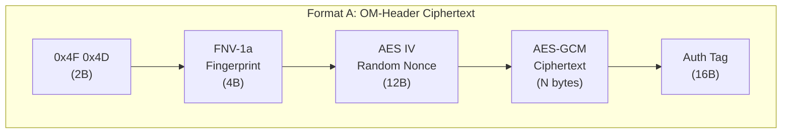
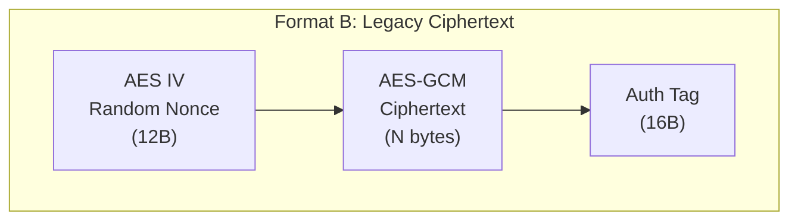
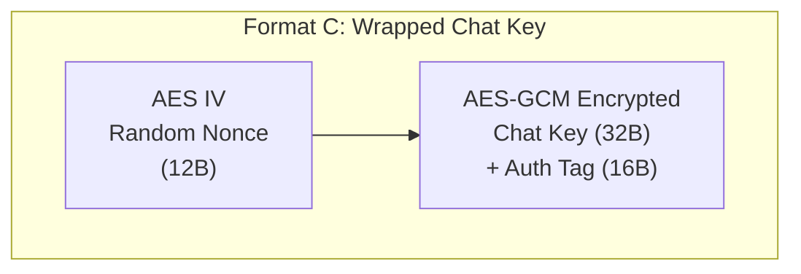
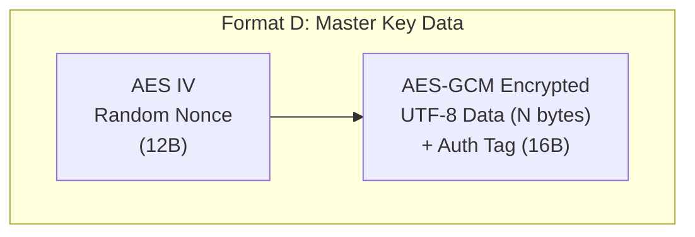
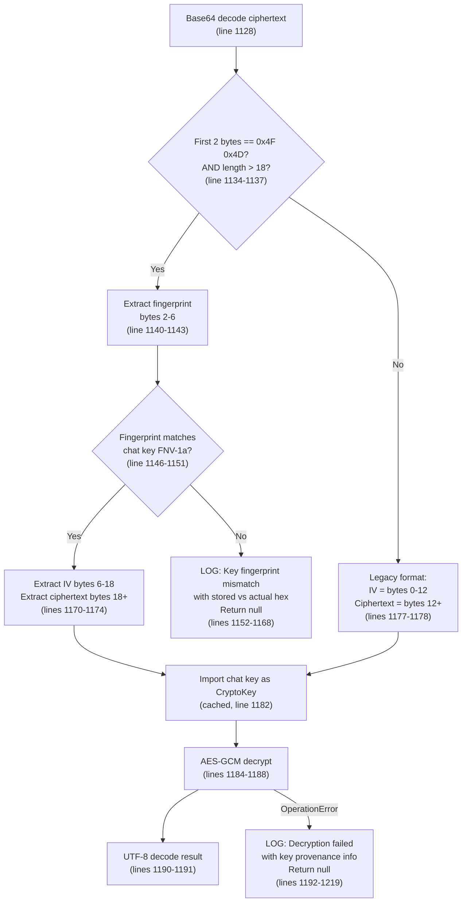

<!--
  Encryption Formats - Byte-Level Ciphertext Documentation

  Documents the exact binary layout of every ciphertext format used in
  OpenMates' client-side encryption. All formats use AES-256-GCM with
  12-byte random IVs and are base64-encoded for storage/transport.

  Source of truth: cryptoService.ts (frontend/packages/ui/src/services/)
  Related: chat-encryption-implementation.md, zero-knowledge-storage.md
-->

---
status: active
last_verified: 2026-03-26
key_files:
  - frontend/packages/ui/src/services/cryptoService.ts
  - docs/architecture/core/chat-encryption-implementation.md
---

# Encryption Formats

> Byte-level documentation of every ciphertext format produced by `cryptoService.ts`. All encrypted values in the database are base64-encoded binary blobs following one of these four formats.

## Overview

OpenMates uses four distinct ciphertext formats, distinguished by their encryption key and header structure:

| Format | Key Used | Has OM Header | Used For |
|--------|----------|---------------|----------|
| Format A: OM-header | Per-chat key | Yes (6B header) | Message content, metadata fields |
| Format B: Legacy | Per-chat key | No | Older messages (pre-fingerprint) |
| Format C: Wrapped chat key | Master key | No | `encrypted_chat_key` field |
| Format D: Master-key data | Master key | No | Titles, drafts, search indexes, settings |

All formats share the same cryptographic primitive: **AES-256-GCM** with 12-byte random IVs via the Web Crypto API (`crypto.subtle`). The 16-byte GCM authentication tag is appended to the ciphertext by the browser's crypto implementation.

## Format A: OM-Header (Chat Key Encrypted Fields)

**Source:** `cryptoService.ts` lines 1076-1103 (`encryptWithChatKey`) and lines 1122-1219 (`decryptWithChatKey`)

The current format for all chat-key-encrypted fields. Includes a 2-byte magic header and a 4-byte key fingerprint for fast wrong-key detection.



### Byte Offset Table

| Offset | Length | Field | Description |
|--------|--------|-------|-------------|
| 0 | 2 | Magic bytes | `0x4F 0x4D` (ASCII "OM") -- identifies new format |
| 2 | 4 | Key fingerprint | FNV-1a hash of the raw chat key bytes |
| 6 | 12 | IV | Cryptographically random nonce (`crypto.getRandomValues`) |
| 18 | N + 16 | Ciphertext + auth tag | AES-GCM encrypted UTF-8 data with 16-byte authentication tag |

**Total header:** 18 bytes before ciphertext. Minimum blob size: 18 + 16 = 34 bytes (empty plaintext).

**Constants in code (cryptoService.ts lines 1041-1044):**
- `CIPHERTEXT_MAGIC = [0x4F, 0x4D]` (2 bytes)
- `FINGERPRINT_LENGTH = 4`
- `CIPHERTEXT_HEADER_LENGTH = 6` (magic + fingerprint)
- `AES_IV_LENGTH = 12`

### Fields Using Format A

All newly encrypted chat-key fields use this format. Fields encrypted before the fingerprint header was added remain in Format B.

| Field | Collection | Encrypted By |
|-------|-----------|-------------|
| `encrypted_content` | messages | Chat key via `encryptWithChatKey()` |
| `encrypted_sender_name` | messages | Chat key via `encryptWithChatKey()` |
| `encrypted_category` | messages | Chat key via `encryptWithChatKey()` |
| `encrypted_active_focus_id` | chats | Chat key via `encryptWithChatKey()` |
| `encrypted_chat_summary` | chats | Chat key via `encryptWithChatKey()` |
| `encrypted_chat_tags` | chats | Chat key via `encryptArrayWithChatKey()` |
| `encrypted_follow_up_request_suggestions` | chats | Chat key via `encryptArrayWithChatKey()` |

### Encoding Pipeline

1. UTF-8 encode plaintext via `TextEncoder`
2. Import raw chat key bytes as AES-GCM CryptoKey (cached per fingerprint, cryptoService.ts lines 971-989)
3. Generate 12-byte random IV
4. AES-GCM encrypt (browser appends 16-byte auth tag)
5. Concatenate: `[magic 2B][fingerprint 4B][IV 12B][ciphertext + tag]`
6. Base64 encode the combined buffer via `uint8ArrayToBase64()`

---

## Format B: Legacy (No Header, Chat Key)

**Source:** `cryptoService.ts` lines 1175-1178 (else branch of `decryptWithChatKey`)

The original format used before the fingerprint header was introduced. Still present in older messages. The decryption path auto-detects this format by checking whether the first 2 bytes match `0x4F 0x4D`.



### Byte Offset Table

| Offset | Length | Field | Description |
|--------|--------|-------|-------------|
| 0 | 12 | IV | Random nonce |
| 12 | N + 16 | Ciphertext + auth tag | AES-GCM encrypted UTF-8 data with authentication tag |

**No header bytes.** Minimum blob size: 12 + 16 = 28 bytes.

### Fields Using Format B

Same fields as Format A, but only for records encrypted before the OM-header was introduced. The database contains a mix of Format A and Format B values in the same columns. Decryption handles both transparently.

### Detection Logic

`decryptWithChatKey()` (cryptoService.ts line 1134) checks:
1. Is `combined.length > CIPHERTEXT_HEADER_LENGTH + AES_IV_LENGTH` (i.e., > 18 bytes)?
2. Are `combined[0] === 0x4F` and `combined[1] === 0x4D`?

If both true: Format A. Otherwise: Format B (legacy).

---

## Format C: Wrapped Chat Key (Master Key Encrypted)

**Source:** `cryptoService.ts` lines 1227-1254 (`encryptChatKeyWithMasterKey`) and lines 1262-1289 (`decryptChatKeyWithMasterKey`)

Used exclusively for the `encrypted_chat_key` field. Wraps a raw 32-byte AES key with the user's master CryptoKey.



### Byte Offset Table

| Offset | Length | Field | Description |
|--------|--------|-------|-------------|
| 0 | 12 | IV | Random nonce |
| 12 | 48 | Wrapped key + auth tag | AES-GCM encrypted 32-byte chat key + 16-byte auth tag |

**Fixed total size:** 60 bytes (before base64 encoding). Base64 encoded: 80 characters.

**No OM header.** The master key (a CryptoKey object from IndexedDB or memory) is used directly via `crypto.subtle.encrypt()`.

### Fields Using Format C

| Field | Collection | Notes |
|-------|-----------|-------|
| `encrypted_chat_key` | chats | One per chat. Wraps the per-chat AES-256 key |

### Key Differences from Format A/B

- **Plaintext is raw bytes** (32-byte key), not UTF-8 text
- **Encryption key is a CryptoKey object** (master key from IndexedDB), not raw Uint8Array
- **Fixed-size plaintext** (always 32 bytes), so ciphertext is always 48 bytes
- Decryption returns `Uint8Array` (not string)

---

## Format D: Master Key Encrypted Arbitrary Data

**Source:** `cryptoService.ts` lines 513-555 (`encryptWithMasterKey` / `encryptWithMasterKeyDirect`) and lines 563-595 (`decryptWithMasterKey`)

Same binary layout as Format C, but encrypts arbitrary UTF-8 text instead of a fixed-size key.



### Byte Offset Table

| Offset | Length | Field | Description |
|--------|--------|-------|-------------|
| 0 | 12 | IV | Random nonce |
| 12 | N + 16 | Ciphertext + auth tag | AES-GCM encrypted UTF-8 data with authentication tag |

**Variable size.** Same structure as Format B but encrypted with master key instead of chat key.

### Fields Using Format D

| Field | Collection | Notes |
|-------|-----------|-------|
| `encrypted_title` | chats | Chat title, master-key encrypted |
| `encrypted_draft_md` | drafts | Draft markdown content |
| `encrypted_draft_preview` | drafts | Draft preview text |
| Encrypted email | localStorage/sessionStorage | Email encrypted for client-side storage |
| Encrypted suggestions | localStorage | AI suggestions cached locally |
| Encrypted search index | localStorage | Local search index |
| Encrypted app settings | app_settings | Per-app AES key wrapped with master key (same format) |

---

## FNV-1a Key Fingerprint

**Source:** `cryptoService.ts` lines 1053-1065 (`computeKeyFingerprint4Bytes`)

A fast, non-cryptographic hash embedded in Format A ciphertexts. Enables instant wrong-key detection without attempting AES-GCM decryption (which is slower and produces an opaque `OperationError`).

### Algorithm

```
Input:  raw chat key bytes (Uint8Array, 32 bytes)
Output: 4-byte fingerprint (Uint8Array)

h = 0x811c9dc5  (FNV-1a offset basis, 32-bit)
for each byte b in key:
    h = h XOR b
    h = h * 0x01000193  (FNV prime, via Math.imul for 32-bit multiply)
return [h >> 24, h >> 16, h >> 8, h] & 0xFF  (big-endian 4 bytes)
```

### Properties

- **Deterministic:** Same key always produces the same fingerprint
- **Fast:** Single pass over 32 bytes with integer arithmetic
- **Not cryptographic:** Collisions are possible but rare for 4 bytes (1 in ~4 billion)
- **Purpose:** Diagnostic, not security. A fingerprint match does not prove the key is correct; a mismatch proves it is wrong

### Usage in Decryption

The fingerprint is checked at `cryptoService.ts` lines 1140-1168. On mismatch, `decryptWithChatKey` logs a detailed error message including the stored vs. actual fingerprint hex values and returns `null` without attempting AES-GCM. This produces a clear "wrong key" diagnostic instead of a generic decryption failure.

---

## Format Detection Flowchart

The complete decryption logic in `decryptWithChatKey()` (cryptoService.ts lines 1122-1219):



---

## Base64 Encoding

All four formats are base64-encoded for storage and transport.

**Encoding:** `uint8ArrayToBase64()` (cryptoService.ts lines 55-62) -- standard base64 via `window.btoa()`.

**Decoding:** `base64ToUint8Array()` (cryptoService.ts lines 76-103) -- handles both standard base64 and URL-safe base64 (with `-` and `_` characters), auto-adds padding.

**URL-safe variant:** `uint8ArrayToUrlSafeBase64()` (cryptoService.ts lines 67-70) -- used for shared chat link keys (replaces `+` with `-`, `/` with `_`, strips padding).

---

## Related Docs

- [Chat Encryption Implementation](./chat-encryption-implementation.md) -- which fields use which format
- [Zero-Knowledge Storage](./zero-knowledge-storage.md) -- key hierarchy and encryption tiers
- [Master Key Lifecycle](./master-key-lifecycle.md) -- key derivation and cross-device distribution
