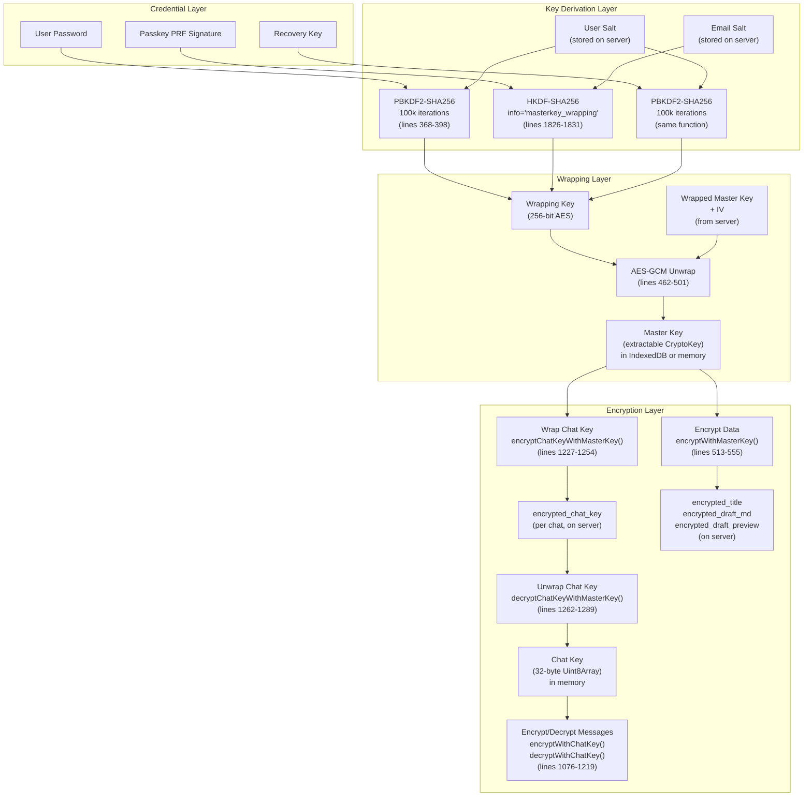
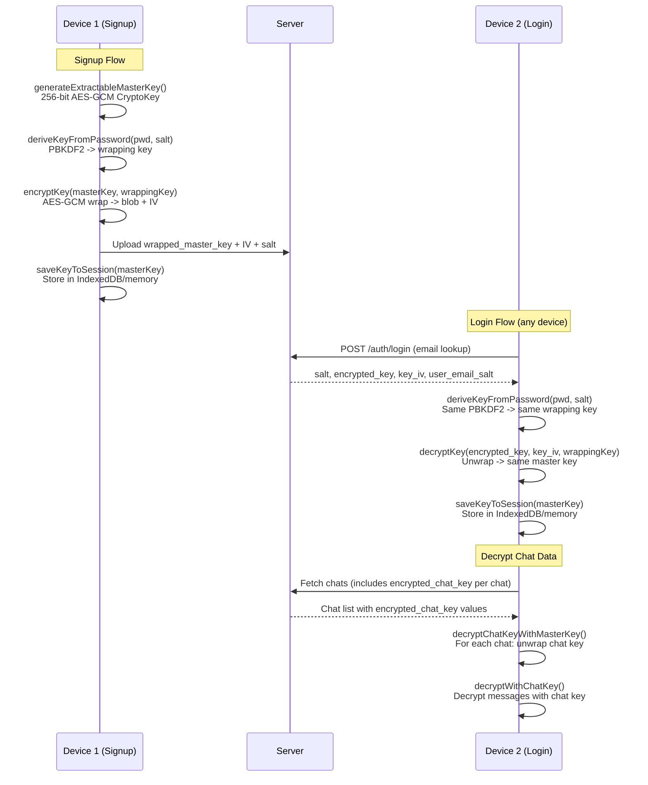

<!--
  Master Key Lifecycle - Derivation and Cross-Device Distribution

  Documents the complete master key derivation chain from user credential
  to content encryption, and traces the cross-device key distribution
  mechanism through the login flow. This is the critical reference for
  understanding how a single master key is shared across all of a user's
  devices without the server ever seeing it in plaintext.

  Source of truth: cryptoService.ts, cryptoKeyStorage.ts, Login.svelte,
  PasswordAndTfaOtp.svelte, passkeys.md, signup-and-auth.md
-->

---
status: active
last_verified: 2026-03-26
key_files:
  - frontend/packages/ui/src/services/cryptoService.ts
  - frontend/packages/ui/src/services/cryptoKeyStorage.ts
  - frontend/packages/ui/src/components/Login.svelte
  - frontend/packages/ui/src/components/PasswordAndTfaOtp.svelte
  - frontend/packages/ui/src/components/EnterRecoveryKey.svelte
  - docs/architecture/core/passkeys.md
  - docs/architecture/core/signup-and-auth.md
---

# Master Key Lifecycle

> The full derivation chain from user credential to encrypted content, and how the same master key is distributed to every device via server-stored wrapped key blobs.

## Overview

The master key is the root of all client-side encryption in OpenMates. Every encrypted field -- chat messages, titles, drafts, settings -- is ultimately protected by a single 256-bit AES-GCM key that never leaves the user's devices in plaintext.

**Key property:** There is exactly one master key per user account, created at signup. All subsequent logins on any device recover this same key by downloading the server-stored wrapped blob and unwrapping it with a credential-derived wrapping key.

## Full Derivation Chain



## Part A: Master Key Derivation Path

### Step 1: Credential to Wrapping Key

Three authentication methods produce the same result: a 256-bit wrapping key.

#### Password Path (PBKDF2)

**Function:** `deriveKeyFromPassword()` -- cryptoService.ts lines 368-398

| Parameter | Value |
|-----------|-------|
| Algorithm | PBKDF2 |
| Hash | SHA-256 |
| Iterations | 100,000 (`PBKDF2_ITERATIONS` constant, line 46) |
| Salt | 16-byte random salt, unique per user, base64-stored on server |
| Output | 256 bits (32 bytes) via `crypto.subtle.deriveBits()` |

**Call sites:**
- `PasswordAndTfaOtp.svelte` line 584 -- password login
- `EnterBackupCode.svelte` line 193 -- backup code login (uses password)
- `PasswordBottomContent.svelte` line 133 -- signup
- `SettingsPassword.svelte` line 271 -- password change
- `AccountRecovery.svelte` line 455 -- account recovery with new password

#### Passkey PRF Path (HKDF)

**Function:** `deriveWrappingKeyFromPRF()` -- cryptoService.ts lines 1826-1831

| Parameter | Value |
|-----------|-------|
| Algorithm | HKDF |
| Hash | SHA-256 |
| Salt | `user_email_salt` (base64-stored on server) |
| Info | `"masterkey_wrapping"` (hardcoded string) |
| IKM | PRF signature from WebAuthn authenticator |
| Output | 32 bytes |

The PRF signature is deterministic: the same passkey on any device produces the same signature when given the same eval salt (`SHA256(rp_id)[:32]`). This makes passkey-based wrapping key derivation reproducible across devices.

**Call sites:**
- `Login.svelte` lines 860, 1413 -- passkey login (two code paths for initial and re-registration)

#### Recovery Key Path (PBKDF2)

Uses the same `deriveKeyFromPassword()` function with the recovery key string as the "password" input and the user's salt.

**Call sites:**
- `EnterRecoveryKey.svelte` line 177 -- recovery key login
- `RecoveryKeyTopContent.svelte` line 137 -- recovery key generation during signup
- `SettingsRecoveryKey.svelte` line 252 -- recovery key rotation

### Step 2: Master Key Generation (Signup Only)

**Function:** `generateExtractableMasterKey()` -- cryptoService.ts lines 134-140

```
crypto.subtle.generateKey(
    { name: "AES-GCM", length: 256 },
    true,    // extractable -- allows wrapping/export
    ["encrypt", "decrypt"]
)
```

Returns a CryptoKey object. The `extractable: true` flag is critical -- it allows the key to be wrapped (encrypted) with the wrapping key for server storage, and later re-exported for recovery key wrapping.

**This function is called only during signup.** On every subsequent login, the master key is recovered by unwrapping the server-stored blob (see Step 3).

### Step 3: Wrapping and Unwrapping

#### Wrapping (Signup / Key Rotation)

**Function:** `encryptKey()` -- cryptoService.ts lines 422-452

1. Import wrapping key bytes as a non-extractable CryptoKey with `wrapKey` usage
2. Generate 12-byte random IV
3. `crypto.subtle.wrapKey("raw", masterKey, wrappingKey, { name: "AES-GCM", iv })`
4. Return `{ wrapped: base64(wrappedKeyBlob), iv: base64(iv) }`

The server stores `wrapped` as `encrypted_key` (or `encrypted_master_key`) and `iv` as `key_iv` on the user record.

#### Unwrapping (Every Login)

**Function:** `decryptKey()` -- cryptoService.ts lines 462-501

1. Import wrapping key bytes as a non-extractable CryptoKey with `unwrapKey` usage
2. `crypto.subtle.unwrapKey("raw", wrappedBlob, wrappingKey, { name: "AES-GCM", iv }, { name: "AES-GCM" }, true, ["encrypt", "decrypt"])`
3. Returns an extractable CryptoKey (or `null` on failure)

The `true` (extractable) flag on unwrapping is intentional: it allows the recovered master key to be re-wrapped with a different credential (e.g., adding a recovery key or passkey).

### Step 4: Master Key Storage on Device

**Function:** `saveKeyToSession()` -- cryptoService.ts lines 156-169

Delegates to `saveMasterKey()` in cryptoKeyStorage.ts (lines 77-118):

| `stayLoggedIn` | Storage | Persistence | Cleanup |
|----------------|---------|-------------|---------|
| `false` (default) | Module-level variable `memoryMasterKey` | Page lifetime only | Auto-cleared on page close |
| `true` | IndexedDB (`openmates_crypto` database, `keys` store, key `master_key`) + memory cache | Survives page reloads | Explicit logout or `clearMasterKey()` |

When `stayLoggedIn=true`, `requestPersistentStorage()` (cryptoKeyStorage.ts lines 329-360) calls `navigator.storage.persist()` to prevent iOS Safari from evicting the IndexedDB data.

**Retrieval:** `getKeyFromStorage()` (cryptoService.ts lines 323-325) delegates to `getMasterKey()` (cryptoKeyStorage.ts lines 162-191):
1. Check memory cache first (`memoryMasterKey`)
2. If null, read from IndexedDB and cache in memory
3. Defense-in-depth: if `clear_master_key_on_unload` flag is set, clear IndexedDB first

### Step 5: Master Key to Chat Key

#### Wrapping a Chat Key

**Function:** `encryptChatKeyWithMasterKey()` -- cryptoService.ts lines 1227-1254

1. Get master CryptoKey from storage via `getKeyFromStorage()`
2. Generate 12-byte random IV
3. `crypto.subtle.encrypt({ name: "AES-GCM", iv }, masterKey, chatKeyBytes)`
4. Concatenate `[IV 12B][ciphertext 48B]` and base64 encode
5. Result stored as `encrypted_chat_key` in the chats collection

This produces a **Format C** ciphertext (see [encryption-formats.md](./encryption-formats.md)).

#### Unwrapping a Chat Key

**Function:** `decryptChatKeyWithMasterKey()` -- cryptoService.ts lines 1262-1289

1. Get master CryptoKey (or use prefetched key for batch operations)
2. Base64 decode, split at offset 12: IV = bytes 0-12, ciphertext = bytes 12+
3. `crypto.subtle.decrypt({ name: "AES-GCM", iv }, masterKey, ciphertext)`
4. Return raw 32-byte Uint8Array (the chat key)

### Step 6: Chat Key to Content Encryption

**Functions:** `encryptWithChatKey()` / `decryptWithChatKey()` -- cryptoService.ts lines 1076-1219

The chat key (32-byte Uint8Array) encrypts individual message fields using the **Format A** (OM-header) layout. See [encryption-formats.md](./encryption-formats.md) for byte-level details.

Chat keys are managed by `ChatKeyManager` (single source of truth for key state), which handles:
- Key creation for new chats (`_generateChatKeyInternal()`, cryptoService.ts lines 1015-1017)
- Key caching with provenance tracking
- Batch key loading during sync

---

## Part B: Cross-Device Distribution

### Answer to the Critical Question

**When a second device logs in with the same password/passkey, does it derive the same wrapping key?**

**Yes.** Both PBKDF2 (password) and HKDF (passkey PRF) are deterministic. Given the same input (password + salt, or PRF signature + email salt), they produce the same wrapping key on every device.

**Does it download and unwrap the same master key?**

**Yes.** Every login flow -- password, passkey, and recovery key -- follows the same pattern:
1. Server returns the wrapped master key blob (`encrypted_key` / `encrypted_master_key`) and its IV (`key_iv`)
2. Client derives the wrapping key from the credential
3. Client calls `decryptKey()` to unwrap the blob, recovering the original master key

**Does it generate a fresh master key?**

**No.** `generateExtractableMasterKey()` is only called during signup (in `PasswordBottomContent.svelte` line 133 and the passkey registration flow). Login flows never call this function.

### Cross-Device Sequence Diagram



### What Works Today

1. **Password login on a new device:** Server returns `salt` + `encrypted_key` + `key_iv`. Client derives wrapping key via PBKDF2 and unwraps the same master key. Verified in `PasswordAndTfaOtp.svelte` lines 574-614.

2. **Passkey login on a new device:** Server returns `user_email_salt` + `encrypted_master_key` + `key_iv`. Client derives wrapping key via `HKDF(PRF_signature, email_salt, "masterkey_wrapping")` and unwraps. Verified in `Login.svelte` lines 859-891.

3. **Recovery key login:** Same PBKDF2 path as password. Verified in `EnterRecoveryKey.svelte` lines 170-210.

4. **Multiple wrapped copies:** When a user has both a password and a passkey, the server stores separate wrapped master key blobs for each method. Each wrapping key is derived from a different credential but wraps the same master key.

5. **Chat key sync:** Once the master key is available on any device, all `encrypted_chat_key` values can be decrypted. Chat keys are synced via Directus (downloaded on login, updated via WebSocket during active sessions).

### Architectural Gap Analysis

The cross-device distribution mechanism is **architecturally sound** -- there is no fundamental gap in the design. The master key is created once, wrapped per credential method, and unwrapped identically on every device.

However, the implementation has practical failure modes that produce the observed "content decryption failed" errors:

#### Failure Mode 1: IndexedDB Eviction (iOS Safari)

When `stayLoggedIn=true` on iOS Safari, the browser can evict IndexedDB data under storage pressure. The master key is lost, and the user must log in again. During the gap between eviction and re-login, any background sync or service worker activity will fail to decrypt.

**Mitigation in code:** `navigator.storage.persist()` request (cryptoKeyStorage.ts line 345), `STAY_LOGGED_IN_FLAG` in localStorage for notification differentiation (line 37).

#### Failure Mode 2: Memory Key Loss on Page Reload

When `stayLoggedIn=false`, the master key is in memory only (`memoryMasterKey`). A page reload, navigation, or tab crash loses the key. The user must log in again.

**This is by design** -- not a bug. But it means any code path that assumes the master key is always available will fail for `stayLoggedIn=false` users after a page reload.

#### Failure Mode 3: Race Condition During Key Loading

When multiple chat keys are being decrypted concurrently (e.g., during initial sync after login), concurrent calls to `getMasterKey()` can race with IndexedDB access. The memory cache in `getMasterKey()` (cryptoKeyStorage.ts line 188) mitigates this by caching the first successful read.

#### Failure Mode 4: Stale Wrapped Keys After Credential Change

When a user changes their password, the master key must be re-wrapped with the new wrapping key. If this re-wrapping fails or is interrupted, the server stores a wrapped blob that cannot be unwrapped by the new password. The old password's wrapped blob may still work, but the new one does not.

**This is handled** in `SettingsPassword.svelte` -- the password change flow unwraps with the old password, then re-wraps with the new one in a single transaction.

### What Would Need to Change in Phase 3

The master key distribution itself does not need architectural changes. The "content decryption failed" errors are caused by:

1. **Chat key management issues** (ChatKeyManager race conditions, stale keys in cache)
2. **Sync timing issues** (new messages arriving before chat key is loaded)
3. **Key fingerprint mismatches** (correct master key, wrong chat key selected for a chat)

Phase 3 should focus on:
- Ensuring ChatKeyManager is the single gatekeeper for all chat key access
- Adding retry logic with re-derivation when decryption fails
- Ensuring key loading completes before message decryption begins (sync ordering)

---

## Cryptographic Parameters Summary

| Parameter | Value | Defined In |
|-----------|-------|------------|
| Master key algorithm | AES-GCM | cryptoService.ts line 136 |
| Master key length | 256 bits | `AES_KEY_LENGTH` constant, line 44 |
| Master key extractable | `true` | cryptoService.ts line 137 |
| PBKDF2 hash | SHA-256 | cryptoService.ts line 389 |
| PBKDF2 iterations | 100,000 | `PBKDF2_ITERATIONS` constant, line 46 |
| PBKDF2 output | 256 bits | cryptoService.ts line 392 |
| HKDF hash | SHA-256 | Via `hkdf()` helper |
| HKDF info | `"masterkey_wrapping"` | cryptoService.ts line 1830 |
| AES-GCM IV length | 12 bytes | `AES_IV_LENGTH` constant, line 45 |
| Chat key length | 32 bytes (256 bits) | cryptoService.ts line 1016 |
| Salt length | 16 bytes | `generateSalt(16)`, line 108 |

## Related Docs

- [Encryption Formats](./encryption-formats.md) -- byte-level ciphertext format documentation
- [Zero-Knowledge Storage](./zero-knowledge-storage.md) -- encryption tiers and key hierarchy
- [Signup & Login](./signup-and-auth.md) -- authentication flow context
- [Passkeys](./passkeys.md) -- PRF-based key wrapping details
- [Chat Encryption Implementation](./chat-encryption-implementation.md) -- field-level encryption details
