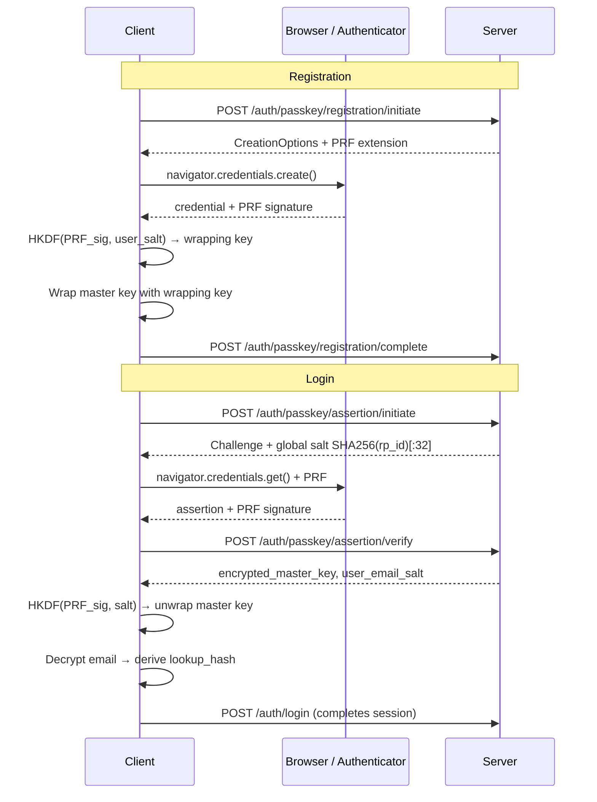

# Passkeys

> Passwordless WebAuthn (FIDO2) authentication using the PRF extension to maintain zero-knowledge encryption. PRF is mandatory -- without it, passkey login would leak key material.

## Why This Exists

- Passkeys are faster and more secure than passwords, but a naive implementation leaks the `credential_id` (public), which could be used to derive wrapping keys if the server is breached
- The PRF extension produces a deterministic signature from the passkey's private key, giving us secret key material equivalent to a password
- A global salt (`SHA256(rp_id)[:32]`) enables true passwordless login: no email lookup needed before authentication

## How It Works

### PRF-Based Key Wrapping

1. Client uses global salt `prf_eval_first = SHA256(rp_id)[:32]` for the PRF extension
2. Authenticator signs the salt with its private key, producing a deterministic PRF signature unique per passkey
3. Wrapping key derived via `HKDF(PRF_signature, user_email_salt, "masterkey_wrapping")` -- see `deriveWrappingKeyFromPRF()` in [cryptoService.ts](../../frontend/packages/ui/src/services/cryptoService.ts)
4. Master key encrypted with wrapping key and stored on server as `encrypted_master_key`
5. On login, same global salt produces the same PRF signature, recovering the wrapping key deterministically

The global salt approach solves the chicken-and-egg problem: the server can send `prf_eval_first` without knowing user identity.

### Registration Flow

1. `POST /auth/passkey/registration/initiate` generates WebAuthn `PublicKeyCredentialCreationOptions` with PRF extension
2. Browser creates credential; frontend checks PRF support. If unsupported: registration blocked, user offered password+2FA
3. `POST /auth/passkey/registration/complete` verifies attestation via `py_webauthn`, stores passkey in `user_passkeys` table
4. Client wraps master key with PRF-derived key, uploads wrapped key

See [SecureAccountTopContent.svelte](../../frontend/packages/ui/src/components/signup/steps/secureaccount/SecureAccountTopContent.svelte) for PRF validation during signup, [PasskeyRegistrationBottomContent.svelte](../../frontend/packages/ui/src/components/signup/steps/passkey/PasskeyRegistrationBottomContent.svelte) for registration UI.

### Login Flow

1. `POST /auth/passkey/assertion/initiate` generates challenge with PRF extension using global salt
2. User authenticates via biometric/PIN
3. `POST /auth/passkey/assertion/verify` verifies signature via `py_webauthn`, identifies user by `credential_id` -> `user_id` (via `user_passkeys`), starts cache warming
4. Server returns `encrypted_email_with_master_key`, `encrypted_master_key`, `user_email_salt`
5. Client derives wrapping key from PRF, unwraps master key, decrypts email
6. Client derives `lookup_hash = SHA256(PRF_signature + user_email_salt)` and completes auth via `POST /auth/login`
7. Frontend waits for cache warming (WebSocket sync status) before loading main interface

See [Login.svelte](../../frontend/packages/ui/src/components/Login.svelte) and [auth_passkey.py](../../backend/core/api/app/routes/auth_routes/auth_passkey.py).

### Email Retrieval for Passwordless Login

The user does not enter their email during passkey login, but the server needs it for notifications:

1. During signup: email encrypted with master key -> stored as `encrypted_email_with_master_key`
2. During login: server returns this field; client decrypts with master key (derived from PRF)
3. Client derives `email_encryption_key = SHA256(email + user_email_salt)` and sends it to server for notification decryption

## Data Structures

### `user_passkeys` Table

| Column | Type | Purpose |
|--------|------|---------|
| `hashed_user_id` | string (indexed) | Privacy-preserving lookup |
| `user_id` | string | Direct reverse lookup |
| `credential_id` | string (unique) | Base64 WebAuthn credential ID |
| `public_key_cose` | string | Primary format for `py_webauthn` verification |
| `public_key_jwk` | json | Backward compatibility |
| `aaguid` | string | Authenticator identifier |
| `sign_count` | integer | Cloned authenticator detection |
| `encrypted_device_name` | string | User-friendly name (encrypted) |
| `registered_at`, `last_used_at` | timestamp | Audit |

Schema: [user_passkeys.yml](../../backend/core/directus/schemas/user_passkeys.yml). The `prf_eval_first` is no longer stored per user -- the global salt approach makes it unnecessary.

### Users Table Addition

- `encrypted_email_with_master_key` -- email encrypted with master key for passwordless login retrieval

## Security Considerations

- **PRF mandatory:** non-PRF passkey registration is never allowed. Detected via `navigator.credentials.create()` with PRF extension
- **Sign count validation:** if `sign_count` does not increase, the authenticator may be cloned; flagged as suspicious
- **Challenge freshness:** new challenge per registration/assertion, expires after 5 minutes. See challenge caching in [auth_passkey.py](../../backend/core/api/app/routes/auth_routes/auth_passkey.py)
- **Cache warming:** starts immediately after passkey verification (async), ensuring instant sync when authentication completes

### Device Support

PRF is supported on: macOS (iCloud Keychain, security keys), iOS (Face ID/Touch ID), Android (Google Password Manager), Windows (Windows Hello). Not supported on some older devices and security keys.

## Edge Cases

- **Browser lacks WebAuthn:** error message shown, forced to password-only
- **User loses passkey:** recovery key is primary recovery method; email-based account reset as last resort (see [Account Recovery](./account-recovery.md))
- **Passkey login fails:** fall back to password login if password exists
- **Cloned authenticator:** flag account, require 2FA, send security alert

## Related Docs

- [Signup & Login](./signup-and-auth.md) -- full authentication flow context
- [Zero-Knowledge Storage](./zero-knowledge-storage.md) -- master key wrapping details
- [Account Recovery](./account-recovery.md) -- recovery when passkey is lost
- [Security Architecture](./security.md) -- overall security model
