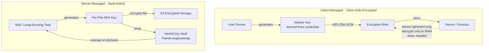
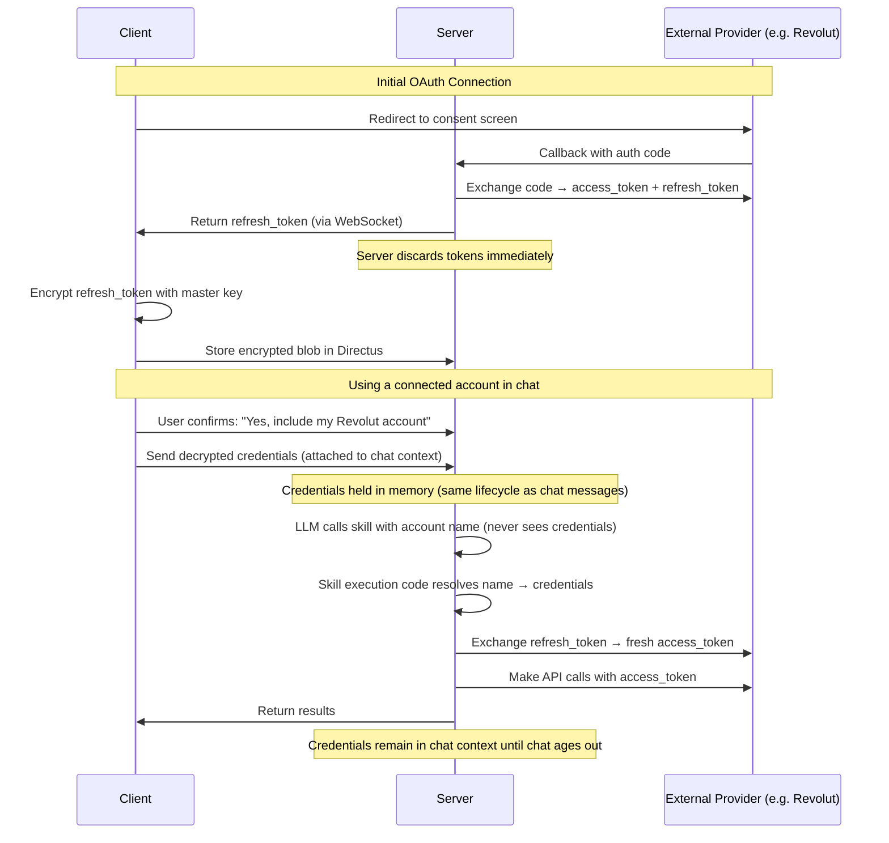

# Security Architecture

> Client-side encryption with in-memory-only server processing. The server never *persists* plaintext passwords, emails, or user content — everything on disk, in caches, and in backups is ciphertext. When the server needs to read content (to run an AI response, render an invoice, or deliver a reminder), decryption happens transiently in process memory and is discarded. This is **not** end-to-end encryption. See [encryption-architecture.md](./encryption-architecture.md) for the full posture.

## Why This Exists

- User data at rest must remain unreadable even if the database, caches, or backups are fully compromised
- Third-party data requests targeting at-rest storage cannot yield plaintext — ciphertext on disk requires the user's key, which is derived from their credential and wrapped inside HashiCorp Vault
- AI features (image gen, long-running tasks) need server-side processing → the server decrypts in memory on demand but never writes plaintext to disk, logs, or traces
- Multiple login methods (password, passkey, recovery key) each need their own path to the master key

## Two Encryption Tiers



### Client-Managed (Client-Side Encrypted)

- **Used for:** chat messages, app data, profile settings, user email addresses
- Master key is derived from the user's credential on their device; the raw key is never sent to the server
- Server stores only ciphertext on disk, in Redis caches, and in backups. It *can* decrypt transiently in memory when the user invokes an AI response, but the plaintext is never persisted.
- Implementation: [cryptoService.ts](../../frontend/packages/ui/src/services/cryptoService.ts), [cryptoKeyStorage.ts](../../frontend/packages/ui/src/services/cryptoKeyStorage.ts)
- **Limitation:** background processing without user interaction would require a different key-release path (not currently implemented)

### Server-Managed (Vault-Hybrid)

- **Used for:** server-generated files (images, PDFs, videos), long-running task outputs
- AES key wrapped by HashiCorp Vault using user-specific key ID
- Server can temporarily unwrap to process (e.g., AI modifying a generated image)
- Implementation: [encryption.py](../../backend/core/api/app/utils/encryption.py), [vault/](../../backend/core/vault/)
- **Why needed:** long-running tasks complete while user may be offline — can't wait for client to encrypt

## Zero-Knowledge Password Verification

> Note: "zero-knowledge" here refers specifically to the password verification flow — we verify that you know your password without ever learning it. It does NOT mean the server cannot decrypt your stored content. See [encryption-architecture.md](./encryption-architecture.md).

- Client derives `lookup_hash = SHA256(password + salt)` → sends only hash, never the plaintext password
- Server locates user by `hashed_email = SHA256(email)` → the plaintext email is not used as a direct lookup key (an encrypted copy is still stored for invoicing / transactional mail)
- Server verifies lookup_hash → the plaintext password is never stored
- Client decrypts master key locally to verify authentication
- Implementation: [auth_login.py](../../backend/core/api/app/routes/auth_routes/auth_login.py) (server), [cryptoService.ts](../../frontend/packages/ui/src/services/cryptoService.ts) (client)

### Password + 2FA Requirement

- Password auth **always requires 2FA** — set up together, can't exist independently
- If user cancels 2FA setup → password not saved
- Implementation: [SettingsPassword.svelte](../../frontend/packages/ui/src/components/settings/security/SettingsPassword.svelte)

## S3 File Access

### Client Access (Presigned URLs)

- `GET /v1/embeds/presigned-url` → 15-min presigned URL → client fetches encrypted blob → decrypts with local AES key
- On 403 (expired): auto-retry with fresh URL; in-memory blob cache prevents redundant fetches
- Implementation: [embeds_api.py](../../backend/core/api/app/routes/embeds_api.py) (endpoint), [presignedUrlService.ts](../../frontend/packages/ui/src/services/presignedUrlService.ts) (client retry logic)

### Skill/Task Access (Internal API)

- `GET /internal/s3/download?s3_key=...` → server AWS credentials → Vault unwrap → decrypt in memory
- Internal-only endpoint, not exposed through public API gateway
- Implementation: [internal_api.py](../../backend/core/api/app/routes/internal_api.py)

### Audio Transcription

- Client sends `vault_wrapped_aes_key` (never plaintext AES key)
- `apps_api.py` resolves `vault_key_id` from cache/Directus → skill unwraps via Vault
- Implementation: [transcribe_skill.py](../../backend/apps/audio/skills/transcribe_skill.py)

> Profile images use separate public-read bucket — unencrypted thumbnails, no sensitive data

## Edge Cases

- **At-rest compromise (cold DB / backup / cache dump):** attackers get only ciphertext and hashes — no access to passwords, email plaintext, chat content, or master keys without a user credential
- **Live-process compromise:** an attacker with root on a running API host could in principle read plaintext that is transiently in RAM during AI processing. This is the honest limit of the posture and is why we rely on defense-in-depth (Vault, OTel redaction, minimal blast radius) for live hosts
- **Presigned URL expiry:** 403 → auto-retry in [presignedUrlService.ts](../../frontend/packages/ui/src/services/presignedUrlService.ts)
- **Stale vault keys in cache:** decryption fails → request fresh data from client → re-cache. Handled in [message_received_handler.py](../../backend/core/api/app/routes/handlers/websocket_handlers/message_received_handler.py)
- **Multiple login methods:** each wraps the same master key differently (password-derived, passkey PRF, recovery key). See [passkeys.md](./passkeys.md), [account-recovery.md](./account-recovery.md)

## Security Controls Summary

| Category | Status | Documentation |
|----------|--------|---------------|
| Authentication | Zero-knowledge password verification, 2FA mandatory | [Signup & Login](./signup-and-auth.md) |
| Encryption | AES-256-GCM, dual-mode | See tiers above |
| S3 Access | Private bucket + presigned URLs (15-min TTL) | See section above |
| Email Privacy | Client-side encrypted storage | [Email Privacy](../privacy/email-privacy.md) |
| PII Anonymization | Client-side detection, placeholder replacement | [PII Protection](../privacy/pii-protection.md) |
| Passkey Support | WebAuthn with PRF extension | [Passkeys](./passkeys.md) |
| Device Management | Planned: QR login, remote logout | [Device Sessions](../data/device-sessions.md) |

## Connected Accounts (Planned)

> **Status:** Planned — part of Finance app milestone. Reusable pattern for any app needing user-level provider auth.

Apps can connect to external services on a per-user basis (e.g., Revolut Business, InvoiceNinja). Connected account credentials are client-side encrypted by default and follow the same lifecycle as chat messages and other settings/memories.

### How It Fits the Existing Memories Pipeline

Connected accounts piggyback on the existing settings/memories infrastructure (`preprocessor.py` → permission request → `app_settings_memories_confirmed_handler.py` → Redis cache → `main_processor.py`). The only difference: **credentials are stripped before LLM context**.

**Existing flow (settings/memories):**
1. Client sends metadata (available keys) with each message
2. Preprocessing LLM suggests which keys to load
3. If not cached → permission request to user → user confirms → client decrypts & sends cleartext
4. Server Vault-encrypts cleartext → caches in Redis (chat-scoped, 24h TTL)
5. Main processor decrypts from cache → passes full content to LLM

**Connected accounts flow (same pipeline, one difference at step 5):**
1. Client sends metadata: `"finance-connected_accounts"` in available keys
2. Preprocessing LLM suggests loading connected accounts
3. If not cached → permission request → user confirms → client decrypts & sends full account data (names + credentials)
4. Server Vault-encrypts → caches in Redis (same chat-scoped, 24h TTL)
5. Main processor decrypts from cache → **strips credentials** → passes only display names + status to LLM
6. LLM calls skill: "use Review skill with account Revolut Business EUR"
7. Skill execution code (not LLM) resolves "Revolut Business EUR" → fetches full credentials from same cache → makes API calls

### LLM Visibility Model

| Stage | What LLM sees | What is hidden |
|-------|--------------|----------------|
| **Preprocessor metadata** (always) | "User has N connected accounts for Finance app" | Account names, provider types, all credentials |
| **After user confirms** (main processor) | Account display names, status, scopes | All credentials (tokens, URLs, keys) — stripped before LLM context |
| **Skill execution** (application code, not LLM) | N/A — resolves name → full credentials from cache | N/A |

The LLM **never** sees credentials at any stage. When the LLM calls a skill and specifies a connected account by name, the skill execution layer (application code) resolves the name to credentials from the same Vault-encrypted Redis cache.

### Credential Lifecycle

Credentials follow the **same lifecycle as chat messages and other settings/memories**:

1. Client decrypts credentials and submits them when user confirms access in a chat
2. Server Vault-encrypts and caches in Redis — same chat-scoped, 24h TTL as other settings/memories
3. When the chat ages out of the recent window (or 24h TTL expires), cached credentials are evicted
4. Credentials are never persisted server-side in plaintext — only E2E encrypted blobs in Directus

### Default: Client-Side Encrypted



- **Credentials stored:** Client-side encrypted in Directus as `connected_accounts` memory field (same encryption as chat messages)
- **Server access:** Credentials submitted per-chat when user confirms, held in memory with same lifecycle as chat messages, discarded when chat is no longer recent
- **At-rest compromise:** Attacker reading a cold database, cache dump, or backup gets only ciphertext — without a user credential the external accounts cannot be reached
- **Token types supported:**
  - OAuth refresh tokens (Revolut Business) — server exchanges for short-lived access token on each skill call
  - API keys/tokens (InvoiceNinja) — used directly by skill execution code

### Upgrade: Vault-Hybrid (For Workflows)

When a user enables background features (scheduled reports, webhook-triggered actions, reminders), the system upgrades credential storage:

- User is informed: "To run this workflow while you're offline, we need to store your credentials server-side encrypted"
- On consent: credentials are additionally stored in Vault under `kv/data/users/{user_id_hash}/providers/{provider_id}`
- Server can then access credentials for background tasks without user being online
- User can revoke server-side storage at any time → falls back to client-only mode

### Connected Accounts Memory Field Schema

```yaml
# In app.yml settings_and_memories
- id: connected_accounts
  type: list
  schema:
    properties:
      provider_id:    { type: string }      # e.g. "revolut_business", "invoiceninja"
      display_name:   { type: string }      # e.g. "Revolut Business (EUR)" — visible to LLM only after user confirms
      connected_at:   { type: integer }     # Unix timestamp
      scopes:         { type: string }      # e.g. "READ,WRITE,PAY"
      status:         { type: string, enum: [connected, expired, revoked] }
      credentials:    { type: string }      # E2E encrypted JSON blob — NEVER visible to LLM
      vault_enabled:  { type: boolean }     # true if user consented to server-side storage for workflows
```

### Provider-Specific Connection Flows

| Provider | Auth Method | Credentials Stored (E2E) | Notes |
|----------|------------|--------------------------|-------|
| Revolut Business | OAuth 2.0 | `refresh_token`, `client_id` | Auth code exchanged server-side, refresh_token handed to client for encryption |
| InvoiceNinja | API Token | `api_token`, `instance_url` | User pastes token + URL in settings UI |

### Security Properties

- **Default posture:** Client-side encrypted — server cannot access external accounts without active user participation in an active chat session
- **LLM isolation:** LLM sees account names only after user confirms; credentials are resolved by application code, never in LLM context
- **Chat-scoped retention:** Credentials in server memory follow the same lifecycle as chat messages — discarded when chat is no longer recent
- **Upgrade path:** Vault-hybrid only with explicit user consent, only for features that require offline/background access
- **Revocation:** User can disconnect at any time → encrypted blob deleted, Vault entry removed if present

## Design Assumptions

- **At-rest compromise is assumed possible** → all user content and credentials are stored as ciphertext, with keys wrapped in HashiCorp Vault
- **Legal process targeting at-rest data** → the relevant storage tier (database, backups, caches) holds only ciphertext; serving decrypted content requires live access to user credentials and Vault, not just a cold dump. We do not claim this makes us unable to comply with valid legal orders that target live processing.
- **Prompt injection** → defense-in-depth, minimize data exposure. See [Prompt Injection](../privacy/prompt-injection.md)

<!-- TODO: screenshot (1000x400) — security settings page showing encryption status -->

## Improvement Opportunities

> **Improvement opportunity:** Device management (QR login, remote logout) — currently planned, not implemented
> **Improvement opportunity:** Encrypted search indexes for client-side full-text search without leaking data to server

## Related Docs

- [Signup & Login](./signup-and-auth.md) — authentication flows
- [Client-Side Encryption](./client-side-encryption.md) — client-side encryption details
- [Passkeys](./passkeys.md) — WebAuthn implementation
- [Email Privacy](../privacy/email-privacy.md) — email encryption
- [Device Sessions](../data/device-sessions.md) — device management
- [Embeds](../messaging/embeds.md) — embed-level encryption and key wrappers
- [Message Processing](../messaging/message-processing.md) — dual-cache (vault vs. client encryption)
