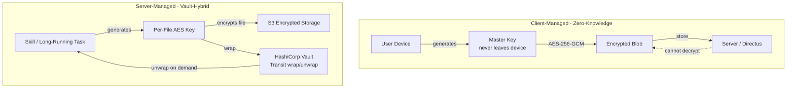

# Security Architecture

> Zero-knowledge architecture where the server never sees passwords, emails, or encryption keys. Dual-mode encryption balances maximum privacy with AI-powered features.

## Why This Exists

- User data must remain private even if server is fully compromised
- Government data requests should be unanswerable — zero-knowledge means we can't decrypt
- AI features (image gen, long-running tasks) need server-side processing → requires controlled exception to pure client-side encryption
- Multiple login methods (password, passkey, recovery key) each need their own path to the master key

## Two Encryption Tiers

### Client-Managed (Zero-Knowledge)

- **Used for:** chat messages, app data, profile settings, user email addresses
- Key lives on user's device — never sent to server
- Server stores encrypted blobs it cannot decrypt
- Implementation: [cryptoService.ts](../../frontend/packages/ui/src/services/cryptoService.ts), [cryptoKeyStorage.ts](../../frontend/packages/ui/src/services/cryptoKeyStorage.ts)
- **Limitation:** server can't process this data in background (user must be online)

### Server-Managed (Vault-Hybrid)

- **Used for:** server-generated files (images, PDFs, videos), long-running task outputs
- AES key wrapped by HashiCorp Vault using user-specific key ID
- Server can temporarily unwrap to process (e.g., AI modifying a generated image)
- Implementation: [encryption.py](../../backend/core/api/app/utils/encryption.py), [vault/](../../backend/core/vault/)
- **Why needed:** long-running tasks complete while user may be offline — can't wait for client to encrypt

## Zero-Knowledge Authentication

- Client derives `lookup_hash = SHA256(password + salt)` → sends only hash, never plaintext
- Server locates user by `hashed_email = SHA256(email)` → never sees real email
- Server verifies lookup_hash → never sees or stores plaintext password
- Client decrypts master key locally to verify authentication
- Implementation: [auth_login.py](../../backend/core/api/app/routes/auth_routes/auth_login.py) (server), [cryptoService.ts](../../frontend/packages/ui/src/services/cryptoService.ts) (client)

### Password + 2FA Requirement

- Password auth **always requires 2FA** — set up together, can't exist independently
- If user cancels 2FA setup → password not saved
- Implementation: [SettingsPassword.svelte](../../frontend/packages/ui/src/components/settings/security/SettingsPassword.svelte)

## S3 File Access

### Client Access (Presigned URLs)

- `GET /v1/embeds/presigned-url` → 15-min presigned URL → client fetches encrypted blob → decrypts with local AES key
- On 403 (expired): auto-retry with fresh URL; in-memory blob cache prevents redundant fetches
- Implementation: [embeds_api.py](../../backend/core/api/app/routes/embeds_api.py) (endpoint), [presignedUrlService.ts](../../frontend/packages/ui/src/services/presignedUrlService.ts) (client retry logic)

### Skill/Task Access (Internal API)

- `GET /internal/s3/download?s3_key=...` → server AWS credentials → Vault unwrap → decrypt in memory
- Internal-only endpoint, not exposed through public API gateway
- Implementation: [internal_api.py](../../backend/core/api/app/routes/internal_api.py)

### Audio Transcription

- Client sends `vault_wrapped_aes_key` (never plaintext AES key)
- `apps_api.py` resolves `vault_key_id` from cache/Directus → skill unwraps via Vault
- Implementation: [transcribe_skill.py](../../backend/apps/audio/skills/transcribe_skill.py)

> Profile images use separate public-read bucket — unencrypted thumbnails, no sensitive data

## Edge Cases

- **Server compromise:** attackers get only hashes — no access to passwords, emails, chat content, or master keys
- **Presigned URL expiry:** 403 → auto-retry in [presignedUrlService.ts](../../frontend/packages/ui/src/services/presignedUrlService.ts)
- **Stale vault keys in cache:** decryption fails → request fresh data from client → re-cache. Handled in [message_received_handler.py](../../backend/core/api/app/routes/handlers/websocket_handlers/message_received_handler.py)
- **Multiple login methods:** each wraps the same master key differently (password-derived, passkey PRF, recovery key). See [passkeys.md](./passkeys.md), [account-recovery.md](./account-recovery.md)

## Security Controls Summary

| Category | Status | Documentation |
|----------|--------|---------------|
| Authentication | Zero-knowledge login, 2FA mandatory | [Signup & Login](./signup-and-auth.md) |
| Encryption | AES-256-GCM, dual-mode | See tiers above |
| S3 Access | Private bucket + presigned URLs (15-min TTL) | See section above |
| Email Privacy | Client-side encrypted storage | [Email Privacy](../privacy/email-privacy.md) |
| PII Anonymization | Client-side detection, placeholder replacement | [PII Protection](../privacy/pii-protection.md) |
| Passkey Support | WebAuthn with PRF extension | [Passkeys](./passkeys.md) |
| Device Management | Planned: QR login, remote logout | [Device Sessions](../data/device-sessions.md) |

## Design Assumptions

- **Servers will be compromised** → all user data encrypted with user-controlled keys
- **Government data requests** → zero-knowledge means we can't decrypt even under legal pressure
- **Prompt injection** → defense-in-depth, minimize data exposure. See [Prompt Injection](../privacy/prompt-injection.md)

<!-- TODO: screenshot (1000x400) — security settings page showing encryption status -->

## Improvement Opportunities

> **Improvement opportunity:** Device management (QR login, remote logout) — currently planned, not implemented
> **Improvement opportunity:** Encrypted search indexes for client-side full-text search without leaking data to server

## Related Docs

- [Signup & Login](./signup-and-auth.md) — authentication flows
- [Zero-Knowledge Storage](./zero-knowledge-storage.md) — client-side encryption details
- [Passkeys](./passkeys.md) — WebAuthn implementation
- [Email Privacy](../privacy/email-privacy.md) — email encryption
- [Device Sessions](../data/device-sessions.md) — device management
- [Embeds](../messaging/embeds.md) — embed-level encryption and key wrappers
- [Message Processing](../messaging/message-processing.md) — dual-cache (vault vs. client encryption)
