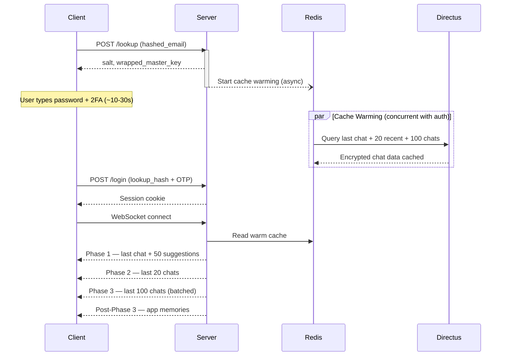

# Sync Architecture

> Three-phase sync with predictive cache warming — chats appear instantly after login because warming starts at email lookup, before authentication completes.

## Why This Exists

- Users expect instant chat access after login — even 2-second delay feels broken
- Zero-knowledge means server can't pre-decrypt for fast access
- Multiple devices need sync while maintaining client-side encryption
- Different data has different priorities: last chat > recent 20 > full 100

## How It Works

- User enters email → `/lookup` triggers predictive cache warming (async, non-blocking)
- User types password + 2FA (~10-30s) — warming runs concurrently
- Login succeeds → cache already warm → instant WebSocket sync in 3 phases
- All data stays encrypted during transit — decryption only in client memory



### Data Flow (all phases)

```
Directus (encrypted) → Redis cache → WebSocket (encrypted) → IndexedDB (encrypted) → Memory (decrypted) → UI
```

## Phases

### Phase 1: Last Chat + Suggestions (immediate)

- Two parallel queries via `asyncio.gather()` in [user_cache_tasks.py](../../backend/core/api/app/tasks/user_cache_tasks.py):
  - Query A: 50 new chat suggestions (always)
  - Query B: last opened chat metadata + messages + embeds (if any)
- WebSocket event: `phase_1_last_chat_ready`
- **Only phase that triggers auto-navigation** — phases 2/3 update sidebar only
- Embeds loaded alongside messages via `_load_and_cache_embeds_for_chats()` in [user_cache_tasks.py](../../backend/core/api/app/tasks/user_cache_tasks.py)

### Phase 2: Last 20 Chats

- By `last_edited_overall_timestamp`
- WebSocket: `phase_2_last_20_chats_ready`
- Includes embeds; updates sidebar only

### Phase 3: Last 100 Chats

- Batched via WebSocket: `phase_3_last_100_chats_ready`
- **Never sends suggestions** — always in Phase 1
- After completion: triggers app settings/memories sync

### Post-Phase 3: Memories

- Automatic after Phase 3
- Conflict resolution: higher `item_version` wins, then `updated_at`
- Multi-device: all devices decrypt independently with master key

## User Choice Protection

Sync **never overrides** explicit user choices:

| Flag in [phasedSyncStateStore.ts](../../frontend/packages/ui/src/stores/phasedSyncStateStore.ts) | Purpose |
|---|---|
| `initialChatLoaded` | Set when first chat loads → blocks future auto-navigation |
| `userMadeExplicitChoice` | Set on click chat / "new chat" → sync never overrides |
| `currentActiveChatId` | `NEW_CHAT_SENTINEL` for explicit new-chat mode (not null) |

- `canAutoNavigate()` returns false if either flag set
- Phase 1 chat loading handled in `+page.svelte`; phases 2/3 only update `Chats.svelte` sidebar

## Predictive Cache Warming

- Triggered at `/lookup` (email entry), NOT at `/login`
- Before: 2-5s wait after login. After: instant sync
- Deduplication: checks `cache_primed` + `warming_in_progress` flags
- Fallback: `/login` also triggers warming if `/lookup` skipped
- Security: all cached data encrypted, rate-limited (3/min), no premature transmission
- Implementation: [auth_login.py](../../backend/core/api/app/routes/auth_routes/auth_login.py) (trigger), [user_cache_tasks.py](../../backend/core/api/app/tasks/user_cache_tasks.py) (warming task)

## Edge Cases

- **User switches chat during Phase 1:** `userMadeExplicitChoice` prevents auto-navigation — handled by `shouldAutoSelectPhase1Chat()` in [phasedSyncStateStore.ts](../../frontend/packages/ui/src/stores/phasedSyncStateStore.ts)
- **Duplicate cache warming:** dedup via Redis flags `cache_warming_in_progress:{user_id}` (5-min TTL) in [auth_login.py](../../backend/core/api/app/routes/auth_routes/auth_login.py)
- **Multiple browser instances:** unique sessionID per tab (UUID in sessionStorage) → device hash `SHA256(OS:Country:UserID:SessionID)` → separate WebSocket connections. See [device-sessions.md](./device-sessions.md)
- **Storage overflow:** max 100 cached chats, 50MB default limit → auto-eviction of oldest
- **Embed eviction:** `chat:{chat_id}:embed_ids` Redis set tracks ownership → embeds evicted only when no active chat references them. In [cache_chat_mixin.py](../../backend/core/api/app/services/cache_chat_mixin.py)

<!-- TODO: screenshot (1000x400) — sync phase indicators in UI during login -->

## Improvement Opportunities

> **Improvement opportunity:** Full-text search across synced chats — index building after Phase 3, client-side only for zero-knowledge
> **Improvement opportunity:** Pinned chat support — ensure pinned chats always sync in Phase 1 regardless of last-edited order
> **Improvement opportunity:** Smart eviction — evict by access frequency, not just age

## Related Docs

- [Security](../core/security.md) — encryption tiers and zero-knowledge
- [Message Processing](../messaging/message-processing.md) — dual-cache (AI vs. sync)
- [Embeds](../messaging/embeds.md) — embed sync alongside messages
- [Device Sessions](./device-sessions.md) — device fingerprinting, multi-device
- [Memories](../../user-guide/apps/settings-and-memories.md) — post-Phase 3 sync target
