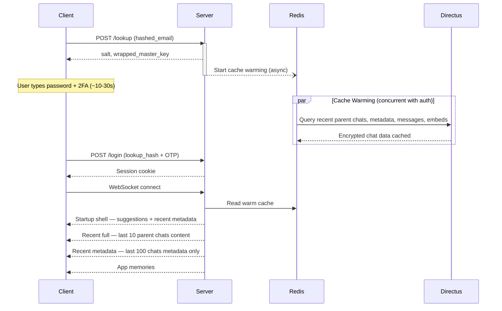

# Sync Architecture

> Bounded startup sync with predictive cache warming — recent chats appear quickly after login without bulk-syncing the full last-100 chat content set.

## Summary

- Startup sync sends a small shell first, then recent parent-chat content, then metadata-only updates.
- Partially warmed cache entries must be completed from Directus before Phase 1a reaches the client.
- Full startup content is capped to recent parent chats; sub-chat content stays on demand.

## Why This Exists

- Users expect instant chat access after login — even 2-second delay feels broken
- Zero-knowledge means server can't pre-decrypt for fast access
- Multiple devices need sync while maintaining client-side encryption
- Different data has different priorities: startup shell > recent 10 full parent chats > recent 100 metadata > on-demand content

## How It Works

- User enters email → `/lookup` triggers predictive cache warming (async, non-blocking)
- User types password + 2FA (~10-30s) — warming runs concurrently
- Login succeeds → cache already warm → instant WebSocket startup sync
- All data stays encrypted during transit — decryption only in client memory



### Data Flow (all phases)

```
Directus (encrypted) → Redis cache → WebSocket (encrypted) → IndexedDB (encrypted) → Memory (decrypted) → UI
```

## Startup Contract

Startup/login sync has a hard payload boundary:

- The 10 most recent parent chats are fully synced.
- The 100 most recent chats are metadata-only beyond that full-content budget.
- Sub-chat messages and sub-chat embeds are always on-demand.
- Parent full-content sync may include embeds referenced by parent chat messages.
- Web startup never runs the 100-chat background message/embed sync path.

Full content means encrypted messages, referenced embeds, embed keys, Code Run output sidecars, and compression checkpoints.

### Startup Shell: Metadata + Suggestions

- WebSocket event: `phase_1_last_chat_ready`
- Sends last-opened metadata, recent parent chat metadata, direct sub-chat preview metadata, new chat suggestions, and daily inspirations.
- Sends no messages, embeds, embed keys, Code Run outputs, or compression checkpoints.
- **Only startup event that can trigger auto-navigation** — later events update cached data/sidebar only.

#### Startup Metadata Invariant

Startup shell sync may read Redis while the cache is only partially warm. The backend must treat a Redis list item without matching versions, encrypted chat key, or titled-chat encrypted title as incomplete and fill missing fields from Directus before sending `phase_1_last_chat_ready`.

Required invariant for every Phase 1a chat payload:

- `encrypted_chat_key` is present for private encrypted chats.
- `encrypted_icon` and `encrypted_category` are present when available in Directus/cache.
- If `title_v > 0`, `encrypted_title` is present.
- Partial cache fields may be filled from Directus, but cached versions stay authoritative unless the versions key is missing.

Client-side Phase 1a handling must use the shared chat metadata merge policy (`mergeServerChatWithLocal`) rather than writing server payloads directly over IndexedDB. This prevents null/incomplete sync payloads from erasing locally valid encrypted metadata and keeps key-mismatch handling consistent with Phase 2/3.

### Recent Full Content: Last 10 Parent Chats

- WebSocket event: `phase_1b_chat_content_ready`
- Sends full content for at most `STARTUP_FULL_PARENT_CHAT_LIMIT = 10` parent chats.
- Parent chat selection excludes `is_sub_chat=true` and rows with `parent_id`.
- Sub-chat content is not included in this payload.

### Recent Metadata: Last 100 Chats

- WebSocket event: `phase_2_last_20_chats_ready` until the event name is renamed.
- Sends metadata only for the recent 100-chat window.
- Does not send messages, embeds, embed keys, Code Run outputs, or compression checkpoints.
- Triggers metadata-only expansion for chats 101-1000 when needed.

### On-Demand Hydration

- Request: `request_chat_content_batch`
- Response: `chat_content_batch_response`
- Used when opening a metadata-only parent chat or any sub-chat.
- Returns encrypted messages, embeds, embed keys, Code Run outputs, compression checkpoints, and version data for requested chats only.

### App Settings And Memories

- Automatic after startup metadata sync
- Conflict resolution: higher `item_version` wins, then `updated_at`
- Multi-device: all devices decrypt independently with master key

### Native Offline Prefetch

Native/desktop offline sync for parent chats 11-100 is a separate capability-gated path, not part of web startup.

- REST endpoint: `POST /v1/sync/offline-prefetch`
- Request: `cursor`, `limit` (max 5), and `include_embeds`.
- Response: encrypted parent-chat metadata, encrypted message strings, referenced embeds, embed keys, Code Run output sidecars, compression checkpoints, and `next_cursor`.
- Cursor starts at offset 10 so startup-owned parent chats are not fetched again.
- The endpoint filters out sub-chat content; sub-chats remain on-demand only.
- Apple/native clients run it opportunistically after startup sync and on network restore only when network is non-expensive/non-constrained, Low Power Mode is off, thermal state is acceptable, and local storage remains under budget.
- Prefetched content is persisted to SwiftData through `OfflineStore`; it is not pushed into the visible in-memory transcript unless the chat is already part of normal startup/opened-chat state.

## User Choice Protection

Sync **never overrides** explicit user choices:

| Flag in [phasedSyncStateStore.ts](../../frontend/packages/ui/src/stores/phasedSyncStateStore.ts) | Purpose |
|---|---|
| `initialChatLoaded` | Set when first chat loads → blocks future auto-navigation |
| `userMadeExplicitChoice` | Set on click chat / "new chat" → sync never overrides |
| `currentActiveChatId` | `NEW_CHAT_SENTINEL` for explicit new-chat mode (not null) |

- `canAutoNavigate()` returns false if either flag set
- Startup shell chat loading handled in `+page.svelte`; later startup events update IndexedDB/sidebar only

## Predictive Cache Warming

- Triggered at `/lookup` (email entry), NOT at `/login`
- Before: 2-5s wait after login. After: instant sync
- Deduplication: checks `cache_primed` + `warming_in_progress` flags
- Fallback: `/login` also triggers warming if `/lookup` skipped
- Security: all cached data encrypted, rate-limited (3/min), no premature transmission
- Implementation: [auth_login.py](../../backend/core/api/app/routes/auth_routes/auth_login.py) (trigger), [user_cache_tasks.py](../../backend/core/api/app/tasks/user_cache_tasks.py) (warming task)

## Edge Cases

- **User switches chat during Phase 1:** `userMadeExplicitChoice` prevents auto-navigation — handled by `shouldAutoSelectPhase1Chat()` in [phasedSyncStateStore.ts](../../frontend/packages/ui/src/stores/phasedSyncStateStore.ts)
- **Duplicate cache warming:** dedup via Redis flags `cache_warming_in_progress:{user_id}` (5-min TTL) in [auth_login.py](../../backend/core/api/app/routes/auth_routes/auth_login.py)
- **Multiple browser instances:** unique sessionID per tab (UUID in sessionStorage) → device hash `SHA256(OS:Country:UserID:SessionID)` → separate WebSocket connections. See [device-sessions.md](./device-sessions.md)
- **Storage overflow:** startup full content is capped to 10 parent chats; older chat content hydrates on demand
- **Embed eviction:** `chat:{chat_id}:embed_ids` Redis set tracks ownership → embeds evicted only when no active chat references them. In [cache_chat_mixin.py](../../backend/core/api/app/services/cache_chat_mixin.py)

<!-- TODO: screenshot (1000x400) — sync phase indicators in UI during login -->

## Improvement Opportunities

> **Improvement opportunity:** Full-text search across synced metadata — client-side only for zero-knowledge
> **Improvement opportunity:** Pinned chat support — ensure pinned chats always sync in Phase 1 regardless of last-edited order
> **Improvement opportunity:** Smart eviction — evict by access frequency, not just age

## Related Docs

- [Security](../core/security.md) — encryption tiers and zero-knowledge
- [Message Processing](../messaging/message-processing.md) — dual-cache (AI vs. sync)
- [Embeds](../messaging/embeds.md) — embed sync alongside messages
- [Device Sessions](./device-sessions.md) — device fingerprinting, multi-device
- [Memories](../../user-guide/apps/settings-and-memories.md) — post-startup sync target
