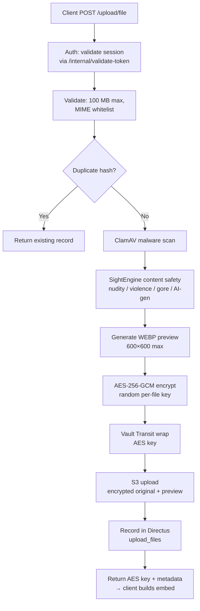

# File Upload Pipeline

> User-uploaded files flow through an isolated `app-uploads` microservice on a separate VM, with AES-256-GCM encryption, ClamAV malware scanning, SightEngine content safety, and S3 storage.

## Why This Exists

File uploads need malware scanning, content moderation, encryption, and S3 storage. Running this on a separate VM limits the blast radius: a compromised upload server cannot access user data, the main Vault, or Directus.

## How It Works



### Upload Flow (Phase 1: Images)

Client sends multipart POST to `/api/uploads/v1/upload/file`. Processing steps:

1. **Auth** -- session cookie validated via core API `/internal/validate-token`
2. **Validation** -- 100 MB max, MIME whitelist
3. **Dedup** -- per-user SHA-256 hash check via core API proxy (instant return on match)
4. **Malware scan** -- ClamAV TCP socket; 422 on threat
5. **Content safety** -- SightEngine combined scan (nudity/violence/gore/AI-gen); **fail-closed** on API error (503 to user)
6. **Preview** -- Pillow WEBP at max 600x600px
7. **Encryption** -- AES-256-GCM with random per-file key
8. **Key wrapping** -- AES key wrapped by core API via Vault Transit (`/internal/uploads/wrap-key`)
9. **S3 upload** -- encrypted original + preview to `chatfiles` bucket
10. **Record** -- written to Directus `upload_files` via core API proxy

Client receives the plaintext AES key + S3 metadata, builds an embed TOON, client-encrypts it before storage (zero-knowledge at rest).

### Security Architecture

```
UPLOADS VM                              MAIN SERVER
  app-uploads -> local Vault (dev mode)   core API -> main Vault (Transit only)
       |           S3 creds                        -> Directus
       |           SightEngine creds
       +-> core API /internal/uploads/*
            (INTERNAL_API_SHARED_TOKEN)
```

**Compromise blast radius:** Attacker gets S3 write creds + SightEngine keys only. Cannot decrypt existing files, access user data, or reach main Vault.

**Local Vault:** Dev mode (in-memory, auto-unsealed) Docker sidecar. `vault-setup` init container migrates `SECRET__*` env vars into KV v2. Only two KV paths: `kv/data/providers/hetzner` (S3) and `kv/data/providers/sightengine`.

### Encryption Model

- Files encrypted before S3 upload -- plaintext never leaves the upload server.
- Plaintext `aes_key` returned to client for browser rendering; stored inside client-encrypted embed content at rest.
- `vault_wrapped_aes_key` enables backend skills to decrypt on demand (e.g., `images.view` skill).
- Key wrapping uses only Vault Transit `encrypt` -- upload VM has no decrypt capability.

### Internal API Proxy Endpoints

All require `INTERNAL_API_SHARED_TOKEN` in `X-Internal-Token` header.

| Endpoint                                 | Purpose                                      |
|------------------------------------------|----------------------------------------------|
| `POST /internal/uploads/check-duplicate` | Query `upload_files` for `(user_id, hash)`   |
| `POST /internal/uploads/wrap-key`        | Vault Transit encrypt on user's key ID       |
| `POST /internal/uploads/store-record`    | Create `upload_files` Directus record        |

### Content Safety Scanning

Single combined SightEngine call (`nudity-2.0,offensive,gore,genai`). Blocking thresholds: sexual_activity/display > 0.3, erotica > 0.4, sextoy > 0.3, suggestive > 0.6, weapon > 0.5, gore > 0.3, blood > 0.4. AI-detection score is metadata only (non-blocking).

**Fail-closed policy:** SightEngine HTTP error/timeout -> upload rejected with HTTP 503. If credentials not configured (dev/self-hosted), scanning is skipped entirely.

**PDF screenshots:** `app-pdf-worker` scans each rendered page. Service unavailable -> Celery retry. Violation on any page -> entire PDF rejected.

### Storage Billing

Weekly Celery Beat task (`charge-storage-fees-weekly`, Sunday 03:00 UTC):
- Aggregates `upload_files` by user for real total bytes.
- 1 GB free tier; above: 3 credits/GB/week (ceil).
- Reconciles `storage_used_bytes` counter drift on every run.
- Failure escalation: warning (1st), second notice (2nd), final warning (3rd), file deletion (4th).

### Auto-Deletion of Chats

Daily task (`auto-delete-old-chats-daily`, 02:30 UTC): users with `auto_delete_chats_after_days` configured have stale chats deleted (max 100/user/day). Deletion pipeline removes messages, embeds (with shared-embed safety check), `upload_files` records, and decrements `storage_used_bytes`.

### File Type Routing

| Type                  | Route                    | Status          |
|-----------------------|--------------------------|-----------------|
| Images (JPEG/PNG/etc) | app-uploads microservice | Implemented     |
| PDF                   | app-uploads microservice | Phase 2 planned |
| DOCX, XLSX            | app-uploads microservice | Phase 3 planned |
| Code/Audio/Video/EPUB | Client-only embeds       | Already works   |

## Edge Cases

- Deduplication is per-user only. Cross-user dedup intentionally not implemented to maintain per-user encryption model.
- Content safety fallback providers (Azure, AWS Rekognition, Hive) researched but not yet implemented. See `sightengine_service.py` for planned cascade.
- `storage_used_bytes` counter can drift from failed decrements; weekly billing run self-heals.

## Data Structures

Key Directus fields on `users`: `storage_used_bytes`, `storage_last_billed_at`, `storage_billing_failures`, `auto_delete_chats_after_days`.

## Related Docs

- [Message Processing](../messaging/message-processing.md) -- how AI skills consume uploaded file embed data
- [Zero-Knowledge Storage](../core/zero-knowledge-storage.md) -- encryption model
