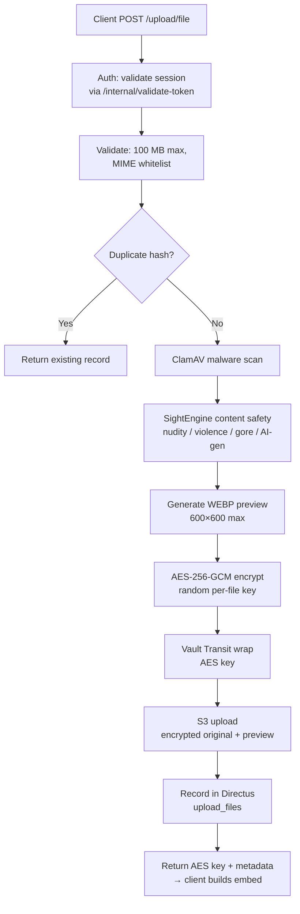

# File Upload Pipeline

> User-uploaded files flow through an isolated `app-uploads` microservice on a separate VM, with AES-256-GCM encryption, ClamAV malware scanning, SightEngine content safety, and S3 storage.

## Why This Exists

File uploads need malware scanning, content moderation, encryption, and S3 storage. Running this on a separate VM limits the blast radius: a compromised upload server cannot access user data, the main Vault, or Directus.

## How It Works


```mermaid
graph TB
    A["Client POST /upload/file"] --> B["Auth: validate session<br/>via /internal/validate-token"]
    B --> C["Validate: 100 MB max,<br/>MIME whitelist"]
    C --> D{Duplicate hash?}
    D -->|Yes| E["Return existing record"]
    D -->|No| F["ClamAV malware scan"]
    F --> G["SightEngine content safety<br/>nudity / violence / gore / AI-gen"]
    G --> H["Generate WEBP preview<br/>600×600 max"]
    H --> I["AES-256-GCM encrypt<br/>random per-file key"]
    I --> J["Vault Transit wrap<br/>AES key"]
    J --> K["S3 upload<br/>encrypted original + preview"]
    K --> L["Record in Directus<br/>upload_files"]
    L --> M["Return AES key + metadata<br/>→ client builds embed"]
```

### Upload Flow (Phase 1: Images)

Client sends multipart POST to `/api/uploads/v1/upload/file`. Processing steps:

Before sending, web, CLI and TUI run `@repo/upload-privacy` locally. Supported
image containers lose EXIF/GPS, XMP/IPTC, comments and private chunks; rendering
instructions such as orientation and animation remain. PDFs are rewritten with
document properties, XMP and unreachable metadata objects removed, preserving
pages and selectable text. Audio containers lose identifying tags while keeping
encoded audio. Office/EPUB/ZIP preparation removes supported author/date properties,
archive comments and timestamps, and cleans supported embedded images. Chat Office
documents are already converted locally to content embeds rather than uploaded raw.

The upload boundary covers chat and Project uploads. Avatars use local canvas
re-encoding or upload preparation; issue screenshots use local preparation.
Filenames and folder paths retain their existing behavior in uploads, processing
requests and client records. Cleanup targets embedded properties rather than
file identity. CLI retries reuse prepared bytes instead of re-reading the original.

Cleanup is deliberately best effort: unsupported variants, encrypted/signed
documents and parser failures retain the original bytes so a valid upload can
continue. Cleanup failures use generic diagnostics that exclude file contents,
properties and local paths. This does not guarantee removal of every possible
metadata field, embedded format or information visible in the content itself.

1. **Auth** -- session cookie validated via core API `/internal/validate-token`
2. **Validation** -- 100 MB max, MIME whitelist
3. **Dedup** -- per-user SHA-256 hash check via core API proxy (instant return on match)
4. **Malware scan** -- ClamAV TCP socket; 422 on threat
5. **Content safety** -- SightEngine combined scan (nudity/violence/gore/AI-gen); **fail-closed** on API error (503 to user)
6. **Preview** -- Pillow WEBP at max 600x600px
7. **Encryption** -- AES-256-GCM with random per-file key
8. **Key wrapping** -- AES key wrapped by core API via Vault Transit (`/internal/uploads/wrap-key`)
9. **S3 upload** -- encrypted original + preview to `chatfiles` bucket
10. **Record** -- written to Directus `upload_files` via core API proxy

Client receives the plaintext AES key + S3 metadata, builds an embed TOON, client-encrypts it before storage (zero-knowledge at rest).

### Security Architecture

```
UPLOADS VM                              MAIN SERVER
  app-uploads -> local Vault (file storage) core API -> main Vault (Transit only)
       |           S3 creds                        -> Directus
       |           SightEngine creds
       +-> core API /internal/uploads/*
            (INTERNAL_API_SHARED_TOKEN)
```

**Compromise blast radius:** Attacker gets S3 write creds + SightEngine keys only. Cannot decrypt existing files, access user data, or reach main Vault.

**Local Vault:** A Docker sidecar with persistent file storage. The `vault-setup` init container initializes and unseals it, then migrates `SECRET__*` env vars into KV v2. Provider credentials live at `kv/data/providers/hetzner` (S3) and `kv/data/providers/sightengine`.

Setup issues a scoped seven-day periodic API token. The upload app validates and renews it at startup and every 12 hours, retrying transient renewal failures every five minutes. Ordinary renewable tokens still expire at Vault's maximum TTL; setup replaces them during an update. The setup-only volume retains `root.token`; a separate app volume contains the scoped API token and the unseal key used by the startup gate. Updates that introduce this volume must run the new `vault-setup` image before starting the new upload app.

The upload image explicitly packages the shared media-encryption and object-storage-region utilities. Its build imports `backend.upload.main` from the image filesystem so a missing runtime dependency fails before publication.

### Encryption Model

- Files encrypted before S3 upload -- plaintext never leaves the upload server.
- Plaintext `aes_key` returned to client for browser rendering; stored inside client-encrypted embed content at rest.
- `vault_wrapped_aes_key` enables backend skills to decrypt on demand (e.g., `images.view` skill).
- Key wrapping uses only Vault Transit `encrypt` -- upload VM has no decrypt capability.

### Internal API Proxy Endpoints

All require `INTERNAL_API_SHARED_TOKEN` in `X-Internal-Token` header.

| Endpoint                                 | Purpose                                      |
|------------------------------------------|----------------------------------------------|
| `POST /internal/uploads/check-duplicate` | Query `upload_files` for `(user_id, hash)`   |
| `POST /internal/uploads/wrap-key`        | Vault Transit encrypt on user's key ID       |
| `POST /internal/uploads/store-record`    | Create `upload_files` Directus record        |

### Content Safety Scanning

Single combined SightEngine call (`nudity-2.0,offensive,gore,genai`). Blocking thresholds: sexual_activity/display > 0.3, erotica > 0.4, sextoy > 0.3, suggestive > 0.6, weapon > 0.5, gore > 0.3, blood > 0.4. AI-detection score is metadata only (non-blocking).

**Fail-closed policy:** SightEngine HTTP error/timeout -> upload rejected with HTTP 503. If credentials not configured (dev/self-hosted), scanning is skipped entirely.

**PDF screenshots:** `app-pdf-worker` scans each rendered page. Service unavailable -> Celery retry. Violation on any page -> entire PDF rejected.

### Storage Billing

Weekly Celery Beat task (`charge-storage-fees-weekly`, Sunday 03:00 UTC):
- Aggregates `upload_files` by user for real total bytes.
- 1 GB free tier; above: 3 credits/GB/week (ceil).
- Reconciles `storage_used_bytes` counter drift on every run.
- Failure escalation: warning (1st), second notice (2nd), final warning (3rd), file deletion (4th).

### Auto-Deletion of Chats

Daily task (`auto-delete-old-chats-daily`, 02:30 UTC): users with `auto_delete_chats_after_days` configured have stale chats deleted (max 100/user/day). Deletion pipeline removes messages, embeds (with shared-embed safety check), `upload_files` records, and decrements `storage_used_bytes`.

### File Type Routing

| Type                  | Route                    | Status          |
|-----------------------|--------------------------|-----------------|
| Images (JPEG/PNG/etc) | app-uploads microservice | Implemented     |
| PDF                   | app-uploads microservice | Phase 2 planned |
| DOCX, XLSX            | app-uploads microservice | Phase 3 planned |
| Code/Audio/Video/EPUB | Client-only embeds       | Already works   |

## Edge Cases

- Deduplication is per-user only. Cross-user dedup intentionally not implemented to maintain per-user encryption model.
- Content safety fallback providers (Azure, AWS Rekognition, Hive) researched but not yet implemented. See `sightengine_service.py` for planned cascade.
- `storage_used_bytes` counter can drift from failed decrements; weekly billing run self-heals.

## Data Structures

Key Directus fields on `users`: `storage_used_bytes`, `storage_last_billed_at`, `storage_billing_failures`, `auto_delete_chats_after_days`.

## Related Docs

- [Message Processing](../messaging/message-processing.md) -- how AI skills consume uploaded file embed data
- [Encryption Architecture](../core/encryption-architecture.md) -- encryption model
