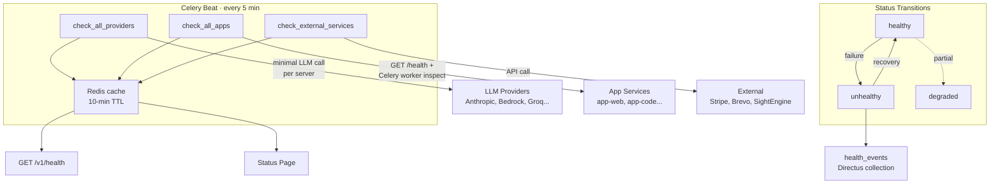

# Health Checks

> Periodic Celery Beat tasks monitor LLM providers, internal app services, and external dependencies, exposing results via `/health` and `/v1/health`.

## Why This Exists

OpenMates depends on multiple LLM providers, internal microservices, and external APIs (Stripe, Brevo, etc.). Automated health checks detect degradation early and feed the public status page.

## How It Works

Three Celery Beat tasks run every **5 minutes** on the `health_check` queue, each acquiring a distributed Redis lock (10-minute TTL) to prevent duplicate executions.

### Provider Health Checks (`health_check.check_all_providers`)

- Iterates all server IDs from `PROVIDER_CLIENT_REGISTRY` (dynamically built from provider YAML configs; includes Anthropic, AWS Bedrock, Cerebras, Google, Google AI Studio, Google MaaS, Groq, Mistral, OpenAI, OpenRouter, Together).
- Makes a minimal LLM completion request ("Answer short" / "1+2?") using the cheapest available model per server (Haiku for Anthropic, `llama-3.1-8b-instant` for Groq, cheapest-by-input-cost for others).
- 15-second timeout, single attempt (no retry to avoid duplicate API billing).
- Also checks Brave Search reachability via HEAD request (no billing).
- Stores last 5 response times per provider; results cached 10 minutes.

### App Health Checks (`health_check.check_all_apps`)

- Discovers enabled apps via cache, `/metadata` endpoints, or filesystem fallback. Filters by `SERVER_ENVIRONMENT`.
- Per app: HTTP GET to `http://app-{app_id}:8000/health` (5s timeout) + Celery worker inspection via `active_queues()`.
- One retry after 1-second wait on failure for both API and worker checks.
- Status: `healthy` (both up), `degraded` (one up), `unhealthy` (both down).

### External Services Health Checks (`health_check.check_external_services`)

| Service       | Check Method                     | Credential Source                        |
|---------------|----------------------------------|------------------------------------------|
| Stripe        | `stripe.Account.retrieve()`      | Vault `kv/data/providers/stripe`         |
| Sightengine   | GET `/api/moderation/list`       | Vault `kv/data/providers/sightengine`    |
| Brevo         | GET `/v3/account`                | Vault `kv/data/providers/brevo`          |
| AWS Bedrock   | `boto3.list_foundation_models()` | Vault `kv/data/providers/aws`            |
| Vercel Domain | HTTP GET (follow redirects)      | `VERCEL_DOMAIN` env var                  |

Missing credentials yield `unhealthy` with `missing_credentials`. HTTP errors return the status code; timeouts return `"timeout"`.

### Health Event Persistence

Status changes are recorded in a `health_events` Directus collection via `_record_health_event_if_changed()`. Only transitions (e.g., healthy -> unhealthy) create a new row. A daily cleanup task at 04:00 UTC prunes events older than 90 days.

### API Endpoints

`GET /health` and `GET /v1/health` return cached results:
- **Overall status**: `healthy`, `degraded`, or `unhealthy`
- Per-provider/app/service: status, last check timestamp, error (sanitized), response time history.

Error sanitization: HTTP codes -> numeric string, timeouts -> `"timeout"`, connection errors -> `"connection_error"`, unknown -> null.

## Edge Cases

- If Redis is unavailable, health checks cannot acquire the distributed lock and skip execution (logged as error).
- Cache miss on the `/health` endpoint returns stale or empty data, not an error -- the next Celery Beat cycle repopulates.
- Provider with no configured models returns `"no_models"` status.

## Related Docs

- [Status Page](./status-page.md) -- public-facing status UI consuming these health checks
- [Cronjobs](./cronjobs.md) -- Celery Beat schedule overview
