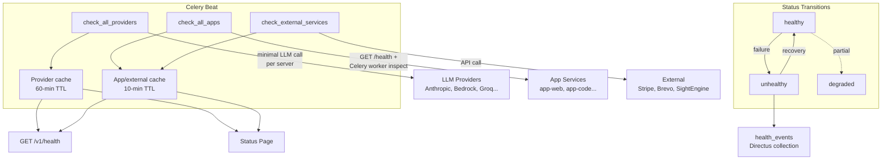

# Health Checks

> Periodic Celery Beat tasks monitor LLM providers, internal app services, and external dependencies, exposing results via `/health` and `/v1/health`.

## Why This Exists

OpenMates depends on multiple LLM providers, internal microservices, and external APIs (Stripe, Brevo, etc.). Automated health checks detect degradation early and feed the public status page.

## How It Works

```mermaid
graph TB
    subgraph "Celery Beat"
        A["check_all_providers"] --> D1["Provider cache<br/>60-min TTL"]
        B["check_all_apps"] --> D2["App/external cache<br/>10-min TTL"]
        C["check_external_services"] --> D2
    end

    A -->|"minimal LLM call<br/>per server"| P["LLM Providers<br/>Anthropic, Bedrock, Groq..."]
    B -->|"GET /health +<br/>Celery worker inspect"| Q["App Services<br/>app-web, app-code..."]
    C -->|"API call"| R["External<br/>Stripe, Brevo, SightEngine"]

    D1 --> E["GET /v1/health"]
    D2 --> E
    D1 --> F["Status Page"]
    D2 --> F

    subgraph "Status Transitions"
        G["healthy"] -->|failure| H["unhealthy"]
        H -->|recovery| G
        G -.->|partial| I["degraded"]
    end

    H --> J["health_events<br/>Directus collection"]
```

App and external-service checks run every **5 minutes**. Provider inference probes run every **30 minutes**. Each task acquires a distributed Redis lock (10-minute TTL) to prevent duplicate executions.

### Provider Health Checks (`health_check.check_all_providers`)

- Iterates server IDs from `PROVIDER_CLIENT_REGISTRY` (dynamically built from provider YAML configs; includes Anthropic, AWS Bedrock, Cerebras, Google, Google MaaS, Groq, Mistral, OpenAI, OpenRouter, Together). The separate Google AI Studio registry entry is omitted because the canonical Google probe already uses the AI Studio default model.
- Makes a minimal LLM completion request ("Answer short" / "1+2?") using the cheapest available model per server (Haiku for Anthropic, `llama-3.1-8b-instant` for Groq, cheapest-by-input-cost for others).
- 15-second timeout, single attempt (no retry to avoid duplicate API billing).
- Also checks Brave Search reachability via HEAD request (no billing).
- Stores last 5 response times per provider; results cached 10 minutes.

### App Health Checks (`health_check.check_all_apps`)

- Discovers enabled apps via cache, `/metadata` endpoints, or filesystem fallback. Filters by `SERVER_ENVIRONMENT`.
- Per app: HTTP GET to `http://app-{app_id}:8000/health` (5s timeout) + Celery worker inspection via `active_queues()`.
- One retry after 1-second wait on failure for both API and worker checks.
- Status: `healthy` (both up), `degraded` (one up), `unhealthy` (both down).

### External Services Health Checks (`health_check.check_external_services`)

| Service       | Check Method                     | Credential Source                        |
|---------------|----------------------------------|------------------------------------------|
| Stripe        | `stripe.Account.retrieve()`      | Vault `kv/data/providers/stripe`         |
| Sightengine   | GET `/api/moderation/list`       | Vault `kv/data/providers/sightengine`    |
| Brevo         | GET `/v3/account`                | Vault `kv/data/providers/brevo`          |
| AWS Bedrock   | `boto3.list_foundation_models()` | Vault `kv/data/providers/aws`            |
| Vercel Domain | HTTP GET (follow redirects)      | `VERCEL_DOMAIN` env var                  |

Missing credentials yield `unhealthy` with `missing_credentials`. HTTP errors return the status code; timeouts return `"timeout"`.

### Health Event Persistence

Status changes are recorded in a `health_events` Directus collection via `_record_health_event_if_changed()`. Only transitions (e.g., healthy -> unhealthy) create a new row. A daily cleanup task at 04:00 UTC prunes events older than 90 days.

### Health Transition Alerts

Persisted status transitions now send operational Discord alerts by default when a webhook is configured. Email is intentionally opt-in to avoid accidentally spamming the server owner, especially on the dev server.

Discord webhook resolution:
- `OPENMATES_HEALTH_ALERT_DISCORD_WEBHOOK_URL` for an explicit transition-alert webhook.
- `OPENMATES_RUNTIME_HEALTH_DISCORD_WEBHOOK_URL` for self-host/runtime-health overrides.
- Existing degraded-services fallback: `DISCORD_WEBHOOK_DEGRADED_SERVICES`, then `DISCORD_WEBHOOK_PROD_SMOKE` for production or `DISCORD_WEBHOOK_DEV_SMOKE` for dev.

Email is disabled unless `OPENMATES_HEALTH_ALERT_EMAIL_ENABLED=true`. When enabled, the recipient resolves in this order: `OPENMATES_HEALTH_ALERT_EMAIL_TO`, `OPENMATES_RUNTIME_HEALTH_EMAIL_TO`, `SERVER_OWNER_EMAIL`, then `ADMIN_NOTIFY_EMAIL`. This lets self-hosting operators opt into email explicitly without enabling it on the OpenMates dev server by accident.

Alert policy:
- Send one Discord alert when a provider, app, or external service enters `degraded` or `unhealthy`.
- Send one recovery alert when a `degraded` or `unhealthy` service returns to `healthy`.
- Do not alert repeated same-state checks, `skipped`, `not_configured`, or initial `healthy` observations.
- Include only sanitized fields: service type/id, previous and new status, public error class/code, response time, previous-status duration, timestamp, and environment.

This closes the notification gap surfaced by OpenAI quota/429 streaming failures: the LLM provider probe already records provider state, but operators now receive immediate Discord notification when the persisted provider state becomes alert-worthy instead of discovering the issue from a user-visible chat failure.

### Rollout Plan

1. Keep the existing `/v1/health` and status-page data model as the source of truth. It already covers LLM providers, Brave Search, app APIs/workers, and external services such as Firecrawl, SerpAPI, YouTube, Google Maps, Sightengine, Brevo, and Stripe.
2. Deploy the transition Discord path and verify it posts to the dev server webhook without queueing email when only `SERVER_OWNER_EMAIL`/`ADMIN_NOTIFY_EMAIL` are present.
3. Add live smoke coverage for the actual streaming inference path, not just non-streaming minimal completions, so quota/429 failures during SSE streaming are detected before users report them.
4. Add provider-specific quota classification where provider responses expose it safely, while continuing to publish only sanitized values (`429`, `timeout`, `credential_error`, etc.) through public health APIs and emails.
5. If email is needed later, enable it explicitly with `OPENMATES_HEALTH_ALERT_EMAIL_ENABLED=true` and verify `health-status-alert` through Brevo before using it for production or self-hosting operations.

### API Endpoints

`GET /health` and `GET /v1/health` return cached results:
- **Overall status**: `healthy`, `degraded`, or `unhealthy`
- Per-provider/app/service: status, last check timestamp, error (sanitized), response time history.

Error sanitization: HTTP codes -> numeric string, timeouts -> `"timeout"`, connection errors -> `"connection_error"`, unknown -> null.

## Edge Cases

- If Redis is unavailable, health checks cannot acquire the distributed lock and skip execution (logged as error).
- Cache miss on the `/health` endpoint returns stale or empty data, not an error -- the next Celery Beat cycle repopulates.
- Provider with no configured models returns `"no_models"` status.

## Host Operational Monitoring

CLI-managed servers install a host systemd verifier and independent watchdog in addition to Celery health checks. The verifier runs every five minutes and covers role health, API availability, host disk, notification configuration, and read-only billing readiness only for verified official-cloud deployments. Self-host inventories omit all billing checks and never read payment-provider credentials.

`core.object_storage` is an optional bounded check. Configured storage that
times out or returns a provider failure reports `failed/storage_unavailable`
without failing required core health; absent intentional configuration reports
`skipped/not_configured`. Two failures open one warning, one continuous hour
opens one critical escalation, and one successful probe emits one recovery.
Only stable check IDs and sanitized failure classes enter host state, digests,
or notifications.

Remote bucket, ACL, lifecycle, and CORS reconciliation runs outside API
liveness. Its failure keeps the API available in a degraded state. Operations
that need durable object storage use the shared availability gate before
provider execution or charging and return retryable
`storage_temporarily_unavailable`; destructive jobs preserve authoritative
source records and retry intent until storage succeeds.

When a verified email or Discord destination exists, the same host scheduler sends a compact daily 24-hour operational digest at 08:30 UTC. The report watchdog opens one incident after 26 hours without an accepted report and emits one recovery event after delivery resumes. Host notification delivery retries independently and does not depend on the API or Celery task scheduler.

Prometheus provides container/host trend data and disk/report-staleness alerts. Alertmanager can additionally send critical events directly to an environment-specific Discord webhook; the host verifier remains the independent email/Discord path when that optional Alertmanager receiver is not configured.

## Related Docs

- [Status Page](./status-page.md) -- public-facing status UI consuming these health checks
- [Cronjobs](./cronjobs.md) -- Celery Beat schedule overview
