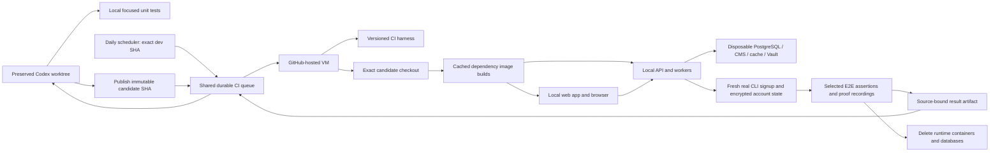

# Isolated GitHub application tests

Implementation status: migration HOLD. The coordinator must not release dependent work until a successful source-bound runner-local pilot and an explicit coverage disposition are recorded. See `docs/plans/isolated-github-tests/plan.yml`.

## Execution and ownership



The Hetzner host retains source worktrees, focused unit execution, the queue and bounded result artifacts. It does not start candidate Docker stacks. `ci_environment.py` rejects execution outside a GitHub-hosted job before Docker is invoked. Shared dev domains resolve to a rejected loopback endpoint in both the runner and application containers; verification checks the runner's failed HTTPS connection.

The workflow checks out its trusted harness separately from the immutable subject. Old worktrees and reviewed resolved patches may predate CI tooling. The tested subject and harness commits are recorded separately. Image builds and frontend compilation use the subject checkout. Existing build caches accelerate dependencies without substituting stale application source.

## Commands

Focused worktree request, once the migration readiness checkpoint is published:

```sh
python3 scripts/tests.py run --spec example.spec.ts --session SESSION
```

A supported old-worktree adoption inserts forwarding before any legacy test preflight. It preserves the existing worktree and dirty source, and saves dispatcher preimages and hashes:

```sh
python3 scripts/sessions.py ci-adopt --session SESSION
```

The canonical `ci_dispatch.py` checks `logs/ci-coordinator/cutover.json`; absent readiness fails closed. There is no shared-dev fallback. The retired single-spec workflow also fails explicitly instead of consuming shared accounts or endpoints. Local `--suite pytest` and `--suite vitest` remain available during HOLD.

The implementation pilot uses these lower-level coordinator commands:

```sh
python3 scripts/sessions.py ci-source --session SESSION
python3 scripts/ci_coordinator.py submit --session SESSION --source FULL_SHA --spec example.spec.ts
python3 scripts/ci_coordinator.py status REQUEST_ID
python3 scripts/ci_coordinator.py result REQUEST_ID
python3 scripts/ci_coordinator.py health
```

`status` reads local state only. `result` fetches and validates artifacts once, then returns the cached receipt and GitHub artifact link. Phone and laptop proofs use separate `--proof-video-profile web-phone` / `web-laptop` requests. Review and delivery requirements remain in force; an artifact link alone does not certify a video review.

For a reviewed stale-base patch:

```sh
python3 scripts/sessions.py ci-source --session SESSION --base REVIEWED_FULL_SHA --resolved-patch REVIEWED_PATCH --patch-sha256 REVIEWED_DIGEST
```

This publishes a candidate through a temporary index. It does not integrate or deploy the patch to dev, change the original checkout, or solve a separate deploy conflict.

## Queue, cost and retained space

One flocked reconciler dispatches at most four active jobs. Intent is durable before the request; ambiguous dispatches retain their slot and are reconciled rather than resent. Routine status polling is shared at 30 seconds. GitHub request reserve and backoff also apply to artifact retrieval. The coordinator exposes attention states instead of silently rerunning uncertain jobs.

Candidate publication and artifact retrieval preserve at least 30 GiB free on the host. Artifact downloads are bounded to 256 MiB, extracted data to 512 MiB and 10,000 files, with a one-minute download deadline. Unsafe paths, symlinks and private account state are rejected. GitHub artifact retention is seven days. Local result-cache and candidate-ref retention automation remains pending.

Fresh accounts are created through real CLI signup and security initialization. Generated credentials and client state stay in a private runner directory. The private email verification code is obtained from that account's local cache key; no shared Gmail account is used for account provisioning. This is not a replacement for email-delivery assertions. Any skipped selected case makes coverage incomplete. Signup creation is paced against the real per-IP rate limit. Fresh CLI keys have a lifetime credit cap and expiry; the fresh owner approves the exact registered CLI device through the authenticated API. Earlier completed results survive later fixture failures.

## Coverage and readiness limits

The current portable profile is the self-host edition. It is not equivalent to official-cloud billing, anonymous eligibility or provider-spend enforcement. Cloud-only tests must not silently become self-host tests. Their private-code execution and cost decision is pending. External email, provider, upload and broader worker coverage must be admitted explicitly before complete migration is claimed.

Core cold daily accounts, real SvelteKit routes and cleanup have passed on hosted runners. The manifest distinguishes admitted execution from passing product assertions. Existing committed AI responses use an additional AI worker on an internal Docker network; a credential-free TCP gateway exposes API/CMS only to the runner. Cached-pipeline replay keeps its original server-signed marker authorization, with an explicit allowlist of identities generated for that job. No pre-existing account credentials are imported, and no paid provider key is supplied.


### Reviewed current-base deployment

Publishing a candidate is not deployment. A preserved worktree can deploy an exact
reviewed candidate with `sessions.py deploy --session <existing> --reviewed-candidate
<full-sha> --reviewed-base <parent-sha> --only <all-candidate-paths> --title ...`.
Use `ci-source --base ... --resolved-patch ... --patch-sha256 ...` first. The adapter
requires the session candidate ref, exact parent and full changed-path inventory.
It runs the ordinary integration gates and push lock, rejects selected-path upstream
drift and deletion amplification, and requires staged selected files to equal the
candidate. It checks original worktree/HEAD/index identity and skips source
synchronization; it never rewrites the source to fabricate a newer base.

### Remaining legacy coverage holds

These legacy workflows now fail explicitly before shared-dev execution. They are
unmigrated coverage, not passing skips: typed Task/Workflow CLI smoke, main-processor
CLI smoke, installed VSIX login, and release core journeys. Their runner-local
profiles and cloud-only/provider requirements must be implemented before release.
Existing unit/build checks in the VS Code workflow remain executable. Public
self-host mocks do not replace official-cloud billing, eligibility or budget proof.


### Verified core admission

`ci_coordinator.py verify-pilot REQUEST_ID --activate` validates an overall passing
GitHub job, non-skipped real account browser preflight, runner-local source receipt
and shared-dev rejection before enabling core dispatch. It rejects runtime source
drift since the verified harness. `scripts/ci_coverage.py` lists supported core
specs; unported and cloud-only specs produce explicit holds, including in daily
batches. This partial cutover never means all E2E has migrated. The coordinator's
low-level submit command enforces the same coverage boundary.

The public core profile supplies fresh encrypted accounts and the real CLI. Task
spec admission permits candidate verification; it does not certify the candidate's
creator/eligibility contract or declare those product tests passed. Their selected
source must include the reviewed compatible implementation. Proof artifact links
retain source/harness/profile identities; visual review remains a separate gate.


### Installer coverage in the shared queue

`selfhost-smoke.spec.ts` uses the distinct `selfhost` execution mode. The adapter
executes the candidate's existing source-mode and image-mode installer workflow
commands and original Playwright assertions inside the same hosted job. It uses
the real installed API/frontend, creates its own user, and tests admin promotion.
It does not reuse the ordinary core fixture or claim that a core preflight proves
installation. Unsupported workflow expressions/actions fail visibly.

The outer workflow supplies Node/pnpm/Python setup and artifact transport. The
adapter records immutable workflow/source hashes, actual built image IDs, test
counts and verified container/volume cleanup. Private installer logs and generated
account material are excluded. The standalone legacy installer schedule must be
disabled at repository level after this routing is deployed, so all test jobs
share the coordinator's four-job cap. Admission still requires a real hosted run
before installer coverage can be marked verified.
