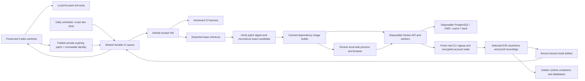
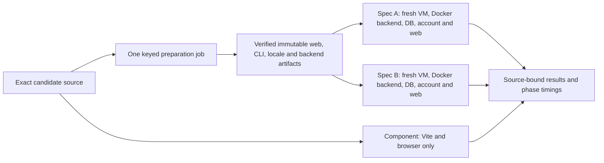

# Isolated GitHub application tests

Implementation status: core profiles are admitted; unsupported profiles remain held. Shared preparation and fair admission are implemented, with live cutover evidence tracked in `docs/plans/isolated-github-tests/plan.yml`. A component pass does not certify a full application journey.

## Execution and ownership



The Hetzner host retains source worktrees, focused unit execution, the queue and bounded result artifacts. It does not start candidate Docker stacks. `ci_environment.py` rejects execution outside a GitHub-hosted job before Docker is invoked. Shared dev domains resolve to a rejected loopback endpoint in both the runner and application containers; verification checks the runner's failed HTTPS connection.

Every ordinary E2E job contains exactly one Playwright spec. A submission naming
multiple specs is split into separate GitHub jobs, so each spec receives its own
VM, Compose project, database, volumes, credentials and web process. The backend
is containerized; the exact SvelteKit build is served by a runner-host process on
`localhost:5173`. Because the GitHub VM is already the isolation boundary, the
web process does not need a second container. Tests inside one spec intentionally
share that spec's disposable stack.

The workflow checks out its trusted harness separately from the immutable subject. For a worktree candidate it checks out the reachable base in detached state, downloads a private 48-hour patch, verifies its SHA-256, reconstructs the deterministic tree and commit, and rejects any identity mismatch. No candidate branch or other Git ref is created. Old worktrees and reviewed resolved patches may predate CI tooling. The tested subject and harness commits are recorded separately. Image builds and frontend compilation use the subject checkout. Existing build caches accelerate dependencies without substituting stale application source.

## Commands

Focused worktree request, once the migration readiness checkpoint is published:

```sh
python3 scripts/tests.py run --spec example.spec.ts --session SESSION
```

A supported old-worktree adoption inserts forwarding before any legacy test preflight. It preserves the existing worktree and dirty source, and saves dispatcher preimages and hashes:

```sh
python3 scripts/sessions.py ci-adopt --session SESSION
```

The canonical `ci_dispatch.py` checks `logs/ci-coordinator/cutover.json`; absent readiness fails closed. There is no shared-dev fallback. The retired single-spec workflow also fails explicitly instead of consuming shared accounts or endpoints. Local `--suite pytest` and `--suite vitest` remain available during HOLD.

The implementation pilot uses these lower-level coordinator commands:

```sh
python3 scripts/sessions.py ci-source --session SESSION
python3 scripts/ci_coordinator.py submit --session SESSION --source FULL_SHA --spec example.spec.ts
python3 scripts/ci_coordinator.py status REQUEST_ID
python3 scripts/ci_coordinator.py result REQUEST_ID
python3 scripts/ci_coordinator.py health
```

Passing several `--spec` arguments returns several request records, one per
isolated job. Ordinary E2E rejects `--preview-url`; deployment and Vercel are not
prerequisites for candidate verification.

`status` reads local state only. `result` fetches and validates artifacts once, then returns the cached receipt and GitHub artifact link. Phone and laptop proofs use separate `--proof-video-profile web-phone` / `web-laptop` requests. Review and delivery requirements remain in force; an artifact link alone does not certify a video review.

For a reviewed stale-base patch:

```sh
python3 scripts/sessions.py ci-source --session SESSION --base REVIEWED_FULL_SHA --resolved-patch REVIEWED_PATCH --patch-sha256 REVIEWED_DIGEST
```

This publishes a candidate through a temporary index. It does not integrate or deploy the patch to dev, change the original checkout, or solve a separate deploy conflict.

## Queue, cost and retained space

One flocked reconciler dispatches at most four active jobs by default, reserving one slot for lightweight component/unit jobs. Within explicit priority, admission balances active jobs across owners before FIFO. `OPENMATES_CI_MAX_ACTIVE` and `OPENMATES_CI_LIGHTWEIGHT_RESERVE` configure these bounds. Intent is durable before the request; ambiguous dispatches retain their slot and are reconciled rather than resent. Routine status polling is shared at 30 seconds. GitHub request reserve and backoff also apply to artifact retrieval. The coordinator exposes attention states instead of silently rerunning uncertain jobs.

### Prepare once, run independently



Ordinary E2E submissions attach to one preparation for the exact source and
capabilities. Consumers download only that successful producer run's artifact;
they verify the manifest, source/tree, harness, build contract and content hashes.
Published compatible images use immutable digests. Cache misses build once and
travel as checksummed private Actions Docker archives, not public candidate
images. Schema carriers must pass two independent fresh-database restores before
publication. Each consumer still receives new databases, volumes, credentials,
accounts and containers. Only immutable build output is shared.

Preparation failure blocks dependent tests without crediting coverage. Missing
or incompatible consumer artifacts report an explicit cold fallback. Component
tests bypass preparation, application builds, CLI and backend startup entirely.
Queued superseded generations of the same owner's exact test selection are
retired; running jobs and other owners are untouched. Producers may finish even
if a consumer is superseded, avoiding races with another attaching consumer.

Status distinguishes preparation wait, admission queue, GitHub queue and the
active runner step. Result receipts retain actual step durations and total
request latency; absent timestamps are not reported as zero. After deploying
coordinator changes, restart the exact `openmates-ci-coordinator.service` under
the coordinator queue lock so the running daemon uses the new code. Preserve
its queue database and already-dispatched GitHub jobs.

Focused backend runs accept repeatable `--test-target` with `--suite pytest`
(or `--mode pytest` on the coordinator), including `::test_node` selectors.
Only those targets execute; an empty selection retains the broad daily suite.
Local source preflight checks touched syntax and existing contract metadata.
For a resolved patch that is not materialized, syntax/metadata preflight is
explicitly deferred rather than recorded as passed.

Stack startup retries only recognized transient registry/network failures with
bounded backoff. Source errors, unhealthy application services and failed
initializers are not retried and remain visible failures.

Candidate publication and artifact retrieval preserve at least 30 GiB free on the host. Candidate patches are bounded to 100 MiB, stored in a private bucket, addressed by digest, and expire after two days. Result artifact downloads are bounded to 256 MiB, extracted data to 512 MiB and 10,000 files, with a one-minute download deadline. Unsafe paths, symlinks and private account state are rejected. GitHub result-artifact retention is seven days. Local manifests retain the exact reviewed bytes needed by reviewed deployment.

Fresh accounts are created through real CLI signup and security initialization. Generated credentials and client state stay in a private runner directory. The private email verification code is obtained from that account's local cache key; no shared Gmail account is used for account provisioning. This is not a replacement for email-delivery assertions. Any skipped selected case makes coverage incomplete. Signup creation is paced against the real per-IP rate limit. Fresh CLI keys have a lifetime credit cap and expiry; the fresh owner approves the exact registered CLI device through the authenticated API. Earlier completed results survive later fixture failures.

## Coverage and readiness limits

The current portable profile is the self-host edition. It is not equivalent to official-cloud billing, anonymous eligibility or provider-spend enforcement. Cloud-only tests must not silently become self-host tests. Their private-code execution and cost decision is pending. External email, provider, upload and broader worker coverage must be admitted explicitly before complete migration is claimed.

Core cold daily accounts, real SvelteKit routes and cleanup have passed on hosted runners. The manifest distinguishes admitted execution from passing product assertions. Existing committed AI responses use an additional AI worker on an internal Docker network; a credential-free TCP gateway exposes API/CMS only to the runner. Cached-pipeline replay keeps its original server-signed marker authorization, with an explicit allowlist of identities generated for that job. No pre-existing account credentials are imported, and no paid provider key is supplied.


### Reviewed current-base deployment

Publishing a candidate is not deployment. A preserved worktree can deploy an exact
reviewed candidate with `sessions.py deploy --session <existing> --reviewed-candidate
<full-sha> --reviewed-base <parent-sha> --only <all-candidate-paths> --title ...`.
Use `ci-source --base ... --resolved-patch ... --patch-sha256 ...` first. The adapter
requires the session's retained local candidate manifest and patch, exact parent,
digest, tree, commit identity, and full changed-path inventory.
It runs the ordinary integration gates and push lock, rejects selected-path upstream
drift and deletion amplification, and requires staged selected files to equal the
candidate. It checks original worktree/HEAD/index identity and skips source
synchronization; it never rewrites the source to fabricate a newer base.

### Remaining legacy coverage holds

These legacy workflows now fail explicitly before shared-dev execution. They are
unmigrated coverage, not passing skips: typed Task/Workflow CLI smoke, main-processor
CLI smoke, installed VSIX login, and release core journeys. Their runner-local
profiles and cloud-only/provider requirements must be implemented before release.
Existing unit/build checks in the VS Code workflow remain executable. Public
self-host mocks do not replace official-cloud billing, eligibility or budget proof.


### Verified core admission

`ci_coordinator.py verify-pilot REQUEST_ID --activate` validates an overall passing
GitHub job, non-skipped real account browser preflight, runner-local source receipt
and shared-dev rejection before enabling core dispatch. It rejects runtime source
drift since the verified harness. `scripts/ci_coverage.py` lists supported core
specs; unported and cloud-only specs produce explicit holds, including in daily
batches. This partial cutover never means all E2E has migrated. The coordinator's
low-level submit command enforces the same coverage boundary.

The public core profile supplies fresh encrypted accounts and the real CLI. Task
spec admission permits candidate verification; it does not certify the candidate's
creator/eligibility contract or declare those product tests passed. Their selected
source must include the reviewed compatible implementation. Proof artifact links
retain source/harness/profile identities; visual review remains a separate gate.


### Installer coverage in the shared queue

`selfhost-smoke.spec.ts` uses the distinct `selfhost` execution mode. The adapter
executes the candidate's existing source-mode and image-mode installer workflow
commands and original Playwright assertions inside the same hosted job. It uses
the real installed API/frontend, creates its own user, and tests admin promotion.
It does not reuse the ordinary core fixture or claim that a core preflight proves
installation. Unsupported workflow expressions/actions fail visibly.

The outer workflow supplies Node/pnpm/Python setup and artifact transport. The
adapter records immutable workflow/source hashes, actual built image IDs, test
counts and verified container/volume cleanup. Private installer logs and generated
account material are excluded. The standalone legacy installer schedule must be
disabled at repository level after this routing is deployed, so all test jobs
share the coordinator's four-job cap. Admission still requires a real hosted run
before installer coverage can be marked verified.


### Disposable object storage

The `object_storage` capability adds a digest-pinned SeaweedFS S3 server,
loopback-only port9000, fresh runner credentials in the private Vault, and an
empty named volume removed with the batch. API/upload clients accept an explicit
`S3_ENDPOINT_URL` origin only with one configured `S3_REGIONS` entry. Default
Hetzner endpoints and region naming are unchanged. Both Docker DNS and runner
DNS resolve `storage.ci.test` to this disposable server; no shared bucket is read.

Startup verifies actual authenticated put/get/delete, per-bucket CORS,
presigned download and unsigned-access rejection. The selected original specs
then verify application persistence. This provides S3 protocol/application
coverage, not Hetzner multi-region failover or external email-delivery proof.
SeaweedFS is used because the application requires per-bucket CORS; the MinIO
community edition does not implement that API. See the upstream
[SeaweedFS quickstart](https://github.com/seaweedfs/seaweedfs/blob/master/README.md)
and [MinIO API limits](https://github.com/minio/minio/blob/master/docs/minio-limits.md).


The `uploads` capability adds the exact candidate upload image and a pinned
ClamAV daemon with genuine signature updates and mandatory healthy scanning.
The browser sends uploads through the runner's same-origin proxy; it forwards
unaltered multipart bytes and cookies to port8001 and sets `X-Target-Env: dev`.
Both internal target configurations point only to this runner's API. The upload
image builds only for batches that require it. This preserves scan/encryption
and persistence behavior; official cross-origin gateway policy and credentialed
SightEngine/transcription behavior are not claimed by this profile. Documentation
capture retains its original assertions and JPEG outputs in a separate artifact.


The `workflow_weather` capability retains the original real weather requests
(Bright Sky/DWD and Open-Meteo, with no provider credentials) and fresh Workflow
state. It adds the workflow queue and a Beat process filtered to the canonical
`workflows.scan_due_triggers` entry at its original interval. User AI-assignment
jobs and all other periodic jobs are excluded. The dispatcher keeps these suites
in separate batches from offline replay/storage; direct mixed submissions fail
closed. This capability does not authorize paid inference or search-provider keys.

Fresh account invites grant exactly 1,000 disposable credits. Provisioning accepts
the gift through the real first-party authenticated endpoint and verifies the
returned balance before browser execution; it never writes encrypted balances
directly. Credits do not provide paid-provider credentials or loosen network
restrictions. Receipts record the amount and real gift-acceptance method.

Committed replay suites with an original public-provider CLI phase can use the
existing gateway's fixed HTTPS CONNECT allowlist. Initially only `webench.ti.com:443`
is accepted. Backend/AI containers remain on the internal network; the proxy port
is not published on the host. Private DNS answers, paid-provider authorities and
shared-dev destinations are rejected before upstream connection. TLS remains
end-to-end with normal client certificate validation. Original provider requests
and assertions remain unchanged; no provider credentials are provisioned.

The shared-chat viewer receives a newly encrypted synthetic archived transcript,
not a historical shared-dev link. The fixture reuses candidate CLI crypto, seeds
only encrypted rows in the runner CMS, and performs actual authenticated client
sync and share creation before the original logged-out viewer assertions. It
does not claim audio generation/transcription-provider coverage. Missing fixture
setup fails explicitly; no external shared-chat URL is used as fallback.
