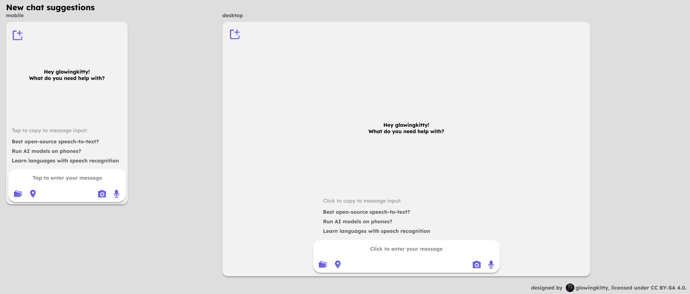
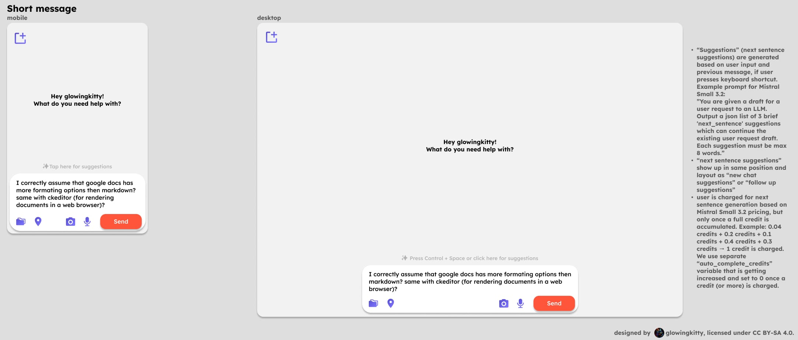
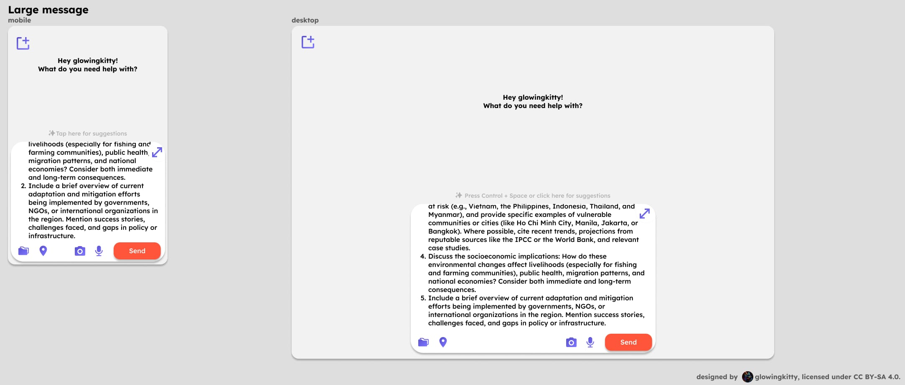
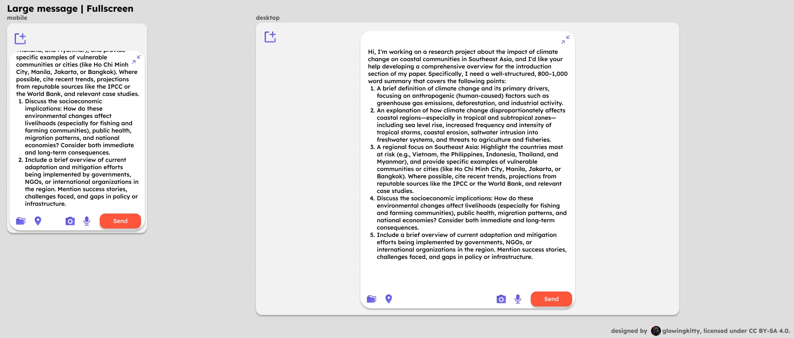
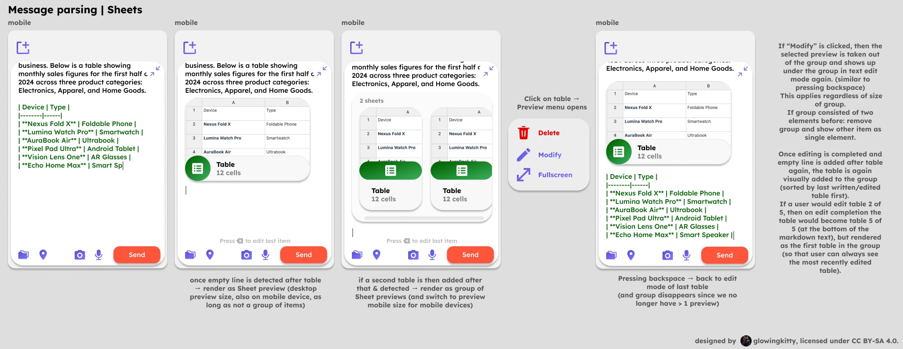
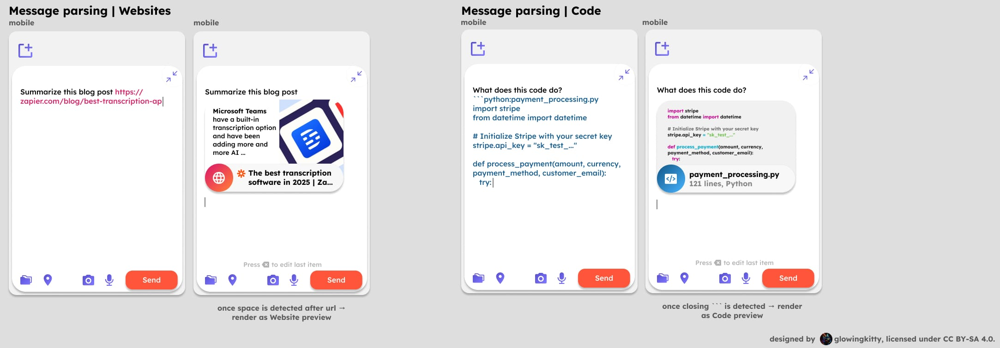
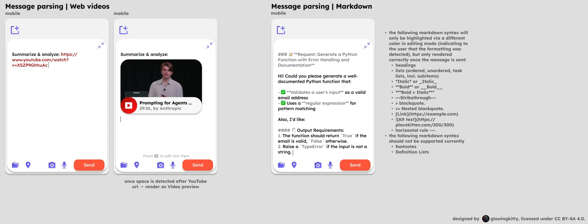

# Message input field architecture

The message input field is the field that allows the user to send messages to their digital team mates.

> Note: The architecture is still in development and not yet fully implemented.

## New chat suggestions

> Note: Not yet implemented.

[](https://www.figma.com/design/PzgE78TVxG0eWuEeO6o8ve/Website?node-id=3554-60874&t=vQbeWjQG2QtbTDoL-4)

"New chat suggestions" are shown when the user opens an empty new chat. The suggestions are generated with every new message sent by the user - see [message_processing.md #post-processing](./message_processing.md#post-processing) for more details.

## Short message

> Note: "Next sentence" suggestions are not yet implemented.

[](https://www.figma.com/design/PzgE78TVxG0eWuEeO6o8ve/Website?node-id=3556-61099&t=vQbeWjQG2QtbTDoL-4)

The message input field height is adapting to the height of the text in the field.
Once a certain max height is reached, the layout switches to "Large message" layout.
When the message input field is not empty, the 'Send' button shows up in the bottom right corner of message input field, moving the camera and recording buttons to the left. When the message input field is empty again, the buttons move back to the right and the 'Send' button disappears.

### Next sentence suggestions

Next sentence suggestions can be triggered manually by user interacting with "Press Control + Space or click here for suggestions" text.

- “Suggestions” (next sentence suggestions) are generated based on user input and previous message, if user presses keyboard shortcut or clicks on "Press Control + Space or click here for suggestions" text. Example prompt for Mistral Small 3.2:

```text
You are given a draft for a user request to an LLM. Output a json list of 3 brief 'next_sentence' suggestions which can continue the existing user request draft. Each suggestion must be max 8 words.
```

- “Next sentence suggestions” show up in same position and layout as “new chat suggestions” or “follow up suggestions”
- User is charged for next sentence generation based on Mistral Small 3.2 pricing, but only once a full credit is accumulated. Example: 0.04 credits + 0.2 credits + 0.1 credits + 0.4 credits + 0.3 credits → 1 credit is charged. We use separate “auto_complete_credits” variable that is getting increased and set to 0 once a credit (or more) is charged.


## Large message

[](https://www.figma.com/design/PzgE78TVxG0eWuEeO6o8ve/Website?node-id=3556-61259&t=vQbeWjQG2QtbTDoL-4)

When the max message input field height is reached, then the text will be cut off visually at the top (should be combined with a way that prevents super long text that isn't visible currently from being rendered in the DOM). "Fullscreen" button shows up in the top right corner of message input field.

When the user scrolls within the chat history, minimize the message input field height so the user sees the last few lines of his input, but sees also more from the chat history.

## Large message | Fullscreen

[](https://www.figma.com/design/PzgE78TVxG0eWuEeO6o8ve/Website?node-id=3556-61446&t=vQbeWjQG2QtbTDoL-4)

When the user clicks on "Fullscreen" button, the message input field will be expanded to the full height of the screen and the "Fullscreen" button will be replaced with "Minimize" button.

## Message parsing | Sheets

[](https://www.figma.com/design/PzgE78TVxG0eWuEeO6o8ve/Website?node-id=3556-61591&t=vQbeWjQG2QtbTDoL-4)

The message input is continuously parsed. Once the parsing detects a started table like in this message:

````markdown
I'm analyzing sales data for a small retail business. Below is a table showing monthly sales figures for the first half of 2024 across three product categories: Electronics, Apparel, and Home Goods.

| Device | Type |
|--------|------|
| **Nexus Fold X** | Foldable Phone |
| **Lumina Watch Pro** | Smartwatch |
| **AuraBook Air** | Ultrabook |
| **Pixel Pad Ultra** | Android Tablet |
| **Vision Lens One** | AR Glasses |
| **Echo Home Max** | Smart Sp
````

The table text will be highlighted in "Edit mode".

### Sheets | Highlight in "Edit mode"

The table text will be rendered in the color `#006400`, to indicate to the user that a Sheet was detected and will be rendered as a Sheets preview, once the user adds an empty line below the table to close it. See [apps/sheets.md](./apps/sheets.md) for more details and screenshots.

Figma design: [Sheets | Highlight in "Edit mode" | Mobile](https://www.figma.com/design/PzgE78TVxG0eWuEeO6o8ve/Website?node-id=3556-61685&t=vQbeWjQG2QtbTDoL-4)

### Sheets | One preview block

The preview block will be rendered as the `Finished` `Desktop` preview of the Sheets document if its a single item. See [apps/sheets.md](./apps/sheets.md) for more details and screenshots.

Figma design: [Sheets | One preview block | Mobile](https://www.figma.com/design/PzgE78TVxG0eWuEeO6o8ve/Website?node-id=3556-61701&t=vQbeWjQG2QtbTDoL-4)

### Sheets | Multiple preview blocks

Once multiple items are detected, the preview blocks will be rendered as the `Finished` `Mobile` preview of the Sheets document. See [apps/sheets.md](./apps/sheets.md) for more details and screenshots.

Figma design: [Sheets | Multiple preview blocks | Mobile](https://www.figma.com/design/PzgE78TVxG0eWuEeO6o8ve/Website?node-id=3556-61728&t=vQbeWjQG2QtbTDoL-4)

### Sheets | Preview Click-menu

If the user clicks/taps on a preview block, a click-menu will show up with the following options:

- "Delete" -> deletes the preview block
- "Edit" -> switches back to edit mode and remove the preview block
- "Fullscreen" -> opens the Sheets in fullscreen mode (see [apps/sheets.md#sheet--finished--fullscreen-view](./apps/sheets.md#sheet--finished--fullscreen-view))

Figma design: [Preview Click-menu](https://www.figma.com/design/PzgE78TVxG0eWuEeO6o8ve/Website?node-id=3556-61765&t=vQbeWjQG2QtbTDoL-4)

The same applies not just to sheet blocks, but to all preview blocks, like websites, code, docs, etc.

### Pressing backspace

When the user presses backspace after a preview block or group of preview blocks, the last preview block will be deleted and switched back to edit mode. Regardless of the type of preview block.

Figma design: [Pressing backspace](https://www.figma.com/design/PzgE78TVxG0eWuEeO6o8ve/Website?node-id=3556-61774&t=vQbeWjQG2QtbTDoL-4)


## Message parsing | Websites & Code

[](https://www.figma.com/design/PzgE78TVxG0eWuEeO6o8ve/Website?node-id=3556-61919&t=vQbeWjQG2QtbTDoL-4)

### Websites

The message input is continuously parsed. Once the parsing detects a started URL like in this message:

````markdown
Summarize this blog post https://zapier.com/blog/best-transcription-ap
````

The URL text will be highlighted in "Edit mode".


#### Websites | Highlight in "Edit mode"

The URL text will be highlighted in the color `#DE1E66`, to indicate to the user that a Website was detected and will be rendered as a Website preview, once the user enters a space after the url or new line. See [apps/web.md](./apps/web.md) for more details and screenshots.

Figma design: [Websites | Highlight in "Edit mode" | Mobile](https://www.figma.com/design/PzgE78TVxG0eWuEeO6o8ve/Website?node-id=3556-62168&t=vQbeWjQG2QtbTDoL-4)

#### Websites | One preview block

The preview block will be rendered as the `Finished` `Desktop` preview of the Website. See [apps/web.md](./apps/web.md) for more details and screenshots.

Figma design: [Websites | One preview block | Mobile](https://www.figma.com/design/PzgE78TVxG0eWuEeO6o8ve/Website?node-id=3556-62184&t=vQbeWjQG2QtbTDoL-4)

#### Websites | Multiple preview blocks

Once multiple items are detected, the preview blocks will be rendered as the `Finished` `Mobile` preview of the Website. See [apps/web.md](./apps/web.md) for more details and screenshots.

#### Websites | Preview Click-menu

If the user clicks/taps on a preview block, a click-menu will show up with the following options:

- "Delete" -> deletes the preview block
- "Edit" -> switches back to edit mode and remove the preview block
- "Fullscreen" -> opens the Website in fullscreen mode (see [apps/web.md#website--finished--fullscreen-view](./apps/web.md#website--finished--fullscreen-view))

Figma design: [Preview Click-menu](https://www.figma.com/design/PzgE78TVxG0eWuEeO6o8ve/Website?node-id=3556-61765&t=vQbeWjQG2QtbTDoL-4)

The same applies not just to website blocks, but to all preview blocks, like sheets, code, docs, etc.

### Code

The message input is continuously parsed. Once the parsing detects a started code block using \``` as a start, the code block will be highlighted in "Edit mode", like in this message:

````markdown
What does this code do?
```python:payment_processing.py
import stripe
from datetime import datetime

# Initialize Stripe with your secret key
stripe.api_key = "sk_test_..."

def process_payment(amount, currency, payment_method, customer_email):
   try:
````

#### Code | Highlight in "Edit mode"

The code block will be highlighted in the color `#155D91`, to indicate to the user that a Code block was detected and will be rendered as a Code preview, once the user enters the closing \```. See [apps/code.md](./apps/code.md) for more details and screenshots.

Figma design: [Code | Highlight in "Edit mode" | Mobile](https://www.figma.com/design/PzgE78TVxG0eWuEeO6o8ve/Website?node-id=3556-62203&t=vQbeWjQG2QtbTDoL-4)

#### Code | One preview block

The preview block will be rendered as the `Finished` `Desktop` preview of the Code. See [apps/code.md](./apps/code.md) for more details and screenshots.

Figma design: [Code | One preview block | Mobile](https://www.figma.com/design/PzgE78TVxG0eWuEeO6o8ve/Website?node-id=3556-62218&t=vQbeWjQG2QtbTDoL-4)


#### Code | Multiple preview blocks

Once multiple items are detected, the preview blocks will be rendered as the `Finished` `Mobile` preview of the Code. See [apps/code.md](./apps/code.md) for more details and screenshots.

#### Code | Preview Click-menu

If the user clicks/taps on a preview block, a click-menu will show up with the following options:

- "Delete" -> deletes the preview block
- "Edit" -> switches back to edit mode and remove the preview block
- "Fullscreen" -> opens the Code in fullscreen mode (see [apps/code.md#code--finished--fullscreen-view](./apps/code.md#code--finished--fullscreen-view))

Figma design: [Preview Click-menu](https://www.figma.com/design/PzgE78TVxG0eWuEeO6o8ve/Website?node-id=3556-61765&t=vQbeWjQG2QtbTDoL-4)

The same applies not just to code blocks, but to all preview blocks, like websites, sheets, docs, etc.

## Message parsing | Web videos & Markdown

[](https://www.figma.com/design/PzgE78TVxG0eWuEeO6o8ve/Website?node-id=3556-62364&t=vQbeWjQG2QtbTDoL-4)

### Web videos

The message input is continuously parsed. Once the parsing detects a started YouTube URL like in this message:

````markdown
Summarize & analyze: https://www.youtube.com/watch?v=XSZP9GhhuAc
````

#### Web videos | Highlight in "Edit mode"

The YouTube URL text will be highlighted in the color `#A70B09`, to indicate to the user that a Web video was detected and will be rendered as a Web video preview, once the user enters a space after the url or new line. See [apps/videos.md](./apps/videos.md) for more details and screenshots.

Figma design: [Web videos | Highlight in "Edit mode" | Mobile](https://www.figma.com/design/PzgE78TVxG0eWuEeO6o8ve/Website?node-id=3556-62571&t=vQbeWjQG2QtbTDoL-4)

#### Web videos | One preview block

The preview block will be rendered as the `Finished` `Desktop` preview of the Web video. See [apps/videos.md](./apps/videos.md) for more details and screenshots.

Figma design: [Web videos | One preview block | Mobile](https://www.figma.com/design/PzgE78TVxG0eWuEeO6o8ve/Website?node-id=3556-62586&t=vQbeWjQG2QtbTDoL-4)

#### Web videos | Multiple preview blocks

Once multiple items are detected, the preview blocks will be rendered as the `Finished` `Mobile` preview of the Web video. See [apps/videos.md](./apps/videos.md) for more details and screenshots.

#### Web videos | Preview Click-menu

If the user clicks/taps on a preview block, a click-menu will show up with the following options:

- "Delete" -> deletes the preview block
- "Edit" -> switches back to edit mode and remove the preview block
- "Fullscreen" -> opens the Web video in fullscreen mode (see [apps/videos.md#web-videos--finished--fullscreen-view](./apps/videos.md#web-videos--finished--fullscreen-view))

Figma design: [Preview Click-menu](https://www.figma.com/design/PzgE78TVxG0eWuEeO6o8ve/Website?node-id=3556-61765&t=vQbeWjQG2QtbTDoL-4)


### Markdown

The following markdown syntax will only be highlighted via a different color in editing mode (indicating to the user that the formatting was detected), but only rendered correctly once the message is sent and added to the chat history:

- headings
- lists (ordered, unordered, task lists, incl. subitems)
- *Italic* or _Italic_
- **Bold** or __Bold__
- ***Bold + Italic***
- ~~Strikethrough~~
- > blockquote.
- >> Nested blockquote. 
- [Link](https://example.com)
- 
- horizontal rule

The following markdown syntax should not be supported currently:

- footnotes
- Definition Lists

#### Markdown | Highlight in "Edit mode"

The markdown text will be highlighted in the color `#6A737D`, to indicate to the user that Markdown formatting was detected and will be rendered in the chat history, once the user sends the message.

Figma design: [Markdown | Highlight in "Edit mode" | Mobile](https://www.figma.com/design/PzgE78TVxG0eWuEeO6o8ve/Website?node-id=3556-62605&t=vQbeWjQG2QtbTDoL-4)
