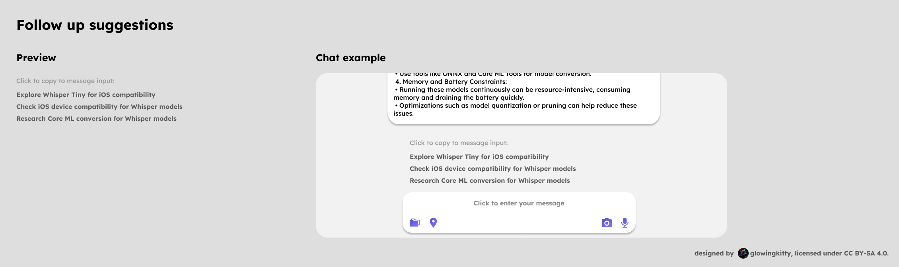
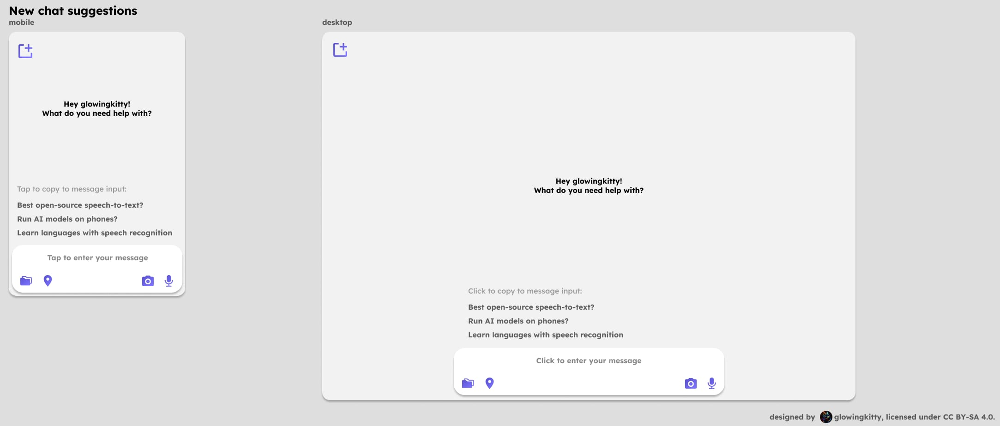

# Message processing architecture

> Zero-knowledge architecture where server processes decrypted content on-demand from client.

## Zero-Knowledge Architecture Overview

**Core Principle**: Server never has decryption keys and can only process messages when client provides decrypted content on-demand.

**Flow**:
1. Client encrypts all messages with chat-specific keys
2. Server stores only encrypted messages (cannot decrypt)
3. When processing needed, client decrypts and sends clear text to server
4. Server processes clear text (temporary cache for last 3 chats)
5. Server streams response to client
6. Client encrypts response and stores on server

## Pre-Processing

**Input**: Decrypted chat history provided by client (server cannot decrypt stored data)

- Split chat history into blocks of 70.000 tokens max
- send separate request for every 70.000 tokens, to be processed simultaneously
- then extract max harmful value, last language code, etc.
- LLM request to mistral small 3.2
- system prompt:
    - requests a json output via function calling
        - language_code: language code of the last user request (default: EN)
- extract request category and therefore mate (software, marketing, etc.)
- define best fitting LLM for request based on complexity/usecase
- detect harmful / illegal requests
- detect which app settings & memories need to be requested by user to hand over to main processing (and requests those data via websocket connection)
- "tags" field, which outputs a list of max 10 tags for the request, based on which the frontend will send the top 3 "similar_past_chats_with_summaries" (and allow user to deactivate that function in settings)
- "prompt_injection_chance" -> extract chance for prompt injection, to then include in system prompt explicit warning to not follow request but continue the conversation in a better direction
- "icon_names" -> which icon names to consider from the Lucide icon library

## Main-processing

**Input**: Decrypted chat history and user data provided by client

- LLM request to model selected by pre-processing
- system prompt:
    - is built up based on multiple instruction parts:
        1. Focus instruction (if focus mode active for chat)
        2. Base ethics instruction
        3. Mate specific instruction
        4. Apps instruction (about how to decide for which app skills/focus modes?)
- input:
	- chat history (decrypted by client)
	- similar_past_chats (based on pre-processing)
	- user data
		- interests (related to request or random, for privacy reasons. Never include all interests to prevent user detection.)
		- preferred learning style (visual, auditory, repeating content, etc.)
- assistant creates response & function calls when requested (for starting focus modes and app skills)

**Output**: Clear text response streamed to client (client will encrypt before storage)

## Post-Processing

- LLM request to mistral small 3.2 if text only or Gemini 2.5 Flash Lite if text + images
- system prompt:
		- include ethics system prompt
    - requests a json output via function calling
- include:
	- system prompt
	- interests of user (?)
- generates list of 6 [“followup_request_suggestions”](./message_processing.md#follow-up-suggestions) for current chat, based on last assistant response and previous user message 
- generates [“new_chat_request_suggestions"](./message_processing.md#new-chat-suggestions) which are shown for new chats
- consider learning type of user (if they prefer learning visually with videos, read books, or other methods)
- for topics which look like something the user wants to likely learn again, reserve one question for learning specific follow up question ("Test me about this topic", "Prepare me for an upcoming test", "Repeat teaching me about this every week", etc.)
- ["chat_summary"](./message_processing.md#chat-summary) field, which takes the previous chat summary (if it exists) + the last user message and assistant response to create an updated chat summary (2,3 sentences.)
- ["tags"](./message_processing.md#chat-tags) field, which outputs a list of max 10 tags based on the existing tags for the chat (if they exists) + the last user message and assistant response to create an updated tags list
- "harmful_response" from 0 to 10, to detect if assistant possibly gave a harmful response and if so; consider reprocessing
- idea: "new_learnings" parameter to better collect new learnings?
- question: how to consider user interests without accidentally creating tracking profile of user?
- also auto parse any urls in response and check if they are valid links (if 404 error, then replace with brave search?)

**Output**: Post-processing results sent to client (client will encrypt before storage)

## Topic specific post-processing

- for example: for software development related requests, also check generated code for security flaws, if comments and reasoning for decisions is included, if it violates requirements, if docs need to be updated, if files are so long that they should be better split up, if the files, duplicate code, compiler errors, etc. -> generate "next step suggestions" in addition to follow up questions


## Storage constraints and parsing implications

When local storage is constrained (e.g., IndexedDB quota), parsing and rendering should remain responsive by relying on lightweight nodes and on-demand content loading.

- Lightweight parsing output
    - `parse_message()` emits minimal embed nodes (id, type, status, contentRef, contentHash?, small metadata). It never stores full preview text in the node.
    - Previews are derived at render time from the ContentStore; if missing, show a placeholder and load on-demand when user enters fullscreen.

- Behavior under budget pressure
    - If the sync layer stored only metadata (no message bodies), `parse_message()` can still render previews from existing `contentRef` (if present) and show truncated text around them.
    - For fullscreen, the UI attempts rehydration via `contentRef`. If missing locally due to eviction, it requests content on-demand (or reconstructs from canonical markdown if available).

- Streaming backpressure
    - During streaming, avoid persisting intermediate states when space is tight. Keep in-memory and finalize once the message ends; then persist only the minimal node + `cid` mapping.
    - If final persistence exceeds budget, persist only references (`cid`) and drop inline/full content from cache.

- Copy/paste resilience
    - Clipboard JSON (`application/x-openmates-embed+json`) can include `inlineContent` to enable reconstruction even when the target device lacks the `cid` payload.


### Follow up suggestions

[](https://www.figma.com/design/PzgE78TVxG0eWuEeO6o8ve/Website?node-id=3469-39197&t=vQbeWjQG2QtbTDoL-4)

#### Follow up suggestions | Idea

User should be engaged to ask follow up questions, to dig deeper and learn a topic better, while also discovering new OpenMates App skills and features. Follow ups can include for example: learning more about specific topics, instructions to use specific app skills like web search, image generation, etc., instructions to start specific focus modes, and more.


#### Follow up suggestions | Implementation

- 6 follow up request suggestions for the current chat are generated
- generated based on:
    - systemprompt:
        - ethics prompt
        - mate prompt
        - focus mode prompt (if active)
    - last user request
    - last assistant response
    - (for more details check [backend/apps/ai/base_instructions.yml](../../backend/apps/ai/base_instructions.yml))
- always shows first 3 generated requests of total of 6 generated requests
- when user types, it auto searches/filters the suggestions based on current message input
- if message input string is not contained in any suggestion, show no suggestions
- requests stored in chat entry on client under 'follow_up_request_suggestions' field (and always replaced once the next assistant response for the chat is completed)

**Example output:**

```json
{
    // ...
    "follow_up_request_suggestions": [
        "Explore Whisper Tiny for iOS compatibility",
        "Check iOS device compatibility for Whisper models",
        "Research Core ML conversion for Whisper models",
        "Compare Whisper accuracy with Apple's on-device speech recognition",
        "Can Whisper run offline on mobile devices efficiently?",
        "How to fine-tune Whisper for custom accents or languages?"
    ]
    // ...
}
```

### New chat suggestions

[](https://www.figma.com/design/PzgE78TVxG0eWuEeO6o8ve/Website?node-id=3554-60874&t=vQbeWjQG2QtbTDoL-4)

#### New chat | Idea

When user starts a new chat, the assistant should suggest a list of new chat request suggestions, to help the user to start a new chat and explore new topics, OpenMates App skills and features. New chat suggestions can include for example: learning more about specific topics, instructions to use specific app skills like web search, image generation, etc., instructions to start specific focus modes, and more.

#### New chat | Implementation

- 6 new chat request suggestions are generated
- generated based on:
    - systemprompt:
        - ethics prompt
        - mate prompt
        - focus mode prompt (if active)
    - last user request
    - last assistant response
    - (for more details check [backend/apps/ai/base_instructions.yml](../../backend/apps/ai/base_instructions.yml))
- 50 most recent 'new_chat_request_suggestions' are stored in indexeddb under separate key
- always shows 3 randomly selected requests from all 'new_chat_request_suggestions'
- when user types, it auto searches/filters the suggestions based on current message input
- if message input string is not contained in any suggestion, show no suggestions

**Example output (post-processing response):**

```json
{
    // ...
    "new_chat_request_suggestions": [
        "Whisper for offline voice notes",
        "Best open-source speech-to-text?",
        "Auto-subtitle local videos",
        "Run AI models on phones?",
        "How is AI optimized for mobile chips?",
        "Learn languages with speech recognition"
    ]
    // ...
}
```

> Those requests will be added to existing users 'new_chat_request_suggestions' list to the top, and the first 50 will be stored in indexeddb under 'new_chat_request_suggestions' key.


### Chat summary

#### Chat summary | Idea

The chat summary is a short summary of the chat, which is typically not shown to the user directly but used for new requests to the assistant so it has a context of the previous chats.

#### Chat summary | Implementation

- generated during post-processing
- input:
    - previous chat summary (if it exists)
    - last user request
    - last assistant response
- output:
    - new chat summary (2-3 sentences)
- include general app settings & memories which are included, but not the actual details (strip them out before generating the summary)

**Example output:**

```json
{
    // ...
    "chat_summary": "User asked about Whisper for iOS compatibility and how to implement it and assistant explained its compatibility and how to implement it."
    // ...
}
```


### Chat tags

#### Chat tags | Idea

The chat tags are a list of tags for the chat, which are used to categorize the chat and to help the user to find the chat again.

#### Chat tags | Implementation

- generated during post-processing
- input:
    - previous chat tags (if it exists)
    - last user request
    - last assistant response
- output:
    - new chat tags (max 10 tags)
- include general app settings & memories which are included, but not the actual details (strip them out before generating the tags)

**Example output:**

```json
{
    // ...
    "chat_tags": ["Whisper", "iOS", "Compatibility", "Implementation"]
    // ...
}
```

### User message shortening

[](https://www.figma.com/design/PzgE78TVxG0eWuEeO6o8ve/Website?node-id=3544-39158&t=vQbeWjQG2QtbTDoL-4)

#### User message shortening | Idea

When the user message is too long, it should be shortened to a maximum length, so the user isn't scrolling forever.

#### User message shortening | Implementation

- only user messages are shortened
- shorten text rendered in DOM to first X words or X lines (use js, not webkit-line-clamp, also count in preview blocks as multiple lines of text, so messages with lots of preview blocks aren’t getting bloated)
- load & decrypt & parse full message from indexedDB when clicking on ‘Click to show full message’ cta at the bottom of the user message

Figma design: [User message shortened](https://www.figma.com/design/PzgE78TVxG0eWuEeO6o8ve/Website?node-id=3544-39320&t=vQbeWjQG2QtbTDoL-4)

> Question: how to better detect if user is asking for advice on how to self harm, how to harm others or how to do something illegal - over a longer conversation, and still remain reliable. (see openai case where chatgpt gave suicide instructions to teenager). Add "conversat_safety_score" that accumulates over time?

# Example enhancement to your pre-processing
harmful_content_detection:
  categories:
    - direct_self_harm
    - indirect_self_harm  
    - gradual_escalation_patterns
    - emotional_distress_indicators
  response_actions:
    - refuse_and_redirect
    - provide_crisis_resources  
    - flag_for_human_review
    - terminate_conversation

> Idea: add mate specific pre-processing? for example for software dev topics -> does request likely require folder / project overview? (if so, we would include that in vscode extension)