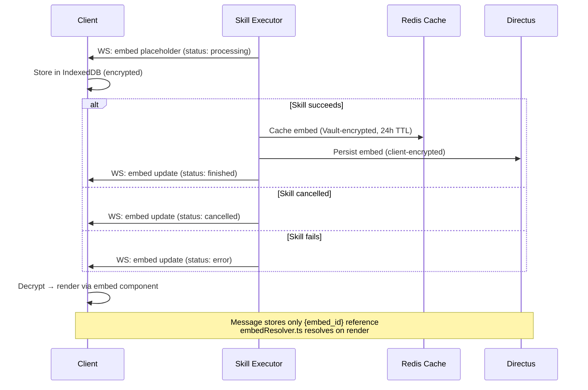

# Embeds Architecture

> Embeds are first-class entities stored independently from messages, enabling independent updates, cross-chat references, and zero-knowledge encryption per embed.

## Why This Exists

- Messages shouldn't contain heavy structured data inline → separate entity
- Long-running tasks (image gen, web search) need to update results without touching the message
- Embeds need independent sharing (share a code snippet without sharing the whole chat)
- Zero-knowledge requires encryption at the embed level, not just chat level
- Server needs fast cached access for AI context without breaking zero-knowledge for permanent storage

## How It Works

- User sends message → server dispatches skills via [skill_executor.py](../../backend/apps/ai/processing/skill_executor.py)
- Skill creates embed placeholder (status: `processing`) → sent to client via WebSocket
- Client stores in [EmbedStore](../../frontend/packages/ui/src/services/embedStore.ts) (IndexedDB, encrypted)
- Skill completes → updates embed (status: `finished`) → persisted to Directus (encrypted)
- Client receives update → decrypts → renders via embed preview component
- Message markdown has lightweight JSON reference block with `embed_id`
- On render, [embedResolver.ts](../../frontend/packages/ui/src/services/embedResolver.ts) resolves references to actual content

## Encryption

- **Directus (permanent):** client-encrypted with `embed_key` — zero-knowledge
- **Redis cache:** vault-encrypted — server can decrypt for AI, 24h TTL
- **IndexedDB:** client-encrypted with master key — decrypted on-demand
- **Sharing:** embed key in URL fragment (never sent to server)
- Key wrapping in `embed_keys` collection — master wrapper + per-chat wrapper for offline sharing
- See [security.md](../core/security.md) for encryption tier details

## Edge Cases

- **Skill cancellation:** individual skill cancel without stopping AI → `SkillCancelledException` in [skill_executor.py](../../backend/apps/ai/processing/skill_executor.py) → embed status `cancelled`
- **Cache miss:** [embedResolver.ts](../../frontend/packages/ui/src/services/embedResolver.ts) fetches from Directus on miss — never terminal error
- **Composite embeds:** `app_skill_use` contains `embed_ids` → child embeds loaded via `_load_and_cache_embeds_for_chats()` in [user_cache_tasks.py](../../backend/core/api/app/tasks/user_cache_tasks.py)
- **Cross-chat access:** owner uses master key wrapper; recipient uses chat key wrapper from share link
- **Stale vault keys:** cache decryption fails → request from client → re-cache (same pattern as [message-processing.md](./message-processing.md))
- **Duplicate detection:** `content_hash` (SHA256) used for code/file/sheet/document embeds — [embed_service.py](../../backend/core/api/app/services/embed_service.py)

## Data Structures

### `embeds` Collection (Directus)

| Field | Type | Purpose |
|-------|------|---------|
| `embed_id` | string | Client-generated UUID v4 |
| `hashed_chat_id` | string | SHA256(chat_id) — privacy: server can't link to chat |
| `hashed_message_id` | string | SHA256(message_id) — nullable for multi-message embeds |
| `hashed_task_id` | string | SHA256(task_id) — for long-running task updates |
| `encrypted_type` | string | Embed type, encrypted client-side |
| `status` | string | `processing` / `finished` / `error` / `cancelled` |
| `encrypted_content` | text | TOON/JSON content, encrypted |
| `encrypted_text_preview` | text | Lightweight preview for fast rendering |
| `content_hash` | string | SHA256 for dedup (code, file, sheet, document) |
| `text_length_chars` | int | Char count for LLM compression decisions |
| `share_mode` | string | `private` / `shared_with_user` / `public` |
| `embed_ids` | json | Child embed IDs for composite `app_skill_use` embeds |

Full schema: [app_metadata_schemas.py](../../backend/shared/python_schemas/app_metadata_schemas.py)

### Embed Types (`encrypted_type` values)

`app_skill_use` · `website` · `place` · `event` · `code` · `application` · `file` · `sheet` · `document` · `image` · `video` · `audio` · `pdf`

### Application Embeds

Application embeds are Code app parent embeds for generated multi-file web apps.
The parent embed stores only a project manifest: app name, framework/runtime,
entrypoints, and `file_refs` / `asset_refs` that map logical sandbox paths to
child `code-code`, image, or file embeds. The durable source of truth remains the
encrypted parent manifest plus encrypted child embeds; OpenMates does not store a
full rendered DOM snapshot.

Live previews run only after an explicit user action. The backend creates a
viewer-scoped E2B sandbox session, writes the selected generated files/assets into
that sandbox, and returns a short-lived preview URL under the configured
`APPLICATION_PREVIEW_ORIGIN` user-content site. Clients load that URL in an
iframe or WKWebView; generated application JavaScript never runs on the OpenMates
app/API origin and never receives OpenMates auth cookies, vault keys, provider
API keys, or raw E2B traffic tokens.

Each preview session belongs to exactly one authenticated viewer. Shared-chat
recipients start their own isolated sandbox and are billed for their own preview
runtime; they do not attach to, reuse, or charge the creator's sandbox session.
The gateway stores only a hash of the path token, redacts `/p/<session>/<token>/`
URLs from logs, and proxies sandbox traffic server-side so raw E2B URLs remain
server-only.

### `embed_keys` Collection

| key_type | wrapping | use case |
|----------|----------|----------|
| `master` | `AES(embed_key, master_key)` | Owner cross-chat access |
| `chat` | `AES(embed_key, chat_key)` | Shared chat recipient access |

### TOON Format

- Token-Oriented Object Notation — 30-60% smaller than JSON
- Conversion in [main_processor.py](../../backend/apps/ai/processing/main_processor.py) — skills only return JSON
- Stored as-is; decoded on-demand for rendering or AI context

<!-- TODO: screenshot (1000x400) — embed in processing, finished, and error states side by side -->

## Improvement Opportunities

> **Improvement opportunity:** Batch query child embeds by `embed_id` array instead of individual queries per composite embed
> **Implemented:** Embed content versioning via diff-based editing — see [Embed Diff-Based Editing](./embed-diff-editing.md)

## Related Docs

- [Message Processing](./message-processing.md) — embed resolution during AI inference
- [Embed Diff-Based Editing](./embed-diff-editing.md) — unified diff patching and version timeline
- [App Skills](../apps/app-skills.md) — skill execution that produces embeds
- [Security](../core/security.md) — encryption tiers and key wrapping
- [Sync](../data/sync.md) — embed sync across devices during login
- [Message Previews & Grouping](./message-previews-grouping.md) — embed preview rendering
