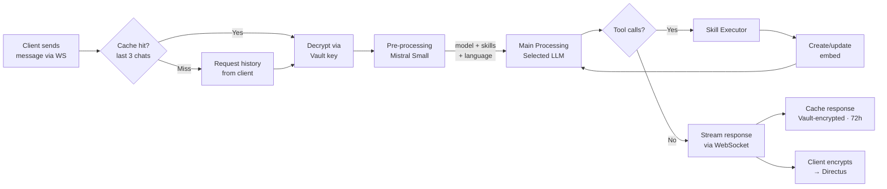

# Message Processing Architecture

> Three-stage pipeline (pre-processing → main → post-processing) with client-side encrypted permanent storage and a short-lived server-readable cache of the last 3 chats for fast follow-ups.

## Why This Exists

- Fast AI responses without re-sending full chat history every message
- Permanent storage is client-side encrypted — the persistence tier holds only ciphertext — so a server-readable cache is needed for AI follow-ups
- Different messages need different LLMs — pre-processing selects optimal model
- Growing skill count (35+ apps) requires intelligent tool filtering

## How It Works

- Client sends message via WebSocket → [chatSyncServiceSenders.ts `sendNewMessageImpl()`](../../frontend/packages/ui/src/services/chatSyncServiceSenders.ts)
- Server receives in [message_received_handler.py `handle_message_received()`](../../backend/core/api/app/routes/handlers/websocket_handlers/message_received_handler.py)
- Check cache for chat history (last 3 chats, vault-encrypted)
  - Cache hit → decrypt with `decrypt_with_user_key()` in [encryption.py](../../backend/core/api/app/utils/encryption.py)
  - Cache miss → send `request_chat_history` to client → client responds with decrypted history + embeds
- **Pre-processing** → select LLM, detect language, preselect skills, safety check
- **Main processing** → send to LLM with tools and context
- LLM calls skills → each creates/updates embeds
- Response streamed via [stream_consumer.py](../../backend/apps/ai/tasks/stream_consumer.py)
- Server caches assistant response via `_save_to_cache_and_publish()` in [stream_consumer.py](../../backend/apps/ai/tasks/stream_consumer.py)
- Client encrypts response → stores in Directus (ciphertext at rest; plaintext never written server-side)

## Dual-Cache Architecture

Two caches, different encryption, different purposes:

| Cache | Key pattern | Encryption | TTL | Purpose |
|-------|-------------|------------|-----|---------|
| **AI Inference** | `user:{id}:chat:{id}:messages:ai` | Vault (server can decrypt) | 72h | AI context for follow-ups |
| **Sync** | `user:{id}:chat:{id}:messages:sync` | Client-encrypted | 1h | Login sync (phases 1-3) |

- Why separate? AI cache needs server-readable encryption (Vault-wrapped, transient in RAM); sync cache holds client-encrypted blobs the server can only relay, not read. Mixing → decryption failures
- Implementation: [cache_chat_mixin.py](../../backend/core/api/app/services/cache_chat_mixin.py) — `add_ai_message_to_history()`, `get_ai_messages_history()`, `set_sync_messages_history()`
- Embeds cached separately: `embed:{embed_id}` — vault-encrypted, 24h TTL, global
- App settings/memories: `chat:{chat_id}:app_settings_memories:{app_id}:{item_key}` — auto-evicted with chat

### Cache Fallback Flow

- `get_chat_messages_history()` in [cache_chat_mixin.py](../../backend/core/api/app/services/cache_chat_mixin.py) → cache miss or decryption failure detected
- Server sends `request_chat_history` WebSocket event
- Client handles in `handleRequestChatHistoryImpl()` in [chatSyncServiceHandlersAI.ts](../../frontend/packages/ui/src/services/chatSyncServiceHandlersAI.ts) → loads from IndexedDB, sends decrypted
- Server re-encrypts with current vault key and caches for future

## Pre-Processing

- **Model:** `mistral-small-2506` (Mistral Small) — see [preprocessing model comparison](../ai/preprocessing-model-comparison.md) for why
- **Implementation:** [preprocessor.py](../../backend/apps/ai/processing/preprocessor.py)
- **Config:** [base_instructions.yml](../../backend/apps/ai/base_instructions.yml)
- **Outputs:**
  - `language_code` — language of last user message
  - `selected_model` + `selection_reason` — optimal LLM
  - `relevant_app_skills` — preselected tools
  - `relevant_app_focus_modes` — preselected focus modes
  - `relevant_app_settings_and_memories` — data to request from client
  - `prompt_injection_chance` — safety score
  - `title`, `icon_names`, `category` — chat metadata (first message only, skipped if title exists)
  - `tags` — max 10 for similar past chat lookup

### Tool Preselection

- Pre-processing filters skills to only relevant ones
- Auto-excludes: uninstalled apps, skills needing unconnected accounts (`requires_account`)
- Validation in [apps.py `is_skill_available()`](../../backend/core/api/app/routes/apps.py)
- See [function-calling.md](../apps/function-calling.md) for scalability details

## Main Processing

- **Model:** selected by pre-processing (varies per request)
- **System prompt:** focus instruction + ethics + mate instruction + apps instruction
- **Implementation:** [main_processor.py](../../backend/apps/ai/processing/main_processor.py)
- Skills execute via [skill_executor.py](../../backend/apps/ai/processing/skill_executor.py) → results as embeds

## Post-Processing

- Follow-up suggestions generated after response completes
- See [followup-suggestions.md](../ai/followup-suggestions.md)

## Edge Cases

- **Stale vault keys:** decryption failure detected in [message_received_handler.py](../../backend/core/api/app/routes/handlers/websocket_handlers/message_received_handler.py) → falls back to requesting fresh history from client → re-caches
- **Skill cancellation:** individual skill cancel via `cancel_skill` WebSocket → `SkillCancelledException` in [skill_executor.py](../../backend/apps/ai/processing/skill_executor.py) → embed set to `cancelled`, AI continues
- **Chat history too large:** split into 70k token blocks, processed in parallel in [preprocessor.py](../../backend/apps/ai/processing/preprocessor.py)
- **First message metadata:** pre-processing generates title/icon/category — skipped for follow-ups (checks `current_chat_title` field)
- **Embed resolution during inference:** embed placeholders in cached messages resolved on-demand when building AI context, not at cache time
- **App settings not yet confirmed:** WebSocket notification sent to client (`request_app_settings_memories`), processing continues without waiting — user can confirm hours later

<!-- TODO: screenshot (1000x400) — message processing timeline showing pre/main/post stages -->

## Improvement Opportunities

> **Improvement opportunity:** PII pseudonymization before LLM — see [sensitive-data-redaction.md](../privacy/sensitive-data-redaction.md) for implementation options
> **Improvement opportunity:** Similar past chats feature — tags output used for frontend lookup, not yet fully implemented

## Related Docs

- [Embeds](./embeds.md) — skill results stored as embeds
- [App Skills](../apps/app-skills.md) — skill execution and cancellation
- [AI Model Selection](../ai/ai-model-selection.md) — model choice logic
- [Security](../core/security.md) — encryption tiers (vault vs. client)
- [Sync](../data/sync.md) — sync cache usage during login
- [Sensitive Data Redaction](../privacy/sensitive-data-redaction.md) — PII protection before LLM
