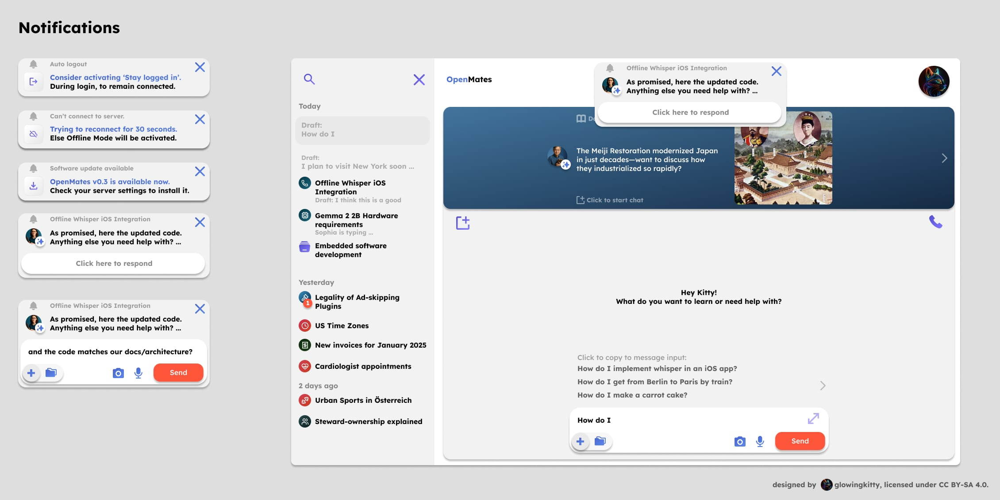

# Notifications architecture

> **Status**: ✅ In-app notifications implemented | 🚧 Push notifications in progress  
> **Last Updated**: 2026-02-02



## Overview

The notification system provides two types of notifications:

1. **In-app notifications (toasts/alerts)**: Displayed within the web app UI using the `Notification.svelte` component
2. **Push notifications (PWA/OS-level)**: System notifications that appear in the browser/OS notification center, even when the app is in the background

All notification types use the same visual design language for consistency.

**Current Scope**: Notifications are currently implemented only for the web app/PWA.

**Future Scope**: There is an option to add notification support to CLI/pip/npm packages in the future, which would allow programmatic access to notifications for developers and system administrators.

## Implementation

### Shared Component

All notifications are rendered using the shared `Notification.svelte` component located at `frontend/packages/ui/src/components/Notification.svelte`. The component uses a card-based design with the following structure:

- **Header**: Notification title with a bell icon on the left, and a close button in the top right corner
- **Main Icon**: Located on the left side of the card:
  - For message notifications: Profile picture with optional badge (e.g., star icon)
  - For system notifications: Purple system icons (logout arrow, disconnected chain, download arrow, etc.)
- **Message**: Formatted text on the right side with:
  - Bold text styling
  - Blue text for important/actionable parts
  - Black text for regular content
  - Multi-line support for longer messages
- **Close Button**: Located in the top right corner of each notification, allows users to dismiss individual notifications
- **Message Input** (for message notifications only):
  - A "Click here to respond" field at the bottom of the notification, spanning the full width of the notification card
  - On click, expands to show the full message input field inside the notification
  - Uses the same message input component as ActiveChat, providing consistent functionality for responding directly from notifications

Notifications are displayed as stacked cards with white backgrounds, rounded corners, and appear at the top of the main content area. The component is managed through the `notificationStore` which provides a centralized way to add, remove, and manage notifications across the application.

### Notification Types

#### Initial Implementation

The following notification types are implemented initially:

1. **New message completed in chat**
   - Triggered when a chat message response is completed
   - Displays profile picture of the sender with optional badge
   - Provides user feedback that their message has been processed
   - Includes a "Click here to respond" field at the bottom that expands to show the full message input field (same component as used in ActiveChat)
   - Allows users to respond directly from the notification without navigating to the chat

2. **Auto logout**
   - Triggered when the user is automatically logged out (e.g., due to session expiration, security reasons)
   - Uses logout icon (purple arrow exiting square)
   - Message suggests activating "Stay logged in" during login to remain connected

#### Future Additions

Additional notification types to be implemented over time:

1. **Software update available**
   - **Server admins only**: Only shown to users with administrative privileges
   - Uses download icon (purple arrow pointing down into square)
   - Notifies admins when a new software version is available (e.g., "OpenMates v0.3 is available now. Check your server settings to install it.")

2. **Can't connect to server**
   - Uses disconnected/broken chain icon (purple)
   - Triggered when connection to the server is lost
   - Message format: "Trying to reconnect for 30 seconds. Else Offline Mode will be activated."
   - Behavior depends on user's login preferences:
     - **If user selected "stay logged in" during login**:
       - Informs user about connection loss and reconnection attempt
       - Notifies that offline mode will be activated if reconnection fails
       - Allows continued use of the application in offline mode
     - **If user did NOT select "stay logged in"**:
       - User is automatically logged out once connection drops
       - If connection cannot be re-established after a few seconds, user is logged out
       - Notification informs user about the logout and connection issues

3. **Security notifications** (future)
   - Examples:
     - Login from other device
     - Suspicious activity detected
     - Password change notifications
     - Two-factor authentication events

## Push Notifications (PWA/OS-Level)

Push notifications allow users to receive notifications even when the OpenMates web app is not in the foreground. This includes support for:

- Browser notifications (Chrome, Firefox, Safari, Edge)
- PWA notifications on mobile (Android, iOS when added to home screen)
- Notification center integration on all platforms

### Platform Support

| Platform                     | Support    | Notes                                                                           |
| ---------------------------- | ---------- | ------------------------------------------------------------------------------- |
| **Chrome/Edge (Desktop)**    | ✅ Full    | Standard Web Push API                                                           |
| **Firefox (Desktop)**        | ✅ Full    | Standard Web Push API                                                           |
| **Safari (macOS)**           | ✅ Full    | Requires HTTPS, uses Web Push API (Safari 16+)                                  |
| **Android (Chrome/Firefox)** | ✅ Full    | Works as PWA or in browser                                                      |
| **iOS Safari**               | ⚠️ Limited | **Must be added to home screen as PWA first**, then permission can be requested |

### iOS PWA Requirements

For iOS devices, push notifications have specific requirements:

1. **Must be installed as PWA**: User must tap "Add to Home Screen" in Safari share menu
2. **Permission request timing**: Can only request permission after a user gesture (tap/click)
3. **Background limitations**: Notifications only work when app is in background, not when completely closed
4. **No service worker persistence**: iOS aggressively terminates service workers

### Permission Request Flow

#### When to Request Permission

Permission is requested **after the user sends their first message to an assistant** (and we haven't requested permission before). This timing is optimal because:

- User has shown engagement/intent with the app
- Context is highly relevant (they'll want to know when the assistant replies)
- Not intrusive on first page load
- Clear value proposition

#### In-Chat Permission Banner

When the user sends a message, a banner appears in the chat history **between the user message and the pending assistant response**:

```
┌─────────────────────────────────────────────────────────────┐
│  🔔  Want to receive notifications when your assistant      │
│      responds? Even when you're not in the app.             │
│                                                             │
│  [Enable Notifications]              [Not Yet]              │
└─────────────────────────────────────────────────────────────┘
```

**Banner Behavior:**

- Shows only once per chat (tracked by `pushNotificationBannerShownInChat` in chat state)
- If user clicks "Not Yet": Banner doesn't show again in **any** chat until next session
- If user ignores (doesn't interact): Banner may show again in the next chat
- If user clicks "Enable": Browser permission dialog appears, banner is dismissed
- Never shows if user has already granted or denied permission at the browser level
- Never shows multiple times in the same chat

**State Tracking:**

- `pushNotificationStore.bannerDismissedThisSession`: Set to `true` when user clicks "Not Yet"
- `pushNotificationStore.permissionRequested`: Set to `true` after first permission request
- Per-chat flag prevents duplicate banners in same chat

### Notification Categories

Users can configure which notifications they want to receive in **Settings > Chat > Notifications**:

| Category             | Description                                                        | Default     |
| -------------------- | ------------------------------------------------------------------ | ----------- |
| **New Messages**     | When an assistant completes a response in any chat                 | ✅ Enabled  |
| **Server Events**    | Important server status changes (connection issues, maintenance)   | ✅ Enabled  |
| **Software Updates** | When a new version of OpenMates is available (newsletter addition) | ❌ Disabled |

### Settings Menu Structure

A new "Chat" settings category is added with a "Notifications" submenu:

```
Settings
├── Usage
├── Billing
├── Chat                          ← NEW
│   └── Notifications             ← NEW
│       ├── Enable/Disable Push Notifications
│       ├── New Messages (toggle)
│       ├── Server Events (toggle)
│       └── Software Updates (toggle)
├── Interface
├── App Store
├── ...
```

### Technical Implementation

#### Frontend Components

- `PushNotificationBanner.svelte` - The in-chat permission request banner
- `SettingsChat.svelte` - Chat settings page
- `SettingsChatNotifications.svelte` - Notification preferences page

#### Stores

- `pushNotificationStore.ts` - Manages:
  - `permission`: Current browser permission state ('default' | 'granted' | 'denied')
  - `enabled`: User's preference to receive push notifications
  - `preferences`: Object with category toggles (newMessages, serverEvents, softwareUpdates)
  - `bannerDismissedThisSession`: Whether user clicked "Not Yet" this session
  - `subscription`: Current PushSubscription object (if any)

#### Service

- `pushNotificationService.ts` - Handles:
  - `requestPermission()`: Requests browser notification permission
  - `subscribe()`: Creates push subscription and sends to server
  - `unsubscribe()`: Removes push subscription
  - `showNotification()`: Displays a push notification (via service worker)
  - `checkSupport()`: Detects platform capabilities

#### Service Worker

The service worker (`sw.js`) handles:

- Receiving push events from the server
- Displaying notifications with appropriate icons and actions
- Handling notification clicks (navigating to relevant chat)
- Badge management for unread counts

### Important Notifications (Push)

The following notification types trigger push notifications (in addition to in-app notifications):

1. **New message completed in chat** - Users receive a system notification when their chat message is completed, allowing them to return to the conversation
2. **Software update available** - Server admins receive system notifications for critical updates (opt-in)
3. **Security-related notifications** (future) - Important security events like logins from other devices will trigger system notifications

### Reply to Notification (Future Enhancement)

We plan to add support for direct replies to notifications at the OS level via PWA functionality on supported platforms. This will allow users to respond to messages directly from system notifications without switching back to the application.

**Planned Features**:

- **macOS**: Users will be able to see notifications in the macOS notification center and reply directly to messages
- **Windows**: Similar reply functionality for Windows system notifications
- **Android**: Reply action for Android system notifications
- **Fallback**: On platforms without native reply support, notifications will open the relevant chat when clicked

**Implementation Approach**:

- Utilize the Notification API's `actions` property to add a reply action button
- Integrate with platform-specific notification features (e.g., reply boxes in macOS and Windows)
- Send the reply directly to the server with context about which chat/conversation it belongs to
- Provide visual feedback to confirm the message was sent

### Implementation Notes

- Push notifications require user permission (requested contextually after first message)
- Notifications should be actionable when possible (e.g., clicking a notification opens the relevant chat or page)
- Notification content should be concise but informative
- Respect user preferences for notification types (configurable in Settings > Chat > Notifications)
- Reply-to-notification will be prioritized for message notifications first, with potential expansion to other notification types
- Server must support Web Push Protocol (VAPID keys required)

## Integration with PWA & Offline Support

Notifications are implemented together with PWA (Progressive Web App) and offline support for the web app. This allows:

- Push notifications to work even when the app is in the background
- Offline mode notifications to inform users about connection status
- Cross-platform consistency in notification behavior (including iOS devices via PWA)
- Service worker caching for offline notification display

## Use Cases

### Responses to User Messages

Notifications are used to inform users when their messages have been processed and responses are ready, providing immediate feedback and improving user experience.

### Optional Social Media Posts & Promotions

Notifications can be used for optional social media posts and promotions, allowing users to directly ask questions or start conversations from these notifications. This provides an alternative to traditional social media or email for users who prefer not to use those platforms.

### Alternative Communication Channel

The notification system serves as an alternative to social media and email for users who prefer not to use those platforms, providing a direct communication channel within the application.

## Key Files

### Frontend

- [`Notification.svelte`](../../frontend/packages/ui/src/components/Notification.svelte) - In-app notification component
- [`ChatMessageNotification.svelte`](../../frontend/packages/ui/src/components/ChatMessageNotification.svelte) - Chat message notification with reply input
- [`PushNotificationBanner.svelte`](../../frontend/packages/ui/src/components/PushNotificationBanner.svelte) - In-chat permission request banner
- [`pushNotificationStore.ts`](../../frontend/packages/ui/src/stores/pushNotificationStore.ts) - Push notification state management
- [`pushNotificationService.ts`](../../frontend/packages/ui/src/services/pushNotificationService.ts) - Web Push API integration
- [`notificationStore.ts`](../../frontend/packages/ui/src/stores/notificationStore.ts) - In-app notification state
- [`SettingsChat.svelte`](../../frontend/packages/ui/src/components/settings/SettingsChat.svelte) - Chat settings page
- [`SettingsChatNotifications.svelte`](../../frontend/packages/ui/src/components/settings/chat/SettingsChatNotifications.svelte) - Notification preferences

### i18n

- [`notifications.yml`](../../frontend/packages/ui/src/i18n/sources/notifications.yml) - Notification translations

---

## Read Next

- [Sync Architecture](./sync.md) - How chat data is synchronized
- [Message Processing](./message_processing.md) - How AI messages are processed
- [Web App Architecture](./web_app.md) - Overall web app structure
