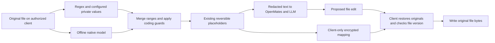

# Offline PII evaluation on the Linux dev server

Date: 2026-10-03. Task: TASK-5996. Session: 8c51.

The offline model is useful as an additional CLI detector. The optimized Q8 CPU
runtime is practical on this server; OpenAI's reference PyTorch runtime is too
slow on its older ARM CPU for routine file processing. Keep deterministic patterns
and configured private values, and add semantic detection with explicit safeguards
for coding content. This evaluation does **not** activate a model in the product.

## What was actually tested

OpenAI Privacy Filter is a local token classifier with eight categories: person,
address, email, phone, date, URL, account number and secret. It does not generate
answers. The published model is primarily English, so multilingual results cannot
be assumed reliable. [Official model card](https://huggingface.co/openai/privacy-filter).

Two implementations were run, with pinned code and weights:

| Implementation | Source revision | Weight revision |
| --- | --- | --- |
| OpenAI reference, PyTorch 2.8.0+cpu, original BF16 weights | `f7f00ca7fb869683eb732c010299d901457f19c3` | `openai/privacy-filter@7ffa9a043d54d1be65afb281eddf0ffbe629385b` |
| LocalAI C++/GGML, Q8 weights | `735a6c28607ee82afc3a670383f41b55266a3b9a` | `LocalAI-io/privacy-filter-GGUF@935d86882f4b5dc6e0eef05aae48ae5ba0a82a7a` |

The C++ implementation is third-party software, rather than OpenAI's supported
runtime. Its GGML submodule is pinned to
`3af5f5760e19a96427f5f7a93b79cbdf3d4b265b`. It exposes local classification with
UTF-8 byte offsets. [Runtime source](https://github.com/localai-org/privacy-filter.cpp),
[converted weights](https://huggingface.co/LocalAI-io/privacy-filter-GGUF).

The host has 16 ARM Neoverse-N1 cores, 30.54 GiB RAM, no swap, and approximately
15.5 GiB available at the start. Linux is 6.8.0-137-generic; Python is 3.12.3.
Inference used CPU affinity, lower process priority, and an RSS watchdog. No GPU
was used. Nothing was installed system-wide or changed in shared services.

Weights and dependencies were downloaded into a private evaluation directory,
then predictions ran offline. Final native profiles and the clean reference
profile also denied socket creation/connection through a process-local Linux
seccomp filter, including future inference threads. No real account data, Project
files or production credentials were scanned.

The quality set contains 56 synthetic cases: 50 sensitive values and 12 negative
coding/documentation cases. Inputs include support messages, JSON, code, logs,
multiple languages, unfamiliar names, multiline addresses, credential formats,
passphrases and split credentials. The baseline calls the **actual shared
OpenMates Project-file detector**, without user overrides. Two fixtures additionally
demonstrate explicitly configured private values. Its source matches `origin/dev`:

- `piiDetectionService.ts`: SHA-256 `853c4f933104a53caba60fb7248db335b9dffc244b4eaaa1b149c6ecdf1aaeb9`.
- `identifierRanges.ts`: SHA-256 `f3ff7568bfff437f016531ebaeaa192c4cf9ce8c306687e254b90a43429ae81c`.

## Disk and memory

GiB means 1,073,741,824 bytes. These are measured file sizes and process RSS,
not estimates from parameter counts.

| Measurement | Reference BF16 | Native Q8 |
| --- | ---: | ---: |
| Weight file | 2,798,984,088 bytes / 2.61 GiB | 1,637,572,192 bytes / 1.53 GiB |
| Additional runtime | Evaluation Python environment: about 600 MiB logical, including build tools | Built shared libraries plus CLI: 2.09 MiB |
| Resident RAM after load | 3.36 GiB | 1.68 GiB |
| Peak RSS in measured scan profiles | 4.06 GiB | Approximately 1.87 GiB through 4,096 tokens |
| New-process model/tokenizer load | 6.70 seconds in clean reference run | Approximately 1.5–2.0 seconds |

The evaluation environment retains both checkpoints and build tools. A native CLI
installation would not need PyTorch, Python, CMake or both weight formats. The
native model already contains its tokenizer; the evaluation's separate 3.45 MiB
tiktoken cache is used to count and construct comparable test inputs. Disk free
space changed during other host activity, so free-space deltas are not presented
as this evaluation's footprint. Startup measurements use the normal OS file cache;
they are not a cold-disk benchmark.

## CPU latency

The selected native build enables `armv8.2-a+fp16+dotprod`, supported by this host.
An initial generic ARM build was considerably slower; packaging must select a
compatible optimized CPU variant rather than silently falling back to scalar
execution. No x86 or GPU hardware was benchmarked.

Native table entries are the median of two warm scans of identical plain-text
inputs. Profiles ran sequentially, so their CPU timings do not compete with each
other. These small samples establish feasibility, rather than production p95s.

| Input tokens | 1 core | 2 cores | 4 cores |
| --- | ---: | ---: | ---: |
| 64 | 0.322 s | 0.166 s | 0.088 s |
| 256 | 1.257 s | 0.647 s | 0.330 s |
| 1,024 | 5.397 s | 2.701 s | 1.372 s |
| 4,096 | 21.050 s | 10.671 s | 5.451 s |

Across the short quality fixtures, the initial reference runtime had a median of
2.046 seconds; the generic native build's median was 0.259 seconds. The optimized
native build's quality-fixture median was 0.053 seconds. The reference's initial 1,024-token timing was
158.777 seconds, but part overlapped another evaluation on the same CPU cores.
Treat that figure as exploratory, not a controlled runtime comparison. Clean
two-core reference scans took 7.238 seconds for 64 tokens and 28.769 seconds for
256 tokens, versus 0.166 and 0.647 seconds for the optimized native two-core build.
Only one clean reference sample per length was collected because the feasibility
decision was already clear.

The native four-core worker also scanned 8,192 tokens in 16.210 seconds with
approximately 1.87 GiB peak RSS. Two roughly 5,300-token synthetic files placed
a name across, and an address near, the 4,096-token forward-window boundary:
both sensitive values were fully detected, with no source-text changes or
tokenizer warnings. These scans took 9.793 and 9.947 seconds. Overlapping context
adds work, so long-file latency should not be extrapolated directly from a single
4,096-token pass. The reference code splits disjoint windows; preserve overlap
if it is ever used for long Project files.

## Detection quality

Protection means all sensitive characters were included in detected ranges. A
German address was returned in two pieces separated by an unredacted comma and
space; it counts as protected content but not as a single fully covered raw
value. Credential punctuation is never ignored. Exact boundaries and labels are
also retained in the raw evidence.

| Category | Expected values | Existing default detector | Reference / native Q8 |
| --- | ---: | ---: | ---: |
| Private names | 13 | 0 | 12 |
| Private addresses | 7 | 0 | 7 |
| Email addresses | 6 | 6 | 6 |
| Phone numbers | 5 | 5 | 5 |
| Secrets | 15 | 8 | 14 |
| Account numbers | 2 | 1 | 2 |
| Private birth date | 1 | 0 | 1 |
| Private URL | 1 | 0 | 1 |
| **Total content protected** | **50** | **20** | **48** |

The two model implementations protected the same labeled sensitive values in
this set. Exact predicted boundaries differ in two cases; this is not a claim of
bitwise or universal equivalence. Strict coverage of every character in each
annotated value is 47/50. The existing detector with the two fixtures' configured
private entries protects 23/50; combining model results with those configured
entries protects 49/50. These are small, deliberately varied fixtures, not an
estimate of population accuracy or a claim of guaranteed anonymization.

Concrete successes:

- `Our customer Amina Okafor needs help…` → the complete name is detected.
- `{"customer_name":"Marta Kowalska"…}` and `fullName: "Samira Haddad"`
  → names are detected inside JSON and code strings.
- `My home address is 42 Maple Avenue, Bristol BS1 4QA.` → the address is detected.
- `The production database password is copper-lantern-cedar-73.` → the password
  is covered, though the prediction also includes `is `.
- A novel deployment credential and both fragments of a split token are detected
  from surrounding context without a vendor-specific key prefix.
- German and Japanese name examples pass; the tested Arabic name is missed.

The model misses an unknown opaque credential shown without any surrounding
context. Registering that exact value in existing private-data settings catches
it deterministically. Hashes cannot detect substrings by themselves; known-value
matching requires the configured value to be available locally in decrypted form.

Both model runtimes produce false positives in **4 of 12 negative cases**:

| Coding input | Incorrect classification |
| --- | --- |
| Project UUID `550e8400-e29b-41d4-a716-446655440000` | Secret |
| Build timestamp | Private date |
| Existing `[OM_PII_…]` marker | Email |
| Release branch date and commit hash | Private date and account number |

The default deterministic detector produces no false positives in these 12
negative cases. Some model errors have confidence above 0.99, so simply raising
a confidence threshold would not resolve them. Public historical names, library
names, the public documentation URL, version numbers and the public Eiffel Tower
address were preserved in the tested examples.

## Minimum hardware recommendation

- **Practical floor for a dedicated native detector:** 2 vCPU, 4 GB total RAM,
  about 3 GiB memory headroom for its worker, and 4 GB free disk for a model plus
  safe replacement/update space. No GPU. A 1-core process works but takes about
  21 seconds for 4,096 tokens, which is unattractive for interactive work.
- **Recommended development VM:** 4 vCPU and at least 8 GB RAM; increase RAM for
  builds, terminals and other services. On this server four cores scan 1,024
  tokens in about 1.4 seconds and 4,096 in about 5.5 seconds.
- **Reference Python path:** reserve at least 5 GiB for the process and use an
  8 GB or larger VM. Its BF16 implementation is not recommended for this
  Neoverse-N1 host. Newer ARM/x86 hardware could behave differently.

These are sizing recommendations inferred from measured processes, not claims
that separate 4 GB/8 GB VMs were tested. One- and four-core native profiles were
also run under a 3 GiB process RSS watchdog and completed. OS overhead and Project
build memory are additional. Do not load one independent model per chat: use one
serialized local worker and a bounded request queue.

## Recommended integration

1. Keep regex, validators and exact configured-secret matching as the mandatory
   fast layer. Add the local model as an opt-in semantic layer, initially for
   names, addresses and contextual secrets. Let neither layer remove detections
   from the other. Existing user category settings must govern the combined result.
2. Pass original client-local text to classification, merge ranges, and generate
   our existing reversible `[OM_PII_…]` tokens. Do **not** use the model's generic
   `<SECRET>` redacted output as a file-editing placeholder map. Preserve original
   case, CR/LF, byte offsets, encrypted local mappings and one-pass restoration.
3. Protect existing placeholder markers and protocol commitments deterministically.
   Handle UUIDs, hashes and timestamps using their known structural roles, not a
   blanket exemption: a UUID or hex string can itself be a configured secret or
   credential. Avoid automatic date/account-number redaction throughout source
   files until those categories have appropriate context rules.
4. Run a persistent CLI-owned native worker with no listening network port. Ship
   reviewed compatible binaries, pin/checksum weights, bound memory/CPU/queueing,
   and make setup/download status clear. Package the model separately from the
   default CLI installation. A crash or timeout must not silently claim that a
   model-required scan succeeded; explicitly expose retry or deterministic-only
   policy before forwarding content.
5. Cache scan results locally by content digest, model version and privacy-settings
   version. Scan content once before remote search/read/proposal output is sent to
   the server. Use overlap-aware bounded windows for long files and complete output
   chunks; arbitrary disjoint chunks can split a sensitive value. Large-file work
   should use the existing asynchronous job/progress mechanism.
6. Keep inference on the machine that already owns decrypted content. Remote
   Projects can use their CLI executor. Hosted encrypted files can use an
   authorized local client/CLI executor; the OpenMates server must not decrypt
   them for this detector. Browser-only model deployment needs a separate runtime
   evaluation. Preserve the existing prompt-injection checks on redacted content.



The next implementation should be one bounded CLI pilot using the existing
Project privacy boundary. Its acceptance checks should cover the demonstrated
false positives, non-English limitations, split-window entities, worker failure
and exact file restoration. Actual product integration remains a separate step.

## Reproduction and evidence

Harness: `scripts/privacy_filter_evaluation.py`. Fixtures:
`scripts/fixtures/privacy-filter-synthetic.json`. Baseline:
`scripts/privacy_filter_regex_baseline.mjs`. Synthetic expected spans and actual
results are retained alongside this report. No hosted inference or CI run is
required for these local model measurements.

Credential-shaped synthetic values are stored as `synthetic_parts` arrays in
the fixtures and evidence, then assembled locally by the harness. This avoids
publishing literal vendor-key formats that trigger repository secret protection.
The assembled fixture inputs and retained predictions are identical to those
measured; no real credentials are involved. Saved evidence can be read with the
harness's `load_json` helper to recover those synthetic strings.

Prepare a separate environment from the pinned OpenAI source using CPU-only
PyTorch 2.8.0+cpu and its declared dependencies. Download only
`original/{config.json,dtypes.json,model.safetensors,viterbi_calibration.json}`
from the pinned official weight revision. Prepopulate `TIKTOKEN_CACHE_DIR` with
`tiktoken.get_encoding('o200k_base')` during setup; inference subsequently has no
network access. For native evaluation build the pinned C++/GGML code with
`GGML_NATIVE=OFF`, `GGML_CPU_ARM_ARCH=armv8.2-a+fp16+dotprod`,
`CMAKE_POSITION_INDEPENDENT_CODE=ON`, `PF_BUILD_TESTS=OFF`, and link its `libpf.a`
into an evaluation shared library. Other CPU architectures need their own
compatible build; this is a developer reproduction recipe, not a user setup flow.

```bash
node --experimental-strip-types \
  --loader ./frontend/packages/openmates-cli/tests/loader.mjs \
  scripts/privacy_filter_regex_baseline.mjs \
  scripts/fixtures/privacy-filter-synthetic.json > /tmp/pii-baseline.json

# Set TIKTOKEN_CACHE_DIR to the prepared evaluation cache.
# Use the separate evaluation venv's Python, not the system interpreter.
python scripts/privacy_filter_evaluation.py \
  --checkpoint /path/to/privacy-filter-q8.gguf \
  --cpp-library /path/to/libpf-eval.so \
  --fixtures scripts/fixtures/privacy-filter-synthetic.json \
  --baseline /tmp/pii-baseline.json --output /tmp/pii-results.json \
  --threads 4 --context 4096 --max-rss-gib 3 --repeats 2
```

The reference path omits `--cpp-library` and points `--checkpoint` at the
original checkpoint directory. Reference CPU scans are slow here; use a smaller
bounded `--latency-tokens` set. The harness uses Linux `libseccomp.so.2` and stops
if it cannot apply its network filter, rather than running an unverified offline
profile. Native spans are converted from UTF-8 bytes to Python code points; the
baseline converts JavaScript UTF-16 offsets to the same coordinate system.
