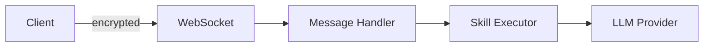
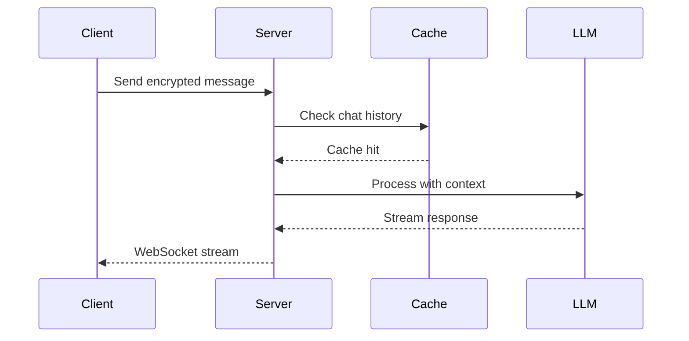

# Documentation Writing Guidelines

> How to write, structure, and maintain OpenMates documentation — for both human and AI contributors.

## Core Philosophy

Documentation is only useful if it is **up to date**, **clear to understand**, **guides through the code**, and makes it **much easier to navigate** the system. Every doc must earn its place by being actively maintained and genuinely helpful.

## Doc Templates

### Architecture Docs

```markdown
---
status: active          # active | draft | planned
last_verified: 2026-03-24
key_files:
  - backend/apps/ai/skills/*/skill.py
  - frontend/packages/ui/src/components/embeds/**/*.svelte
---

# Title

> One-sentence summary of what this doc covers.

## Why This Exists
What problem does this solve? What would happen without it? What edge cases does code handle?

## How It Works
Plain English processing flow. Numbered steps. Inline [file links](path).

## Edge Cases
- Case 1: how it is handled and why

## Data Structures
(For app/embed/skill docs) Key models, REST API contracts, enum values.

## Diagrams
Mermaid flow diagrams or auto-generated screenshots.

## Related Docs
- [Doc name](link) — why it is related
```

### User Guide Docs

```markdown
---
status: active          # active | planned
last_verified: 2026-03-24
---

# Feature Name

> What this feature does in plain language.

## What It Does
## How to Use It
## Screenshots
## Tips
## Related
```

### Frontmatter Fields

| Field | Required | Description |
|-------|----------|-------------|
| `status` | Yes | `active`, `draft`, or `planned` |
| `last_verified` | Yes | ISO date when someone last confirmed doc matches reality |
| `key_files` | Architecture only | Glob patterns of related source files (for staleness tracking) |

The `last_verified` field is auto-updated by `sessions.py deploy` when a doc file is committed. Docs not verified in >30 days are flagged as "needs review".

## Draft-First Workflow

When creating or significantly updating a doc, **always start with a draft**. A draft is a **wireframe** — a scannable skeleton showing what the full doc will cover, not the full doc itself.

1. Set `status: draft` in frontmatter
2. Write **short bullet points and phrases** for each section — no full sentences or paragraphs
3. Use `<!-- TODO: screenshot (1000x400) -->` placeholders for images
4. Use `<!-- TODO: Mermaid diagram — [brief description] -->` placeholders for diagrams
5. Fill in all **file links** immediately (those are known from the start)
6. Add cross-links to related docs
7. Mark areas that need fact-checking with `<!-- VERIFY: [assumption] -->`
8. Submit for review

**The draft is not a short version of the doc.** It is a structural outline that lets reviewers quickly see what will be documented, suggest changes to scope/structure, and catch missing topics — before any detailed writing begins.

Only expand to full prose after the draft structure is reviewed. Even the full version should be concise — the goal is a **quick big-picture overview** of processes, architecture, and decisions, not a replacement for reading the code.

## Writing for the Right Audience

### User Guide (non-technical)
- Plain language, no jargon
- Use "digital team mates" instead of "AI agents"
- Avoid terms like "LLM", "API", "WebSocket" — use simpler alternatives
- Step-by-step instructions with expected outcomes

### Architecture & CLI (developers)
- Technical terms fine but define on first use
- Focus on the **"why"** behind design decisions
- Link to specific source files instead of including code examples
- Document trade-offs and alternatives considered

### Contributing Guides (humans & AI)
- Focus on principles over prescriptions
- Include links to live preview pages where applicable
- Reference specific component names and file paths

## Code Examples Policy

**Default: link to code files, don't include code examples.** Code in docs goes stale fast.

Instead of code blocks, use:
- Links to source files: `[cryptoService.ts](../../frontend/packages/ui/src/services/cryptoService.ts)`
- Function references: "See `decryptChatData()` in `cryptoService.ts`"
- Links are processed by the build system — relative `.md` links become `/docs/` routes, relative code links become GitHub URLs

**Exceptions** (code blocks allowed):
- REST API request/response bodies
- Database/Pydantic model schemas
- Config file formats (YAML examples)
- CLI command examples
- Input/output examples that clarify a processing step

**Rule:** Every code block must reference the source file it came from, so freshness can be verified.

## File Links

- Always use **inline links to files** when describing processing flows: `[websockets.py](../../backend/core/api/app/routes/websockets.py)`
- Reference **function names** when specific: "See `handleMessage()` in [websockets.py](link)"
- For edge case handlers and specific logic, **link to the function name** that handles it — this makes it easy to find the code even if lines shift
- When Claude implements a feature described in an architecture doc, add a comment at the code entry point: `// See docs/architecture/path/doc.md`
- **Line numbers:** Do not include line numbers in doc links (they change too quickly). Instead, reference the function or class name — these are stable identifiers that survive refactors

## Cross-References

- Link to related docs, don't duplicate content
- Use relative markdown links (processed automatically by the build system)
- When referencing architecture decisions, link to the architecture doc rather than explaining inline
- Every doc should have a **Related Docs** section at the bottom
- Prefer shorter docs linking to other docs over one giant doc

## Conciseness Rules

- **Max ~200 lines** for architecture docs — split if larger
- Every section must earn its place — if removable without losing understanding, remove it
- Cross-link aggressively instead of duplicating content
- Use bullet points and tables for scannable content
- Numbered lists for sequential processes, bullet lists for non-ordered items

## Diagram Strategy

Three types of diagrams, each for different purposes:

| Type | Tool | When to use | Update method |
|------|------|-------------|---------------|
| **Component screenshots** | Playwright via `/dev/docs/` | Show what UI looks like | Auto-generated, always current |
| **Flow diagrams** | Mermaid (inline fenced blocks) | Show data flow between modules | Edit inline, diffs in PRs |
| **System architecture** | Penpot (manual) | High-level system topology | Rare updates, export as PNG |

### When to Include a Diagram

- Processing flows with **3+ steps** → Mermaid diagram
- UI elements referenced in the doc → auto-generated screenshot (1000x400px)
- System with **3+ interacting services** → architecture diagram
- **Don't** add diagrams for simple linear processes describable in a numbered list

### Mermaid Diagrams

Use ` ```mermaid ` fenced code blocks. GitHub renders these natively. Examples:





### Auto-Generated Screenshots

All doc screenshots use a **unified size of 1000x400px**. Screenshots are generated from `/dev/docs/{slug}` pages via Playwright, ensuring they always show real, current UI.

Images are stored in `docs/images/` mirroring the doc folder structure. Reference with relative paths:
```markdown

```

## Data Structures in App/Embed Docs

Architecture docs for apps, skills, and embeds must include a **Data Structures** section:

- Key Pydantic model fields with types (link to the schema file)
- REST API endpoints with request/response examples (code blocks allowed here)
- Database collection fields relevant to the feature
- Available enum/field values (e.g., embed statuses: `processing`, `finished`, `error`)
- Link to the actual schema file so the code block can be verified for freshness

## Freshness & Staleness Tracking

Three layers keep docs up to date:

1. **Automated (code-mapping):** `key_files` in frontmatter (and `docs/architecture/code-mapping.yml`) map docs to source code. When mapped code is newer than the doc by >24 hours, the doc is flagged as stale.

2. **Human-visible (last_verified):** The `last_verified` date in frontmatter is auto-updated on deploy. Docs not verified in >30 days are flagged as "needs review" even if code hasn't changed.

3. **AI-enforced (sessions.py):**
   - `sessions.py check-docs` finds related docs for modified files
   - `sessions.py stale-docs` lists all stale architecture docs
   - `sessions.py draft-docs` lists incomplete draft docs
   - Deploy warns about stale docs related to modified files

When updating code, check if it appears in `docs/architecture/code-mapping.yml` and update the corresponding doc.

## File Naming

- Use **kebab-case**: `message-processing.md`, not `MessageProcessing.md`
- Use **descriptive names** matching the topic: `payment-processing.md`, not `payments.md`
- User-facing docs use the feature name: `sharing.md`, `keyboard-shortcuts.md`

## Folder Structure

| Folder | Audience | Content |
|--------|----------|---------|
| `architecture/{domain}/` | Developers | How and why things work |
| `contributing/guides/` | AI + Developers | Step-by-step procedures |
| `contributing/standards/` | AI + Developers | Coding standards and rules |
| `design-guide/` | AI + Developers | UI/UX principles, component guidelines |
| `user-guide/` | End users | Feature documentation |
| `user-guide/apps/` | End users | Per-app feature docs |
| `cli/` | End users | CLI command reference |
| `self-hosting/` | Self-hosters | Deployment instructions |
| `images/{mirrors above}/` | All | Screenshots and diagrams |

**Decision tree:** Is the doc for end users? → `user-guide/`. Does it explain how a system works? → `architecture/`. Does it explain how to do a task? → `contributing/guides/`. Does it set coding rules? → `contributing/standards/`.

## Fact-Checking (CRITICAL)

**Never write documentation based on assumptions.** Every factual claim must be verified against the actual code before committing.

- Before describing how a provider works (API vs. scraping, auth method, data flow), **read the provider's source code**
- Before listing enum values or field types, **read the schema file**
- Before describing a processing flow, **trace the actual code path**
- If unsure about a claim, mark it with `<!-- VERIFY: [assumption] -->` for review
- Never rely on training data for API details, pricing, or provider behavior — always verify from source

Example of what goes wrong without fact-checking: Writing "Flightradar24 uses web scraping" when the actual provider uses a proper API with Bearer token auth via SecretsManager.

## Architecture Docs: What to Include

Architecture docs should give a **quick big-picture overview** — not replace reading the code. Include:

- **Why decisions were made:** What alternatives were considered? Why was this approach chosen?
- **Where things happen in code:** Link to the specific files and functions that implement each step
- **Edge cases and how they're handled:** With links to the handler functions
- **Areas for improvement:** Known limitations, planned enhancements, or technical debt worth addressing. Mark with `> **Improvement opportunity:**` blockquote

## Claude Integration

When working on a task, Claude should:

1. **Reference docs in task summaries:** Include links to all architecture docs touched or referenced in the "Architecture & Key Functions" section
2. **Link to docs in code:** When implementing a feature described in an architecture doc, add a comment at the entry point: `// See docs/architecture/path/doc.md`
3. **Update stale docs:** If `check-docs` flags a related doc as stale during deploy, update it as part of the task
4. **Draft-first for new docs:** Always create a draft with bullet points and placeholders first; expand only after review
5. **Fact-check everything:** Before writing any documentation, read the actual source code to verify claims. Never document from assumptions or training data
