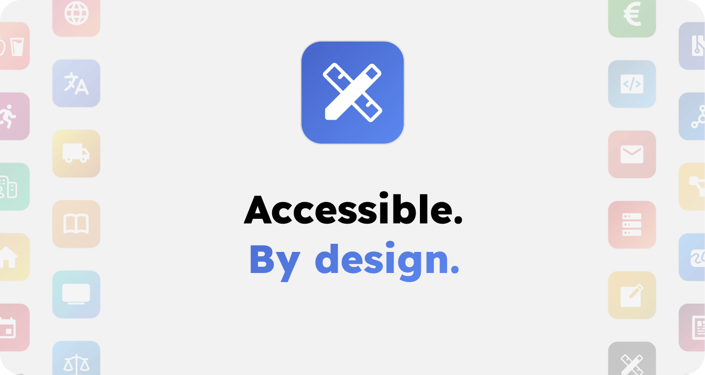
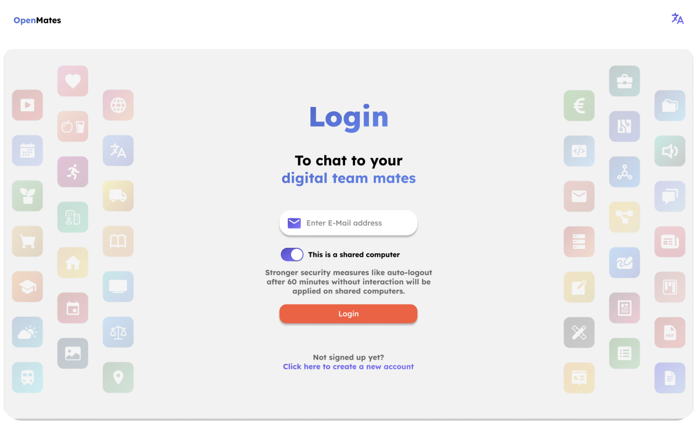
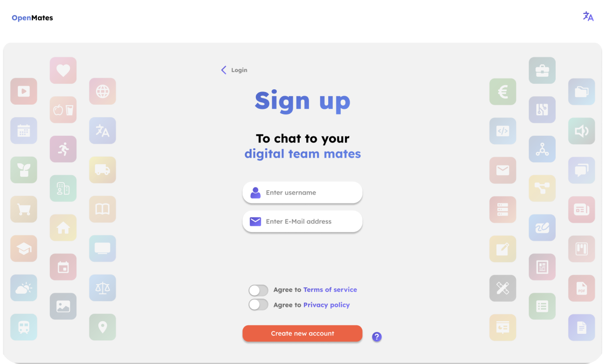
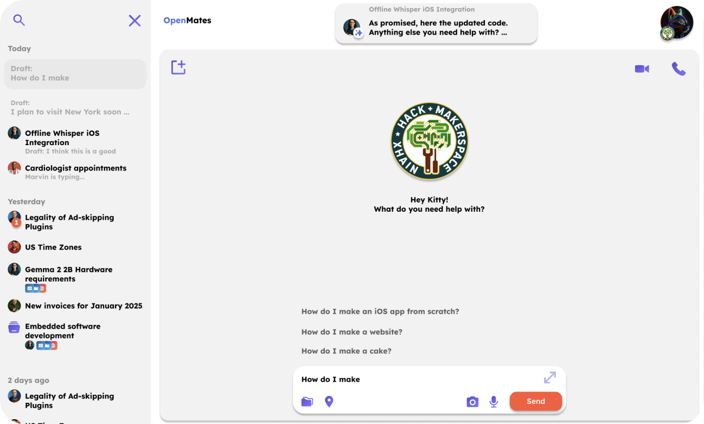
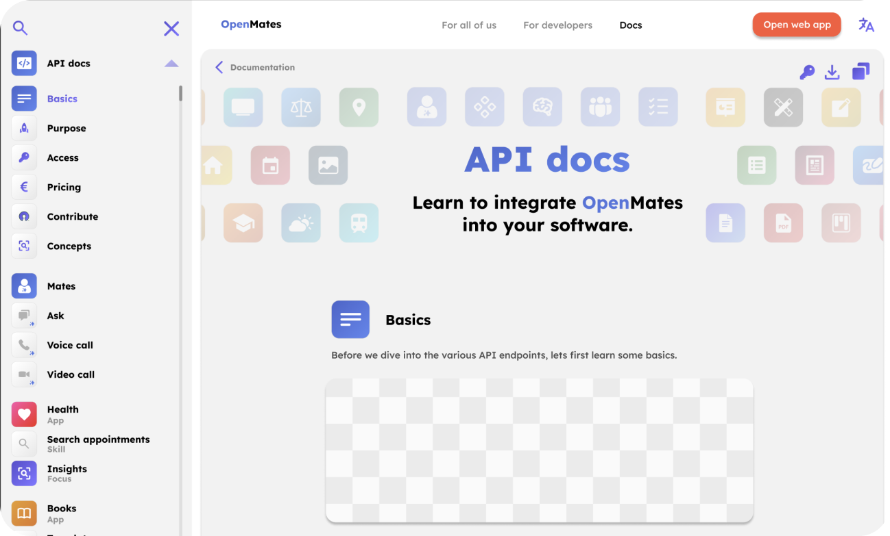
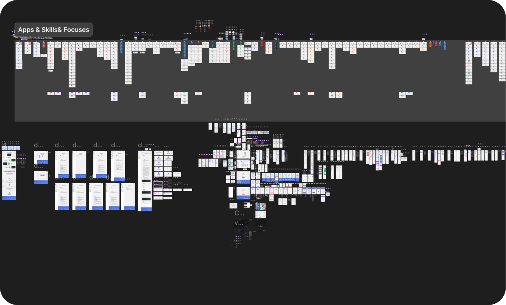

# Design guidelines

## Target users & their needs

- Web app & docs:
	- wide general audience, with tech experience ranging from "never used AI tools before and don't use a laptop but only my phone" to "uses a few AI tools like ChatGPT and Sora on a regular base", "skeptical of AI tools but open to look into the topic" to "tech and AI enthusiasts who are deeply familiar with all the latest tools and models and use them multiple times a day."
	- consequences:
		- simple easy to understand UI
		- prevent usage of tech terms which many people are either unfamiliar with or have skepticism against (use "digital team mates" instead of "AI agents" for example, prevent the use of "LLMs" and other tech terms outside of developer facing communication - meaning, prefer alternative better to understand terms when reasonable)
- API / Developer docs
	- software developers with a wide range of experience, ranging from people who have only experience using AI tools to let AI write the full code - up to developers who are skeptical of AI but want to give it a chance, and experienced software developers who are experienced with AI tech / projects

## Basic design principles

- reuse of common design patterns from chat apps like telegram / signal / WhatsApp
- focus on balancing simplicity with lots of great features, but without overcomplicating UI
- reuse design elements across web app and website (we neither want to code more components than needed and also don't want to teach users more new UI structures than needed, to make the software as easy and quick to learn as possible)
- basic design structure:
	- left side panel
		- website: used for navigation overview of current page (hidden by default on landingpage)
		- web app: used for chat list
	- center content
		- website: used for page content
		- web app: used for page content / signup / login / current chat
	- right side panel (hidden by default)
		- web app: used for settings

## Web app components

### Login

>_Keep in mind: the screenshot shows the UI as its planned. The current state of the UI might differ in layout and functionality._

Users can login via:
- email + password + OTP 2FA code (currently implemented)

Starting with v0.2 users can also login via:
- email + passkey
- email + yubikey/hardware key

### Signup

>_Keep in mind: the screenshot shows the UI as its planned. The current state of the UI might differ in layout and functionality._

The signup flow is split into multiple steps, and the progress is shown in the bottom of the screen. Optional steps have a skip button in the top right. The design of each signup step attempts to be as close to each as possible, so the user feels quickly familiar and can quickly finish the signup flow.

### Web App Main Screen

>_Keep in mind: the screenshot shows the UI as its planned. The current state of the UI might differ in layout and functionality._

The landing page, when the user visits [app.openmates.org](https://app.openmates.org). It contains the current chat, the chat list, and the settings menu (closed by default). The design is fully responsive. All elements are visible and usable on both desktop and mobile. The chats list and settings can be closed to focus completely on the current chat and give it more space. All menus can be opened at the same time and be interacted with. 

<!-- 
#### Current chat

#### Chats list & Search

#### Settings 
-->

### Docs

>_Keep in mind: the screenshot shows the UI as its planned. The current state of the UI might differ in layout and functionality._

Docs have a similar core structure as the web app, to keep a consistent design language that's easy to understand for users and easy to maintain from a developer perspective. Left we have again a sidebar, but with the chapters of the docs page. Center we have the actual docs page. And in the top right (where in the web app we find the user profile image opening the settings menu), we find the language settings button that opens the settings sidebar on the right side with the language selection.

## Design board

Currently I have a huge Figma design file which I created over the months. Eventually I might move to Penpot (although last time I tried the import failed, so I use Figma for now). In that design file I spend a lot of time planning a coherent and easy to use design for the web app, documentation, website, user settings and more. The design board is mostly the single source of truth when it comes to the UI / UX plans, with some exceptions. I am considering publishing the design board in the weeks to come. For now, I will implement instead parts of it in the docs of this repo.